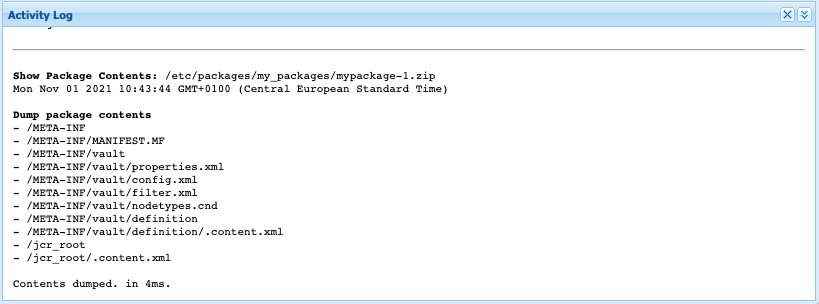

# 封裝管理員 {#working-with-packages}

軟體包允許導入和導出儲存庫內容。 您可以使用套件來安裝新內容、在執行個體之間傳輸內容，以及備份存放庫內容。

使用套件管理器，您可以在AEM執行個體和本機檔案系統之間傳輸套件，以利開發用途。

## 什麼是包？ {#what-are-packages}

軟體包是郵遞區號檔案，以檔案系統序列化形式保儲存存庫內容，稱為保管庫序列化，提供了簡單易用、易於編輯的檔案和資料夾表示。 套件中包含的內容是透過使用篩選器來定義。

包中還包含保管庫元資訊，包括篩選器定義和導入配置資訊。 套件中可包含其他不用於套件擷取的內容屬性，例如說明、視覺影像或圖示。 這些額外內容屬性僅供內容套件使用者使用，僅供參考之用。

>[!NOTE]
>
>套件代表建置套件時的內容目前版本。 其中不包含AEM保留在存放庫中的任何舊版內容。

## AEMas a Cloud Service中的套件 {#aemaacs-packages}

為AEMas a Cloud Service應用程式建立的內容套件必須在不可變和可變內容之間有乾淨的分隔。 因此，包管理器只能用於管理包含內容的包。 任何程式碼皆須透過Cloud Manager部署。

>[!NOTE]
>
>套件只能包含內容。 任何功能(例如，儲存在 `/apps`)必須 [在Cloud Manager中使用CI/CD管道部署。](/help/implementing/cloud-manager/deploy-code.md)

>[!IMPORTANT]
>
>套件管理器UI可能會傳回 **未定義** 如果安裝程式包需要超過10分鐘，則會顯示錯誤訊息。 如果發生此情況，請不要重試安裝，因為安裝正在後台正確進行，並且多個併發導入進程可能會導致某些衝突。

如需進一步了解如何管理AEMaaCS的套件，請檢閱此檔案 [部署至AEMas a Cloud Service](/help/implementing/deploying/overview.md) 部署使用手冊中。

## 封裝管理員 {#package-manager}

套件管理器會管理您AEM安裝上的套件。 在您 [已指派必要的權限](#permissions-needed-for-using-the-package-manager) 您可以使用套件管理器執行各種動作，包括設定、建立、下載和安裝您的套件。

### 必要權限 {#required-permissions}

若要建立、修改、上傳和安裝套件，使用者必須具備下列節點的適當權限：

* 排除刪除的完整權限 `/etc/packages`
* 包含包內容的節點

>[!CAUTION]
>
>授予套件權限可能會導致敏感資訊洩漏和資料遺失。
>
>為限制這些風險，強烈建議僅授予專用子樹的特定組權限。

### 存取套件管理器 {#accessing}

您可以透過三種方式存取套件管理器：

1. 從AEM主菜單 — > **工具** -> **部署** -> **套件**
1. 從 [CRXDE Lite](crxde.md) 使用頂端切換器列
1. 直接透過 `http://<host>:<port>/crx/packmgr/`

### 套件管理器UI {#ui}

包管理器分為四個主要功能區：

* **左側導覽面板**  — 此面板可讓您篩選和排序套件清單。
* **包清單**  — 這是您執行個體上依左側導覽面板中的選取項目篩選和排序的套件清單。
* **活動記錄**  — 此面板首先最小化，並展開以詳細說明包管理器的活動，如生成或安裝包時。 「活動日誌」頁簽中有其他按鈕，用於：
   * **清除日誌**
   * **顯示/隱藏**
* **工具列**  — 工具欄包含「左側導航面板」和「包」清單的刷新按鈕，以及用於搜索、建立和上載包的按鈕。


按一下左側導覽面板中的選項，會立即篩選套件清單。

按一下套件名稱會展開「套件清單」中的項目，以顯示套件的詳細資訊。


擴展包詳細資訊時，可通過工具欄按鈕在包上執行的操作數。

* [編輯](#edit-package)
* [建置](#building-a-package)
* [重新安裝](#reinstalling-packages)
* [下載](#downloading-packages-to-your-file-system)

您可在 **更多** 按鈕。

* [刪除](#deleting-packages)
* [適用範圍](#package-coverage)
* [內容](#viewing-package-contents-and-testing-installation)
* [折行](#rewrapping-a-package)
* [其他版本](#other-versions)
* [解除安裝](#uninstalling-packages)
* [測試安裝](#viewing-package-contents-and-testing-installation)
* [驗證](#validating-packages)
* [複寫](#replicating-packages)

### 包狀態 {#package-status}

套件清單中的每個項目都有狀態指標，可讓您一覽套件的狀態。 將滑鼠暫留在狀態上會顯示工具提示，其中包含狀態的詳細資訊。


如果包已更改或從未構建，則狀態將顯示為一個連結，以採取快速操作來重建或安裝包。

## 套件設定 {#package-settings}

套件實際上是一組篩選器，以及以這些篩選器為基礎的存放庫資料。 使用套件管理程式UI，您可以按一下套件，然後按 **編輯** 按鈕，查看包的詳細資訊，包括下列設定。

* [一般設定](#general-settings)
* [封裝篩選器](#package-filters)
* [封裝相依性](#package-dependencies)
* [進階設定](#advanced-settings)
* [包螢幕截圖](#package-screenshots)

### 一般設定 {#general-settings}

您可以編輯各種包設定以定義資訊，如包說明、依賴項和提供程式詳細資訊。

此 **套件設定** 對話方塊可透過 **編輯** 按鈕 [建立](#creating-a-new-package) 或 [編輯](#viewing-and-editing-package-information) 包裹。 進行任何變更後，按一下 **儲存**.


| 欄位 | 說明 |
|---|---|
| 名稱 | 包的名稱 |
| 群組 | 要組織包，您可以鍵入新組的名稱或選擇現有組 |
| 版本 | 用於版本的文本 |
| 說明 | 允許格式化的HTML標籤的包的簡短說明 |
| 縮圖 | 隨包清單一起顯示的表徵圖 |

### 封裝篩選器 {#package-filters}

篩選器可識別要包含在套件中的存放庫節點。 A **篩選器定義** 指定下列資訊：

* 此 **根路徑** 包含的內容
* **規則** 包含或排除根路徑下的特定節點

使用 **+** 按鈕。 使用 **-** 按鈕。

系統會根據規則的順序套用規則，以便視需要使用 **向上** 和 **向下** 箭頭按鈕。

篩選器可以包含零個或多個規則。 未定義規則時，套件會包含根路徑下方的所有內容。

您可以為套件定義一或多個篩選器定義。 使用多個篩選器來包含來自多個根路徑的內容。


建立篩選器時，您可以定義路徑，或使用規則運算式來指定您要包含或排除的所有節點。

| 規則類型 | 說明 |
|---|---|
| 加入 | 包括目錄將包括該目錄以及該目錄中的所有檔案和資料夾（即整個子樹），但 **不會** 包括指定根路徑下的其他檔案或資料夾。 |
| 排除 | 排除目錄將排除該目錄以及該目錄中的所有檔案和資料夾（即整個子樹）。 |

封裝篩選器最常在您首次 [建立套件。](#creating-a-new-package) 不過，您也可以稍後編輯這些檔案，之後應重建套件，以根據新的篩選器定義更新其內容。

>[!TIP]
>
>一個包可以包含多個篩選器定義，以便從不同位置的節點可以輕鬆地組合到一個包中。

### 相依關係 {#dependencies}


| 欄位 | 說明 | 範例/詳細資料 |
|---|---|---|
| 測試方式 | 此套件的目標產品名稱和版本為或相容。 | `AEMaaCS` |
| 已修正的問題 | 允許列出此套件修正錯誤的詳細資訊的文字欄位，每行一個錯誤 | - |
| 取決於 | 列出安裝時當前程式包按預期運行所需的其他程式包 | `groupId:name:version` |
| 取代 | 此包替換的已棄用包的清單 | `groupId:name:version` |

### 進階設定 {#advanced-settings}


| 欄位 | 說明 | 範例/詳細資料 |
|---|---|---|
| 名稱 | 包的提供程式的名稱 | `WKND Media Group` |
| URL | 提供程式的URL | `https://wknd.site` |
| 連結 | 提供程式頁面的包特定連結 | `https://wknd.site/package/` |
| 需要 | 定義安裝套件時是否有任何限制 | **管理**  — 只能以管理員權限安裝套件&#x200B;<br>**重新啟動**  — 安裝套件後，AEM必須重新啟動 |
| AC 處理 | 指定導入包時如何處理包中定義的訪問控制資訊 | **忽略**  — 保留儲存庫中的ACL <br>**覆寫**  — 覆寫儲存庫中的ACL <br>**合併**  — 合併兩組ACL <br>**MergePreserve**  — 通過添加內容中不存在的主體的訪問控制項，將內容中的訪問控制與包中提供的訪問控制合併&#x200B;<br>**清除**  — 清除ACL |

### 包螢幕截圖 {#package-screenshots}

您可以將多個螢幕擷取畫面附加至您的套件，以提供內容顯示方式的視覺表示。


## 封裝動作 {#package-actions}

可以對包採取許多操作。

### 建立套件 {#creating-a-new-package}

1. [訪問包管理器。](#accessing)

1. 按一下 **建立套件**.

   >[!TIP]
   >
   >如果您的執行個體有許多套件，則可能會有資料夾結構。 在這種情況下，在建立新包之前，可以更輕鬆地導覽至所需的目標資料夾。

1. 在 **新套件** 對話框，輸入以下欄位：

   

   * **套件名稱**  — 選取描述性名稱，以協助您（和其他人）輕鬆識別套件的內容。

   * **版本**  — 這是用於指示版本的文本欄位。 這會附加至套件名稱，以形成zip檔案的名稱。

   * **群組**  — 這是目標組（或資料夾）名稱。 群組可協助您整理套件。 為組建立資料夾（如果該資料夾尚未存在）。 如果將組名留空，它將在主包清單中建立包。

1. 按一下 **確定** 來建立套件。

1. AEM在包清單的頂部列出新包。

   

1. 按一下 **編輯** 來定義 [套件內容。](#package-contents) 按一下 **儲存** 編輯完設定後。

1. 您現在可以 [建置](#building-a-package) 你的包裹。

建立套件後立即建置並非強制性。 未建置的套件不包含任何內容，且僅包含該套件的篩選資料和其他中繼資料。

### 建立套件 {#building-a-package}

通常會在您同時建立套件 [建立套件](#creating-a-new-package)，但您稍後可以返回，建置或重建套件。 如果儲存庫內的內容已變更或封裝篩選條件已變更，這個功能會很實用。

1. [訪問包管理器。](#accessing)

1. 按一下套件名稱，從套件清單開啟套件詳細資訊。

1. 按一下 **建置**. 對話方塊會要求確認您確實要建立套件，因為任何現有套件內容都會覆寫。

1. 按一下&#x200B;**「確定」**。AEM會建置套件，並將新增至套件的所有內容列在活動清單中。 完成AEM後，會顯示已建置套件的確認，並（當您關閉對話方塊時）會更新套件清單資訊。

### 編輯套件 {#edit-package}

將套件上傳至AEM後，您可以修改其設定。

1. [訪問包管理器。](#accessing)

1. 按一下套件名稱，從套件清單開啟套件詳細資訊。

1. 按一下 **編輯** 並更新 **[套件設定](#package-settings)** 視需要。

1. 按一下 **儲存** 儲存。

您可能需要 [重建包](#building-a-package) 以根據您所做的變更更新其內容。

### 重新包裝套件 {#rewrapping-a-package}

套件建置完成後，即可重新包裝。 重新包裝會變更套件資訊，但不會變更縮圖、說明等，而不會變更套件內容。

1. [訪問包管理器。](#accessing)

1. 按一下套件名稱，從套件清單開啟套件詳細資訊。

1. 按一下 **編輯** 並更新 **[套件設定](#package-settings)** 視需要。

1. 按一下 **儲存** 儲存。

1. 按一下 **更多** -> **重新包裝** 對話會要求確認。

### 查看其他包版本 {#other-versions}

因為軟體包的每個版本都以任何其他軟體包的形式顯示在清單中，所以軟體包管理器可以找到所選軟體包的其他版本。

1. [訪問包管理器。](#accessing)

1. 按一下套件名稱，從套件清單開啟套件詳細資訊。

1. 按一下 **更多** -> **其他版本** 隨即開啟對話框，其中列出了包含狀態資訊的相同包的其他版本。

### 查看包內容和測試安裝 {#viewing-package-contents-and-testing-installation}

建置套件後，您可以檢視內容。

1. [訪問包管理器。](#accessing)

1. 按一下套件名稱，從套件清單開啟套件詳細資訊。

1. 若要檢視內容，請按一下 **更多** -> **內容**，而套件管理器會在活動記錄中列出套件的整個內容。

   

1. 要執行乾式運行安裝，請按一下 **更多** -> **測試安裝** 和「套件管理器」在活動記錄中報告結果，就像已執行安裝一樣。

   

### 將包下載到檔案系統 {#downloading-packages-to-your-file-system}

1. [訪問包管理器。](#accessing)

1. 按一下套件名稱，從套件清單開啟套件詳細資訊。

1. 按一下 **下載** 按鈕或包詳細資訊區域中包的連結檔案名。

1. AEM會將套件下載至您的電腦。

### 從檔案系統上傳套件 {#uploading-packages-from-your-file-system}

1. [訪問包管理器。](#accessing)

1. 選取您要上傳套件的群組資料夾。

1. 按一下 **上傳套件** 按鈕。

1. 提供上傳套件的必要資訊。

   

   * **套件**  — 使用 **瀏覽……** 按鈕，從本地檔案系統中選擇所需的包。
   * **強制上傳**  — 如果已存在具有此名稱的套件，此選項會強制上傳並覆寫現有套件。

1. 按一下 **確定** 並且，上傳所選包，並相應地更新包清單。

套件內容現在存在於AEM上，但若要讓內容可供使用，請務必 [安裝套件](#installing-packages).

### 驗證套件 {#validating-packages}

由於套件可修改現有內容，因此在安裝前驗證這些變更通常很實用。

#### 驗證選項 {#validation-options}

包管理器可以執行以下驗證：

* [OSGi套件匯入](#osgi-package-imports)
* [覆蓋](#overlays)
* [ACL](#acls)

##### 驗證 OSGi 封裝匯入 {#osgi-package-imports}

>[!NOTE]
>
>由於套件無法用於在AEMaaCS中部署程式碼， **OSGi套件匯入** 不需要驗證。

**已核取的項目**

此驗證會檢查所有JAR檔案（OSGi套件組合）的套件，提取其 `manifest.xml` （包含所述OSGi套件所依賴的版本化相依性），並驗證AEM執行個體使用正確的版本匯出所述相依性。

**報告方式**

AEM例項無法滿足的任何版本化相依性都會列在套件管理器的活動記錄中。

**錯誤狀態**

如果不滿足相依性，則包中包含這些相依性的OSGi套件組合將不會啟動。 這會導致應用程式部署中斷，因為任何依賴未啟動的OSGi套件組合的程式，都會無法正常運作。

**錯誤解決**

要解決由於未滿足要求的OSGi套件組合而導致的錯誤，必須調整套件中具有未滿足要求的導入的依賴項版本。

##### 驗證覆蓋 {#overlays}

>[!NOTE]
>
>由於套件無法用於在AEMaaCS中部署程式碼， **覆蓋** 不需要驗證。

**已核取的項目**

此驗證會判斷所安裝的套件是否包含已覆蓋在目標AEM例項中的檔案。

例如，在 `/apps/sling/servlet/errorhandler/404.jsp`，包含 `/libs/sling/servlet/errorhandler/404.jsp`，以便變更現有檔案(位於 `/libs/sling/servlet/errorhandler/404.jsp`.

**報告方式**

套件管理器的活動記錄中會說明任何此類覆蓋。

**錯誤狀態**

錯誤狀態表示套件嘗試部署已覆蓋的檔案，因此套件中的變更將被覆蓋覆蓋（因此「隱藏」），而不會生效。

**錯誤解決**

若要解決此問題，請在 `/apps` 必須在 `/libs` 並視需要將變更併入覆蓋圖( `/apps`)，並重新部署重疊的檔案。

>[!NOTE]
>
>如果覆蓋內容已正確整合至覆蓋檔案，驗證機制便無法調解。 因此，即使進行了必要的變更，此驗證仍會繼續報告衝突。

##### 驗證 ACL {#acls}

**已核取的項目**

此驗證會檢查要新增哪些權限、處理方式（合併/取代），以及目前權限是否會受到影響。

**報告方式**

套件管理器的活動記錄中會說明權限。

**錯誤狀態**

無法提供明確錯誤。 驗證只會指出安裝套件是否會新增或影響任何新ACL權限。

**錯誤解決**

使用驗證提供的資訊，您可以在CRXDE中查看受影響的節點，並視需要在套件中調整ACL。

>[!CAUTION]
>
>作為最佳實務，建議軟體包不要影響AEM提供的ACL，因為這可能導致意外行為。

#### 執行驗證 {#performing-validation}

可透過兩種不同方式驗證套件：

* [透過套件管理程式UI](#via-package-manager)
* [透過HTTPPOST要求（例如搭配cURL）](#via-post-request)

上傳套件後但安裝之前，一律應進行驗證。

##### 透過封裝管理程式進行封裝驗證 {#via-package-manager}

1. [訪問包管理器。](#accessing)

1. 按一下套件名稱，從套件清單開啟套件詳細資訊。

1. 若要驗證套件，請按一下 **更多** -> **驗證**,

1. 在隨後出現的強制回應對話方塊中，使用核取方塊來選取驗證的類型，並按一下以開始驗證 **驗證**.

1. 選擇的驗證隨後會運行，結果將顯示在包管理器的活動日誌中。

##### 透過HTTPPOST要求進行套件驗證 {#via-post-request}

POST請求會採用下清單單。

```
https://<host>:<port>/crx/packmgr/service.jsp?cmd=validate&type=osgiPackageImports,overlays,acls
```

此 `type` 參數可以是任何以逗號分隔、無序列的清單，包含：

* `osgiPackageImports`
* `overlays`
* `acls`

的值 `type` 預設為 `osgiPackageImports` 若未明確傳遞。

使用cURL時，執行類似下列的陳述式：

```shell
curl -v -X POST --user admin:admin -F file=@/Users/SomeGuy/Desktop/core.wcm.components.all-1.1.0.zip 'http://localhost:4502/crx/packmgr/service.jsp?cmd=validate&type=osgiPackageImports,overlays,acls'
```

透過POST要求驗證時，回應會以JSON物件的形式傳回。

### 查看包覆蓋 {#package-coverage}

套件由其篩選器定義。 您可以讓套件管理器將套件的篩選器套用至您現有的存放庫內容，以顯示套件的篩選器定義涵蓋的存放庫內容。

1. [訪問包管理器。](#accessing)

1. 按一下套件名稱，從套件清單開啟套件詳細資訊。

1. 按一下 **更多** -> **涵蓋範圍**.

1. 涵蓋範圍詳細資訊會列在活動記錄中。

### 安裝套件 {#installing-packages}

上傳套件只會將套件內容新增至存放庫，但無法存取。 您必須安裝已上傳的套件，才能使用套件的內容。

>[!CAUTION]
>
>安裝套件可能會覆寫或刪除現有內容。 只有在您確定套件不會刪除或覆寫您需要的內容時，才上傳套件。

在安裝軟體包之前，軟體包管理器會自動建立包含將被覆蓋內容的快照軟體包。 如果卸載軟體包，則將重新安裝此快照。

1. [訪問包管理器。](#accessing)

1. 按一下包名稱，從包清單中開啟要安裝的包的包詳細資訊。

1. 按一下 **安裝** 按鈕，或 **安裝** 連結。

1. 對話方塊會要求確認，並允許指定其他選項。

   * **僅提取**  — 僅解壓包，以便不建立快照，因此無法卸載
   * **儲存臨界值**  — 觸發自動儲存之前的暫時節點數（如果遇到併發修改例外，則增加）
   * **擷取子套件**  — 啟用子包的自動提取
   * **存取控制處理**  — 指定安裝包時如何處理包中定義的訪問控制資訊(選項與 [進階套件設定](#advanced-settings))
   * **相依性處理**  — 指定在安裝期間如何處理相依性

1. 按一下 **安裝**.

1. 活動日誌詳細說明了安裝的進度。

安裝完成並成功後，將更新包清單和單詞 **已安裝** 出現在套件狀態中。

### 重新安裝軟體包 {#reinstalling-packages}

重新安裝軟體包對已安裝的軟體包執行的步驟相同，當 [最初安裝套件。](#installing-packages)

### 基於檔案系統的上傳和安裝 {#file-system-based-upload-and-installation}

安裝套件時，您可以完全放棄套件管理器。 AEM可以檢測放置在主機本地檔案系統上的特定位置的軟體包，並自動上傳和安裝它們。

1. 在AEM安裝資料夾下方， `crx-quicksart` 與jar和 `license.properties` 檔案。 建立名為 `install` 在 `crx-quickstart` 導致路徑 `<aem-home>/crx-quickstart/install`.

1. 在此資料夾中，新增您的套件。 這些檔案會自動上傳並安裝在您的執行個體上。

1. 上傳和安裝完成後，您就可以在套件管理器中看到套件，就像您已使用套件管理器UI來安裝這些套件一樣。

如果執行個體執行中，當您將執行個體新增至的套件時，上傳和安裝會立即開始 `install` 資料夾

如果執行個體未執行，則會將套件放在 `install` 資料夾在啟動時按字母順序安裝。

### 卸載軟體包 {#uninstalling-packages}

卸載軟體包會將儲存庫的內容還原為安裝前由軟體包管理器自動生成的快照。

1. [訪問包管理器。](#accessing)

1. 按一下包名稱，從包清單中開啟要卸載的包的包詳細資訊。

1. 按一下 **更多** -> **解除安裝**，從存放庫中移除此套件的內容。

1. 對話方塊會要求確認，並列出所有正在進行的變更。

1. 將刪除包並應用快照。 進程的進度顯示在活動日誌中。

### 刪除包 {#deleting-packages}

刪除套件只會從套件管理器中刪除其詳細資訊。 如果已安裝此軟體包，則不會刪除已安裝的內容。

1. [訪問包管理器。](#accessing)

1. 按一下包名稱，開啟要從包清單中刪除的包的包詳細資訊。

1. AEM要求確認您要刪除套件。 按一下 **確定** 以確認刪除。

1. 套件資訊會刪除，且詳細資訊會在活動記錄中報告。

### 複製包 {#replicating-packages}

復寫套件的內容以安裝在發佈執行個體上。

1. [訪問包管理器。](#accessing)

1. 按一下包名稱，從包清單中開啟要複製的包的包詳細資訊。

1. 按一下 **更多** -> **複製**.

1. 會複製套件，並在活動記錄中報告詳細資訊。

## Software Distribution {#software-distribution}

AEM套件可用來在AEMaaCS環境間建立和共用內容。

[Software Distribution](https://downloads.experiencecloud.adobe.com) 提供AEM套件，以用於本機開發AEM SDK。 Software Distribution上提供的AEM套件必須經Adobe支援明確核准，才能安裝在AEMaaCS雲端環境上。

如需詳細資訊，請參閱 [Software Distribution檔案](https://experienceleague.adobe.com/docs/experience-cloud/software-distribution/home.html).
