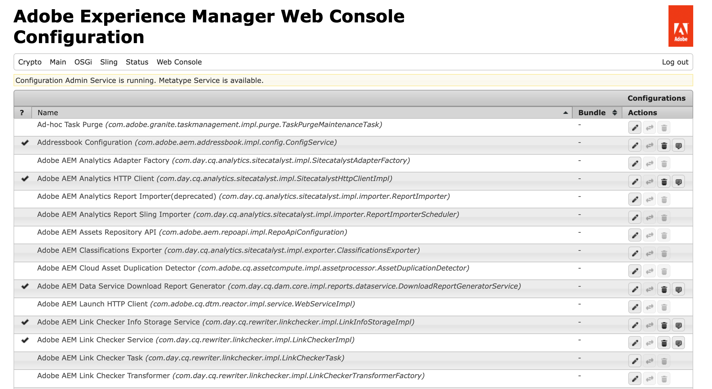
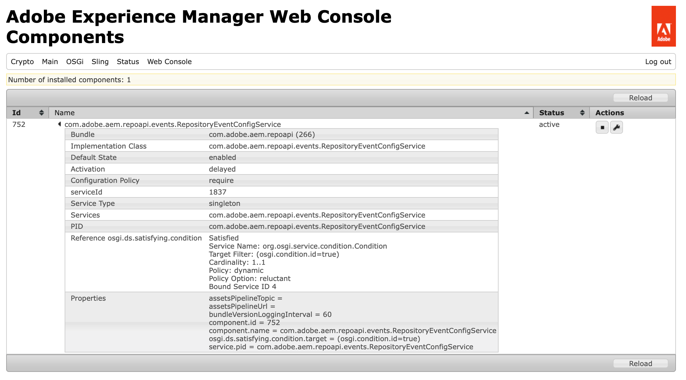

# Web 控制台 {#web-console}

瞭解如何使用Adobe Experience Manager (AEM) Web主控台管理本機開發的OSGi設定和套件組合。

## 概觀 {#overview}

AEM as a Cloud Service將[組態和程式碼視為在執行階段不可變動。](/help/release-notes/aem-cloud-changes.md#apps-libs-immutable) 這表示所有設定都必須像在生產環境中編碼一樣進行部署。 對於生產執行個體，這可確保傳遞品質門檻，並提供您目前環境的穩定性和清晰度等級。

不過，測試本機開發通常需要臨機[OSGi設定](/help/implementing/deploying/configuring-osgi.md)更新和套件組合變更。 作為[AEM as a Cloud Service SDK](/help/implementing/developing/introduction/aem-as-a-cloud-service-sdk.md)的一部分，網頁主控台會啟用這類即時更新。

在AEM as a Cloud Service本機執行的情況下，可以從`http://<host>:<port>/system/console`存取主控台。

Web控制檯提供一組用於維護OSGi套裝的畫面和選項，包括：

* [設定](#configuration)：用於設定OSGi組合，因此是設定AEM系統引數的基礎機制
* [組合](#bundles)：用於安裝組合
* [元件](#components)：用來控制AEM所需元件的狀態
* [產生OSGi設定](#generating-osgi-configurations)：用於以JSON自動產生OSGi設定

所做的任何變更會立即套用至執行中的SDK。 不需要重新啟動。

在Web主控台中，提及預設設定的任何說明都與Sling預設值有關。 AEM有其本身的預設值，因此預設集可能會與主控台所記錄的有所不同。

Adobe Experience Manager (AEM)中的Web主控台是以[Apache Felix Web管理主控台](https://felix.apache.org/documentation/subprojects/apache-felix-web-console.html)為基礎。 Apache Felix是社群努力實施OSGi R4服務平台，其中包括OSGi架構和標準服務。

>[!NOTE]
>
>此Web主控台僅適用於AEM as a Cloud Service SDK的本機開發用途。 無法在生產環境中使用。

>[!TIP]
>
>若要檢查生產環境中OSGi設定、套件組合和元件的狀態，請使用[Developer Console。](/help/implementing/developing/introduction/aem-developer-console.md)

## 設定 {#configuration}

**Configuration**&#x200B;畫面用於設定OSGi組合，因此是設定AEM系統引數的基礎機制。 **組態**&#x200B;索引標籤可由以下任一方式存取：

* 下拉式功能表： **OSGi ->組態**
* URL： `http://<host>:<port>/system/console/configMgr`

隨即顯示設定清單：

此畫面上的清單提供兩種型別的設定：

* **設定**&#x200B;可讓您更新現有的設定。 這些具有持續性身分(PID)，可以是：
   * AEM的標準與完整 — 如果刪除這些值，會傳回預設設定，則需使用這些值。
   * 從工廠組態建立的執行處理 — 這些執行處理是由使用者建立的，刪除會移除執行處理。
* **工廠組態**&#x200B;可讓您建立所需功能物件的執行個體。 這會配置給持續性身分，並列在設定清單中。

從清單中選取任何專案時，會顯示與該組態相關的引數：

之後，您可以視需要更新引數，並且：

* **儲存**&#x200B;以儲存所做的變更。
   * 對於工廠組態，這會建立具有永久識別的執行個體。
   * 然後，新執行個體會列在Configurations底下。
* **重設**&#x200B;以將熒幕上顯示的引數重設為上次儲存的引數。
* **刪除**&#x200B;以刪除目前的組態。
   * 若為standard，引數會傳回預設設定。
   * 如果是從工廠組態建立，則會刪除特定的執行處理。
* **解除繫結**&#x200B;以解除繫結組合中的目前組態。
* **取消**&#x200B;以取消任何目前的變更。

>[!TIP]
>
>請參閱[為Adobe Experience Manager as a Cloud Service設定OSGi](/help/implementing/deploying/configuring-osgi.md)，以取得有關OSGi設定的詳細資料。

## 組合 {#bundles}

**組合**&#x200B;畫面是用來安裝AEM所需的OSGi組合。 您可以透過下列其中一種方法來存取畫面：

* 下拉式功能表： **OSGi ->組合**
* URL： `http://<host>:<port>/system/console/bundles`

隨即顯示套件組合清單：

您可以使用此熒幕：

* **安裝或更新**&#x200B;以安裝新的套件組合或更新現有的套件。
   * 您可以&#x200B;**瀏覽**&#x200B;以尋找包含您的套件組合的檔案，並指定它是否應該立即&#x200B;**啟動**，以及應該從哪個&#x200B;**啟動層級**。
* **重新載入**&#x200B;以重新整理顯示的清單。
* **重新整理封裝**&#x200B;以檢查所有封裝的參照，並視需要重新整理。
   * 例如，在更新後，由於先前的參照，舊版本和新版本可能仍在執行。 此選項會檢查並移動新版本的所有參照，讓舊版本停止。
* **啟動**&#x200B;以根據指定的啟動層級啟動組合。
* **停止**&#x200B;以停止該組合。
* **解除安裝**&#x200B;以從系統解除安裝套件。

清單指定束的狀態。 按一下特定束的名稱以顯示進一步資訊。

>[!TIP]
>
>在&#x200B;**更新**&#x200B;之後，Adobe建議您按一下&#x200B;**重新整理封裝**。

## 元件 {#components}

**元件**&#x200B;畫面可讓您啟用和停用元件。 您可透過以下任一方式存取該區域：

* 下拉式功能表： **主要 — >元件**
* URL： `http://<host>:<port>/system/console/components`

隨即顯示元件清單。 每一列都有圖示，可讓您啟用、停用或（在適當時）開啟特定元件的組態詳細資訊。

按一下特定元件的名稱會顯示其狀態的進一步資訊。 您也可以在此處啟用、停用或重新載入元件。

>[!NOTE]
>
>啟用或停用元件只適用於SDK重新啟動之前。
>
>開始狀態是在元件描述項中定義，在開發期間產生並在套件建立時儲存在套件中。

## 產生OSGi設定 {#generating-osgi-configs}

此Web主控台可用於設定OSGi元件，以及將OSGi設定匯出為JSON。 這對於設定AEM提供的OSGi元件非常有用，當您在AEM專案中定義OSGi設定時，您可能不熟悉這些元件的OSGi屬性和值格式。

如需詳細資訊，請參閱檔案[為Adobe Experience Manager as a Cloud Service](/help/implementing/deploying/configuring-osgi.md#generating-osgi-configurations-using-the-web-console)設定OSGi。
