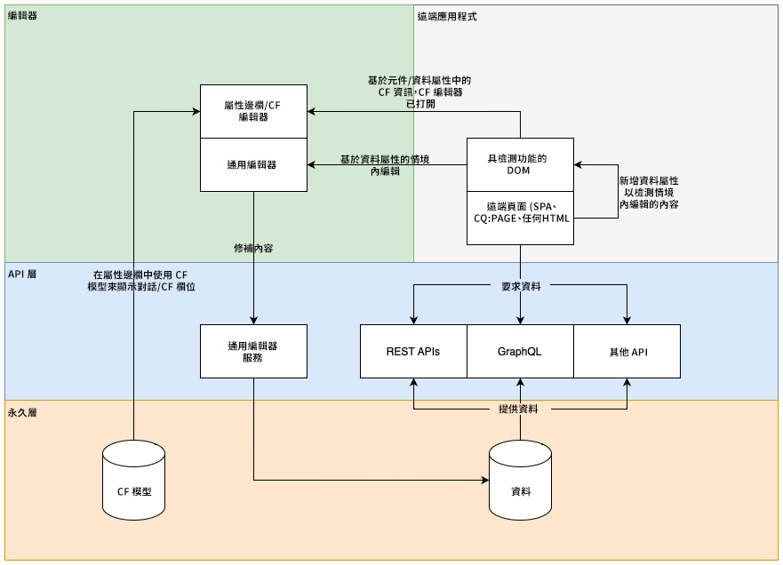
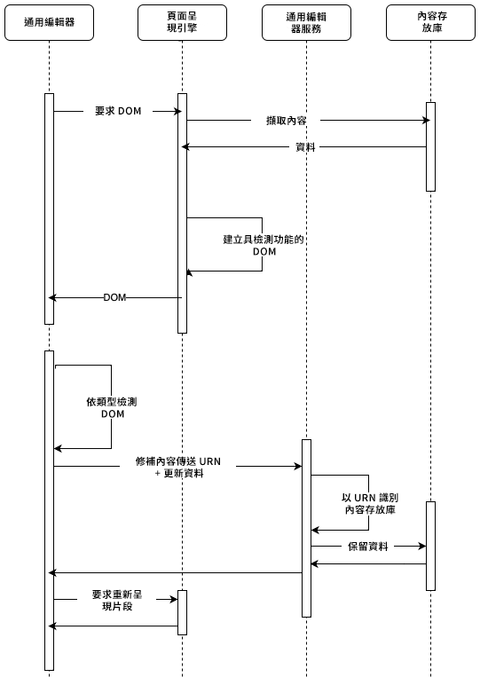
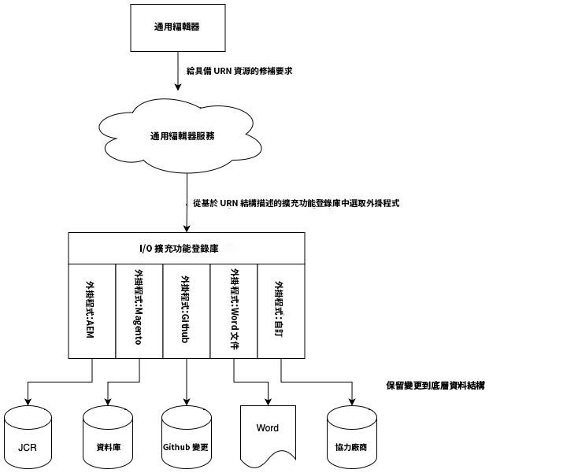
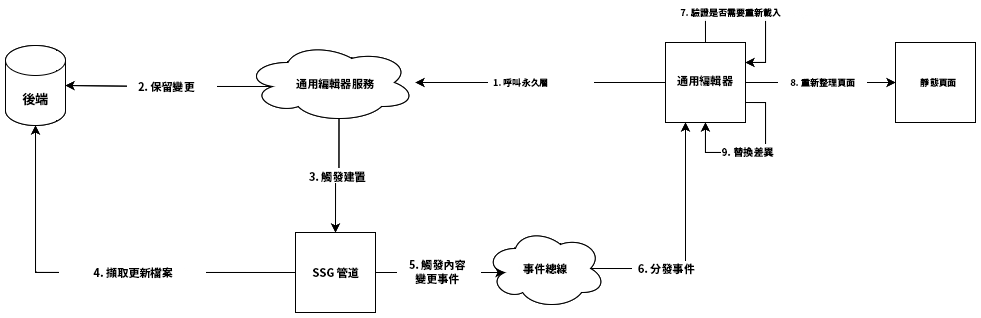
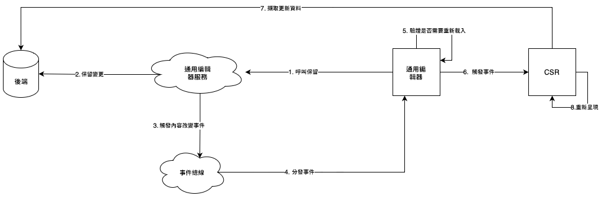

# Universal Editor 架構 {#architecture}

了解 Universal Editor 的架構，以及資料如何在其服務和階層之間流動。

## 架構建置區塊 {#building-blocks}

Universal Editor由四個基本建置區塊組成，這些區塊可相互影響，讓內容作者可編輯任何實施中任何內容的任何方面，因此您可以提供卓越的體驗、提高內容速度，並提供一流的開發人員體驗。

1. [編輯](#editors)
1. [遠端應用程式](#remote-app)
1. [API 層](#api-layer)
1. [持續性層](#persistence-layer)

本文件概述所有建置區塊，及其如何交換資料。

>[!TIP]
>
>如果您想查看 Universal Editor 及其架構，請參閱文件[AEM 中 Universal Editor 快速入門](getting-started.md)，了解如何存取 Universal Editor，和如何開始檢測您的第一個 AEM 應用程式以使用它。

### 編輯 {#editors}

* **Universal Editor** - Universal Editor 使用經過檢測的 DOM 來就地編輯內容。如需有關必要的中繼資料詳細資訊，請參閱文件[屬性和類型](attributes-types.md)。請參閱文件[AEM 中 Universal Editor 快速入門](getting-started.md)，了解 AEM 中的檢測範例。
* **屬性邊欄** - 元件的某些屬性不能在內容中編輯，例如浮動切換的切換時間，或摺疊式功能表標籤應始終打開或關閉。為了編輯此類元件資訊，編輯器的側欄提供了表單型編輯器。

### 遠端應用程式 {#remote-app}

要在 Universal Editor 中編輯應用程式內容，就必須對 DOM 進行檢測。遠端應用程式必須在 DOM 中呈現某些屬性。如需有關必要中繼資料的詳細資訊，請參閱文件[屬性和類型](attributes-types.md)。請參閱文件[AEM 中 Universal Editor 快速入門](getting-started.md)，了解 AEM 中的檢測範例。

Universal Editor 致力於最小化 SDK，因此檢測是遠端應用程式實施的責任。

### API 層 {#api-layer}

* **內容資料** - 對於 Universal Editor，內容資料的來源系統和使用方式都不重要。使用內容中可編輯資料定義和提供所需的屬性很重要。
* **持續性資料** - 每個可編輯資料都有 URN 識別碼。此 URN 用於將持續性路由到正確的系統和資源。

### 持續性層 {#persistence-layer}

* **內容片段模型** - 若要支援編輯內容片段屬性的邊欄、內容片段編輯器和表單型編輯器，就需要每個元件和內容片段的模型。
* **內容** - 內容可以儲存在任何地方，例如 AEM、Magento 等。

## Universal Editor 服務和後端系統分派 {#service}

Universal Editor 將所有內容變更分派到稱為 Universal Editor Service 的集中服務。該服務是在 Adobe I/O Runtime 上執行，其會根據提供的 URN 載入擴展註冊表中可用的外掛程式。該外掛程式負責與後端通訊並傳回統一的回應。

## 轉譯管道 {#rendering-pipelines}

### 伺服器端轉譯 {#server-side}

### 靜態網站生成 {#static-generation}

### 用戶端轉譯 {#client-side}

## 其他資源 {#additional-resources}

若要了解有關 Universal Editor 的詳細資訊，請參閱以下文件。

* [通用編輯器簡介](introduction.md)  — 瞭解通用編輯器如何讓您編輯任何實作中任何內容的任何方面，以便提供卓越的體驗、提高內容速度並提供一流的開發人員體驗。
* [使用 Universal Editor 編寫內容](authoring.md) - 了解內容作者使用 Universal Editor 建立內容有多簡單和直觀。
* [使用 Universal Editor 發佈內容](publishing.md) - 了解 Universal Visual Editor 如何發佈內容，和您的應用程式如何處理發佈的內容。
* [AEM 中 Universal Editor 快速入門](getting-started.md) - 了解如何存取 Universal Editor，以及如何開始檢測您的第一個 AEM 應用程式以使用它。
* [屬性和類型](attributes-types.md) - 了解 Universal Editor 需要的資料屬性和類型。
* [Universal Editor 驗證](authentication.md) - 了解 Universal Editor 如何進行驗證。
