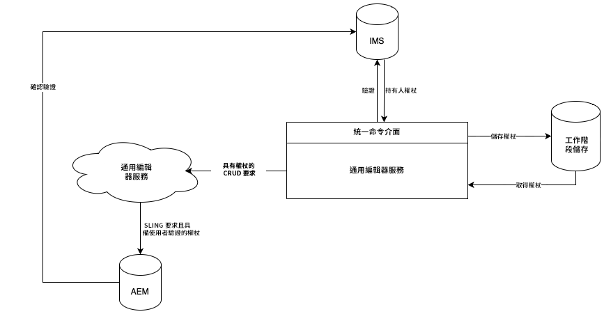

# Universal Editor 驗證 {#authentication}

了解 Universal Editor 如何進行驗證。

## 選項 {#options}

Universal Editor 使用 Adobe 的 Identity Management System (IMS) 驗證，這是透過 Unified Shell 提供的。

所有應用程式/遠端頁面都負責對所需後端系統進行驗證。Universal Editor 服務需要此驗證才能向後端系統執行 CRUD 動作，因為它是一項獨立服務。

## 標準流程 {#standard-flow}

這是 AEM as a Cloud Service 和「使用 IMS 的 AMS」運用 Universal editor 的解決方案。

若要使用 Universal Editor，使用者必須登入針對 IMS 進行驗證的 Unified Shell。提供的 IMS 權杖會儲存在使用者工作階段儲存體中。

每當使用者執行 CRUD 動作時，都會使用 HTTP 標頭中的 IMS 持有人權杖向 Universal Editor 服務發送呼叫。然後，Universal Editor 服務使用持有人權杖對 AEM 後端系統的要求進行驗證，並以使用者的名義執行動作。

此圖表和文章的內容說明通用編輯器本身的內部驗證。

{{ue-headless-auth}}
