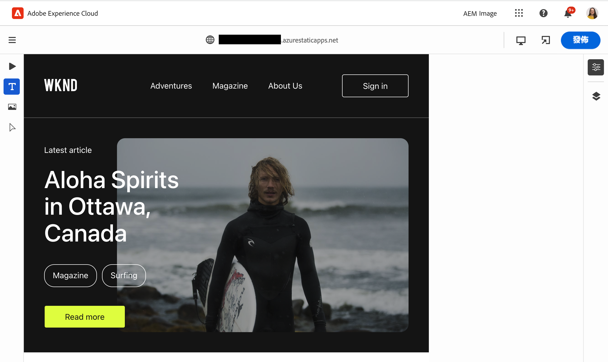
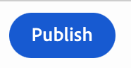

# 使用 Universal Editor 編寫內容 {#authoring}

了解內容作者使用 Universal Editor 建立內容有多簡單和直觀。

## 簡介 {#introduction}

通用編輯器可讓您編輯任何實作中任何內容的任何方面，因此您可以提供卓越的體驗、提高內容速度，並提供一流的開發人員體驗。

為此，它為內容作者提供了直觀的 UI，只需要一點培訓就能立即開始編輯內容。

>[!TIP]
>
>如需 Universal Editor 的詳細介紹，請參閱文件[Universal Editor 簡介。](introduction.md)

>[!NOTE]
>
>Universal Editor 仍在開發中，目前無法編輯所有內容類型。

## 準備應用程式 {#prepare-app}

若要使用通用編輯器為應用程式編寫內容，應用程式必須由開發人員檢測以支援編輯器。

>[!TIP]
>
>請參閱文件 [AEM 中 Universal Editor 快速入門](getting-started.md)，了解設定 AEM 應用程式以使用 Universal Editor 的範例。

## 登入 {#sign-in}

一旦檢測到應用程式與 Universal Editor 一起使用，您將需要登入 Universal Editor。您需要 Adobe ID 才能登入和[存取 Universal Editor。](getting-started.md#request-access)

登入後，請在中輸入您要編輯之頁面的URL [位址列。](#address-bar) 以便您開始 [編輯內容。](#edit-content)

## 了解 UI {#ui}

UI 分為四個主要區域。

* [Experience Cloud 標頭](#experience-cloud-header)
* [Universal Editor 標頭](#universal-editor-header)
* [邊欄](#rail)
* [編輯器](#editor)

### Experience Cloud 標頭 {#experience-cloud-header}

Experience Cloud 標頭會始終顯示在畫面頂端。這是一個錨點，說明您在 Experience Cloud 中的位置，並幫助您導覽到其他 Experience Cloud 應用程式。

#### Experience Manager {#experience-manager}

選取標頭左側的 Adobe Experience Cloud 連結，導覽至 Experience Manager 解決方案的根目錄，以存取 [Cloud Manager](/help/onboarding/cloud-manager-introduction.md)、[Cloud Acceleration Manager](/help/journey-migration/cloud-acceleration-manager/introduction/overview-cam.md) 和 [Software Distribution](https://experienceleague.adobe.com/docs/experience-cloud/software-distribution/home.html) 等工具。

#### 組織 {#organization}

這將顯示您目前登入的組織。如果您的 Adobe ID 與多個組織關聯，可點選或點擊以切換到另一個組織。

#### 解決方案 {#solutions}

點選或點擊解決方案切換器可讓您快速跳轉到其他 Experience Cloud 解決方案。

#### 說明 {#help}

說明圖示可快速存取學習和支援資源。

#### 通知 {#notifications}

此圖示會加上目前指派的未完成專案之數目 [通知。](/help/implementing/cloud-manager/notifications.md)

#### 使用者屬性 {#user-properties}

點選或點擊代表您使用者的圖示以存取您的使用者設定。如果您未設定使用者圖片，則會隨機指派圖示。

### Universal Editor 標頭 {#universal-editor-header}

Universal Editor 標頭始終顯示在畫面頂端，就在 [Experience Cloud 標頭下方。](#experience-cloud-header)它可讓您快速存取，以導覽到另一個頁面進行編輯和發佈目前的頁面。

#### 漢堡選單 {#hamburger-menu}

漢堡選單尚未實施。

#### 位置列 {#Location-bar}

位置列會顯示您正在編輯頁面的網址。點選或點擊以輸入要編輯的其他頁面的網址。

>[!TIP]
>
>使用快速鍵 `L` 打開網址列。

>[!NOTE]
>
>您希望使用 Universal Editor 編輯的任何頁面都必須[經過檢測以支援 Universal Editor。](getting-started.md)

#### 開啟應用程式預覽 {#open-app-preview}

點選或點擊開啟應用程式預覽圖示，以在其瀏覽器中打開您正在編輯的頁面，無需編輯器即可預覽變更。

>[!TIP]
>
>使用快速鍵 `O` 開啟應用程式預覽。

#### 發佈 {#publish}

點選或按一下「發佈」按鈕，這樣您就可以將變更發佈到即時內容，以供讀者使用。

>[!TIP]
>
>如需有關使用 Universal Visual Editor 進行發佈的詳細資訊，請參閱[使用 Universal Visual Editor 發佈內容](publishing.md)文件。

### 邊欄 {#rail}

邊欄始終位於編輯器的左側。它可在預覽模式和編輯模式之間輕鬆切換編輯器。

#### 預覽模式 {#preview-mode}

在預覽模式下，在編輯器中呈現的頁面就是發佈服務所顯示的樣子。這可讓內容作者透過點擊連結等來導覽內容。

>[!TIP]
>
>使用快速鍵 `P` 切換到預覽模式。

#### 編輯模式 {#edit-mode}

在編輯模式下，頁面會呈現在編輯器中，但內容作者可以透過點擊來選擇內容進行編輯。這是載入頁面時編輯器的預設模式。

### 編輯器 {#editor}

編輯器會佔據大部分視窗，並顯示在[網址列](#address-bar)中指定頁面的位置。

根據編輯器是處於[編輯模式](#edit-mode)還是[預覽模式](#edit-mode)，內容將分別以可編輯或可導覽形式呈現。

## 編輯內容 {#editing-content}

編輯內容很簡單又直觀。在 [編輯模式，](#edit-mode) 當您將滑鼠移至編輯器中的內容時，可編輯的內容會以藍色方塊醒目提示。

只需點選或點擊藍色框中的內容即可啟動就地編輯器來進行變更。按 Enter 或返回以儲存變更。

請注意，在編輯模式下，點選或點擊內容會選擇它進行編輯。如果您希望透過以下連結瀏覽您的內容，請切換到[預覽模式。](#preview-mode)

## 預覽內容 {#previewing-content}

內容編輯完成後，您通常會希望瀏覽其內容，以查看它在其他頁面內容中的樣子。在[預覽模式](#preview-mode)中，您可以點選連結，像讀者一樣瀏覽您的內容。內容在編輯器中呈現的樣子就是將會發佈的樣子。

請注意，在預覽模式下，點選或點擊內容的回應與內容讀者的回應一樣。如果您想選擇要編輯的內容，請切換到[編輯模式。](#edit-mode)

## 其他資源 {#additional-resources}

若要了解有關 Universal Editor 的詳細資訊，請參閱以下文件。

* [通用編輯器簡介](introduction.md)  — 瞭解通用編輯器如何讓您編輯任何實作中任何內容的任何方面，以便提供卓越的體驗、提高內容速度並提供一流的開發人員體驗。
* [使用 Universal Editor 發佈內容](publishing.md) - 了解 Universal Visual Editor 如何發佈內容，和您的應用程式如何處理發佈的內容。
* [AEM 中 Universal Editor 快速入門](getting-started.md) - 了解如何存取 Universal Editor，以及如何開始檢測您的第一個 AEM 應用程式以使用它。
* [Universal Editor 架構](architecture.md) - 了解 Universal Editor 的架構，以及資料如何在其服務和階層之間流動。
* [屬性和類型](attributes-types.md) - 了解 Universal Editor 需要的資料屬性和類型。
* [Universal Editor 驗證](authentication.md) - 了解 Universal Editor 如何進行驗證。
