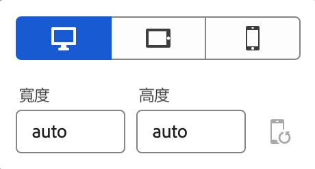
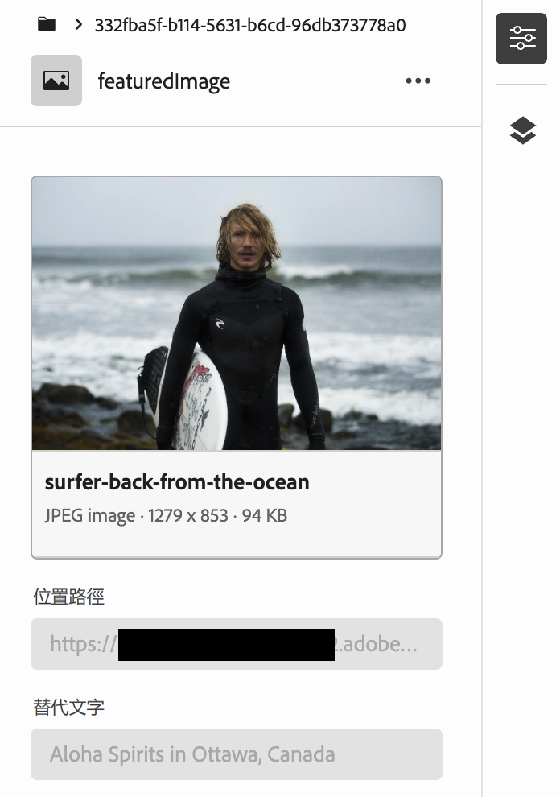
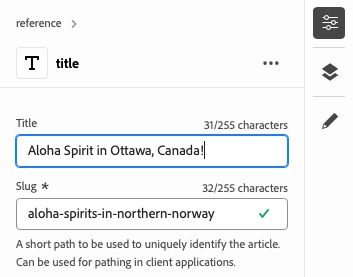
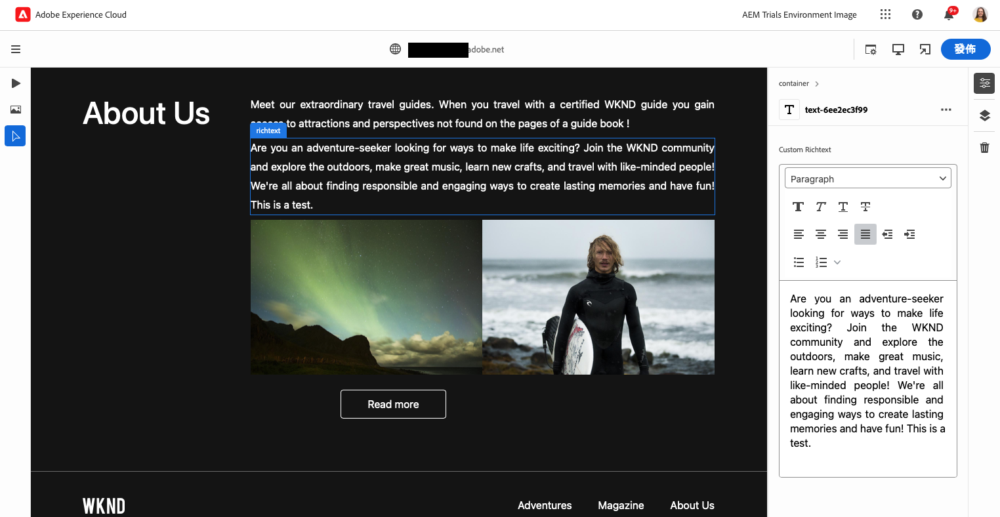
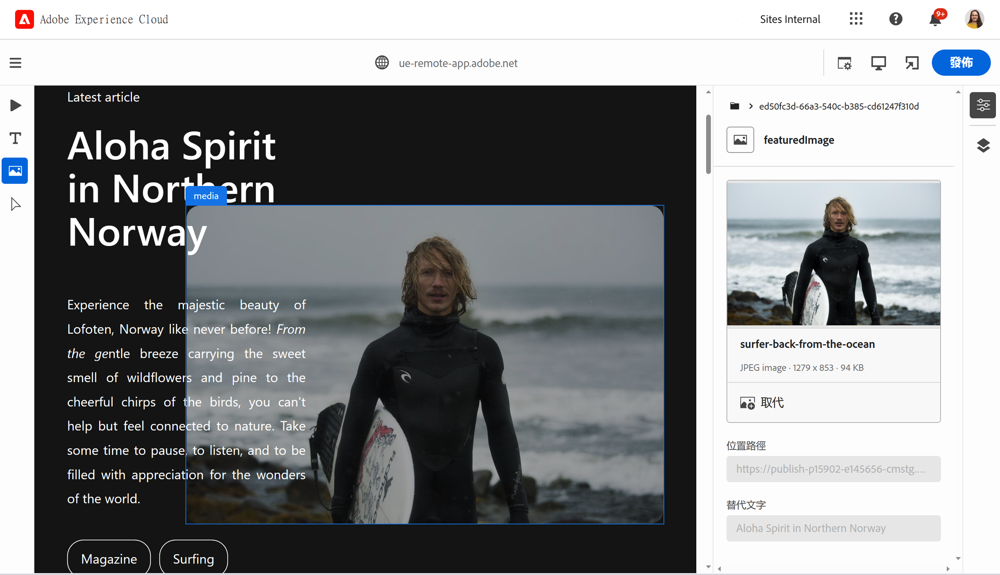
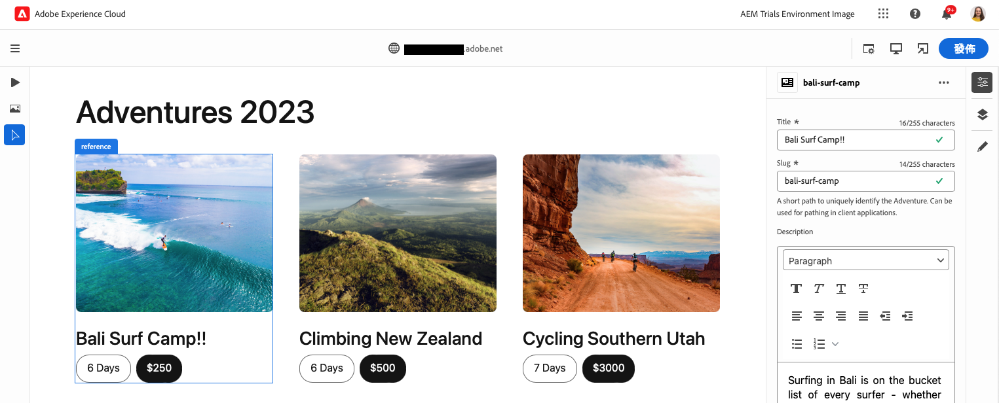
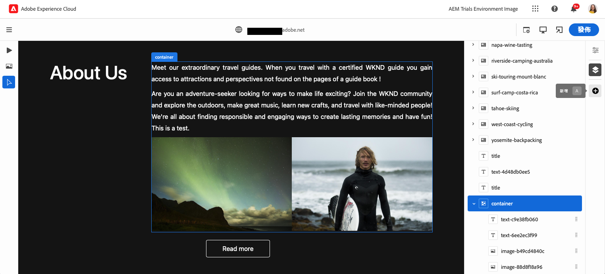
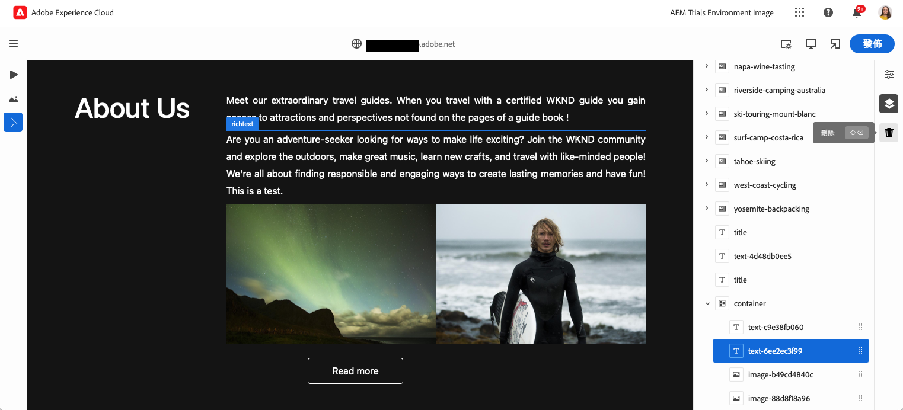

# 使用 Universal Editor 編寫內容 {#authoring}

了解內容作者使用 Universal Editor 建立內容有多簡單和直覺。

{{universal-editor-status}}

## 簡介 {#introduction}

Universal Editor 支援在任意實作中編輯任何方面的內容，以便提供卓越的體驗、提高內容速度並提供最先進的開發人員體驗。

為此，Universal Editor 為內容作者提供直觀的 UI，只需要最基本的培訓就能立即進入狀況並開始編輯內容。本文件說明了 Universal Editor 的編寫體驗。

>[!TIP]
>
>如需 Universal Editor 的更詳細介紹，請參閱 [Universal Editor 簡介](introduction.md)文件。

## 準備應用程式 {#prepare-app}

為了使用 Universal Editor 編寫應用程式的內容，應用程式必須由開發人員進行檢測以支援編輯器。

>[!TIP]
>
>請參閱 [AEM 中 Universal Editor 快速入門](getting-started.md)，了解設定 AEM 應用程式以使用 Universal Editor 的範例。

## 登入 {#sign-in}

應用程式依照指示使用通用編輯器後，請登入通用編輯器。 您需要Adobe ID才能登入和 [擁有通用編輯器的存取權。](getting-started.md#request-access)

登入後，請在[位置列中輸入您要編輯的頁面 URL。](#location-bar)這樣一來，您就可以開始編輯內容，例如[文字內容](#text-mode)或[媒體內容](#media-mode)。

## 了解 UI {#ui}

UI分為以下幾個主要區域。

* [Experience Cloud 標頭](#experience-cloud-header)
* [通用編輯器工具列](#universal-editor-toolbar)
* [編輯器](#editor)
* [屬性邊欄](#properties-rail)

### Experience Cloud 標頭 {#experience-cloud-header}

Experience Cloud 標頭會始終顯示在畫面頂端。這是一個錨點，說明您在 Experience Cloud 中的位置，並幫助您導覽到其他 Experience Cloud 應用程式。

#### Experience Manager {#experience-manager}

選取標頭左側的 Adobe Experience Cloud 連結，導覽至 Experience Manager 解決方案的根目錄，以存取 [Cloud Manager](/help/onboarding/cloud-manager-introduction.md)、[Cloud Acceleration Manager](/help/journey-migration/cloud-acceleration-manager/introduction/overview-cam.md) 和 [Software Distribution](https://experienceleague.adobe.com/docs/experience-cloud/software-distribution/home.html) 等工具。

#### 組織 {#organization}

這將顯示您目前登入的組織。如果您的Adobe ID與多個組織相關聯，請選取以切換至其他組織。

#### 解決方案 {#solutions}

點選或按一下解決方案切換器可讓您快速跳轉到其他 Experience Cloud 解決方案。

#### 說明 {#help}

說明圖示可快速存取學習和支援資源。

#### 通知 {#notifications}

此圖示會標有目前已指派之未完成的[通知](/help/implementing/cloud-manager/notifications.md)數量。

#### 使用者屬性 {#user-properties}

選取代表您使用者的圖示以存取您的使用者設定。如果您沒有設定使用者圖片，則會隨機分配圖示。

### 通用編輯器工具列 {#universal-editor-toolbar}

Universal Editor工具列一律會顯示在畫面頂端，緊接在底下 [Experience Cloud標頭。](#experience-cloud-header)它可讓您快速存取，以導覽到另一個頁面進行編輯和發佈目前的頁面。

#### 首頁按鈕 {#home-button}

首頁按鈕可帶您回到通用編輯器的起始頁

在開始頁面上，您可以輸入要用通用編輯器編輯的網站URL。

>[!NOTE]
>
>您要使用通用編輯器編輯的任何頁面必須是 [用於支援通用編輯器。](getting-started.md)

#### 位置列 {#location-bar}

位置列會顯示您正在編輯頁面的網址。選取「 」即可輸入其他頁面要編輯的位址。

>[!TIP]
>
>使用快速鍵 `L` 打開網址列。

>[!NOTE]
>
>您要使用通用編輯器編輯的任何頁面必須是 [用於支援通用編輯器。](getting-started.md)

#### 驗證標題設定 {#authentication-settings}

如果您需要，請選取驗證標題設定圖示 [設定自訂驗證標頭，以供本機開發之用。](/help/implementing/universal-editor/developer-overview.md#auth-header)

#### 模擬器設定 {#emulator}

選取模擬圖示以定義Universal Editor呈現頁面的方式。

點選或按一下模擬圖示即可顯示選項。

依預設，編輯器會在案頭版面配置中開啟，其中高度和寬度會由瀏覽器自動定義。

您也可以選擇在 Universal Editor 中模擬行動裝置：

* 定義其方向
* 定義寬度和高度
* 變更方向

#### 預覽模式 {#preview-mode}

在預覽模式下，在編輯器中呈現的頁面就是發佈服務所顯示的樣子。這可讓內容作者按一下連結等方式來導覽內容。

>[!TIP]
>
>使用快速鍵 `P` 來切換至預覽模式，或是從預覽模式切換。

#### 開啟應用程式預覽 {#open-app-preview}

選取開啟應用程式預覽圖示，即可使用自己的瀏覽器標籤開啟您目前正在編輯的頁面，無須使用編輯器即可預覽您的內容。

>[!TIP]
>
>使用快速鍵 `O`(字母 O) 可開啟應用程式預覽。

#### 發佈 {#publish}

選取「發佈」按鈕，讓您可以發佈內容的變更供讀者即時使用。

>[!TIP]
>
>檢視檔案 [使用通用編輯器發佈內容](publishing.md) 以取得有關使用Universal Editor發佈的詳細資訊。

### 編輯器 {#editor}

編輯器會佔據大部分視窗，而且是[位置列](#location-bar)中指定之頁面的呈現位置。

如果編輯器在[預覽模式，](#preview-mode)內容即為可瀏覽，而且您可以點選連結，但無法編輯內容。

### 屬性邊欄 {#properties-rail}

屬性邊欄一律會沿著編輯器的右側顯示。 視其模式而定，可能會顯示在內容或頁面內容之階層中選取的元件詳細資訊。

#### 屬性模式 {#properties-mode}

在屬性模式下，邊欄會顯示編輯器中目前選取的元件屬性。這是載入頁面時屬性邊欄的預設模式。

依您所選取的元件類型而定，可在屬性邊欄中顯示和修改詳細資料。

並非所有元件都有可顯示及/或編輯的詳細資料。

>[!TIP]
>
>使用快速鍵 `D` 可切換至屬性模式。

#### 內容樹模式 {#content-tree-mode}

在內容樹模式下，邊欄會顯示頁面內容的階層。

在內容樹中選取一個項目時，編輯器會捲動到該內容並予以選取。

>[!TIP]
>
>使用快速鍵 `F` 可切換至內容樹模式。

##### 編輯 {#edit}

編輯時，所選元件的選項會顯示在屬性邊欄中，您可在此編輯所選元件。 如果選取的元件是內容片段，您也可以選取「編輯」按鈕。

點選或按一下編輯按鈕將在新的索引標籤中開啟[內容片段編輯器](/help/assets/content-fragments/content-fragments-managing.md#opening-the-fragment-editor)。這可讓您使用內容片段編輯器的全部功能來編輯關聯的內容片段。

根據工作流程的需求，您可能會想要在通用編輯器中或直接在內容片段編輯器中編輯內容片段。

>[!TIP]
>
>使用快速鍵 `E` 可編輯選取的元件。

##### 新增 {#add}

如果您在內容樹狀結構或編輯器中選取容器元件，「屬性」邊欄會出現「新增」選項。

點選或按一下「新增」按鈕即會開啟元件的下拉選單，可用於[新增到選取的容器。](#adding-components)

>[!TIP]
>
>使用快速鍵`A`將元件新增到選取的容器元件中。

##### 刪除 {#delete}

如果在內容樹狀結構或編輯器中選取容器元件內的元件，屬性邊欄會顯示刪除選項。

點選或按一下刪除按鈕[刪除該元件。](#deleting-components)

>[!TIP]
>
>使用快速鍵`Shift+Backspace`從容器中刪除選取的元件。

## 編輯內容 {#editing-content}

編輯內容很簡單又直覺。當您將滑鼠移至編輯器中的內容時，可編輯的內容會以藍色方塊醒目提示。

>[!TIP]
>
>依預設，點選或按一下內容會選取內容以進行編輯。 如果您想透過以下連結導覽內容，請切換至 [預覽模式。](#preview-mode)

根據您選取的內容，您可能有不同的就地編輯選項，而且您可能會為中的內容提供其他資訊和選項 [屬性邊欄。](#properties-rail)

### 編輯純文字 {#edit-plain-text}

您可以按兩下或點兩下元件，就地編輯文字。

按下Enter/Return或在文字方塊外選取，以儲存變更。

當您選取選取文字元件時，其詳細資訊會顯示在「屬性」邊欄中。 您也可以在邊欄中編輯文字。

此外，屬性邊欄中也提供您文字的詳細資料。 一旦焦點離開屬性邊欄中已編輯的欄位，變更就會自動儲存。

### 編輯 RTF 文字 {#edit-rich-text}

您可以按兩下或點兩下元件，就地編輯文字。

為方便起見，您可在兩個位置找到文字的格式選項和詳細資訊。

* 此 **內容功能表** 會在RTF區塊上方開啟，並在內容中提供基本的格式選項。 由於空間限制，某些選項可能會隱藏在省略符號按鈕後面。
* 此 **屬性邊欄** 顯示所有可用的格式選項以及文字。

一旦焦點離開已編輯的欄位，變更會自動儲存。

### 編輯媒體 {#edit-media}

您可以在屬性邊欄中檢視其詳細資訊。

1. 在屬性邊欄中，點選或按一下所選影像的預覽。
1. [資產選擇器](/help/assets/asset-selector.md#using-asset-selector)視窗會開啟，讓您可選取資產。
1. 選取「 」以選取新資產。
1. 選取 **選取** 以返回取代資產的屬性邊欄。

變更會自動儲存到您的內容中。

### 編輯內容片段 {#edit-content-fragment}

如果您選取 [內容片段，](/help/sites-cloud/administering/content-fragments/overview.md) 您可以在「屬性」邊欄中編輯其詳細資料。

在選定內容片段的內容模型中定義的欄位會在屬性邊欄中顯示和編輯。

如果您選取與內容片段相關的欄位，則內容片段會載入到元件邊欄中，且會自動捲動到該欄位。

一旦焦點離開屬性邊欄中已編輯的欄位，變更就會自動儲存。

如果您想在 [內容片段編輯器](/help/sites-cloud/administering/content-fragments/authoring.md) 請改為按一下 [編輯按鈕](#edit) 在模式邊欄中。

根據工作流程的需求，您可能會想要在通用編輯器中或直接在內容片段編輯器中編輯內容片段。

### 新增元件到容器中 {#adding-components}

1. 在內容樹或編輯器中選取容器元件。
1. 接著，在屬性邊欄中選取新增圖示。

   

該元件會被插入到容器中並可在編輯器中對其進行編輯。

>[!TIP]
>
>使用快速鍵 `A` 將元件新增到選取的容器中。

### 從容器中刪除元件 {#deleting-components}

1. 在內容樹或編輯器中選取容器元件。
1. 選取容器的>形箭號圖示，展開內容樹狀結構中的內容。
1. 然後，在內容樹中，選取容器內的元件。
1. 在屬性邊欄中選取刪除圖示。

   

選取的元件已刪除。

>[!TIP]
>
>使用快速鍵 `Shift+Backspace` 從容器中刪除選取的元件。

### 將容器中的元件重新排序 {#reordering-components}

1. 在內容樹或編輯器中選取容器元件。
1. 如果尚未變成[內容樹模式，](#content-tree-mode)切換至該模式。
1. 選取容器的>形箭號圖示，展開內容樹狀結構中的內容。
1. 拖曳容器內的元件旁的手柄圖示證明您可以將它們重新排序。拖曳元件，在容器內將它們重新排序。

   

1. 被拖曳的元件在元件樹中會變成灰色，而您的插入點則會以藍線表示。將元件鬆開並放在新位置中。

元件在內容樹和編輯器中都會重新排序

## 預覽內容 {#previewing-content}

內容編輯完成後，您通常會希望瀏覽其內容，以查看它在其他頁面內容中的樣子。在[預覽模式](#preview-mode)中，您可以點選連結，像讀者一樣瀏覽您的內容。內容在編輯器中呈現的樣子就是將會發佈的樣子。

在預覽模式中，點選或按一下內容的反應就像對內容的讀者一樣。 如果您想要選取要編輯的內容，請切換退出 [預覽模式。](#preview-mode)

## 其他資源 {#additional-resources}

若要了解有關 Universal Editor 的詳細資訊，請參閱以下文件。

* [使用通用編輯器發佈內容](publishing.md)  — 瞭解通用編輯器如何發佈內容，以及您的應用程式如何處理已發佈的內容。
