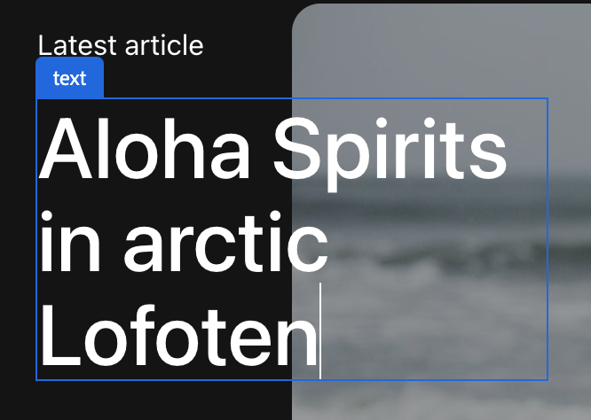

# 使用通用編輯器編寫內容 {#authoring}

了解內容作者使用通用編輯器建立內容有多簡單且直覺。

## 簡介 {#introduction}

通用編輯器可編輯任何實施中任何內容的任何方面，以提供優越的體驗、提高內容速度，並提供最先進的開發人員體驗。

為此，它為內容作者提供直覺式UI，只需要很少的訓練，就能直接跳入並開始編輯內容。

>[!TIP]
>
>有關通用編輯器的更詳細介紹，請參見該文檔 [通用編輯器簡介。](introduction.md)

>[!NOTE]
>
>通用編輯器仍在開發中，目前無法編輯所有內容類型。

## 準備應用程式 {#prepare-app}

若要使用通用編輯器編寫應用程式的內容，應用程式必須由開發人員檢測，以支援編輯器。

>[!TIP]
>
>請查看該文檔 [AEM通用編輯器快速入門](getting-started.md) 以取得如何設定AEM應用程式以搭配通用編輯器運作的範例。

## 登入 {#sign-in}

當應用程式被創作以與通用編輯器搭配使用時，您需要登入通用編輯器。 您需要Adobe ID才能登入及 [可存取通用編輯器。](getting-started.md#request-access)

登入後，請在 [地址欄。](#address-bar) 為了開始 [編輯內容。](#edit-content)

## 了解UI {#ui}

UI分為四個主要區域。

* [Experience Cloud標題](#experience-cloud-header)
* [通用編輯器標題](#universal-editor-header)
* [邊欄](#rail)
* [編輯者](#editor)

### Experience Cloud標題 {#experience-cloud-header}

Experience Cloud標題一律會顯示在畫面頂端。 此錨點可告訴您Experience Cloud中的哪個位置，並協助您導覽至其他Experience Cloud應用程式。

#### Experience Manager {#experience-manager}

選取標頭左側的Adobe Experience Cloud連結，導覽至Experience Manager解決方案的根目錄，以存取工具，例如 [Cloud Manager、](/help/onboarding/cloud-manager-introduction.md) [Cloud Acceleration Manager、](/help/journey-migration/cloud-acceleration-manager/introduction/overview-cam.md) 和 [軟體分發。](https://experienceleague.adobe.com/docs/experience-cloud/software-distribution/home.html)

#### 組織 {#organization}

這會顯示您目前登入的組織。 如果您的Adobe ID與多個組織相關聯，請點選或按一下以切換至其他組織。

#### 解決方案 {#solutions}

點選或按一下解決方案切換器，即可快速跳至其他Experience Cloud解決方案。

#### 說明 {#help}

幫助表徵圖提供學習和支援資源的快速訪問。

#### 通知 {#notifications}

此表徵圖將與當前分配的未完成數量標籤 [通知。](/help/implementing/cloud-manager/notifications.md)

#### 使用者屬性 {#user-properties}

點選或按一下代表您使用者的圖示，以存取您的使用者設定。 如果您未設定使用者圖片，則會隨機指派圖示。

### 通用編輯器標題 {#universal-editor-header}

通用編輯器標題一律顯示在畫面頂端的正下方 [Experience Cloud標題。](#experience-cloud-header) 它可讓您快速存取，以導覽至其他頁面進行編輯，並發佈目前頁面。

#### 漢堡包菜單 {#hamburger-menu}

尚未實施漢堡菜單。

#### 位置列 {#Location-bar}

位置列會顯示您編輯的頁面位址。 點選或按一下以輸入其他頁面的地址以進行編輯。

>[!TIP]
>
>使用熱鍵 `L` 開啟地址欄。

>[!NOTE]
>
>您要使用通用編輯器編輯的任何頁面都必須 [為支援通用編輯器而創作的儀器。](getting-started.md)

#### 開啟應用程式預覽 {#open-app-preview}

點選或按一下開啟的應用程式預覽圖示，以開啟您目前在自己的瀏覽器中編輯的頁面，沒有編輯器可預覽變更。

>[!TIP]
>
>使用熱鍵 `O` 開啟應用程式預覽。

#### 發佈 {#publish}

點選或按一下「發佈」按鈕，以發佈對即時內容的變更，供讀者使用。

>[!TIP]
>
>請參閱檔案 [使用通用視覺編輯器發佈內容](publishing.md) 以取得有關使用通用編輯器發佈的詳細資訊。

### 邊欄 {#rail}

邊欄一律沿著編輯器左側顯示。 它允許在預覽模式和編輯模式之間輕鬆切換編輯器。

#### 預覽模式 {#preview-mode}

在預覽模式中，在編輯器中轉譯的頁面，與在您已發佈的服務中看到的頁面一樣。 這可讓內容作者透過按一下連結等方式導覽內容。

>[!TIP]
>
>使用熱鍵 `P` 切換至預覽模式。

#### 編輯模式 {#edit-mode}

在編輯模式中，頁面會在編輯器中呈現，但內容作者可以按一下以選取內容加以編輯。 這是載入頁面時編輯器的預設模式。

### 編輯 {#editor}

編輯器佔據大部分視窗，且位於 [地址欄](#address-bar) 已呈現。

視編輯器是否位於 [編輯模式](#edit-mode) 或 [預覽模式，](#edit-mode) 內容可分別編輯或導覽。

## 編輯內容 {#editing-content}

編輯內容既簡單又直覺。 在 [編輯模式，](#edit-mode) 將滑鼠移至編輯器中的內容時，可編輯的內容會以藍色方塊強調顯示。

只要點選或按一下藍色方塊中的內容，即可啟動就地編輯器來進行變更。 按下Enter或返回以儲存變更。

請注意，在編輯模式中，點選或按一下內容會嘗試選取它進行編輯。 如果您想透過下列連結導覽內容，請切換至 [預覽模式。](#preview-mode)

## 預覽內容 {#previewing-content}

完成編輯內容時，您通常需要導覽內容，以查看內容在其他頁面內容中的外觀。 在 [預覽模式](#preview-mode) 您可以按一下連結，以如讀者所願導覽您的內容。 內容會如發佈一樣呈現在編輯器中。

請注意，在預覽模式中，點選或按一下內容會如同對內容的讀者反應。 如果您想要選取要編輯的內容，請切換至 [編輯模式。](#edit-mode)

## 其他資源 {#additional-resources}

若要進一步了解通用編輯器，請參閱這些檔案。

* [通用編輯器簡介](introduction.md)  — 了解通用編輯器如何啟用編輯任何實作中任何內容的任何方面，以提供優越的體驗、提高內容速度，並提供最新的開發人員體驗。
* [使用通用編輯器發佈內容](publishing.md)  — 了解通用視覺編輯器如何發佈內容，以及您的應用程式如何處理已發佈的內容。
* [AEM通用編輯器快速入門](getting-started.md)  — 了解如何存取通用編輯器，以及如何開始檢測您的第一個AEM應用程式以使用它。
* [通用編輯器架構](architecture.md)  — 了解通用編輯器的架構，以及資料在其服務與層之間如何流動。
* [屬性和類型](attributes-types.md)  — 了解通用編輯器需要的資料屬性和類型。
* [通用編輯器驗證](authentication.md)  — 了解通用編輯器如何驗證。
