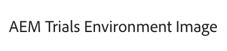

# 使用 Universal Editor 編寫內容 {#authoring}

了解內容作者使用 Universal Editor 建立內容有多簡單和直覺。

## 簡介 {#introduction}

Universal Editor 支援在任意實作中編輯任何方面的內容，以便提供卓越的體驗、提高內容速度並提供最先進的開發人員體驗。

為此，Universal Editor為內容作者提供直覺式UI，只需最少的培訓，就能快速加入並開始編輯內容。 本檔案說明Universal Editor的製作體驗。

>[!TIP]
>
>如需 Universal Editor 的詳細介紹，請參閱文件[Universal Editor 簡介。](introduction.md)

>[!NOTE]
>
>Universal Editor仍在開發中。 目前無法編輯所有內容型別。

## 準備應用程式 {#prepare-app}

為了使用 Universal Editor 編寫應用程式的內容，應用程式必須由開發人員進行檢測以支援編輯器。

>[!TIP]
>
>請參閱 [AEM 中 Universal Editor 快速入門](getting-started.md)，了解設定 AEM 應用程式以使用 Universal Editor 的範例。

## 登入 {#sign-in}

一旦檢測到應用程式與 Universal Editor 一起使用，您將需要登入 Universal Editor。您需要 Adobe ID 才能登入和[存取 Universal Editor。](getting-started.md#request-access)

登入後，請在中輸入您要編輯之頁面的URL [位置列。](#location-bar) 以便您開始編輯內容，例如 [文字內容](#text-mode) 或 [媒體內容。](#media-mode)

## 了解 UI {#ui}

UI分為五個主要區域。

* [Experience Cloud 標頭](#experience-cloud-header)
* [Universal Editor 標頭](#universal-editor-header)
* [模式邊欄](#mode-rail)
* [編輯器](#editor)
* [元件邊欄](#component-rail)

### Experience Cloud 標頭 {#experience-cloud-header}

Experience Cloud 標頭會始終顯示在畫面頂端。這是一個錨點，說明您在 Experience Cloud 中的位置，並幫助您導覽到其他 Experience Cloud 應用程式。

#### Experience Manager {#experience-manager}

選取標頭左側的 Adobe Experience Cloud 連結，導覽至 Experience Manager 解決方案的根目錄，以存取 [Cloud Manager](/help/onboarding/cloud-manager-introduction.md)、[Cloud Acceleration Manager](/help/journey-migration/cloud-acceleration-manager/introduction/overview-cam.md) 和 [Software Distribution](https://experienceleague.adobe.com/docs/experience-cloud/software-distribution/home.html) 等工具。

#### 組織 {#organization}

這將顯示您目前登入的組織。如果您的 Adobe ID 與多個組織關聯，可點選或按一下以切換到另一個組織。

#### 解決方案 {#solutions}

點選或按一下解決方案切換器可讓您快速跳轉到其他 Experience Cloud 解決方案。

#### 說明 {#help}

說明圖示可快速存取學習和支援資源。

#### 通知 {#notifications}

此圖示會加上目前指派的未完成專案之數目 [通知。](/help/implementing/cloud-manager/notifications.md)

#### 使用者屬性 {#user-properties}

點選或按一下代表您使用者的圖示以存取您的使用者設定。如果您沒有設定使用者圖片，則會隨機分配圖示。

### Universal Editor 標頭 {#universal-editor-header}

Universal Editor 標頭始終顯示在畫面頂端，就在 [Experience Cloud 標頭下方。](#experience-cloud-header)它可讓您快速存取，以導覽到另一個頁面進行編輯和發佈目前的頁面。

#### 漢堡選單 {#hamburger-menu}

漢堡選單尚未實作。

#### 位置列 {#location-bar}

位置列會顯示您正在編輯頁面的網址。點選或按一下以輸入要編輯的其他頁面的網址。

>[!TIP]
>
>使用快速鍵 `L` 打開網址列。

>[!NOTE]
>
>您希望使用 Universal Editor 編輯的任何頁面都必須[經過檢測以支援 Universal Editor。](getting-started.md)

#### 模擬器設定 {#emulator}

點選或按一下模擬圖示，以定義Universal Editor轉譯頁面的方式。

點選或按一下模擬圖示會顯示選項。

依預設，編輯器會在瀏覽器自動定義高度和寬度的案頭版面中開啟。

您也可以選擇在Universal Editor中模擬行動裝置和設定：

* 定義其方向
* 定義寬度和高度
* 變更方向

#### 開啟應用程式預覽 {#open-app-preview}

點選或按一下開啟應用程式預覽圖示，以在其瀏覽器中打開您正在編輯的頁面，無需編輯器即可預覽變更。

>[!TIP]
>
>使用快速鍵 `O` （字母O）以開啟應用程式預覽。

#### 發佈 {#publish}

點選或按一下發佈按鈕，以便即時發佈內容變更以供讀者使用。

>[!TIP]
>
>如需有關使用 Universal Visual Editor 進行發佈的詳細資訊，請參閱[使用 Universal Visual Editor 發佈內容](publishing.md)文件。

### 模式邊欄 {#rail}

模式邊欄永遠會出現在編輯器的左側。 它可讓您在不同的編輯模式之間輕鬆切換編輯器。

#### 預覽模式 {#preview-mode}

在預覽模式下，在編輯器中呈現的頁面就是發佈服務所顯示的樣子。這可讓內容作者透過按一下連結等來導覽內容。

>[!TIP]
>
>使用快速鍵 `P` 切換到預覽模式。

#### 文字模式 {#text-mode}

在文字模式中，頁面會在編輯器中呈現，但內容作者可以按一下以選取文字內容來編輯頁面。 這是載入頁面時編輯器的預設模式。

>[!TIP]
>
>使用快速鍵 `T` 以切換至文字模式。

#### 媒體模式 {#media-mode}

在媒體模式中，頁面會在編輯器中呈現，但內容作者可以按一下以選取媒體內容來編輯頁面。

>[!TIP]
>
>使用快速鍵 `M` 切換到媒體模式。

#### 元件模式 {#component-mode}

在元件模式中，頁面會在編輯器中呈現，但內容作者可以按一下以選取頁面元件。

當您選取內容片段時，其詳細資訊會顯示在 [元件欄。](#component-rail)

>[!TIP]
>
>使用快速鍵 `C` 以切換至元件模式。

#### 編輯 {#edit}

當在 [元件模式，](#component-mode) 如果您選取內容片段，模式邊欄上會出現編輯選項。

點選或按一下「編輯」按鈕會在新索引標籤中開啟內容片段編輯器，允許您在通用編輯器中編輯參考內容以及文字和媒體內容。

>[!TIP]
>
>使用快速鍵 `E` 以編輯選取的元件。

### 編輯器 {#editor}

編輯器會佔用大部分視窗，並且是中指定的頁面所在位置。 [位置列](#location-bar) 已呈現。

* 如果編輯器處於編輯模式，例如 [文字模式](#text-mode) 或 [媒體模式，](#media-mode) 內容將可編輯，且您無法關注連結。
* 如果編輯器位於 [預覽模式，](#preview-mode) 內容將可供導覽，您可以關注連結，但您無法編輯內容。

### 元件邊欄 {#component-rail}

元件邊欄一律會沿著編輯器的左側顯示。 視其模式而定，它可以顯示內容或頁面內容階層中所選元件的詳細資訊。

#### 屬性模式 {#properties-mode}

在屬性模式中，邊欄會顯示編輯器中目前所選元件的屬性。 這是載入頁面時元件邊欄的預設模式。

所選元件的詳細資訊會顯示在邊欄中。 如果您已使用選取內容片段 [元件模式，](#component-mode) 您可以在元件邊欄中修改其設定。 變更會由通用編輯器自動儲存。

請注意，並非所有元件都有可顯示的詳細資料。

>[!TIP]
>
>使用快速鍵 `D` 以切換至屬性模式。

#### 內容樹模式 {#Content-tree-mode}

在內容樹狀結構模式中，邊欄會顯示頁面內容的階層。

在內容樹狀結構中選取專案時，編輯器會捲動至該內容並加以選取。

>[!TIP]
>
>使用快速鍵 `F` 以切換至內容樹模式。

## 編輯內容 {#editing-content}

編輯內容很簡單又直覺。在編輯模式中([文字模式](#text-mode)， [媒體模式](#media-mode)、和 [元件模式](#component-mode))，將游標移至編輯器中的內容時，可編輯內容會以藍色方塊醒目提示。

只需點選或按一下藍色框中的內容即可啟動就地編輯器來進行變更。您的變更會自動儲存。

請注意，在編輯模式下，點選或按一下內容會選擇它進行編輯。如果您希望透過以下連結瀏覽您的內容，請切換到[預覽模式。](#preview-mode)

根據 [模式](#mode-rail) 您所在的和您選取的內容，可能會有不同的就地編輯選項。

此外，您或許可以使用檢閱內容的其他屬性。 [元件欄。](#component-rail) 例如，如果您選取RTF文字元件，則可以在元件邊欄中編輯格式選項。

## 預覽內容 {#previewing-content}

內容編輯完成後，您通常會希望瀏覽其內容，以查看它在其他頁面內容中的樣子。在[預覽模式](#preview-mode)中，您可以點選連結，像讀者一樣瀏覽您的內容。內容在編輯器中呈現的樣子就是將會發佈的樣子。

請注意，在預覽模式下，點選或按一下內容的回應與內容讀者的回應一樣。如果要選取要編輯的內容，請切換到編輯模式，例如 [文字模式](#text-mode) 或 [媒體模式。](#media-mode)

## 其他資源 {#additional-resources}

若要了解有關 Universal Editor 的詳細資訊，請參閱以下文件。

* [Universal Editor 簡介](introduction.md) - 了解 Universal Editor 如何在任意實作中編輯任何方面的內容，以便提供卓越的體驗、提高內容速度並提供最先進的開發人員體驗。
* [使用 Universal Editor 發佈內容](publishing.md) - 了解 Universal Visual Editor 如何發佈內容，和您的應用程式如何處理發佈的內容。
* [AEM 中 Universal Editor 快速入門](getting-started.md) - 了解如何存取 Universal Editor，以及如何開始檢測您的第一個 AEM 應用程式以使用它。
* [Universal Editor 架構](architecture.md) - 了解 Universal Editor 的架構，以及資料如何在其服務和階層之間流動。
* [屬性和類型](attributes-types.md) - 了解 Universal Editor 需要的資料屬性和類型。
* [Universal Editor 驗證](authentication.md) - 了解 Universal Editor 如何進行驗證。
