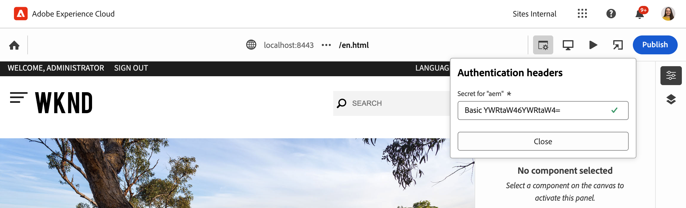

# AEM 開發人員通用編輯器概觀 {#developer-overview}

若您是 AEM 開發人員，且有興趣了解通用編輯器的運作原理及其在專案中的使用方法，本文件為您提供端對端的介紹，引導您檢測 WKND 專案，以便與通用編輯器搭配使用。

## 用途 {#purpose}

本文件向開發人員介紹通用編輯器的功能，以及如何檢測應用程式以便與通用編輯器搭配使用。

文件內容會採用大多數 AEM 開發人員所熟悉的標準範例、核心元件以及 WKND 網站，並檢測一些範例元件，以便使用通用編輯器進行編輯。

>[!TIP]
>
>本文件會採取額外步驟來說明通用編輯器的運作原理，旨在加深開發人員對編輯器的理解。因此，文件並未採取檢測應用程式的最直接途徑，而是選擇能夠清楚說明通用編輯器及其運作原理的途徑。
>
>若您想盡快完成設定並開始運作，請參閱 [AEM 中通用編輯器快速入門](/help/implementing/universal-editor/getting-started.md)文件。

## 先決條件 {#prerequisites}

若要跟著此概觀一起操作，您需要具備以下項目。

* [AEM as a Cloud Service 的本機開發實例](https://experienceleague.adobe.com/docs/experience-cloud/software-distribution/home.html?lang=zh-Hant)
   * 您的本機開發實例必須[設定 HTTPS 才能在 `localhost` 上進行開發](https://experienceleague.adobe.com/docs/experience-manager-learn/foundation/security/use-the-ssl-wizard.html?lang=zh-Hant)。
   * [必須安裝 WKND 示範網站](https://github.com/adobe/aem-guides-wknd)。
* [通用編輯器存取權](/help/implementing/universal-editor/getting-started.md#onboarding)。
* 針對開發目的而執行的[本機通用編輯器服務](/help/implementing/universal-editor/local-dev.md)。
   * 確保引導您的瀏覽器[接受本機服務自我簽署憑證](/help/implementing/universal-editor/local-dev.md#editing)。

本文件假設您大致上熟悉網頁開發，而且對於 AEM 開發也具備基本認識。若您沒有 AEM 開發經驗，請考慮在[繼續之前先檢閱 WKND 教學課程](/help/implementing/developing/introduction/develop-wknd-tutorial.md)。

## 啟動 AEM 並登入通用編輯器 {#sign-in}

若您還沒有這麼做，您的本機 AEM 開發實例必須在已經安裝 WKND 而且啟用 HTTPS 的情況下執行，如[先決條件中所述](#prerequisites)。本概觀假設您的實例是在 `https://localhost:8443` 執行。

1. 在 AEM 編輯器中開啟主要的 WKND 英文主版頁面。

   ```text
   https://localhost:8443/editor.html/content/wknd/language-masters/en.html
   ```

1. 在編輯器的「**頁面資訊**」選單中，選取「**以發佈頁面形式檢視**」。這樣做會在新標籤開啟相同頁面，並停用 AEM 編輯器。

   ```text
   https://localhost:8443/content/wknd/language-masters/en.html?wcmmode=disabled
   ```

1. 複製此連結。

1. 現在登入通用編輯器。

   ```text
   https://experience.adobe.com/#/aem/editor
   ```

1. 將您先前複製的 WKND 內容連結貼到通用編輯器的「**網站 URL**」欄位中，然後按一下「**開啟**」。

   

## 通用編輯器嘗試載入內容 {#sameorigin}

通用編輯器在框架中載入要編輯的內容。AEM X-Frame 選項的預設設定會阻擋此動作，當您嘗試載入 WKND 的本機副本時，可以在瀏覽器中清楚地看到此錯誤，而且控制台輸出中會有詳細記錄。


X-Frame 選項 `sameorigin` 會阻止在框架內轉譯 AEM 頁面。您必須移除此標頭，頁面才能載入到通用編輯器中。

1. 開啟 Configuration Manager。

   ```text
   https://localhost:8443/system/console/configMgr
   ```

1. 編輯 OSGi 設定 `org.apache.sling.engine.impl.SlingMainServlet`

   

1. 刪除&#x200B;**其他回應標頭**&#x200B;屬性的 `X-Frame-Options=SAMEORIGIN` 屬性。

1. 儲存變更。

現在，如果重新載入通用編輯器，會看到您的 AEM 頁面已經載入。

>[!TIP]
>
>* 如需關於此 OSGi 設定的更多詳細資訊，請參閱 [AEM 中通用編輯器快速入門](/help/implementing/universal-editor/getting-started.md#sameorigin)文件。
>* 如需關於 AEM 中 OSGi 的詳細資訊，請參閱[設定 Adobe Experience Manager as a Cloud Service 的 OSGi](/help/implementing/deploying/configuring-osgi.md) 文件。

## 處理同網站 Cookie {#samesite-cookies}

當通用編輯器載入您的頁面時，會把頁面載入到 AEM 登入頁面，確保您經過驗證可以進行變更。

但是，您無法成功登入。系統顯示瀏覽器控制台，可以看到瀏覽器已封鎖框架上的輸入


登入權杖 Cookie 會做為第三方網域傳送至 AEM。因此，AEM 必須允許使用同網站 Cookie。

1. 開啟 Configuration Manager。

   ```text
   https://localhost:8443/system/console/configMgr
   ```

1. 編輯 OSGi 設定 `com.day.crx.security.token.impl.impl.TokenAuthenticationHandler`

   

1. 將屬性&#x200B;**登入權杖 Cookie 的同網站屬性**&#x200B;變更為「`Partitioned`」。

1. 儲存變更。

現在，如果重新載入通用編輯器，您就可以成功登入 AEM，而且目標頁面也會載入。

>[!TIP]
>
>* 如需關於此 OSGi 設定的更多詳細資訊，請參閱 [AEM 中通用編輯器快速入門](/help/implementing/universal-editor/getting-started.md#samesite-cookies)文件。
>* 如需關於 AEM 中 OSGi 的詳細資訊，請參閱[設定 Adobe Experience Manager as a Cloud Service 的 OSGi](/help/implementing/deploying/configuring-osgi.md) 文件。

## 通用編輯器連結至遠端框架 {#ue-connect-remote-frame}

當頁面載入至通用編輯器且您已登入 AEM 後，通用編輯器會嘗試連結至遠端框架。此一連結必須透過在遠端框架中載入的 JavaScript 程式庫來完成。若沒有 JavaScript 程式庫，頁面最終會在控制台中建立逾時錯誤。


您必須將所需的 JavaScript 程式庫新增至 WKND 應用程式的頁面元件。

1. 開啟 CRXDE Lite。

   ```text
   https://localhost:8443/crx/de
   ```

1. 在 `/apps/wknd/components/page` 之下，編輯 `customheaderlibs.html` 檔案。

   

1. 將 JavaScript 程式庫新增至檔案的末端。

   ```html
   <script src="https://universal-editor-service.adobe.io/cors.js" async></script>
   ```

1. 按一下「**儲存全部**」，然後重新載入通用編輯器。

頁面現在透過正確的 JavaScript 程式庫載入，使通用編輯器能夠連結至您的頁面，且控制台中不再出現逾時錯誤。

>[!TIP]
>
>* 程式庫可以載入至頁首或頁尾。

>[!NOTE]
>
>先前建議的加入 JavaScript 程式庫 `<script src="https://universal-editor-service.experiencecloud.live/corslib/LATEST"></script>` 或透過 npmjs.com 的方法，皆不再建議使用，因為該封裝已淘汰。
>
>若應用程式仍在使用已淘汰的封裝，通用編輯器會在使用者介面中顯示偵測到過時封裝的警告。

## 定義連線以保留變更 {#connection}

WKND 頁面現已成功載入通用編輯器中，而且 JavaScript 程式庫已載入，以便編輯器連結至您的應用程式。

但是，您可能注意到您無法在通用編輯器中與頁面進行互動。通用編輯器實際上無法編輯您的頁面。要讓通用編輯器能夠編輯您的內容，必須定義一個連線，讓編輯器知道要將內容寫入何處。對於本機開發，您必須寫回至位在 `https://localhost:8443` 的本機 AEM 開發實例。

1. 開啟 CRXDE Lite。

   ```text
   https://localhost:8443/crx/de
   ```

1. 在 `/apps/wknd/components/page` 之下，編輯 `customheaderlibs.html` 檔案。

   

1. 將建立本機 AEM 實例連線所需的後設資料新增至檔案的末端。

   ```html
   <meta name="urn:adobe:aue:system:aem" content="aem:https://localhost:8443">
   ```

   * 始終建議採用該程式庫的最新版本。若需要先前的版本，請參閱 [AEM 中通用編輯器快速入門](/help/implementing/universal-editor/getting-started.md#alternative)文件。

1. 將建立本機通用編輯器服務所需的後設資料新增至檔案的末端。

   ```html
   <meta name="urn:adobe:aue:config:service" content="https://localhost:8000">
   ```

1. 按一下「**儲存全部**」，然後重新載入通用編輯器。

現在，通用編輯器不僅可以從您的本機 AEM 開發實例成功載入您的內容，也知道要將您使用本機通用編輯器服務所做的任何變更保留在何處。這是檢測您的應用程式使其能透過通用編輯器進行編輯的第一步。

>[!TIP]
>
>* 如需關於連線後設資料的更多詳細資訊，請參閱 [AEM 中通用編輯器快速入門](/help/implementing/universal-editor/getting-started.md#connection)文件。
>* 如需關於通用編輯器結構的更多詳細資訊，請參閱[通用編輯器架構](/help/implementing/universal-editor/architecture.md#service)文件。
>* 如需關於如何連結至通用編輯器自託管版本的更多詳細資訊，請參閱[使用通用編輯器進行本機 AEM 開發](/help/implementing/universal-editor/local-dev.md)文件。

## 檢測元件 {#instrumenting-components}

然而，您可能會發現，能夠使用通用編輯器完成的工作並不多。若您嘗試點按通用編輯器中 WKND 頁面頂部的 Teaser，會發現實際上無法選取 Teaser (或頁面上的任何其他東西)。

您的元件也必須經過檢測才能使用通用編輯器進行編輯。要做到這件事，您必須編輯 Teaser 元件。因此，您需要覆蓋核心元件，因為核心元件位於 `/libs` 之下，而其是不可變的。

1. 開啟 CRXDE Lite。

   ```text
   https://localhost:8443/crx/de
   ```

1. 選取節點 `/libs/core/wcm/components`，然後按一下工具列上的「**覆蓋節點**」。

1. 在選取「`/apps/`」作為「**覆蓋位置**」情況下，按一下「**確定**」。

   

1. 選取 `/libs/core/wcm/components` 之下的 `teaser` 節點，然後在工具列中按一下「**複製**」。

1. 選取位於 `/apps/core/wcm/components` 的已覆蓋節點，然後在工具列中按一下「**貼上**」。

1. 按兩下 `/apps/core/wcm/components/teaser/v2/teaser/teaser.html` 檔案進行編輯。

   

1. 在第一個 `div` 的最後 (大約第 26 行)，新增元件的檢測詳細資訊。

   ```text
   data-aue-resource="urn:aem:${resource.path}"
   data-aue-type="component"
   data-aue-label="Teaser"
   ```

1. 在工具列中按一下「**儲存全部**」，並重新載入通用編輯器。

1. 在通用編輯器中，按一下頁面頂部的 Teaser 元件，便會發現現在已經可以選取 Teaser。

1. 若您按一下通用編輯器屬性面板中的「**內容樹**」圖示，即可看到編輯器已識別出頁面上的所有 Teaser，因為您已經檢測完成。您所選取的 Teaser 就是醒目標示的那一個。

   

>[!TIP]
>
>如需關於覆蓋節點的更多詳細資訊，請參閱[在 Adobe Experience Manager as a Cloud Service 中使用 Sling Resource Merger](/help/implementing/developing/introduction/sling-resource-merger.md) 文件。

## 檢測 Teaser 子元件 {#subcomponents}

現在您可以選取 Teaser，但仍然無法進行編輯。這是因為 Teaser 是由影像和標題元件等不同的元件組合而成。您必須檢測這些子元件才能進行編輯。

1. 開啟 CRXDE Lite。

   ```text
   https://localhost:8443/crx/de
   ```

1. 選取節點 `/apps/core/wcm/components/teaser/v2/teaser/`，然後按兩下 `title.html` 檔案。

   

1. 在 `h2` 標記的末端 (接近第 17 行) 插入下列屬性。

   ```text
   data-aue-prop="jcr:title"
   data-aue-type="text"
   data-aue-label="Title"
   ```

1. 在工具列中按一下「**儲存全部**」，並重新載入通用編輯器。

1. 按一下頁面頂部相同 Teaser 元件的標題，便會發現現已可以選取 Teaser。內容樹也會顯示該標題，做為選取的 Teaser 元件的一部分。

   

現在您已可以編輯 Teaser 元件的標題！

## 這一切代表什麼？ {#what-does-it-mean}

您現在可以編輯 Teaser 標題，我們來花點時間回顧一下您已實現的目標以及您是如何完成的。

透過檢測 Teaser 元件，您已經讓通用編輯器能夠識別出 Teaser 元件。

* `data-aue-resource` 會識別 AEM 中正在編輯的資源。
* `data-aue-type` 定義應被視為頁面元件 (而不是比如說容器) 的項目。
* `data-aue-label` 在使用者介面中為所選 Teaser 顯示使用者容易辨識的標籤。

您也已經檢測 Teaser 元件中的標題元件。

* `data-aue-prop` 是所寫入的 JCR 屬性。
* `data-aue-type` 指定屬性的編輯方式。在本案例中，是使用文字編輯器，因為這是一個標題 (而不是比如說 RTF 文字編輯器)。

## 定義驗證標頭 {#auth-header}

您現在能以行間方式編輯 Teaser 的標題，且變更會保留在瀏覽器中。


然而，若您重新載入瀏覽器，會重新載入之前的標題。這是因為，儘管通用編輯器知道如何連結至您的 AEM 實例，但編輯器還無法驗證您的 AEM 實例，以便將變更寫回 JCR。

若您展開瀏覽器開發人員工具的「網路」標籤並搜尋 `update`，會發現在嘗試編輯標題時出現 401 錯誤。


使用通用編輯器編輯您的生產 AEM 內容時，通用編輯器使用您用來登入編輯器的同一個 IMS 權杖來驗證 AEM，以便能夠寫回 JCR。

當您在本機進行開發時，無法使用 AEM 身分識別提供者，因為 IMS 權杖只會傳遞至 Adobe 擁有的網域。您必須明確設定驗證標頭，手動提供驗證方法。

1. 在通用編輯器介面中，在工具列中按一下「**驗證標頭**」圖示。

1. 複製所需的驗證標頭，以便驗證您的本機 AEM 實例，然後按一下「**儲存**」。

   

1. 重新載入通用編輯器，然後現在可以編輯 Teaser 標題。

瀏覽器控制台不再回報任何錯誤，且變更會保留在您的本機 AEM 開發實例。

若您調查瀏覽器開發人員工具中的流量並尋找 `update` 事件，可以看到關於更新的詳細資訊。


```json
{
  "connections": [
    {
      "name": "aem",
      "protocol": "aem",
      "uri": "https://localhost:8443"
    }
  ],
  "target": {
    "resource": "urn:aem:/content/wknd/language-masters/en/jcr:content/root/container/carousel/item_1571954853062",
    "type": "text",
    "prop": "jcr:title"
  },
  "value": "Tiny Toon Adventures"
}
```

* `connections` 是連結至您本機 AEM 實例的連線
* `target` 是於 JCR 中更新的確切節點和屬性
* `value` 是您所做的更新。

您可以看到變更已保留在 JCR 中。


>[!TIP]
>
>線上有許多工具可用於產生測試和開發所需的驗證標頭。
>
>基本驗證標頭範例 `Basic YWRtaW46YWRtaW4=` 為適用於 `admin:admin` 的使用者/密碼組合，是本機 AEM 開發常見的內容。

## 檢測屬性面板的應用程式 {#properties-rail}

您現在擁有一個經過檢測可使用通用編輯器進行編輯的應用程式！

編輯功能目前僅限於以行間方式編輯 Teaser 標題。然而，也有一些原位置編輯不足以應付的情況。如 Teaser 標題之類的文字可以使用鍵盤輸入編輯。但更複雜的項目必須能夠顯示而且允許編輯結構化資料，與瀏覽器中的轉譯方式不同。這便是屬性面板發揮作用的時候。

若要更新您的應用程式以便能夠使用屬性面板進行編輯，請返回應用程式頁面元件的標頭檔案。您已經在這個標頭檔案中建立與本機 AEM 開發實例以及本機通用編輯器服務之連線。您必須在這個檔案中定義應用程式中可編輯的元件及其資料模型。

1. 開啟 CRXDE Lite。

   ```text
   https://localhost:8443/crx/de
   ```

1. 在 `/apps/wknd/components/page` 之下，編輯 `customheaderlibs.html` 檔案。

   

1. 在檔案的末端加入定義元件所需的指令碼。

   ```html
   <script type="application/vnd.adobe.aue.component+json">
   {
     "groups": [
       {
         "title": "General Components",
         "id": "general",
         "components": [
           {
             "title": "Teaser",
             "id": "teaser",
             "plugins": {
               "aem": {
                 "page": {
                   "resourceType": "wknd/components/teaser"
                 }
               }
             }
           },
           {
             "title": "Title",
             "id": "title",
             "plugins": {
               "aem": {
                 "page": {
                   "resourceType": "wknd/components/title"
                 }
               }
             }
           }
         ]
       }
     ]
   }
   </script>
   ```

1. 在其下方，在檔案的標端加入定義模型所需的指令碼。

   ```html
   <script type="application/vnd.adobe.aue.model+json">
   [
     {
       "id": "teaser",
       "fields": [
         {
           "component": "text-input",
           "name": "jcr:title",
           "label": "Title",
           "valueType": "string"
         },
         {
           "component": "text-area",
           "name": "jcr:description",
           "label": "Description",
           "valueType": "string"
         }
       ]
     },
     {
       "id": "title",
       "fields": [
         {
           "component": "select",
           "name": "type",
           "value": "h1",
           "label": "Type",
           "valueType": "string",
           "options": [
             { "name": "h1", "value": "h1" },
             { "name": "h2", "value": "h2" },
             { "name": "h3", "value": "h3" },
             { "name": "h4", "value": "h4" },
             { "name": "h5", "value": "h5" },
             { "name": "h6", "value": "h6" }
           ]
         }
       ]
     }
   ]
   </script>
   ```

1. 在工具列中按一下「**儲存全部**」。

## 這一切代表什麼？ {#what-does-it-mean-2}

若要能夠使用屬性面板來編輯元件，該元件必須指派至 `groups`，讓每個定義都是以包含元件的群組清單作為開頭。

* `title` 是群組的名稱。
* `id` 是群組的唯一識別碼，在本案例中是組成頁面內容的一般元件，而不是比如說頁面版面的進階元件。

每個群組都會有一個 `components` 陣列。

* `title` 是元件的名稱。
* `id` 是元件的唯一識別碼，在本案例中是一個 Teaser。

每個元件都會有一個外掛程式定義，定義元件如何對應至 AEM。

* `aem` 是處理編輯作業的外掛程式。您可以將此外掛程式看作是處理元件的服務。
* `page` 定義其元件類型，在本案例中是標準頁面元件。
* `resourceType` 是與實際 AEM 元件的對應。

每個元件都必須對應至 `model`，以便定義個別可編輯欄位。

* `id` 是模型的唯一識別碼，必須與元件的 ID 相符。
* `fields` 是個別欄位的陣列。
* `component` 是輸入的類型，例如文字或文字區域。
* `name` 是欄位所對應的 JCR 中的欄位名稱。
* `label` 是編輯器使用者介面中出現之欄位的說明。
* `valueType` 是資料類型。

## 檢測屬性面板的元件 {#properties-rail-component}

您也必須在元件層級定義元件應該使用哪個模型。

1. 開啟 CRXDE Lite。

   ```text
   https://localhost:8443/crx/de
   ```

1. 按兩下 `/apps/core/wcm/components/teaser/v2/teaser/teaser.html` 檔案進行編輯。

   

1. 在第一個 `div` 的末端 (大約第 32 行)，在您先前新增的屬性之後，新增 Teaser 元件將使用之模型的檢測詳細資訊。

   ```text
   data-aue-model="teaser"
   ```

1. 在工具列中按一下「**儲存全部**」，並重新載入通用編輯器。

現在您已準備就緒，可以測試針對您的元件檢測的屬性面板。

1. 在通用編輯器中，按一下 Teaser 的標題，再次進行編輯。

1. 按一下屬性面板以顯示屬性標籤，並查看您剛才檢測的欄位。

   

現在您可以像之前一樣在行間編輯 Teaser 的標題，或是在屬性面板中編輯。在這兩種情況下，變更都會保留在您的本機 AEM 開發實例。

## 在屬性面板中新增其他欄位 {#add-fields}

使用已實施元件的資料模型基本結構，您可以按照相同的模型新增其他欄位。

例如，您可以新增一個欄位來調整元件的樣式。

1. 開啟 CRXDE Lite。

   ```text
   https://localhost:8443/crx/de
   ```

1. 在 `/apps/wknd/components/page` 之下，編輯 `customheaderlibs.html` 檔案。

   

1. 在模型定義指令碼中，將其他項目新增至樣式欄位的 `fields` 陣列。插入新欄位之前，請記得在最後一個欄位之後加上逗號。

   ```json
   {
      "component": "select",
      "name": "cq:styleIds",
      "label": "Style",
      "valueType": "string",
        "multi": true,
      "options": [
        {"name": "hero", "value":"1555543212672"},
        {"name": "card", "value":"1605057868937"}
      ]
   }
   ```

1. 在工具列中按一下「**儲存全部**」，並重新載入通用編輯器。

1. 按一下 Teaser 的標題，再次進行編輯。

1. 按一下屬性面板，可以看到一個用來調整元件樣式的新欄位。

   

元件 JCR 中的任何欄位都可以透過這種方式在通用編輯器中顯示。

## 摘要 {#summary}

恭喜！現在，您可以檢測自己的 AEM 應用程式，以便與通用編輯器一起使用。

當您開始檢測自己的應用程式時，請謹記您在此範例中執行過的基本步驟。

1. [您設定了開發環境](#prerequisites)。
   * 已安裝 WKND 並以 HTTPS 在本機執行的 AEM
   * 通用編輯器服務在本機以 HTTPS 執行
1. 您更新了 AEM 的 OSGi 設定，以便可以從遠端載入其內容。
   * [`org.apache.sling.engine.impl.SlingMainServlet`](#sameorigin)
   * [`com.day.crx.security.token.impl.impl.TokenAuthenticationHandler`](#samesite-cookies)
1. [您將 `universal-editor-embedded.js` 程式庫新增至應用程式頁面元件的 `customheaderlibs.html` 檔案中](#ue-connect-remote-frame)。
1. [您定義了連線，以保留應用程式頁面元件的 `customheaderlibs.html` 檔案中的變更](#connection)。
   * 您定義了與本機 AEM 開發實例的連線。
   * 您也定義了與本機通用編輯器服務的連線。
1. [您檢測了 Teaser 元件](#instrumenting-components)。
1. [您檢測了 Teaser 的子元件](#subcomponents)。
1. [您定義了自訂驗證標頭，讓您可以使用本機通用編輯器服務儲存變更](#auth-header)。
1. [您檢測了應用程式以便使用屬性面板](#properties-rail)。
1. [您檢測了 Teaser 元件以便使用屬性面板](#properties-rail-component)。

您可以依照上述相同的步驟檢測自己的應用程式，以便與通用編輯器搭配使用。JCR 的任何屬性都可以在通用編輯器中顯示。

## 其他資源 {#additional-resources}

參閱以下文件，了解關於通用編輯器功能的更多資訊和詳細資料。

* 若您想盡快完成設定並開始運作，請參閱 [AEM 中通用編輯器快速入門](/help/implementing/universal-editor/getting-started.md)文件。
* 如需關於所需 OSGi 設定的更多詳細資訊，請參閱 [AEM 中通用編輯器快速入門](/help/implementing/universal-editor/getting-started.md#sameorigin)文件。
* 如需關於連線後設資料的更多詳細資訊，請參閱 [AEM 中通用編輯器快速入門](/help/implementing/universal-editor/getting-started.md#connection)文件。
* 如需關於通用編輯器結構的更多詳細資訊，請參閱[通用編輯器架構](/help/implementing/universal-editor/architecture.md#service)文件。
* 如需關於如何連結至通用編輯器自行託管版本的更多詳細資訊，請參閱[使用通用編輯器進行本機 AEM 開發](/help/implementing/universal-editor/local-dev.md)文件。
* 如需關於覆蓋節點的更多詳細資訊，請參閱[在 Adobe Experience Manager as a Cloud Service 中使用 Sling Resource Merger](/help/implementing/developing/introduction/sling-resource-merger.md) 文件。

