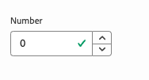

# 模型定義、欄位和元件類型 {#field-types}

透過範例瞭解通用編輯器可在屬性面板中編輯的欄位和元件型別。 瞭解如何建立模型定義並連結至元件，以裝備您自己的應用程式。

## 概觀 {#overview}

調整您自己的應用程式以與通用編輯器搭配使用時，您必須檢測元件，並定義元件可在編輯器的「屬性」面板中操作的欄位和元件型別。 若要這麼做，請建立模型並從元件連結至模型。

本檔案提供模型定義、欄位和可用元件型別的概觀，以及設定範例。

>[!TIP]
>
>如果您不熟悉如何針對通用編輯器檢測您的應用程式，請參閱檔案： [適用於AEM開發人員的通用編輯器概觀](/help/implementing/universal-editor/developer-overview.md)。

## 模型定義結構 {#model-structure}

若要透過通用編輯器中的屬性面板設定元件，模型定義必須存在且必須連結至元件。

模型定義是JSON結構，從模型的陣列開始。

```json
[
  {
    "id": "model-id",        // must be unique
    "fields": []             // array of fields which shall be rendered in the properties panel
  }
]
```

請參閱本檔案的&#x200B;**[欄位](#fields)**&#x200B;區段，以取得如何定義`fields`陣列的詳細資訊。

您可以使用兩種方式將模型連結至元件：使用[元件定義](#component-definition)或透過檢測使用[。](#instrumentation)

### 使用元件定義連結 {#component-definition}

這是將模型連結至元件的偏好方法。 如此可讓您集中維護元件定義中的連結，並啟用跨容器拖曳元件。

只要在`component-definition.json`檔案的`components`陣列中的元件物件中包含`model`屬性即可。

如需詳細資訊，請參閱檔案[元件定義。](/help/implementing/universal-editor/component-definition.md)

### 使用檢測連結 {#instrumentation}

若要搭配元件使用模型定義，可以使用`data-aue-model`屬性。

```html
<div data-aue-resource="urn:datasource:/content/path" data-aue-type="component"  data-aue-model="model-id">Click me</div>
```

>[!NOTE]
>
>在檢查元件定義之前，Universal Editor會先檢查模型是否透過檢測連結並使用模型。 這表示：
>
>* 已透過檢測實作連結至模型的專案將照原樣繼續運作，無需變更。
>* 如果您在[元件定義](#component-definition)以及檢測中定義模型，則一律會使用檢測。

## 載入模型定義 {#loading-model}

建立模型後，可作為外部檔案參照。

```html
<script type="application/vnd.adobe.aue.model+json" src="<url-of-model-definition>"></script>
```

或者，您也可以線上上定義模型。

```html
<script type="application/vnd.adobe.aue.model+json">
  { ... model definition ... }
</script>
```

## 欄位 {#fields}

欄位物件具有下列型別定義。

| 設定 | 數值類型 | 說明 | 必要 |
|---|---|---|---|
| `component` | `ComponentType` | 元件的轉譯器 | 是 |
| `name` | `string` | 應儲存資料的屬性[或路徑](#nesting) | 是 |
| `label` | `FieldLabel` | 欄位標籤 | 是 |
| `description` | `FieldDescription` | 欄位說明 | 否 |
| `placeholder` | `string` | 欄位預留位置 | 否 |
| `value` | `FieldValue` | 預設值 | 否 |
| `valueType` | `ValueType` | 標準驗證，可以是`string`、`string[]`、`number`、`date`、`boolean` | 否 |
| `required` | `boolean` | 欄位是否為必填欄位 | 否 |
| `readOnly` | `boolean` | 欄位是否為唯讀 | 否 |
| `hidden` | `boolean` | 預設為隱藏欄位 | 否 |
| `condition` | `RulesLogic` | 根據[條件](/help/implementing/universal-editor/customizing.md#conditionally-hide)顯示或隱藏欄位的規則 | 否 |
| `multi` | `boolean` | 此欄位是否為多個欄位 | 否 |
| `validation` | `ValidationType` | 欄位的驗證規則 | 否 |
| `raw` | `unknown` | 元件可使用的原始資料 | 否 |

### 名稱欄位和巢狀 {#nesting}

`name`欄位可以直接指向目前資源的屬性，或者，如果是`cq:Pages`中的元件，它也可以使用巢狀屬性的路徑。 例如：

```json
"name": "teaser/image/fileReference"
```

### 元件類型 {#component-types}

以下是可用於呈現欄位的元件型別。

| 說明 | 元件類型 |
|---|---|
| [AEM標籤](#aem-tag) | `aem-tag` |
| [AEM內容](#aem-content) | `aem-content` |
| [布林值](#boolean) | `boolean` |
| [核取方塊群組](#checkbox-group) | `checkbox-group` |
| [容器](#container) | `container` |
| [內容片段](#content-fragment) | `aem-content-fragment` |
| [日期時間](#date-time) | `date-time` |
| [體驗片段](#experience-fragment) | `aem-experience-fragment` |
| [多重選取](#multiselect) | `multiselect` |
| [數字](#number) | `number` |
| [無線電群組](#radio-group) | `radio-group` |
| [參考](#reference) | `reference` |
| [RTF格式](#rich-text) | `richtext` |
| [選取](#select) | `select` |
| [標籤](#tab) | `tab` |
| [文字](#text) | `text` |

#### AEM標籤 {#aem-tag}

AEM標籤元件型別會啟用AEM標籤選取器，其可用來將標籤附加至元件。

>[!BEGINTABS]

>[!TAB 樣本]

```json
{
  "id": "aem-tag-picker",
  "fields": [
    {
      "component": "aem-tag",
      "label": "AEM Tag Picker",
      "name": "cq:tags",
      "valueType": "string"
    }
  ]
}
```

>[!TAB 螢幕擷圖]


>[!ENDTABS]

>[!TIP]
>
>請參閱檔案[管理分類資料](/help/edge/wysiwyg-authoring/taxonomy.md)，瞭解如何使用試算表來管理Edge Delivery Services專案的分類資料的詳細資訊。

#### AEM內容 {#aem-content}

AEM內容元件型別會啟用AEM內容選擇器，可用來選取任何AEM資源。 與只能選取資產的[參考元件](#reference)不同，AEM內容元件可參考任何AEM內容。 它提供額外的驗證型別。

| 驗證類型 | 數值類型 | 說明 | 必要 |
|---|---|---|---|
| `rootPath` | `string` | 內容選擇器將開啟供使用者選取AEM內容的路徑，將選取範圍限制在該目錄和子目錄中 | 否 |

>[!BEGINTABS]

>[!TAB 樣本]

```json
{
  "id": "aem-content-picker",
  "fields": [
    {
      "component": "aem-content",
      "name": "reference",
      "value": "",
      "label": "AEM Content Picker",
      "valueType": "string",
      "validation": {
            "rootPath": "/content/refresh"
        }
    }
  ]
}
```

>[!TAB 螢幕擷圖]


>[!ENDTABS]

#### 布林值 {#boolean}

布林值元件型別會儲存簡單的true/false值，呈現為切換按鈕。 它提供額外的驗證型別。

| 驗證類型 | 數值類型 | 說明 | 必要 |
|---|---|---|---|
| `customErrorMsg` | `string` | 如果輸入的值不是布林值，則會顯示的訊息 | 否 |

>[!BEGINTABS]

>[!TAB 範例1]

```json
{
  "id": "boolean",
  "fields": [
    {
      "component": "boolean",
      "label": "Boolean",
      "name": "boolean",
      "valueType": "boolean"
    }
  ]
}
```

>[!TAB 範例2]

```json
{
  "id": "another-boolean",
  "fields": [
    {
      "component": "boolean",
      "label": "Boolean",
      "name": "boolean",
      "valueType": "boolean",
      "validation": {
        "customErrorMsg": "Think, McFly. Think!"
      }
    }
  ]
}
```

>[!TAB 螢幕擷圖]


>[!ENDTABS]

#### 核取方塊群組 {#checkbox-group}

與布林值類似，核取方塊群組元件型別允許選取多個true/false專案，呈現為多個核取方塊。

>[!BEGINTABS]

>[!TAB 樣本]

```json
{
  "id": "checkbox-group",
  "fields": [
    {
      "component": "checkbox-group",
      "label": "Checkbox Group",
      "name": "checkbox",
      "valueType": "string[]",
      "options": [
        { "name": "Option 1", "value": "option1" },
        { "name": "Option 2", "value": "option2" }
      ]
    }
  ]
}
```

>[!TAB 螢幕擷圖]

的熒幕擷圖

>[!ENDTABS]

#### 容器 {#container}

容器元件型別可將包含多欄位支援的元件分組。 它提供額外設定。

| 設定 | 數值類型 | 說明 | 必要 |
|---|---|---|---|
| `collapsible` | `boolean` | 容器是否可摺疊 | 否 |

>[!BEGINTABS]

>[!TAB 樣本]

```json
 {
  "id": "container",
  "fields": [
    {
      "component": "container",
      "label": "Container",
      "name": "container",
      "valueType": "string",
      "collapsible": true,
      "fields": [
        {
          "component": "text-input",
          "label": "Simple Text 1",
          "name": "text",
          "valueType": "string"
        },
        {
          "component": "text-input",
          "label": "Simple Text 2",
          "name": "text2",
          "valueType": "string"
        }
      ]
    }
  ]
}
```

>[!TAB 螢幕擷圖]

的熒幕擷圖

>[!TAB 多欄位支援]

```json
{
  "component": "container",
  "name": "test",
  "label": "Multi Text",
  "multi": true,
  "fields": [
    {
      "component": "reference",
      "name": "image",
      "value": "",
      "label": "Sample Image",
      "valueType": "string"
    },
    {
      "component": "text",
      "name": "alt",
      "value": "",
      "label": "Alt Text",
      "valueType": "string"
    }
  ]
}
```

>[!ENDTABS]


#### 內容片段 {#content-fragment}

內容片段選擇器可用來選取[內容片段](/help/sites-cloud/authoring/fragments/content-fragments.md)及其變數（如果需要）。 它提供額外設定。

| 設定 | 數值類型 | 說明 | 必要 |
|---|---|---|---|
| `variationName` | `string` | 儲存所選變數的變數名稱。 如果未定義，則不會顯示變數選擇器 | 否 |

此外，還提供其他驗證型別。

| 驗證類型 | 數值類型 | 說明 | 必要 |
|---|---|---|---|
| `rootPath` | `string` | 內容選擇器將開啟供使用者選擇內容片段的路徑，將選擇限制在該目錄和子目錄中 | 否 |

>[!NOTE]
>
>通用編輯器[根據其模型](/help/assets/content-fragments/content-fragments-models.md#validation)驗證內容片段欄位，可讓您強制執行資料完整性規則，例如規則運算式模式和唯一性限制。
>
>這可在發佈之前確保您的內容符合特定業務要求。

>[!BEGINTABS]

>[!TAB 範例1]

```json
[
  {
    "id": "aem-content-fragment",
    "fields": [
      {
        "component": "aem-content-fragment",
        "name": "picker",
        "label": "Content Fragment Picker",
        "valueType": "string",
        "variationName": "contentFragmentVariation",
        "validation": {
            "rootPath": "/content/refresh"
        }
      }
    ]
  }
]
```

>[!TAB 螢幕擷圖]


>[!ENDTABS]

#### 日期時間 {#date-time}

日期時間元件型別可指定日期、時間或其組合。 它提供其他設定。

| 設定 | 數值類型 | 說明 | 必要 |
|---|---|---|---|
| `displayFormat` | `string` | 日期字串顯示格式 | 是 |
| `valueFormat` | `string` | 儲存日期字串的格式 | 是 |

此外，還提供其他驗證型別。

| 驗證類型 | 數值類型 | 說明 | 必要 |
|---|---|---|---|
| `customErrorMsg` | `string` | 未滿足`valueFormat`時將顯示的訊息 | 否 |

>[!BEGINTABS]

>[!TAB 範例1]

```json
{
  "id": "date-time",
  "fields": [
    {
      "component": "date-time",
      "label": "Date & Time",
      "name": "date",
      "valueType": "date"
    }
  ]
}
```

>[!TAB 範例2]

```json
{
  "id": "another-date-time",
  "fields": [
    {
      "component": "date-time",
       "valueType": "date-time",
      "name": "field1",
      "label": "Date Time",
      "description": "This is a date time field that stores both date and time.",
      "required": true,
      "placeholder": "YYYY-MM-DD HH:mm:ss",
      "displayFormat": null,
      "valueFormat": null,
      "validation": {
        "customErrorMsg": "Marty! You have to come back with me!"
      }
    },
    {
      "component": "date-time",
      "valueType": "date",
      "name": "field2",
      "label": "Another Date Time",
      "description": "This is another date time field that only stores the date.",
      "required": true,
      "placeholder": "YYYY-MM-DD",
      "displayFormat": null,
      "valueFormat": null,
      "validation": {
        "customErrorMsg": "Back to the future!"
      }
    },
    {
      "component": "date-time",
      "valueType": "time",
      "name": "field3",
      "label": "Yet Another Date Time",
      "description": "This is another date time field that only stores the time.",
      "required": true,
      "placeholder": "HH:mm:ss",
      "displayFormat": null,
      "valueFormat": null,
      "validation": {
        "customErrorMsg": "Great Scott!"
      }
    }
  ]
}
```

>[!TAB 螢幕擷圖]

的熒幕擷圖

>[!ENDTABS]

#### 體驗片段 {#experience-fragment}

體驗片段選擇器可用來選取[體驗片段](/help/sites-cloud/authoring/fragments/experience-fragments.md)及其變數（如果需要）。 它提供額外設定。

| 設定 | 數值類型 | 說明 | 必要 |
|---|---|---|---|
| `variationName` | `string` | 儲存所選變數的變數名稱。 如果未定義，則不會顯示變數選擇器 | 否 |

此外，還提供其他驗證型別。

| 驗證類型 | 數值類型 | 說明 | 必要 |
|---|---|---|---|
| `rootPath` | `string` | 內容選擇器將開啟供使用者選擇體驗片段的路徑，將選擇限制在該目錄和子目錄中 | 否 |

>[!BEGINTABS]

>[!TAB 範例1]

```json
[
  {
    "id": "experience-fragment",
    "fields": [
      {
        "component": "aem-experience-fragment",
        "valueType": "string",
        "name": "experience-fragment",
        "label": "experience-fragment",
        "variationName": "experienceFragmentVariation",
        "validation": {
            "rootPath": "/content/refresh"
        }
      }
    ]
  }
]
```

>[!TAB 螢幕擷圖]


>[!ENDTABS]


#### 多選 {#multiselect}

多選元件型別會在下拉式選單中顯示多個可供選取的專案，包括將可選取元素分組的功能。

>[!BEGINTABS]

>[!TAB 範例1]

```json
{
  "id": "multiselect",
  "fields": [
    {
      "component": "multiselect",
      "name": "multiselect",
      "label": "Multi Select",
      "valueType": "string",
      "options": [
        { "name": "Option 1", "value": "option1" },
        { "name": "Option 2", "value": "option2" }
      ]
    }
  ]
}
```

>[!TAB 範例2]

```json
{
  "id": "multiselect-grouped",
  "fields": [
    {
      "component": "multiselect",
      "name": "property",
      "label": "Multiselect field",
      "valueType": "string",
      "required": true,
      "maxSize": 2,
      "options": [
        {
          "name": "Theme",
          "children": [
            { "name": "Light", "value": "light" },
            { "name": "Dark",  "value": "dark" }
          ]
        },
        {
          "name": "Type",
          "children": [
            { "name": "Alpha", "value": "alpha" },
            { "name": "Beta", "value": "beta" },
            { "name": "Gamma", "value": "gamma" }
          ]
        }
      ]
    }
  ]
}
```

>[!TAB 熒幕擷取畫面]


>[!ENDTABS]

#### 數字 {#number}

數字元件型別允許輸入數字。 它提供額外的驗證型別。

| 驗證類型 | 數值類型 | 說明 | 必要 |
|---|---|---|---|
| `numberMin` | `number` | 允許的最小數量 | 否 |
| `numberMax` | `number` | 允許的最大數量 | 否 |
| `customErrorMsg` | `string` | 未符合`numberMin`或`numberMax`時將顯示的訊息 | 否 |

>[!BEGINTABS]

>[!TAB 範例1]

```json
{
  "id": "number",
  "fields": [
    {
      "component": "number",
      "name": "number",
      "label": "Number",
      "valueType": "number",
      "value": 0
    }
  ]
}
```

>[!TAB 範例2]

```json
{
  "id": "another-number",
  "fields": [
   {
      "component": "number",
      "valueType": "number",
      "name": "field1",
      "label": "Number Field",
      "description": "This is a number field.",
      "required": true,
      "placeholder": null,
      "validation": {
        "numberMin": 0,
        "numberMax": 88,
        "customErrorMsg": "You also need 1.21 gigawatts."
      }
    }
  ]
}
```

>[!TAB 螢幕擷圖]

的熒幕擷圖

>[!ENDTABS]

#### 選項按鈕群組 {#radio-group}

單選按鈕群組元件型別允許從多個選項中進行互斥選取，這些選項呈現為類似於核取方塊群組的群組。

>[!BEGINTABS]

>[!TAB 樣本]

```json
{
  "id": "radio-group",
  "fields": [
    {
      "component": "radio-group",
      "label": "Radio Group",
      "name": "radio",
      "valueType": "string",
      "options": [
        { "name": "Option 1", "value": "option1" },
        { "name": "Option 2", "value": "option2" }
      ]
    }
  ]
}
```

>[!TAB 螢幕擷圖]

的熒幕擷取畫面

>[!ENDTABS]

#### 參考 {#reference}

參考元件型別會啟用AEM資產選取器，其可用來選取要參考的任何AEM資產。 與可選取任何AEM資源的[AEM內容元件](#aem-content)不同，參考元件只能參考資產。 它提供額外的驗證型別。

參照元件型別允許參照目前物件中的其他資料物件。

>[!BEGINTABS]

>[!TAB 樣本]

```json
{
  "id": "reference",
  "fields": [
    {
      "component": "reference",
      "label": "Reference",
      "name": "reference",
      "valueType": "string"
    }
  ]
}
```

>[!TAB 螢幕擷圖]

的熒幕擷圖

>[!ENDTABS]

#### RTF 文字 {#rich-text}

RTF允許多行RTF輸入。

>[!BEGINTABS]

>[!TAB 範例1]

```json
{
  "id": "richtext",
  "fields": [
    {
      "component": "richtext",
      "name": "rte",
      "label": "Rich Text",
      "valueType": "string"
    }
  ]
}
```

>[!TAB 螢幕擷圖]


>[!ENDTABS]

#### 選取 {#select}

選取元件型別可讓您從下拉式選單中的預先定義選項清單中選取單一選項。

>[!BEGINTABS]

>[!TAB 樣本]

```json
{
  "id": "select",
  "fields": [
    {
      "component": "select",
      "label": "Select",
      "name": "select",
      "valueType": "string",
      "options": [
        { "name": "Option 1", "value": "option1" },
        { "name": "Option 2", "value": "option2" }
      ]
    }
  ]
}
```

>[!TAB 螢幕擷圖]


>[!ENDTABS]

#### 定位符號 {#tab}

索引標籤元件型別可讓您將其他輸入欄位分組在多個索引標籤上，以改善作者的版面配置組織。

可以將`tab`定義視為`fields`陣列中的分隔符號。 `tab`之後的所有專案都將放在該索引標籤上，直到遇到新的`tab`為止，之後下列專案將放在該新索引標籤上。

如果您希望專案出現在所有標籤的上方，必須在任何標籤之前定義它們。

>[!BEGINTABS]

>[!TAB 樣本]

```json
{
  "id": "tab",
  "fields": [
    {
      "component": "tab",
      "label": "Tab 1",
      "name": "tab1"
    },
    {
      "component": "text-input",
      "label": "Text 1",
      "name": "text1",
      "valueType": "string"
    },
    {
      "component": "tab",
      "label": "Tab 2",
      "name": "tab2"
    },
    {
      "component": "text-input",
      "label": "Text 2",
      "name": "text2",
      "valueType": "string"
    }
  ]
}
```

>[!TAB 螢幕擷圖]


>[!ENDTABS]

#### 文字 {#text}

文字允許單行文字輸入。  它包含其他驗證型別。

| 驗證類型 | 數值類型 | 說明 | 必要 |
|---|---|---|---|
| `minLength` | `number` | 允許的最小字元數 | 否 |
| `maxLength` | `number` | 允許的最大字元數 | 否 |
| `regExp` | `string` | 輸入文字必須符合的規則運算式 | 否 |
| `customErrorMsg` | `string` | 違反`minLength`、`maxLength`和/或`regExp`時將顯示的訊息 | 否 |

>[!BEGINTABS]

>[!TAB 範例1]

```json
{
  "id": "simpletext",
  "fields": [
    {
      "component": "text",
      "name": "text",
      "label": "Simple Text",
      "valueType": "string"
    }
  ]
}
```

>[!TAB 範例2]

```json
{
  "id": "another simpletext",
  "fields": [
    {
      "component": "text",
      "name": "text",
      "label": "Simple Text",
      "valueType": "string",
      "valueFormat": "regexp",
      "description": "This is a text input with validation.",
      "required": true,
      "validation": {
        "minLength": 1955,
        "maxLength": 1985,
        "regExp": "^foo:.*",
        "customErrorMsg": "Why don't you make like a tree and get outta here?"
      }
    }
  ]
}
```

>[!TAB 螢幕擷圖]


>[!ENDTABS]
