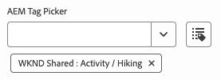

# 模型定義、欄位和元件類型 {#field-types}

透過範例了解通用編輯器可以在屬性面板中編輯的欄位和元件類型。了解如何藉由建立模型定義並連結至元件來檢測自己的應用程式。

## 概觀 {#overview}

調整自己的應用程式以便與通用編輯器搭配使用時，必須檢測元件並在編輯器的屬性面板中定義其可操作的欄位和元件類型。透過建立模型並從元件連結至該模型，便可以達成上述目標。

本文件提供模型定義以及您可使用的欄位和元件類型的概觀，並附上範例設定。

>[!TIP]
>
>若您不熟悉如何針對通用編輯器檢測自己的應用程式，請參閱 [AEM 開發人員通用編輯器概觀](/help/implementing/universal-editor/developer-overview.md)文件。

## 模型定義結構 {#model-structure}

為透過通用編輯器中的屬性面板設定元件，必須具備模型定義並將其連結至該元件。

模型定義是 JSON 結構，以模型陣列開頭。

```json
[
  {
    "id": "model-id",        // must be unique
    "fields": []             // array of fields which shall be rendered in the properties panel
  }
]
```

參閱本文件的「**[欄位](#fields)**」區段，了解關於定義 `fields` 陣列的更多資訊。

您可以透過兩種方式將模型連結至元件：使用[元件定義](#component-definition)或[透過檢測。](#instrumentation)

### 使用元件定義進行連結 {#component-definition}

這是將模型連結至元件的首選方法。這樣做可以讓您在元件定義中集中維護連結，並能夠在各個容器之間拖曳元件。

只需在 `component-definition.json` 檔案之 `components` 陣列的元件物件中包含 `model` 屬性即可。

如需詳細資訊，請參閱[元件定義](/help/implementing/universal-editor/component-definition.md)文件。

### 使用檢測進行連結 {#instrumentation}

若要將模型定義與元件搭配使用，可以使用 `data-aue-model` 屬性。

```html
<div data-aue-resource="urn:datasource:/content/path" data-aue-type="component"  data-aue-model="model-id">Click me</div>
```

>[!NOTE]
>
>通用編輯器首先會檢查模型是否透過檢測進行連結，並在檢查元件定義之前使用該模型。這表示：
>
>* 已經透過檢測實施模型連結的專案會繼續依照原樣運作，不需要進行任何變更。
>* 如果您在[元件定義](#component-definition)以及檢測中定義模型，則會一直使用檢測。

## 載入模型定義 {#loading-model}

模型建立後，即可將其視為外部檔案進行參照。

```html
<script type="application/vnd.adobe.aue.model+json" src="<url-of-model-definition>"></script>
```

或者您也可以內聯定義模型。

```html
<script type="application/vnd.adobe.aue.model+json">
  { ... model definition ... }
</script>
```

## 欄位 {#fields}

欄位物件具有以下類型定義。

| 設定 | 值類型 | 說明 | 必要 |
|---|---|---|---|
| `component` | `ComponentType` | 元件的轉譯工具 | 是 |
| `name` | `string` | 應保留資料的屬性[或路徑](#nesting) | 是 |
| `label` | `FieldLabel` | 欄位的標籤 | 是 |
| `description` | `FieldDescription` | 欄位的說明 | 否 |
| `value` | `FieldValue` | 這是預設值，可作為預留位置。 如果未設定任何值，則通用編輯器將保留在模型定義中定義為`value`的任何內容。 這可確保您看到的內容與後端中儲存的內容相符。 | 否 |
| `valueType` | `ValueType` | 標準驗證，可以是 `string`、`string[]`、`number`、`date`、`boolean` | 否 |
| `required` | `boolean` | 欄位是否為必填 | 否 |
| `readOnly` | `boolean` | 欄位是否為唯讀 | 否 |
| `hidden` | `boolean` | 欄位是否預設隱藏 | 否 |
| `condition` | `RulesLogic` | 根據[條件](/help/implementing/universal-editor/customizing.md#conditionally-hide)顯示或隱藏欄位的規則 | 否 |
| `multi` | `boolean` | 欄位是否為多欄位<br/>請注意，屬性面板中的多欄位不允許容器巢狀 | 否 |
| `validation` | `ValidationType` | 驗證規則或欄位的規則 | 否 |
| `raw` | `unknown` | 元件可以使用的原始資料 | 否 |

### 名稱欄位和巢狀 {#nesting}

`name` 欄位可以直接指向目前資源的屬性，或者若是在 `cq:Pages` 的元件，也可以使用巢狀屬性的路徑。例如：

```json
"name": "teaser/image/fileReference"
```

### 元件類型 {#component-types}

以下是可用於轉譯欄位的元件類型。

| 說明 | 元件類型 |
|---|---|
| [AEM 標記](#aem-tag) | `aem-tag` |
| [AEM 內容](#aem-content) | `aem-content` |
| [布林值](#boolean) | `boolean` |
| [核取方塊群組](#checkbox-group) | `checkbox-group` |
| [容器](#container) | `container` |
| [內容片段](#content-fragment) | `aem-content-fragment` |
| [日期時間](#date-time) | `date-time` |
| [體驗片段](#experience-fragment) | `aem-experience-fragment` |
| [多重選取](#multiselect) | `multiselect` |
| [數字](#number) | `number` |
| [單選按鈕群組](#radio-group) | `radio-group` |
| [參照](#reference) | `reference` |
| [RTF 文字](#rich-text) | `richtext` |
| [選取](#select) | `select` |
| [標籤](#tab) | `tab` |
| [文字](#text) | `text` |

#### AEM 標記 {#aem-tag}

AEM 標記元件類型會啟用 AEM 標記選取器，可用於將標記附加至元件。

>[!BEGINTABS]

>[!TAB 範例]

```json
{
  "id": "aem-tag-picker",
  "fields": [
    {
      "component": "aem-tag",
      "label": "AEM Tag Picker",
      "name": "cq:tags",
      "valueType": "string"
    }
  ]
}
```

>[!TAB 螢幕擷圖]



>[!ENDTABS]

>[!TIP]
>
>請參閱[管理分類資料](https://www.aem.live/docs/authoring-taxonomy)文件，了解如何使用試算表管理 Edge Delivery Services 專案分類資料的更多資訊。

#### AEM 內容 {#aem-content}

AEM 內容元件類型會啟用 AEM 內容選取器，可用於選取任何 AEM 資源。與只能選取資產的[參照元件](#reference)不同，AEM 內容元件可以參照任何 AEM 內容。其提供額外的驗證類型。

| 驗證類型 | 值類型 | 說明 | 必要 |
|---|---|---|---|
| `rootPath` | `string` | 內容選取器將開啟供使用者選取 AEM 內容的路徑，將選取範圍限制為該目錄和子目錄 | 否 |

>[!BEGINTABS]

>[!TAB 範例]

```json
{
  "id": "aem-content-picker",
  "fields": [
    {
      "component": "aem-content",
      "name": "reference",
      "value": "",
      "label": "AEM Content Picker",
      "valueType": "string",
      "validation": {
            "rootPath": "/content/refresh"
        }
    }
  ]
}
```

>[!TAB 螢幕擷圖]


>[!ENDTABS]

#### 布林值 {#boolean}

布林元件類型會儲存簡單真/假值並轉譯為切換功能。其提供額外的驗證類型。

| 驗證類型 | 值類型 | 說明 | 必要 |
|---|---|---|---|
| `customErrorMsg` | `string` | 如果輸入的值不是布林值時會顯示的訊息 | 否 |

>[!BEGINTABS]

>[!TAB 範例 1]

```json
{
  "id": "boolean",
  "fields": [
    {
      "component": "boolean",
      "label": "Boolean",
      "name": "boolean",
      "valueType": "boolean"
    }
  ]
}
```

>[!TAB 範例 2]

```json
{
  "id": "another-boolean",
  "fields": [
    {
      "component": "boolean",
      "label": "Boolean",
      "name": "boolean",
      "valueType": "boolean",
      "validation": {
        "customErrorMsg": "Think, McFly. Think!"
      }
    }
  ]
}
```

>[!TAB 螢幕擷圖]


>[!ENDTABS]

#### 核取方塊群組 {#checkbox-group}

與布林值類似，核取方塊群組元件類型允許選取多個真/假項目，轉譯為多個核取方塊。

>[!BEGINTABS]

>[!TAB 範例]

```json
{
  "id": "checkbox-group",
  "fields": [
    {
      "component": "checkbox-group",
      "label": "Checkbox Group",
      "name": "checkbox",
      "valueType": "string[]",
      "options": [
        { "name": "Option 1", "value": "option1" },
        { "name": "Option 2", "value": "option2" }
      ]
    }
  ]
}
```

>[!TAB 螢幕擷圖]


>[!ENDTABS]

#### 容器 {#container}

容器元件類型能夠對元件進行分組，包括多欄位支援。其提供一項額外的設定。請注意，屬性面板中的多重欄位不允許容器巢狀

| 設定 | 值類型 | 說明 | 必要 |
|---|---|---|---|
| `collapsible` | `boolean` | 容器是否可摺疊 | 否 |

>[!BEGINTABS]

>[!TAB 範例]

```json
 {
  "id": "container",
  "fields": [
    {
      "component": "container",
      "label": "Container",
      "name": "container",
      "valueType": "string",
      "collapsible": true,
      "fields": [
        {
          "component": "text-input",
          "label": "Simple Text 1",
          "name": "text",
          "valueType": "string"
        },
        {
          "component": "text-input",
          "label": "Simple Text 2",
          "name": "text2",
          "valueType": "string"
        }
      ]
    }
  ]
}
```

>[!TAB 螢幕擷圖]


>[!TAB 多欄位支援]

```json
{
  "component": "container",
  "name": "test",
  "label": "Multi Text",
  "multi": true,
  "fields": [
    {
      "component": "reference",
      "name": "image",
      "value": "",
      "label": "Sample Image",
      "valueType": "string"
    },
    {
      "component": "text",
      "name": "alt",
      "value": "",
      "label": "Alt Text",
      "valueType": "string"
    }
  ]
}
```

>[!ENDTABS]


#### 內容片段 {#content-fragment}

內容片段選取器可用於選取[內容片段](/help/sites-cloud/authoring/fragments/content-fragments.md)及其變化版本 (如需要)。其提供一項額外的設定。

| 設定 | 值類型 | 說明 | 必要 |
|---|---|---|---|
| `variationName` | `string` | 用於儲存所選變化版本的變數名稱。若未定義，則不顯示變化版本選取器 | 否 |

其亦提供額外的驗證類型。

| 驗證類型 | 值類型 | 說明 | 必要 |
|---|---|---|---|
| `rootPath` | `string` | 內容選取器將開啟供使用者選取內容片段的路徑，將選取範圍限制為該目錄和子目錄 | 否 |

>[!NOTE]
>
>通用編輯器[根據其模型驗證內容片段欄位](/help/assets/content-fragments/content-fragments-models.md#validation)，讓您能夠強制執行資料完整性規則，例如規則運算式模式和唯一條件限制。
>
>這可在發佈之前確保您的內容符合特定業務需求。

>[!BEGINTABS]

>[!TAB 範例 1]

```json
[
  {
    "id": "aem-content-fragment",
    "fields": [
      {
        "component": "aem-content-fragment",
        "name": "picker",
        "label": "Content Fragment Picker",
        "valueType": "string",
        "variationName": "contentFragmentVariation",
        "validation": {
            "rootPath": "/content/refresh"
        }
      }
    ]
  }
]
```

>[!TAB 螢幕擷圖]


>[!ENDTABS]

#### 日期時間 {#date-time}

日期時間元件類型允許指定日期、時間或其組合。其提供另外的設定。

| 設定 | 值類型 | 說明 | 必要 |
|---|---|---|---|
| `displayFormat` | `string` | 顯示日期字串的格式 | 是 |
| `valueFormat` | `string` | 儲存日期字串的格式 | 是 |

其亦提供額外的驗證類型。

| 驗證類型 | 值類型 | 說明 | 必要 |
|---|---|---|---|
| `customErrorMsg` | `string` | 若 `valueFormat` 未符合，則會顯示此訊息 | 否 |

>[!BEGINTABS]

>[!TAB 範例 1]

```json
{
  "id": "date-time",
  "fields": [
    {
      "component": "date-time",
      "label": "Date & Time",
      "name": "date",
      "valueType": "date"
    }
  ]
}
```

>[!TAB 範例 2]

```json
{
  "id": "another-date-time",
  "fields": [
    {
      "component": "date-time",
       "valueType": "date-time",
      "name": "field1",
      "label": "Date Time",
      "description": "This is a date time field that stores both date and time.",
      "required": true,
      "placeholder": "YYYY-MM-DD HH:mm:ss",
      "displayFormat": null,
      "valueFormat": null,
      "validation": {
        "customErrorMsg": "Marty! You have to come back with me!"
      }
    },
    {
      "component": "date-time",
      "valueType": "date",
      "name": "field2",
      "label": "Another Date Time",
      "description": "This is another date time field that only stores the date.",
      "required": true,
      "placeholder": "YYYY-MM-DD",
      "displayFormat": null,
      "valueFormat": null,
      "validation": {
        "customErrorMsg": "Back to the future!"
      }
    },
    {
      "component": "date-time",
      "valueType": "time",
      "name": "field3",
      "label": "Yet Another Date Time",
      "description": "This is another date time field that only stores the time.",
      "required": true,
      "placeholder": "HH:mm:ss",
      "displayFormat": null,
      "valueFormat": null,
      "validation": {
        "customErrorMsg": "Great Scott!"
      }
    }
  ]
}
```

>[!TAB 螢幕擷圖]


>[!ENDTABS]

#### 體驗片段 {#experience-fragment}

體驗片段選取器可用於選取[體驗片段](/help/sites-cloud/authoring/fragments/experience-fragments.md)及其變化版本 (如需要)。其提供一項額外的設定。

| 設定 | 值類型 | 說明 | 必要 |
|---|---|---|---|
| `variationName` | `string` | 用於儲存所選變化版本的變數名稱。若未定義，則不顯示變化版本選取器 | 否 |

其亦提供額外的驗證類型。

| 驗證類型 | 值類型 | 說明 | 必要 |
|---|---|---|---|
| `rootPath` | `string` | 內容選取器將開啟供使用者選取體驗片段的路徑，將選取範圍限制為該目錄和子目錄 | 否 |

>[!BEGINTABS]

>[!TAB 範例 1]

```json
[
  {
    "id": "experience-fragment",
    "fields": [
      {
        "component": "aem-experience-fragment",
        "valueType": "string",
        "name": "experience-fragment",
        "label": "experience-fragment",
        "variationName": "experienceFragmentVariation",
        "validation": {
            "rootPath": "/content/refresh"
        }
      }
    ]
  }
]
```

>[!TAB 螢幕擷圖]


>[!ENDTABS]


#### 多重選取 {#multiselect}

多重選取元件類型在下拉式選單中顯示多個可供選取的項目，也能夠將可選元素分組。

>[!BEGINTABS]

>[!TAB 範例 1]

```json
{
  "id": "multiselect",
  "fields": [
    {
      "component": "multiselect",
      "name": "multiselect",
      "label": "Multi Select",
      "valueType": "string",
      "options": [
        { "name": "Option 1", "value": "option1" },
        { "name": "Option 2", "value": "option2" }
      ]
    }
  ]
}
```

>[!TAB 範例 2]

```json
{
  "id": "multiselect-grouped",
  "fields": [
    {
      "component": "multiselect",
      "name": "property",
      "label": "Multiselect field",
      "valueType": "string",
      "required": true,
      "maxSize": 2,
      "options": [
        {
          "name": "Theme",
          "children": [
            { "name": "Light", "value": "light" },
            { "name": "Dark",  "value": "dark" }
          ]
        },
        {
          "name": "Type",
          "children": [
            { "name": "Alpha", "value": "alpha" },
            { "name": "Beta", "value": "beta" },
            { "name": "Gamma", "value": "gamma" }
          ]
        }
      ]
    }
  ]
}
```

>[!TAB 螢幕擷圖]


>[!ENDTABS]

#### 數字 {#number}

數字元件類型允許輸入數字。其提供額外的驗證類型。

| 驗證類型 | 值類型 | 說明 | 必要 |
|---|---|---|---|
| `numberMin` | `number` | 允許的最小數字 | 否 |
| `numberMax` | `number` | 允許的最大數字 | 否 |
| `customErrorMsg` | `string` | 若未到達 `numberMin` 或 `numberMax`，則會顯示的訊息 | 否 |

>[!BEGINTABS]

>[!TAB 範例 1]

```json
{
  "id": "number",
  "fields": [
    {
      "component": "number",
      "name": "number",
      "label": "Number",
      "valueType": "number",
      "value": 0
    }
  ]
}
```

>[!TAB 範例 2]

```json
{
  "id": "another-number",
  "fields": [
   {
      "component": "number",
      "valueType": "number",
      "name": "field1",
      "label": "Number Field",
      "description": "This is a number field.",
      "required": true,
      "placeholder": null,
      "validation": {
        "numberMin": 0,
        "numberMax": 88,
        "customErrorMsg": "You also need 1.21 gigawatts."
      }
    }
  ]
}
```

>[!TAB 螢幕擷圖]


>[!ENDTABS]

#### 單選按鈕群組 {#radio-group}

單選按鈕群組元件類型允許從多個選項中進行互斥選取，並轉譯為類似核取方塊群組的群組。

>[!BEGINTABS]

>[!TAB 範例]

```json
{
  "id": "radio-group",
  "fields": [
    {
      "component": "radio-group",
      "label": "Radio Group",
      "name": "radio",
      "valueType": "string",
      "options": [
        { "name": "Option 1", "value": "option1" },
        { "name": "Option 2", "value": "option2" }
      ]
    }
  ]
}
```

>[!TAB 螢幕擷圖]


>[!ENDTABS]

#### 參照 {#reference}

參照元件類型會啟用 AEM 資產選取器，可用於選取要參照的任何 AEM 資產。與可以選取任何 AEM 資源的 [AEM 內容元件](#aem-content)不同，參照元件僅能參照資產。其提供額外的驗證類型。

參照元件類型允許從目前的物件參照另一個資料物件。

>[!BEGINTABS]

>[!TAB 範例]

```json
{
  "id": "reference",
  "fields": [
    {
      "component": "reference",
      "label": "Reference",
      "name": "reference",
      "valueType": "string"
    }
  ]
}
```

>[!TAB 螢幕擷圖]


>[!ENDTABS]

#### RTF 文字 {#rich-text}

RTF 文字允許多行、RTF 文字的輸入內容。

>[!BEGINTABS]

>[!TAB 範例 1]

```json
{
  "id": "richtext",
  "fields": [
    {
      "component": "richtext",
      "name": "rte",
      "label": "Rich Text",
      "valueType": "string"
    }
  ]
}
```

>[!TAB 螢幕擷圖]


>[!ENDTABS]

#### 選取 {#select}

選取元件類型允許從下拉式選單的預定義選項清單中選取單一選項。

>[!BEGINTABS]

>[!TAB 範例]

```json
{
  "id": "select",
  "fields": [
    {
      "component": "select",
      "label": "Select",
      "name": "select",
      "valueType": "string",
      "options": [
        { "name": "Option 1", "value": "option1" },
        { "name": "Option 2", "value": "option2" }
      ]
    }
  ]
}
```

>[!TAB 螢幕擷圖]


>[!ENDTABS]

#### 標籤 {#tab}

標籤元件類型可讓您在多個標籤上將其他輸入欄位組合在一起，改善作者的版面編排。

`tab` 定義可以視為是 `fields` 陣列中的分隔符號。`tab` 之後的所有內容都會被放置在該標籤上，直到出現新的 `tab`，其後的項目便會放置在新標籤上。

若您希望有項目出現在所有標籤之上，則必須在任何標籤之前定義這些項目。

>[!BEGINTABS]

>[!TAB 範例]

```json
{
  "id": "tab",
  "fields": [
    {
      "component": "tab",
      "label": "Tab 1",
      "name": "tab1"
    },
    {
      "component": "text-input",
      "label": "Text 1",
      "name": "text1",
      "valueType": "string"
    },
    {
      "component": "tab",
      "label": "Tab 2",
      "name": "tab2"
    },
    {
      "component": "text-input",
      "label": "Text 2",
      "name": "text2",
      "valueType": "string"
    }
  ]
}
```

>[!TAB 螢幕擷圖]


>[!ENDTABS]

#### 文字 {#text}

文字允許輸入單行文字。其包括額外的驗證類型。

| 驗證類型 | 值類型 | 說明 | 必要 |
|---|---|---|---|
| `minLength` | `number` | 允許的最小字元數 | 否 |
| `maxLength` | `number` | 允許的最大字元數 | 否 |
| `regExp` | `string` | 輸入文字必須符合的規則運算式 | 否 |
| `customErrorMsg` | `string` | 若違反 `minLength`、`maxLength` 和/或 `regExp` 則會顯示的訊息 | 否 |

>[!BEGINTABS]

>[!TAB 範例 1]

```json
{
  "id": "simpletext",
  "fields": [
    {
      "component": "text",
      "name": "text",
      "label": "Simple Text",
      "valueType": "string"
    }
  ]
}
```

>[!TAB 範例 2]

```json
{
  "id": "another simpletext",
  "fields": [
    {
      "component": "text",
      "name": "text",
      "label": "Simple Text",
      "valueType": "string",
      "valueFormat": "regexp",
      "description": "This is a text input with validation.",
      "required": true,
      "validation": {
        "minLength": 1955,
        "maxLength": 1985,
        "regExp": "^foo:.*",
        "customErrorMsg": "Why don't you make like a tree and get outta here?"
      }
    }
  ]
}
```

>[!TAB 螢幕擷圖]


>[!ENDTABS]
