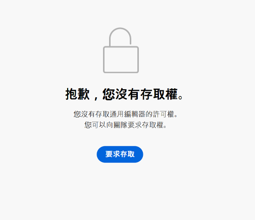

# AEM 中 Universal Editor 快速入門 {#getting-started}

了解如何存取 Universal Editor，以及如何開始檢測您的第一個 AEM 應用程式以使用它。

>[!TIP]
>
>如果您想直接研究範例，可以查看 [GitHub 上的 Universal Editor 範例應用程式。](https://github.com/adobe/universal-editor-sample-editable-app)

## 上線步驟 {#onboarding}

雖然 Universal Editor 可以編輯來自任何來源的內容，但本文件將以 AEM 應用程式為例。

要將 AEM 應用程式上線，並對其進行檢測以使用 Universal Editor 的步驟很多。

1. [要求存取 Universal Editor。](#request-access)
1. [包括 Universal Editor 核心庫。](#core-library)
1. [新增必要的 OSGi 設定。](#osgi-configurations)
1. [檢測頁面。](#instrument-page)

本文件將引導您完成這些步驟。

## 要求存取 Universal Editor {#request-access}

您需要先要求存取 Universal Editor。請移至 [https://experience.adobe.com/#/aem/editor](https://experience.adobe.com/#/aem/editor) 登入，然後驗證您是否有權存取 Universal Editor。

如果您沒有存取權，可以透過同一頁面上連結的表格提出要求。



按一下&#x200B;**要求存取**&#x200B;並按照指示填寫表格以要求存取。Adobe 代表將審查您的要求並與您聯絡以討論您的使用案例。

## 包括 Universal Editor 核心庫。 {#core-library}

您的應用程式需要包含以下相依性，才可與 Universal Editor 一起使用。

```javascript
@adobe/universal-editor-cors
```

要啟動檢測，需要將以下匯入內容新增到您的 `index.js`。

```javascript
import "@adobe/universal-editor-cors";
```

### Non-React 應用程式的替代方案 {#alternative}

如果您沒有實施 React 應用程式和/或要求伺服器端呈現，則替代方案是將以下內容納入文件正文中。

```html
<script src="https://cdn.jsdelivr.net/gh/adobe/universal-editor-cors/dist/universal-editor-embedded.js" async></script>
```

## 新增必要的 OSGi 設定 {#osgi-configurations}

為了能夠使用 Universal Editor 透過您的應用程式編輯 AEM 內容，必須在 AEM 中完成 CORS 和 Cookie 設定。

[必須在 AEM 編寫執行個體上設定以下 OSGi 設定。](/help/implementing/deploying/configuring-osgi.md)

* `com.day.crx.security.token.impl.impl.TokenAuthenticationHandler` 中的 `SameSite Cookies = None`
* 移除 X-FRAME-OPTIONS：`org.apache.sling.engine.impl.SlingMainServlet` 中的 SAMEORIGIN 標頭

### com.day.crx.security.token.impl.impl.TokenAuthenticationHandler {#samesite-cookies}

登入權杖 Cookie 必須作為協力廠商網域發送到 AEM。因此，必須將同網站的 Cookie 明確設定為 `None`。

此屬性必須在 `com.day.crx.security.token.impl.impl.TokenAuthenticationHandler`OSGi 設定中設定。

```xml
<?xml version="1.0" encoding="UTF-8"?>
<jcr:root xmlns:sling="http://sling.apache.org/jcr/sling/1.0"
          xmlns:jcr="http://www.jcp.org/jcr/1.0" jcr:primaryType="sling:OsgiConfig"
          token.samesite.cookie.attr="None" />
```

### org.apache.sling.engine.impl.SlingMainServlet {#sameorigin}

X-Frame-Options：SAMEORIGIN 禁止在 iframe 中呈現 AEM 頁面。移除標頭可載入頁面。

此屬性必須在 `org.apache.sling.engine.impl.SlingMainServlet`OSGi 設定中設定。

```xml
<?xml version="1.0" encoding="UTF-8"?>
<jcr:root xmlns:sling="http://sling.apache.org/jcr/sling/1.0"
          xmlns:jcr="http://www.jcp.org/jcr/1.0"
          jcr:primaryType="sling:OsgiConfig"
          sling.additional.response.headers="[X-Content-Type-Options=nosniff]"/>
```

## 檢測頁面 {#instrument-page}

Universal Editor 服務需要[統一資源名稱 (URN)](https://en.wikipedia.org/wiki/Uniform_Resource_Name) 來識別和使用正確的後端系統來處理應用程式中正在編輯的內容。因此，需要 URN 模式將內容對應回內容資源。

新增到頁面的檢測屬性主要包括 [HTML Microdata](https://developer.mozilla.org/en-US/docs/Web/HTML/Microdata)，這是一種業界標準格式，也可用於讓 HTML 更具語義，使 HTML 文件可編製索引等。

### 建立連線 {#connections}

應用程式中使用的連線會儲存為`<meta>`頁面中的標記`<head>`。

```html
<meta name="urn:adobe:aem:editor:<referenceName>" content="<protocol>:<url>">
```

* `<referenceName>` - 這是簡短名稱，可在文件中重複使用以標識連線。例如 `aemconnection`
* `<protocol>` - 這代表要使用 Universal Editor 持續性服務的哪個持續性外掛程式。例如 `aem`
* `<url>` - 這是儲存變更之系統的 URL。例如 `http://localhost:4502`

識別碼 `adobe:aem:editor` 表示 Adobe Universal Editor 連線。

`itemid` 將使用 `urn` 首碼來縮短識別碼。

```html
itemid="urn:<referenceName>:<resource>"
```

* `<referenceName>` - 這是 `<meta>` 標記中提及的命名參考。例如 `aemconnection`
* `<resource>` - 這是指向目標系統中資源的指標。像是 AEM 內容路徑，例如 `/content/page/jcr:content`

>[!TIP]
>
>請參閱文件[屬性和類型](attributes-types.md)以深入了解 Universal Editor 需要的資料屬性和類型。

### 連線範例 {#example}

```html
<html>
<head>
    <meta name="urn:adobe:aem:editor:aemconnection" content="aem:https://localhost:4502">
    <meta name="urn:adobe:aem:editor:fcsconnection" content="fcs:https://example.franklin.adobe.com/345fcdd">
</head>
<body>
        <aside>
          <ul itemscope itemid="urn:aemconnection:/content/example/list" itemtype="container">
            <li itemscope itemid="urn:aemconnection/content/example/listitem" itemtype="component">
              <p itemprop="name" itemtype="text">Jane Doe</p>
              <p itemprop="title" itemtype="text">Journalist</p>
              
            </li>
 
...
 
            <li itemscope itemid="urn:fcsconnection:/documents/mytext" itemtype="component">
              <p itemprop="name" itemtype="text">John Smith</p>
              <p itemid="urn:aemconnection/content/example/another-source" itemprop="title" itemtype="text">Photographer</p>
              
            </li>
          </ul>
        </aside>
</body>
</html>
```

## 您已準備好使用 Universal Editor {#youre-ready}

您的應用程式現在可以使用 Universal Editor 了！

請參閱文件[使用 Universal Editor 編寫內容](authoring.md)，了解內容作者使用 Universal Editor 建立內容有多簡單和直觀。

## 其他資源 {#additional-resources}

若要了解有關 Universal Editor 的詳細資訊，請參閱以下文件。

* [Universal Editor 簡介](introduction.md) - 了解 Universal Editor 如何在任意實施中編輯任何方面的內容，以提供卓越的體驗、提高內容速度並提供最先進的開發人員體驗。
* [使用 Universal Editor 編寫內容](authoring.md) - 了解內容作者使用 Universal Editor 建立內容有多簡單和直觀。
* [使用 Universal Editor 發佈內容](publishing.md) - 了解 Universal Visual Editor 如何發佈內容，和您的應用程式如何處理發佈的內容。
* [Universal Editor 架構](architecture.md) - 了解 Universal Editor 的架構，以及資料如何在其服務和階層之間流動。
* [屬性和類型](attributes-types.md) - 了解 Universal Editor 需要的資料屬性和類型。
* [Universal Editor 驗證](authentication.md) - 了解 Universal Editor 如何進行驗證。
