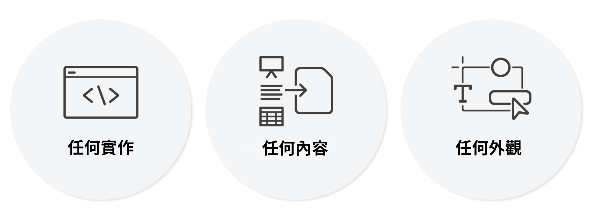

# Universal Editor 簡介 {#introduction}

通用編輯器是多功能的視覺化編輯器，屬於Adobe Experience Manager Sites的一部分。 它可讓作者對任何Headless或Headful體驗進行「所見即所得」(WYSIWYG)編輯。 瞭解它如何協助內容作者提供卓越的體驗，以及如何為開發人員提供無與倫比的自由。

## 背景 {#background}

Universal Editor提供有效率且直覺的內容撰寫體驗，只需最少的訓練。 有了它，作者可以直接在網頁體驗的內容中管理其內容，以及它給訪客呈現的確切外觀。 作為一個真正的編輯器服務和整體上更靈活，它打算最終取代頁面編輯器。

由於通用編輯器支援對所有形式的AEM內容進行相同一致的視覺編輯，因此作者可受益於通用編輯器的彈性：內容片段和頁面元件同樣可以進行就地編輯和版面配置。 當在網路體驗中並排顯示時，甚至可以編輯這兩種形式的內容，作者不必切換內容。 相較於AEM先前的編輯者，這是大幅度的改善，僅支援一種型別的內容。

開發人員可受益於Universal Editor的多功能性，因為它也支援實作的真正分離。 它可讓開發人員運用幾乎任何他們選擇的架構或架構，而不需要施加任何SDK或技術限制。 此彈性甚至可讓您輕鬆針對通用編輯器檢測現有的網頁應用程式，而無需重新架構。

## 真正通用 {#universal}

Universal Editor 可以用於任何實作、任何內容和任何方面的內容。

### 任何實作 {#any-implementation}

由於體驗可透過多種不同方式建置，因此任何實作都可以使用 Universal Editor，讓作者可以執行內容中編輯。

使用者通常會認為 Headless 實作會限制作者在表單型 UI 中編輯所有的內容，但 Universal Editor 的情況並非如此

實作使用 Universal Editor 的要求簡單且支援：

* **任何架構**  — 伺服器端轉譯、邊緣端轉譯、使用者端轉譯等。
* **任何框架** - Vanilla AEM或任何協力廠商架構，例如React、Next.js、Angular等。
* **任何託管** - 可以在本機託管到 AEM，或託管在遠端網域上

### 任何內容 {#any-content}

內容作者也會擁有 AEM 頁面編輯器先前提供的強大編輯體驗。但是 Universal Editor 可讓內容作者在內容中視覺化編輯&#x200B;**任何**&#x200B;內容，並支援：

* **AEM 頁面結構** - `cq:Pages` 的嵌套`cq:Components`，包括體驗片段
* **AEM內容片段**  — 編輯內容片段在體驗內容中出現的內容。
* **文件** - 概念驗證表明 Word、Excel、Google 文件或 Markdown 文件也可以用相同的方式進行編輯 (這是 WIP)。

### 任何方面 {#any-aspect}

對於內容作者而言，內容不僅僅是包含的資訊，還包括呈現和接收資訊的方式。內容帶有額外的中繼資料和檢測規則，Universal Editor 可以理解和編輯這些規則，包括：

* **套用版面與樣式**  — 使用樣式系統，行銷從業人員和內容作者就可以將不同的樣式套用至其內容，並為內容建立不同的版面，例如欄、輪播、索引標籤、摺疊式功能表等。

## 值 {#value}

透過將內容編輯體驗與任何特定的內容傳遞系統分離，編輯器變得更通用和靈活，並可讓內容作者提供卓越的體驗，提高內容速度，並提供最先進的開發人員體驗。

* **提供卓越的體驗** - 為了使從業人員能夠為造訪者創造吸引人的體驗，Universal Editor 可讓從業人員在預覽的內容中建立和編輯內容。這可讓他們建立適合體驗設計的內容，並建構對造訪者有意義的旅程。
* **提高內容速度** - 為了簡化從業人員的管理工作流程，Universal Editor 可在預覽中編輯內容，透過僅顯示與該內容相關的選項來引導從業人員，並使工作流程獨立於內容來源。
* **最先進的開發人員體驗** - 為了支援真實生活的異質應用程式環境，Universal Editor 具備低耦合且與技術無關的特性，可讓開發人員使用他們喜歡的技術堆棧來實施體驗。

## Universal Editor 和內容片段編輯器 {#universal-editor-content-fragment-editor}

乍看之下，Universal Editor 和內容片段編輯器的編輯功能似乎很相似。然而，這些編輯器的功能大不相同，其完成的工作與行銷從業人員不同。

### 內容片段編輯器 {#content-fragment-editor}

行銷從業人員希望建立內容而不必關心其版面，以便它可以在多種體驗環境中重複使用。

* 要達成的基本工作是擴展內容策略。

### Universal Editor {#universal-editor}

行銷從業人員會想建立根據指定內容版面量身定制的內容，以提供卓越的體驗。

* 要達成的基本工作是與讀者建立可靠的聯繫。

## 限制 {#limitations}

當您探索通用編輯器並在您自己的專案中進一步實作時，請記住以下限制。

* 不超過25個AEM資源（內容片段、頁面、體驗片段、資產等） 應為單一頁面上作為檢測工具的參考。
* AEMas a Cloud Service是唯一支援的AEM後端。
* AEMas a Cloud Service版本 `2023.8.13099` 或以上為必填欄位。
* 內容作者必須擁有自己的個別Experience Cloud帳戶。
* 支援的瀏覽器為Chrome和Edge

## 後續步驟 {#next-steps}

請參閱檔案 [通用編輯器使用案例和學習路徑](/help/implementing/universal-editor/use-cases.md) 進一步瞭解通用編輯器的常見使用案例，並探索可在專案中為您提供支援的正確檔案資源。
