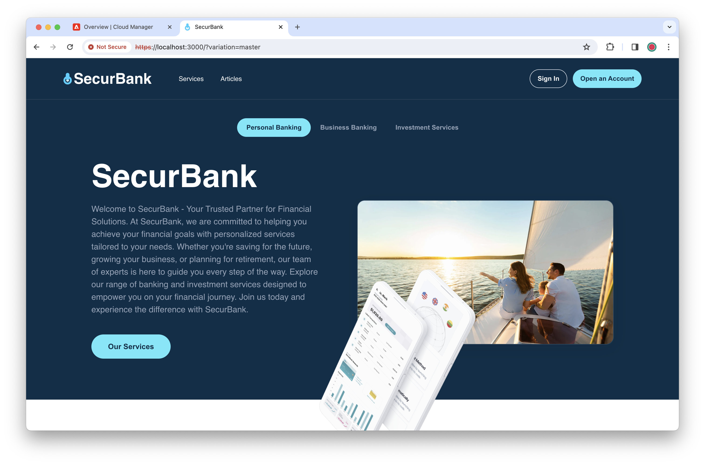

# 通用編輯器的 SecurBank 範例應用程式 {#securbank}

使用 SecurBank 應用程式，透過親身體驗了解通用編輯器，這是為了展示通用編輯器加速建立內容的強大功能、靈活性和可用性而設計的。

## 先決條件 {#prerequisites}

* 您必須被指派至 **AEM 管理員**[產品設定檔](/help/journey-onboarding/assign-profiles-aem.md)，才能安裝 SecurBank 應用程式。
* 您必須擁有 [Node.js](https://nodejs.org) 版本 20 或以上才能進行本機開發。

## 安裝 SecurBank {#installation}

SecurBank 應用程式的安裝很簡單，但由於其涉及 AEM as a Cloud Service 的許多領域，因此會需要較多步驟。以下為主要步驟的概觀。

1. [在 Cloud Manager 中建立沙箱方案](#create-sandbox-program)。
1. [原地複製方案的 git 存放庫，並使用 SecurBank AEM 專案內容進行更新](#clone-and-update)。
1. [執行管道以部署 SecurBank AEM 專案](#run-pipeline)。
1. [檢索用於本機網頁應用程式開發的 Cloud Manager 認證](#retrieve-credentials)。
1. [下載並設定 SecurBank 網頁應用程式](#download-web-app)。
1. [執行 SecurBank 網頁應用程式](#run-web-app)。

以下區段將詳細說明必要的個別任務。

### 在 Cloud Manager 中建立沙箱方案。 {#create-sandbox-program}

您會需要一個新的 Cloud Manager 方案，以便在其中安裝 SecurBank。

1. 於 [my.cloudmanager.adobe.com](https://my.cloudmanager.adobe.com/) 登入 Cloud Manager，並選取適當的組織。

1. 為 SecurBank 應用程式建立一個新的沙箱方案。

   * 選取「**解決方案與附加元件**」時使用預設選項。
   * 如需關於如何建立沙箱方案的詳細資訊，請參閱[建立沙箱方案](/help/implementing/cloud-manager/getting-access-to-aem-in-cloud/creating-sandbox-programs.md)文件。

### 原地複製方案的 git 存放庫，並使用 SecurBank AEM 專案內容進行更新。 {#clone-and-update}

1. 方案建立完成後，請開啟方案，然後在「**存放庫**」標籤點選或按一下「**存取存放庫資訊**」按鈕，開啟「**存放庫資訊**」對話框，檢視存取沙箱環境 git 存放庫所需的認證。

   * 如需關於如何存取您的存放庫資訊的詳細資訊，請參閱[存取存放庫](/help/implementing/cloud-manager/managing-code/accessing-repos.md)文件。

1. 使用「**存放庫資訊**」對話框中的認證，在本機電腦上原地複製存放庫。

1. 找到本機原地複製的資料夾，開啟該資料夾並刪除所有內容，但是隱藏的或 DOT 檔案除外。

1. 按一下「**程式碼**」，然後從下拉式選單中選取「**下載 ZIP**」，從位在 [`https://github.com/Adobe-Marketing-Cloud/summit-2024-l425-securbank`](https://github.com/Adobe-Marketing-Cloud/summit-2024-l425-securbank) 的 GitHub 檢索最新的 SecurBank AEM 專案程式碼。

1. 在本機檔案系統上將 zip 檔案的內容解壓縮，並將其移至沙箱方案的本機原地複製版本現在的空資料夾中。

1. 使用終端機，切換至原地複製版專案的資料夾，提交所有內容並將其推送到 git。

   1. `git add --all`
   1. `git commit -m "Adding SecurBank app code"`
   1. `git push`

### 執行管道，部署 SecurBank AEM 專案。 {#run-pipeline}

SecurBank 的 AEM 專案提交至沙箱存放庫後，即可使用管道進行部署。

1. 返回 Cloud Manager 沙箱方案的「**概觀**」標籤，執行全堆疊非生產管道。

   * 取消選取管道執行的所有選項。
   * 如需關於執行管道的更多資訊，請參閱[管理管道](/help/implementing/cloud-manager/configuring-pipelines/managing-pipelines.md#running-pipelines)文件。

### 檢索用於本機網頁應用程式開發的 Cloud Manager 認證。 {#retrieve-credentials}

能夠執行 SecurBank 應用程式之前，您需要具備 Cloud Manager 認證，才能將應用程式連結至 Cloud Manager。

1. 當管道執行時，返回 Cloud Manager 中的「**概觀**」標籤，點選或按一下環境名稱旁的省略符號按鈕，然後選取「**Developer Console**」。

1. 在 Developer Console 中，選取「**整合**」標籤，然後選取「**本機權杖**」標籤，接著點選或按一下「**取得本機開發權杖**」。

1. 會產生一個 JSON 檔案以及存取權杖。關閉 Developer Console 並返回 Cloud Manager 之前，只複製權杖本身 (其餘的 JSON 不需要) 並儲存到安全的位置，以供後續步驟使用。

1. 回到 Cloud Manager，在「**概觀**」標籤上，於環境 URL 上按一下右鍵來複製 URL 並儲存到安全的位置，以供後續步驟使用。

### 下載並設定 SecurBank 網頁應用程式。 {#download-web-app}

您現在可以下載並設定 SecurBank 網頁應用程式。

1. 按一下「**程式碼**」，然後從下拉式選單中選取「**下載 ZIP**」，從位在 [`https://github.com/Adobe-Marketing-Cloud/summit-2024-l425/tree/ue-z-final-with-events`](https://github.com/Adobe-Marketing-Cloud/summit-2024-l425/tree/ue-z-final-with-events) 的 GitHub 檢索最新的 SecurBank 應用程式程式碼。

1. 於本機檔案系統上將 zip 檔案的內容解壓縮。

1. 啟動您的首選程式碼編輯器，並開啟位在 `summit-2024-l425-ue-z-final-with-events/react-app/.env` 中 SecurBank 應用程式專案的隱藏環境檔案。

1. 對 `.env` 檔案進行以下變更並儲存變更。

   * 若是 `REACT_APP_HOST_URI`，貼上先前複製的環境 URL 的值。
   * 若是 `REACT_APP_DEV_TOKEN`，貼上先前複製的本機開發權杖的值。

### 執行 SecurBank 網頁應用程式。 {#run-web-app}

在 Cloud Manager 和本機完成所有設定後，您便可以執行 SecurBank 網頁應用程式。

1. 在本機電腦的命令列中，導覽至您下載並解壓縮的 SecurBank 應用程式專案的 `react-app` 資料夾。

1. 在您的 `react-app` 資料夾中，使用 `node -i` 命令安裝 SecurBank 應用程式。

1. 安裝完成後，使用 `npm start` 命令啟動 SecurBank 應用程式。

1. 若安裝和啟動皆成功，您會看到：

* 終端機中輸出以下內容。

  ```text
  Compiled successfully!
  
  You can now view securbank in the browser.
  
    Local:            https://localhost:3000
    On Your Network:  https://192.168.1.15:3000
  
  Note that the development build is not optimized.
  To create a production build, use npm run build.
  
  webpack compiled successfully
  ```

   * 接著瀏覽器視窗開啟並連結至 URL `https://localhost:3000`。

      * 請注意，這是供開發使用，故不會提供有效的憑證。因此，您可能需要通知瀏覽器，以便瀏覽器能夠存取該頁面。

恭喜！現在您應該會看到 SecurBank 應用程式成功在您的瀏覽器中執行。

若內容未出現，請確認您執行的&#x200B;**部署至開發**&#x200B;管道是否已成功完成。



{{ue-headless-auth}}

