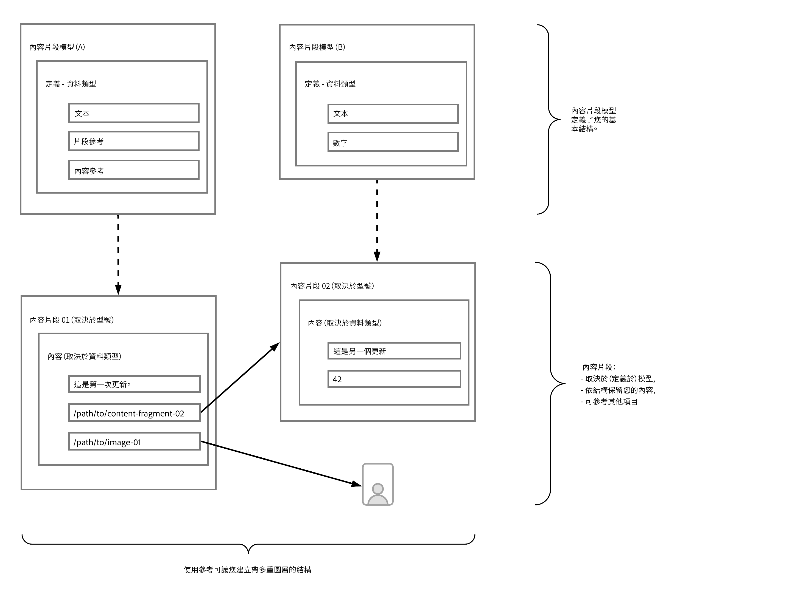

# 了解使用AEM建立無頭式內容模型的基本知識 {#content-modeling-headless-basics}

## 迄今為止的故事 {#story-so-far}

在[AEM無頭內容架構者歷程](overview.md)的開頭，[簡介](introduction.md)涵蓋與無頭內容建模內容相關的基本概念和術語。

本文以這些為基礎，讓您了解如何為您的AEM無頭專案建立內容模型。

## 目標 {#objective}

* **對象**:入門者
* **目標**:介紹無頭式CMS的內容建模概念

## 使用內容片段模型的內容模型 {#architect-content-fragment-models}

內容（資料）模型是一組已建立的技術，在開發關係資料庫時經常使用，因此，「內容模型」對AEM Headless有何意義？

### 為什麼？ {#why}

為確保應用程式能夠一致且有效地從AEM要求和接收所需內容，此內容必須結構化。

這表示您的應用程式會事先知道回應的形式，因此會知道如何處理。 這比接收自由格式內容容易得多，因為必須對內容進行剖析，以確定內容包含的內容，因此，如何使用它。

### 如何介紹？ {#how}

AEM使用內容片段來提供將內容無頭式傳送至應用程式所需的結構。

內容模型的結構為：

* 由內容片段模型定義所實現，
* 作為內容產生所用內容片段的基礎。

>[!NOTE]
>
>內容片段模型也是AEM GraphQL結構的基礎，用於擷取內容，更多關於「開發人員歷程」的資訊。

系統會使用AEM GraphQL API（標準GraphQL API的自訂實作）來請求內容。 AEM GraphQL API可讓應用程式對內容片段執行（複雜）查詢，每個查詢都根據特定的模型類型。

之後，您的應用程式就可以使用傳回的內容。

## 使用內容片段模型建立結構 {#create-structure-content-fragment-models}

內容片段模型提供多種機制，可讓您定義內容的結構。

內容片段模型描述實體。

>[!NOTE]
>必須在「設定瀏覽器」中啟用「內容片段」功能，您才能建立新模型。

>[!TIP]
>
>應命名模型，讓內容作者知道建立內容片段時要選取的模型。

在模型內：

1. **資料** 類型可讓您定義個別屬性。例如，將保留教師姓名的欄位定義為&#x200B;**Text**，並將其服務年限定義為&#x200B;**Number**。
1. 資料類型&#x200B;**內容參考**&#x200B;和&#x200B;**片段參考**&#x200B;可讓您建立與AEM內其他內容的關係。
1. **片段參考**&#x200B;資料類型可讓您透過巢狀內嵌內容片段來實現多個層級的結構（根據模型類型）。 這對您的內容模型至關重要。

例如：

## 資料類型 {#data-types}

AEM提供下列資料類型，供您建立內容模型：

* 單行文字
* 多行文字
* 數量
* 布林值 (Boolean)
* 日期時間
* 列舉
* 標記
* 內容參考資料
* 片段引用
* JSON 物件

>[!NOTE]
>
>更多詳細資訊請參閱內容片段模型 — 資料類型。

## 參考和巢狀內容 {#references-nested-content}

兩種資料類型提供特定片段外部內容的參考：

* **內**
容參考這提供了對任何類型的其他內容的簡單參考。例如，您可以在指定的位置參考影像。

* **片段**
參考這可提供其他內容片段的參考。此類型的參考用於建立巢狀內容，引入建立內容模型所需的關係。
資料類型可設定為允許片段作者：
   * 直接編輯參考的片段。
   * 根據適當的模型建立新內容片段

>[!NOTE]
>
>您也可以使用文字區塊內的連結來建立隨選參照。

## 結構層級（巢狀片段） {#levels-of-structure-nested-fragments}

對於內容模型，**片段參考**&#x200B;資料類型可讓您建立多個層級的結構和關係。

透過此參考，您可以&#x200B;*連接*&#x200B;各種內容片段模型以表示相互關係。 這可讓無頭應用程式遵循連線，並視需要存取內容。

>[!NOTE]
>
>這應謹慎使用，最佳實務可視需要定義為&#x200B;*巢狀，但盡可能少*。

片段參考只會這麼做 — 可讓您參考其他片段。

例如，您可能已定義下列內容片段模型：

* 城市
* 公司
* 人員
* 獎勵

看起來很簡單，但公司當然有CEO和員工…….這些都是人，每個人都被定義為人。

一個人可以獲得一個獎（或者兩個）。

* 我的公司 — 公司
   * CEO — 人員
   * 員工 — 人員
      * 個人獎 — 獎

這只是先來的。 根據複雜性，獎項可能是特定於公司，或者公司可以在特定城市中設定其主要辦事處。

如您（架構師）、您的內容作者和無頭式應用程式所了解，透過片段參考可呈現這些相互關係。

## 下一步 {#whats-next}

現在您已了解基本知識，接下來的步驟是[了解如何在AEM](model-structure.md)中建立內容片段模型。 這將介紹和討論各種可用的參照，以及如何使用片段參照（無頭建模的關鍵部分）建立結構級別。

## 其他資源 {#additional-resources}

* [內容片段模型](/help/assets/content-fragments/content-fragments-models.md)

   * [內容片段模型 — 資料類型](/help/assets/content-fragments/content-fragments-models.md#data-types)

* [製作概念](/help/sites-cloud/authoring/getting-started/concepts.md)

* [基本處理](/help/sites-cloud/authoring/getting-started/basic-handling.md)  — 此頁面主要以Sitesconsole為基礎，但許多/大部分的功能也與在Assets控制台下編寫 **** 內 **容** 片段有 **** 關。

* [使用內容片段](/help/assets/content-fragments/content-fragments.md)
