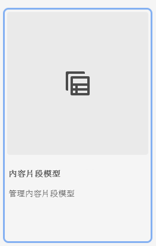

# 了解如何在AEM中建立內容片段模型 {#architect-headless-content-fragment-models}

## 迄今為止的故事 {#story-so-far}

在 [AEM無頭內容製作歷程](overview.md) the [使用AEM的無頭式內容模型基本知識](basics.md) 涵蓋與無頭製作相關的基本概念和術語。

本文以這些為基礎，讓您了解如何為AEM無頭專案建立自己的內容片段模型。

## 目標 {#objective}

* **對象**:入門者
* **目標**:使用內容片段模型為無頭式CMS建立內容模型的概念和機制。

<!-- which persona does this? -->
<!-- and who allows the configuration on the folders? -->

<!--
## Enabling Content Fragment Models {#enabling-content-fragment-models}

At the very start you need to enable Content Fragment Models for your site, this is done in the Configuration Browser; under Tools -> General -> Configuration Browser. You can either select to configure the global entry, or create a new configuration. For example:

>[!NOTE]
>
>See Additional Resources - Content Fragments in the Configuration Browser
-->

## 建立內容片段模型 {#creating-content-fragment-models}

然後可建立內容片段模型並定義結構。 這可在「工具 — >資產 — >內容片段模型」下完成。

選取此選項後，請導覽至模型的位置並選取 **建立**. 您可以在此輸入各種密鑰詳細資訊。

選項 **啟用模型** 預設為啟用。 這表示當您儲存模型後，就可供使用（在建立內容片段時）。 您可以視需要停用此功能，之後可能會啟用（或停用）現有模型。

確認為 **建立** 你可以 **開啟** 要開始定義結構的模型。

## 定義內容片段模型 {#defining-content-fragment-models}

首次開啟新模型時，您會看到左側有一個很大的空白，以及 **資料類型** 在右邊：

那麼，該怎麼辦？

您可以拖曳 **資料類型** 在左邊空間 — 您已定義模型！

新增資料類型後，將需要定義 **屬性** 那塊地。 視使用的類型而定。 例如：

您可以新增所需的欄位數。 例如：

### 您的內容作者 {#your-content-authors}

您的內容作者看不到您用來建立模型的實際資料類型和屬性。 這表示您可能必須提供說明，以及說明它們如何完成特定欄位。 如需基本資訊，您可以使用欄位標籤和預設值，但更複雜的案例可能需要考慮專案特定檔案。

>[!NOTE]
>
>請參閱其他資源 — 內容片段模型。

## 管理內容片段模型 {#managing-content-fragment-models}

<!-- needs more details -->

管理內容片段模型包含：

* 啟用（或停用）這些片段 — 這可讓作者在建立內容片段時使用。
* 刪除 — 一律需要刪除，但您必須注意刪除已用於內容片段的模型，尤其是已發佈的片段。

## 發佈 {#publishing}

<!-- needs more details -->

發佈任何相依內容片段時/之前，必須發佈內容片段模型。

>[!NOTE]
>
>如果作者嘗試發佈模型尚未發佈的內容片段，選取清單會指出這點，且模型將會隨片段發佈。

模型發佈後即會 *鎖定* 在作者上轉換為唯讀模式。 這可防止發生變更，導致現有GraphQL結構和查詢發生錯誤，尤其是在發佈環境中。 在主控台中以 **已鎖定**.

當模型為 **已鎖定** （在「只讀」模式中），您可以查看模型的內容和結構，但無法直接編輯它們；雖然您可以 **已鎖定** 從控制台或模型編輯器建立模型。

## 下一步 {#whats-next}

現在您已了解基本知識，接下來的步驟就是開始建立您自己的內容片段模型。

## 其他資源 {#additional-resources}

* [製作概念](/help/sites-cloud/authoring/getting-started/concepts.md)

* [基本處理](/help/sites-cloud/authoring/getting-started/basic-handling.md)  — 此頁面主要根據 **網站** 主控台，但許多/大部分功能也與導覽至及對採取行動相關， **內容片段模型** 在 **資產** 控制台。

* [使用內容片段](/help/assets/content-fragments/content-fragments.md)

   * [內容片段模型](/help/assets/content-fragments/content-fragments-models.md)

      * [定義內容片段模型](/help/assets/content-fragments/content-fragments-models.md#defining-your-content-fragment-model)

      * [啟用或停用內容片段模型](/help/assets/content-fragments/content-fragments-models.md#enabling-disabling-a-content-fragment-model)

      * [允許資產資料夾上的內容片段模型](/help/assets/content-fragments/content-fragments-models.md#allowing-content-fragment-models-assets-folder)

      * [刪除內容片段模型](/help/assets/content-fragments/content-fragments-models.md#deleting-a-content-fragment-model)

      * [發佈內容片段模型](/help/assets/content-fragments/content-fragments-models.md#publishing-a-content-fragment-model)

      * [取消發佈內容片段模型](/help/assets/content-fragments/content-fragments-models.md#unpublishing-a-content-fragment-model)

      * [鎖定（已發佈）內容片段模型](/help/assets/content-fragments/content-fragments-models.md#locked-published-content-fragment-models)

* 快速入門手冊

   * [建立內容片段模型無頭快速入門手冊](/help/implementing/developing/headless/getting-started/create-content-model.md)
