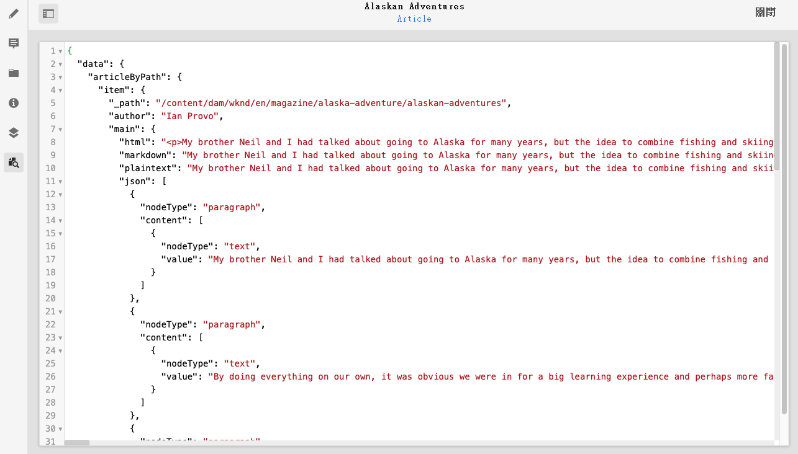
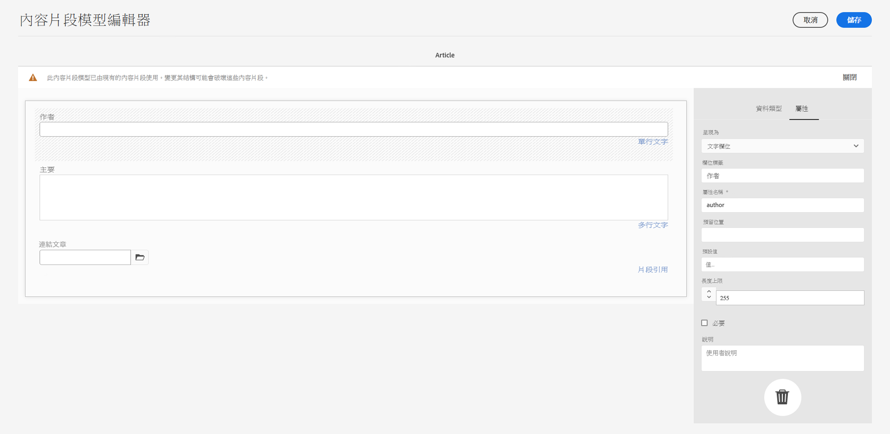
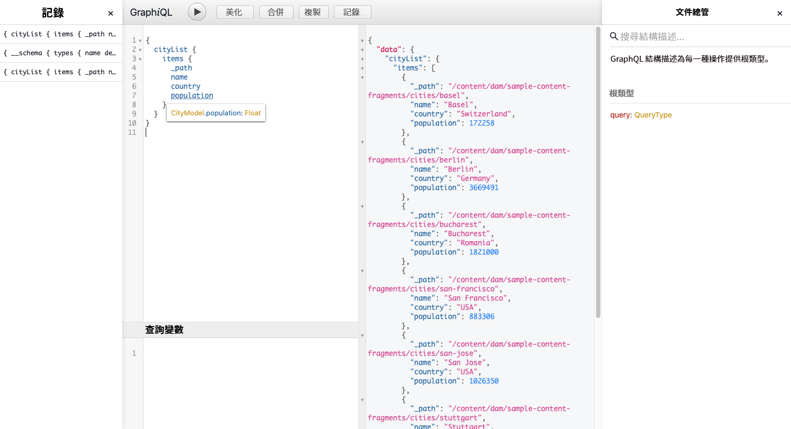

# 如何通過交付API訪AEM問內容 {#access-your-content}

在 [無AEM頭開發者之旅，](overview.md) 您可以學習如何使用GraphQL查詢訪問內容片段的內容並將其饋送到您的應用（無頭傳遞）。

>[!NOTE]
>
>此功能的某些功能在預發行渠道中可用。 特別是與永續查詢相關的功能。
> 
>查看 [預發行渠道文檔](https://experienceleague.adobe.com/docs/experience-manager-cloud-service/content/release-notes/prerelease.html#enable-prerelease) 有關如何為您的環境啟用該功能的資訊。

## 到目前為止的故事 {#story-so-far}

在前一篇無頭旅AEM程中， [如何對內容建模](model-your-content.md) 您在中學習了內容建模的基礎知識AEM，因此您現在應該瞭解如何對內容結構建模，然後使用內容片段模型和內容片AEM段來實現該結構：

* 識別與內容建模相關的概念和術語。
* 瞭解為什麼無頭內容交付需要內容建模。
* 瞭解如何使用內容片段模AEM型（以及使用內容片段創作內容）實現此結構。
* 瞭解如何對內容建模；基本樣本原則。

本文基於這些基礎知識，因此您可以瞭解如何使用AEMGraphQL API訪問現有無AEM頭內容。

* **觀眾**:初學者
* **目標**:瞭解如何使用AEMGraphQL查詢訪問內容片段的內容：
   * 介紹GraphQL和AEMGraphQL API。
   * 深入瞭解GraphQL API的AEM詳細資訊。
   * 查看一些示例查詢，瞭解實際操作中的操作。

## 您想訪問您的內容嗎？ {#so-youd-like-to-access-your-content}

所以……你擁有所有這些內容，結構整齊（在內容片段中），只是在等待輸入新應用。 問題是，怎麼去？

您需要的是一種方法，以特定內容為目標，選擇所需內容並將其返回到您的應用程式以進行進一步處理。

利用Adobe Experience Manager(AEM)as a Cloud Service，您可以使用AEMGraphQL API有選擇地訪問內容片段，以僅返回所需內容。 這意味著您可以實現結構化內容的無頭傳送，以便在您的應用程式中使用。

>[!NOTE]
>
>GraphQL APIAEM是基於標準GraphQL API規範的自定義實現。

## GraphQL — 簡介 {#graphql-introduction}

GraphQL是一種開源規範，它提供：

* 一種查詢語言，使您能夠從結構化對象中選擇特定內容。
* 一個運行時，用於使用結構化內容完成這些查詢。

GraphQL是 *強烈* 類型化API。 這意味著 *全部* 內容必須按類型明確地進行結構化和組織，以便GraphQL *理解* 如何訪問以及如何訪問。 資料欄位在GraphQL架構中定義，用於定義內容對象的結構。

然後，GraphQL端點提供響應GraphQL查詢的路徑。

所有這些都意味著您的應用能夠準確、可靠、高效地選擇它需要的內容 — 這正是您使用時需要的AEM內容。

>[!NOTE]
>
>請參閱 *圖形QL*.org和 *圖形QL*.com。

<!--
## AEM and GraphQL {#aem-graphql}

GraphQL is used in various locations in AEM; for example:

* Content Fragments
  * A customized API has been developed for this use-case (Headless Delivery to your app).
    * This is the AEM GraphQL API.
* Commerce
  * AEM Commerce consumes data from a Commerce platform via GraphQL.
  * There are GraphQL integrations between AEM and various third-party commerce solutions, used with the extension hooks provided by the CIF Core Components.
    * This does not use the AEM GraphQL API.

>[!NOTE]
>
>This step of the Headless Journey is only concerned with the AEM GraphQL API and Content Fragments.
-->

## AEMGraphQL API {#aem-graphql-api}

GraphQL API是基於標準AEMGraphQL API規範的自定義版本，特別配置為允許您對內容片段執行（複雜）查詢。

使用內容片段，因為內容是根據內容片段模型構建的。 這滿足了GraphQL的基本要求。

* 內容片段模型由一個或多個欄位組成。
   * 每個欄位都根據資料類型定義。
* 內容片段模型用於生成相應AEM的GraphQL模式。

要實際訪問GraphQLAEM（和內容），使用端點提供訪問路徑。

通過GraphQL API返回的AEM內容，然後可供應用程式使用。

為幫助您直接輸入和test查詢，標準GraphiQL介面的實現也可用於AEMGraphQL(可隨附安AEM裝)。 它提供語法突出顯示、自動完成、自動建議等功能，以及歷史記錄和線上文檔。

>[!NOTE]
>
>GraphQLAEM API實現基於GraphQL Java庫。

<!--
### Use Cases for Author and Publish Environments {#use-cases-author-publish-environments}

The use cases for the AEM GraphQL API can depend on the type of AEM as a Cloud Service environment:

* Publish environment; used to: 
  * Query content for JS application (standard use-case)

* Author environment; used to: 
  * Query content for "content management purposes":
    * GraphQL in AEM as a Cloud Service is currently a read-only API.
    * The REST API can be used for CR(u)D operations.
-->

## 用於GraphQL API的內AEM容片段 {#content-fragments-use-with-aem-graphql-api}

內容片段可用作架構和查詢的GraphQLAEM的基礎，如下所示：

* 它們使您能夠設計、建立、建立和發佈可以毫無頭緒地傳送的獨立於頁面的內容。
* 它們基於內容片段模型，該模型使用選擇的資料類型預先定義結果片段的結構。
* 可使用「片段參照」(Fragment Reference)資料類型（定義模型時可用）實現其它結構層。

### 內容片段模型 {#content-fragments-models}

以下內容片段模型：

* 用於生成方案 **已啟用**。
* 提供GraphQL所需的資料類型和欄位。 它們確保您的應用程式只請求可能的內容，並接收預期的內容。
* 資料類型 **片段引用** 可在模型中使用以引用另一個內容片段，因此引入其他級別的結構。

### 片段引用 {#fragment-references}

的 **片段引用**:

* 是定義內容片段模型時可用的特定資料類型。
* 引用另一段，取決於特定內容段模型。
* 允許您建立和檢索結構化資料。

   * 定義為 **多饋**，多個子片段可以由素片段引用（檢索）。

### JSON預覽 {#json-preview}

要幫助設計和開發內容片段模型，可以在內容片段編輯器中預覽JSON輸出。



<!--
## GraphQL Schema Generation from Content Fragments {#graphql-schema-generation-content-fragments}

GraphQL is a strongly typed API, which means that content must be clearly structured and organized by type. The GraphQL specification provides a series of guidelines on how to create a robust API for interrogating content on a certain instance. To do this, a client needs to fetch the Schema, which contains all the types necessary for a query. 

For Content Fragments, the GraphQL schemas (structure and types) are based on **Enabled** Content Fragment Models and their data types.

>[!CAUTION]
>
>All the GraphQL schemas (derived from Content Fragment Models that have been **Enabled**) are readable through the GraphQL endpoint.
>
>This means that you need to ensure that no sensitive content is available, to ensure that no sensitive data is exposed via GraphQL endpoints; for example, this includes information that could be present as field names in the model definition.

For example, if a user created a Content Fragment Model called `Article`, then AEM generates the object `article` that is of a type `ArticleModel`. The fields within this type correspond to the fields and data types defined in the model.

1. A Content Fragment Model:

   

1. The corresponding GraphQL schema (output from GraphiQL automatic documentation):
   

   This shows that the generated type `ArticleModel` contains several [fields](#fields). 
   
   * Three of them have been controlled by the user: `author`, `main` and `referencearticle`.

   * The other fields were added automatically by AEM, and represent helpful methods to provide information about a certain Content Fragment; in this example, `_path`, `_metadata`, `_variations`. These [helper fields](#helper-fields) are marked with a preceding `_` to distinguish between what has been defined by the user and what has been auto-generated.

1. After a user creates a Content Fragment based on the Article model, it can then be interrogated through GraphQL. For examples, see the Sample Queries.md#graphql-sample-queries) (based on a sample Content Fragment structure for use with GraphQL.

In GraphQL for AEM, the schema is flexible. This means that it is auto-generated each and every time a Content Fragment Model is created, updated or deleted. The data schema caches are also refreshed when you update a Content Fragment Model.

The Sites GraphQL service listens (in the background) for any modifications made to a Content Fragment Model. When updates are detected, only that part of the schema is regenerated. This optimization saves time and provides stability.

So for example, if you:

1. Install a package containing `Content-Fragment-Model-1` and `Content-Fragment-Model-2`:
 
   1. GraphQL types for `Model-1` and `Model-2` will be generated.

1. Then modify `Content-Fragment-Model-2`:

   1. Only the `Model-2` GraphQL type will get updated.

   1. Whereas `Model-1` will remain the same. 

>[!NOTE]
>
>This is important to note in case you want to do bulk updates on Content Fragment Models through the REST api, or otherwise.

The schema is served through the same endpoint as the GraphQL queries, with the client handling the fact that the schema is called with the extension `GQLschema`. For example, performing a simple `GET` request on `/content/cq:graphql/global/endpoint.GQLschema` will result in the output of the schema with the Content-type: `text/x-graphql-schema;charset=iso-8859-1`.

### Schema Generation - Unpublished Models {#schema-generation-unpublished-models}

When Content Fragments are nested it can happen that a parent Content Fragment Model is published, but a referenced model is not.

>[!NOTE]
>
>The AEM UI prevents this happening, but if publishing is made programmatically, or with content packages, it can occur.

When this happens, AEM generates an *incomplete* Schema for the parent Content Fragment Model. This means that the Fragment Reference, which is dependent on the unpublished model, is removed from the schema.

## AEM GraphQL Endpoints {#aem-graphql-endpoints}

An endpoint is the path used to access GraphQL for AEM. Using this path you (or your app) can:

* access the GraphQL schemas,
* send your GraphQL queries,
* receive the responses (to your GraphQL queries).

AEM allows for:

* A global endpoint - available for use by all sites.
* Endpoints for specific Sites configurations - that you can configure (in the Configuration Browser), specific to a specified site/project.

## Permissions {#permissions}

The permissions are those required for accessing Assets.

## The AEM GraphiQL Interface {#aem-graphiql-interface}

To help you directly input, and test queries, an implementation of the standard GraphiQL interface is available for use with AEM GraphQL. This can be installed with AEM.

>[!NOTE]
>
>GraphiQL is bound the global endpoint (and does not work with other endpoints for specific Sites configurations).

It provides features such as syntax-highlighting, auto-complete, auto-suggest, together with a history and online documentation.


-->

## 實際使AEM用GraphQL API {#actually-using-aem-graphiql}

### 初始設定 {#initial-setup}

在開始查詢內容之前，您需要：

* 啟用終結點
   * 使用工具 — >常規 — > GraphQL
   * [啟用GraphQL終結點](/help/headless/graphql-api/graphql-endpoint.md)

* 安裝GraphiQL（如果需要）
   * 作為專用包安裝
   * [安裝AEMGraphiQL介面](/help/headless/graphql-api/graphiql-ide.md)

### 示例結構 {#sample-structure}

要在查詢中實AEM際使用GraphQL API，我們可以使用兩種非常基本的內容片段模型結構：

* 公司
   * 名稱 — 文本
   * CEO（人員） — 片段參考
   * 員工（人員） — 片段參考
* 人員
   * 名稱 — 文本
   * 名字 — 文本

如您所見，「CEO」(CEO)和「員工」(Employees)欄位，引用「人員」(Person)片段。

將使用碎片模型：

* 在內容片段編輯器中建立內容時
* 生成要查詢的GraphQL架構

### test查詢的位置 {#where-to-test-your-queries}

查詢可以在GraphiQL介面中輸入。 可以從以下任一位置訪問查詢編輯器：

* **工具** -> **常規** -> **GraphQL查詢編輯器**
* 直接；比如說， `http://localhost:4502/aem/graphiql.html`


### 查詢入門 {#getting-Started-with-queries}

直接查詢是返回公司架構中所有條目的名稱。 在此，您請求列出所有公司名稱：

```xml
query {
  companyList {
    items {
      name
    }
  }
}
```

一個稍複雜的查詢是選擇沒有「Jobs」名稱的所有人員。 這將篩選所有名稱不為Job的人員。 這是使用EQUALS_NOT運算子實現的（還有更多）:

```xml
query {
  personList(filter: {
    name: {
      _expressions: [
        {
          value: "Jobs"
          _operator: EQUALS_NOT
        }
      ]
    }
  }) {
    items {
      name
      firstName
    }
  }
}
```

您還可以構建更複雜的查詢。 例如，查詢至少有一名名為「Smith」的員工的所有公司。 此查詢說明了對名為「Smith」的任何人的篩選，從嵌套片段返回資訊：

```xml
query {
  companyList(filter: {
    employees: {
      _match: {
        name: {
          _expressions: [
            {
              value: "Smith"
            }
          ]
        }
      }
    }
  }) {
    items {
      name
      ceo {
        name
        firstName
      }
      employees {
        name
        firstName
      }
    }
  }
}
```

<!-- need code / curl / cli examples-->

有關使用GraphQL API的完AEM整詳細資訊，以及配置必要的元素，可參考：

* 學習將GraphQL與
* 樣本內容片段結構
* 學習將GraphQL與AEM樣例內容和查詢一起使用

## 下一步是什麼 {#whats-next}

現在，您已經學會了如何使用GraphQL API訪問和查詢AEM無頭內容 [瞭解如何使用REST API訪問和更新內容片段的內容](update-your-content.md)。

## 其他資源 {#additional-resources}

* [GraphQL.org](https://graphql.org)
   * [結構描述](https://graphql.org/learn/schema/)
   * [變數](https://graphql.org/learn/queries/#variables)
   * [GraphQL Java庫](https://graphql.org/code/#java)
* [GraphiQL](https://graphql.org/learn/serving-over-http/#graphiql)
* [學習將GraphQL與](/help/headless/graphql-api/content-fragments.md)
   * [啟用GraphQL終結點](/help/headless/graphql-api/graphql-endpoint.md)
   * [安裝AEMGraphiQL介面](/help/headless/graphql-api/graphiql-ide.md)
* [樣本內容片段結構](/help/headless/graphql-api/sample-queries.md#content-fragment-structure-graphql)
* [學習將GraphQL與AEM樣例內容和查詢一起使用](/help/headless/graphql-api/sample-queries.md)
   * [示例查詢 — 單個特定城市片段](/help/headless/graphql-api/sample-queries.md#sample-single-specific-city-fragment)
   * [元資料查詢示例 — 列出標題為GB的獎項的元資料](/help/headless/graphql-api/sample-queries.md#sample-metadata-awards-gb)
   * [示例查詢 — 具有命名變體的所有城市](/help/headless/graphql-api/sample-queries.md#sample-cities-named-variation)
* [在配置瀏覽器中啟用內容片段功能](/help/assets/content-fragments/content-fragments-configuration-browser.md#enable-content-fragment-functionality-in-configuration-browser)
* [使用內容片段](/help/assets/content-fragments/content-fragments.md)
   * [內容片段模型](/help/assets/content-fragments/content-fragments-models.md)
   * [JSON輸出](/help/assets/content-fragments/content-fragments-json-preview.md)
* [瞭解跨源資源共用(CORS)](https://experienceleague.adobe.com/docs/experience-manager-learn/foundation/security/understand-cross-origin-resource-sharing.html?lang=en#understand-cross-origin-resource-sharing-(cors))
* [為伺服器端API生成訪問令牌](/help/implementing/developing/introduction/generating-access-tokens-for-server-side-apis.md)
* [無頭入門AEM](https://experienceleague.adobe.com/docs/experience-manager-learn/getting-started-with-aem-headless/graphql/overview.html)  — 一個短視頻教程系列，概述了使用無AEM頭功能（包括內容建模和GraphQL）。
