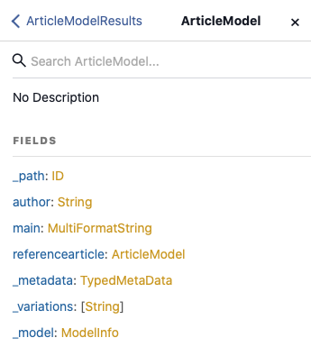

# 如何透過AEM傳送API存取您的內容 {#access-your-content}

在 [AEM無頭開發者歷程，](overview.md) 您可以了解如何使用GraphQL查詢來存取內容片段的內容，並將其饋送至您的應用程式（無周邊傳送）。

## 迄今為止的故事 {#story-so-far}

在AEM無頭歷程的上一份檔案中， [如何建立內容模型](model-your-content.md) 您已了解AEM中內容模型的基本知識，因此您現在應了解如何建立內容結構模型，然後使用AEM內容片段模型和內容片段來實現該結構：

* 識別與內容模型相關的概念和術語。
* 了解為何需要建立內容模型才能傳送無頭式內容。
* 了解如何使用AEM內容片段模型（以及使用內容片段製作內容）來實現此結構。
* 了解如何建立內容模型；基本樣本的原則。

本文以這些基本知識為基礎，讓您了解如何使用AEM GraphQL API存取AEM中現有的無周邊內容。

* **對象**:入門者
* **目標**:了解如何使用AEM GraphQL查詢存取內容片段的內容：
   * 導入GraphQL和AEM GraphQL API。
   * 深入了解AEM GraphQL API的詳細資訊。
   * 查看一些範例查詢，了解實際運作方式。

## 那麼，您想要訪問您的內容？ {#so-youd-like-to-access-your-content}

所以……您擁有所有這些內容，結構整齊（位於內容片段中），而且只是在等待新應用程式的摘要。 問題是，怎麼去？

您需要的是鎖定特定內容、選取所需內容，然後將其傳回至應用程式以進行進一步處理的方式。

透過Adobe Experience Manager(AEM)as a Cloud Service，您可以使用AEM GraphQL API，選擇性地存取內容片段，以僅傳回您需要的內容。 這表示您可以實現結構化內容的無頭傳送，以便用於您的應用程式。

>[!NOTE]
>
>AEM GraphQL API是根據標準GraphQL API規格，自訂的實作。

## GraphQL — 簡介 {#graphql-introduction}

GraphQL是開放原始碼規範，提供：

* 一種查詢語言，可讓您從結構化物件中選取特定內容。
* 一個運行時，用您的結構化內容來完成這些查詢。

GraphQL是 *強烈* 輸入API。 這表示 *all* 內容必須依類型清楚地架構和組織，以便GraphQL *理解* 存取的項目及方式。 資料欄位是在GraphQL結構中定義的，可定義內容物件的結構。

然後，GraphQL端點會提供回應GraphQL查詢的路徑。

這些都表示您的應用程式能夠準確、可靠且有效地選取所需內容，與AEM搭配使用時，為您所需的內容。

>[!NOTE]
>
>請參閱 *GraphQL*.org和 *GraphQL*.com。

<!--
## AEM and GraphQL {#aem-graphql}

GraphQL is used in various locations in AEM; for example:

* Content Fragments
  * A customized API has been developed for this use-case (Headless Delivery to your app).
    * This is the AEM GraphQL API.
* Commerce
  * AEM Commerce consumes data from a Commerce platform via GraphQL.
  * There are GraphQL integrations between AEM and various third-party commerce solutions, used with the extension hooks provided by the CIF Core Components.
    * This does not use the AEM GraphQL API.

>[!NOTE]
>
>This step of the Headless Journey is only concerned with the AEM GraphQL API and Content Fragments.
-->

## AEM GraphQL API {#aem-graphql-api}

AEM GraphQL API是以標準GraphQL API規格為基礎的自訂版本，經特別設定，可讓您對內容片段執行（複雜）查詢。

內容片段是使用的，因為內容是根據內容片段模型建構。 這滿足了GraphQL的基本要求。

* 內容片段模型是由一或多個欄位所建立。
   * 每個欄位都根據資料類型定義。
* 內容片段模型用於產生對應的AEM GraphQL結構。

若要實際存取AEM適用的GraphQL（和內容），會使用端點來提供存取路徑。

透過AEM GraphQL API傳回的內容，便可供您的應用程式使用。

為協助您直接輸入和測試查詢，標準GraphiQL介面的實作也可與AEM GraphQL搭配使用(這可與AEM一併安裝)。 它提供語法醒目提示、自動完成、自動建議等功能，以及歷史記錄和線上檔案。

>[!NOTE]
>
>AEM GraphQL API實作以GraphQL Java程式庫為基礎。

<!--
### Use Cases for Author and Publish Environments {#use-cases-author-publish-environments}

The use cases for the AEM GraphQL API can depend on the type of AEM as a Cloud Service environment:

* Publish environment; used to: 
  * Query content for JS application (standard use-case)

* Author environment; used to: 
  * Query content for "content management purposes":
    * GraphQL in AEM as a Cloud Service is currently a read-only API.
    * The REST API can be used for CR(u)D operations.
-->

## 與AEM GraphQL API搭配使用的內容片段 {#content-fragments-use-with-aem-graphql-api}

內容片段可作為AEM結構和查詢的GraphQL基礎，如下：

* 它們可讓您設計、建立、組織和發佈不受頁面影響的內容，而這些內容可無端傳送。
* 它們以內容片段模型為基礎，該模型使用一系列資料類型預先定義產生片段的結構。
* 可使用「片段參考」資料類型（定義模型時可用）實現其他結構層。

### 內容片段模型 {#content-fragments-models}

以下內容片段模型：

* 一次用於產生結構 **已啟用**.
* 提供GraphQL所需的資料類型和欄位。 它們可確保您的應用程式只要求可能的項目，並接收預期的項目。
* 資料類型 **片段參考** 可用於模型中以參考其他內容片段，因此引入其他層級的結構。

### 片段參考 {#fragment-references}

此 **片段參考**:

* 是定義內容片段模型時可用的特定資料類型。
* 參考另一個片段，取決於特定內容片段模型。
* 可讓您建立並擷取結構化資料。

   * 定義為 **多重摘要**，則主要片段可參考（擷取）多個子片段。

### JSON預覽 {#json-preview}

若要協助您設計和開發內容片段模型，您可以在內容片段編輯器中預覽JSON輸出。


<!--
## GraphQL Schema Generation from Content Fragments {#graphql-schema-generation-content-fragments}

GraphQL is a strongly typed API, which means that content must be clearly structured and organized by type. The GraphQL specification provides a series of guidelines on how to create a robust API for interrogating content on a certain instance. To do this, a client needs to fetch the Schema, which contains all the types necessary for a query. 

For Content Fragments, the GraphQL schemas (structure and types) are based on **Enabled** Content Fragment Models and their data types.

>[!CAUTION]
>
>All the GraphQL schemas (derived from Content Fragment Models that have been **Enabled**) are readable through the GraphQL endpoint.
>
>This means that you need to ensure that no sensitive content is available, to ensure that no sensitive data is exposed via GraphQL endpoints; for example, this includes information that could be present as field names in the model definition.

For example, if a user created a Content Fragment Model called `Article`, then AEM generates the object `article` that is of a type `ArticleModel`. The fields within this type correspond to the fields and data types defined in the model.

1. A Content Fragment Model:

   

1. The corresponding GraphQL schema (output from GraphiQL automatic documentation):
   

   This shows that the generated type `ArticleModel` contains several [fields](#fields). 
   
   * Three of them have been controlled by the user: `author`, `main` and `referencearticle`.

   * The other fields were added automatically by AEM, and represent helpful methods to provide information about a certain Content Fragment; in this example, `_path`, `_metadata`, `_variations`. These [helper fields](#helper-fields) are marked with a preceding `_` to distinguish between what has been defined by the user and what has been auto-generated.

1. After a user creates a Content Fragment based on the Article model, it can then be interrogated through GraphQL. For examples, see the Sample Queries.md#graphql-sample-queries) (based on a sample Content Fragment structure for use with GraphQL.

In GraphQL for AEM, the schema is flexible. This means that it is auto-generated each and every time a Content Fragment Model is created, updated or deleted. The data schema caches are also refreshed when you update a Content Fragment Model.

The Sites GraphQL service listens (in the background) for any modifications made to a Content Fragment Model. When updates are detected, only that part of the schema is regenerated. This optimization saves time and provides stability.

So for example, if you:

1. Install a package containing `Content-Fragment-Model-1` and `Content-Fragment-Model-2`:
 
   1. GraphQL types for `Model-1` and `Model-2` will be generated.

1. Then modify `Content-Fragment-Model-2`:

   1. Only the `Model-2` GraphQL type will get updated.

   1. Whereas `Model-1` will remain the same. 

>[!NOTE]
>
>This is important to note in case you want to do bulk updates on Content Fragment Models through the REST api, or otherwise.

The schema is served through the same endpoint as the GraphQL queries, with the client handling the fact that the schema is called with the extension `GQLschema`. For example, performing a simple `GET` request on `/content/cq:graphql/global/endpoint.GQLschema` will result in the output of the schema with the Content-type: `text/x-graphql-schema;charset=iso-8859-1`.

### Schema Generation - Unpublished Models {#schema-generation-unpublished-models}

When Content Fragments are nested it can happen that a parent Content Fragment Model is published, but a referenced model is not.

>[!NOTE]
>
>The AEM UI prevents this happening, but if publishing is made programmatically, or with content packages, it can occur.

When this happens, AEM generates an *incomplete* Schema for the parent Content Fragment Model. This means that the Fragment Reference, which is dependent on the unpublished model, is removed from the schema.

## AEM GraphQL Endpoints {#aem-graphql-endpoints}

An endpoint is the path used to access GraphQL for AEM. Using this path you (or your app) can:

* access the GraphQL schemas,
* send your GraphQL queries,
* receive the responses (to your GraphQL queries).

AEM allows for:

* A global endpoint - available for use by all sites.
* Endpoints for specific Sites configurations - that you can configure (in the Configuration Browser), specific to a specified site/project.

## Permissions {#permissions}

The permissions are those required for accessing Assets.

## The AEM GraphiQL Interface {#aem-graphiql-interface}

To help you directly input, and test queries, an implementation of the standard GraphiQL interface is available for use with AEM GraphQL. This can be installed with AEM.

>[!NOTE]
>
>GraphiQL is bound the global endpoint (and does not work with other endpoints for specific Sites configurations).

It provides features such as syntax-highlighting, auto-complete, auto-suggest, together with a history and online documentation.


-->

## 實際使用AEM GraphQL API {#actually-using-aem-graphiql}

### 初始設定 {#initial-setup}

開始使用內容查詢之前，您需要：

* 啟用端點
   * 使用工具 — >常規 — > GraphQL
   * [啟用GraphQL端點](/help/headless/graphql-api/graphql-endpoint.md)
      * 這也將啟用GraphiQL IDE。

### 範例結構 {#sample-structure}

若要在查詢中實際使用AEM GraphQL API，我們可以使用兩個非常基本的內容片段模型結構：

* 公司
   * 名稱 — 文字
   * CEO（人員） — 片段參考
   * 員工（人員） — 片段參考
* 人員
   * 名稱 — 文字
   * 名字 — 文字

如您所見，CEO和員工欄位，參考人員片段。

將使用片段模型：

* 在內容片段編輯器中建立內容時
* 生成要查詢的GraphQL結構

### 在何處測試查詢 {#where-to-test-your-queries}

查詢可在GraphiQL介面中輸入。 您可以透過下列任一項存取查詢編輯器：

* **工具** -> **一般** -> **GraphQL查詢編輯器**
* 直接；例如， `http://localhost:4502/aem/graphiql.html`


### 查詢快速入門 {#getting-Started-with-queries}

直接的查詢是返回公司架構中所有條目的名稱。 您可在此處要求所有公司名稱的清單：

```xml
query {
  companyList {
    items {
      name
    }
  }
}
```

更複雜的查詢是選擇沒有「工作」名稱的所有人員。 這會篩選所有名稱不為Jobs的人員。 這是使用EQUALS_NOT運算子實現的（還有更多）:

```xml
query {
  personList(filter: {
    name: {
      _expressions: [
        {
          value: "Jobs"
          _operator: EQUALS_NOT
        }
      ]
    }
  }) {
    items {
      name
      firstName
    }
  }
}
```

您也可以建立更複雜的查詢。 例如，查詢至少有一名員工且名稱為「Smith」的所有公司。 此查詢說明如何篩選名為「Smith」的任何人員，從巢狀片段傳回資訊：

```xml
query {
  companyList(filter: {
    employees: {
      _match: {
        name: {
          _expressions: [
            {
              value: "Smith"
            }
          ]
        }
      }
    }
  }) {
    items {
      name
      ceo {
        name
        firstName
      }
      employees {
        name
        firstName
      }
    }
  }
}
```

<!-- need code / curl / cli examples-->

如需使用AEM GraphQL API的完整詳細資訊，以及設定必要的元素，您可以參考：

* 學習如何搭配AEM使用GraphQL
* 範例內容片段結構
* 學習如何搭配AEM使用GraphQL — 範例內容與查詢

## 下一步 {#whats-next}

現在您已了解如何使用AEM GraphQL API存取和查詢無周邊內容 [了解如何使用REST API存取及更新內容片段的內容](update-your-content.md).

## 其他資源 {#additional-resources}

* [GraphQL.org](https://graphql.org)
   * [結構描述](https://graphql.org/learn/schema/)
   * [變數](https://graphql.org/learn/queries/#variables)
   * [GraphQL Java庫](https://graphql.org/code/#java)
* [GraphiQL](https://graphql.org/learn/serving-over-http/#graphiql)
* [學習如何搭配AEM使用GraphQL](/help/headless/graphql-api/content-fragments.md)
   * [啟用GraphQL端點](/help/headless/graphql-api/graphql-endpoint.md)
   * [安裝AEM GraphQL介面](/help/headless/graphql-api/graphiql-ide.md)
* [範例內容片段結構](/help/headless/graphql-api/sample-queries.md#content-fragment-structure-graphql)
* [學習如何搭配AEM使用GraphQL — 範例內容與查詢](/help/headless/graphql-api/sample-queries.md)
   * [範例查詢 — 單一特定城市片段](/help/headless/graphql-api/sample-queries.md#sample-single-specific-city-fragment)
   * [中繼資料的範例查詢 — 列出題為GB的獎項中繼資料](/help/headless/graphql-api/sample-queries.md#sample-metadata-awards-gb)
   * [範例查詢 — 具有已命名變數的所有城市](/help/headless/graphql-api/sample-queries.md#sample-cities-named-variation)
* [在設定瀏覽器中啟用內容片段功能](/help/sites-cloud/administering/content-fragments/content-fragments-configuration-browser.md#enable-content-fragment-functionality-in-configuration-browser)
* [使用內容片段](/help/sites-cloud/administering/content-fragments/content-fragments.md)
   * [內容片段模型](/help/sites-cloud/administering/content-fragments/content-fragments-models.md)
   * [JSON輸出](/help/sites-cloud/administering/content-fragments/content-fragments-json-preview.md)
* [了解跨原始資源共用(CORS)](https://experienceleague.adobe.com/docs/experience-manager-learn/foundation/security/understand-cross-origin-resource-sharing.html?lang=en#understand-cross-origin-resource-sharing-(cors))
* [產生伺服器端API的存取權杖](/help/implementing/developing/introduction/generating-access-tokens-for-server-side-apis.md)
* [AEM Headless快速入門](https://experienceleague.adobe.com/docs/experience-manager-learn/getting-started-with-aem-headless/graphql/overview.html)  — 簡短的教學課程系列影片，概述如何使用AEM無周邊功能，包括內容模型和GraphQL。
