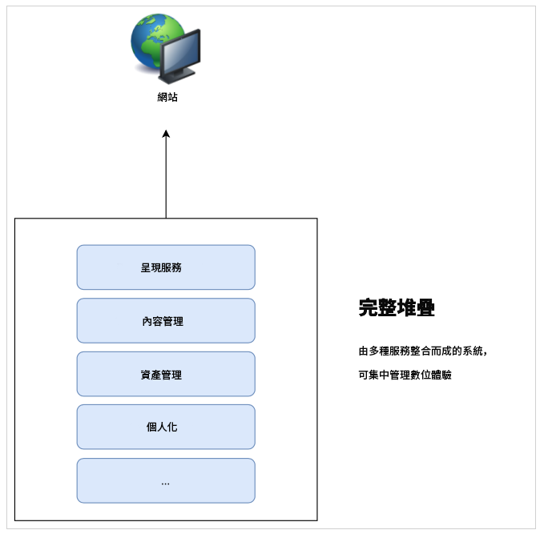
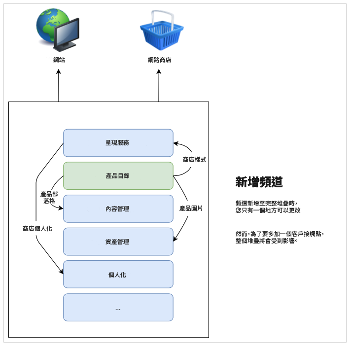
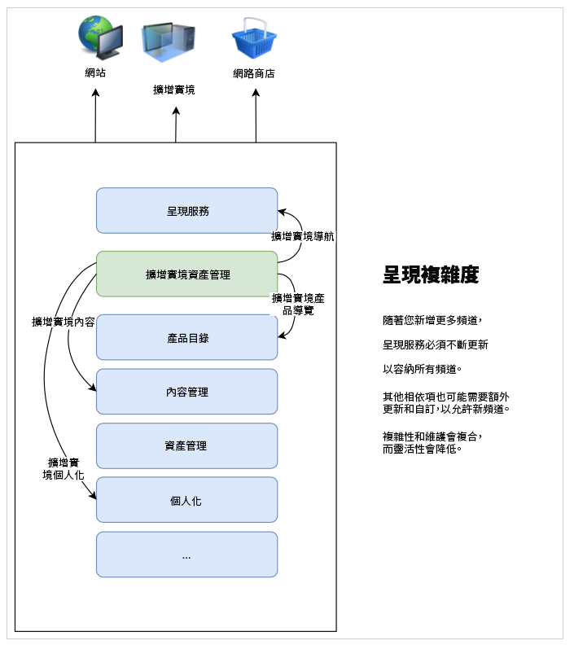
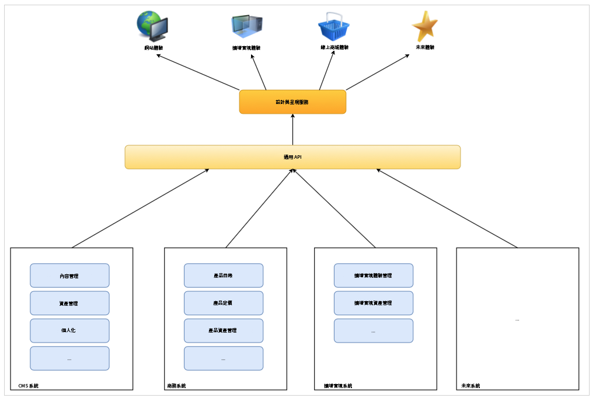

# 了解CMS無頭開發 {#learn-about}

在[AEM無頭開發者歷程的這部分中，](overview.md)了解無頭技術以及您使用它的原因。

## 目標 {#objective}

本檔案可協助您了解無頭式內容傳送，以及使用原因。 閱讀後，您應：

* 了解無頭式內容傳送的基本概念和術語
* 了解需要無頭的原因和時機
* 從高層了解無頭概念的使用方式及其相互關係

## 完整堆疊內容傳送 {#full-stack}

自易用、大規模的內容管理系統(CMS)興起以來，企業一直將它們作為管理報文傳送、品牌推廣和通信的中心位置。 將CMS作為管理體驗的中心點，可消除在不同系統中複製任務的需求，進而提高效率。

在全堆棧CMS中，用於操作內容的所有功能都在CMS中。 系統的功能構成了CMS堆棧的不同元件。 該全棧解決方案具有許多優點。

* 你有一個系統要維護。
* 內容是集中管理的。
* 系統的所有服務均已整合。
* 內容製作順暢。

因此，如果您想要新增管道或支援新類型的體驗，您可以將一（或多個）新元件插入堆疊中，而您只有一個位置可進行變更。

堆棧內的依賴性的複雜性很快變得明顯，因為您發現堆棧中的其他項目可能需要調整以適應更改。

## 完整堆疊傳送的限制 {#limits}

完整堆棧方法本身就會建立一個思洛儲存器，讓所有體驗在一個系統中著陸。 更改或添加思洛儲存器的一個元件需要更改其他元件，這些更改會耗時且成本高昂。

演示系統尤其如此，傳統設定往往與CMS緊密相連。 任何新通道通常都意味著對演示系統的更新，這會影響所有其他通道。

當您花費更多精力協調堆棧所有元件的更改時，此自然外部儲存器的限制可能會變得明顯。

無論平台或接觸點為何，使用者都期望參與度，因此在您提供體驗的方式上需要靈活度。  這種多通道方法是數位體驗的標準，而在某些情況下，完整堆疊方法可能會被證明是不靈活的。

## 無頭的頭 {#the-head}

任何系統的頭通常是該系統的輸出渲染器，通常以GUI或其它圖形輸出的形式。

例如，無頭伺服器可能位於某處伺服器機房的機架中，且未連接顯示器。 要訪問它，您必須遠程連接到它。 在這種情況下，監視器是負責轉譯伺服器輸出的頭。 作為服務的消費者，當您遠程連接到該服務時，請提供您自己的頭（顯示器）。

當我們討論無頭式CMS時， CMS會管理內容並繼續將內容提供給消費者。 但是，通過僅以標準化方式傳送&#x200B;**內容**，無頭CMS省略了最終輸出呈現，將內容的&#x200B;**呈現**&#x200B;保留給消費服務。

無論是AR體驗、網站商店、行動體驗、漸進式網頁應用程式(PWA)等等，使用的服務都會從無頭式CMS接收內容，並提供自己的轉譯。 他們負責為您的內容提供自己的頭腦。

省略頭部可移除複雜性，簡化CMS。 這麼做也會將內容呈現的責任轉移到實際需要內容且通常更適合這類呈現的服務。

## 解耦 {#decoupling}

透過公開一組強大且有彈性的應用程式程式設計介面(API)，即可提供無頭式傳送，供您所有的體驗使用。 API是服務之間的通用語言，可透過標準化內容傳送在內容層級將它們系結在一起，但可讓它們有彈性地實作自己的解決方案。

無頭是將內容與其演示文稿脫鈎的示例。 或者，從更一般的意義上講，將前端與服務堆棧的後端脫鈎。 在無頭設定中，呈現系統（頭）與內容管理（尾）分離。 兩者只透過API呼叫互動。

這種脫鈎意味著，每個消費服務（前端）都可以根據透過API傳遞的相同內容來建立其體驗，從而確保內容的重複使用和一致性。 然後，使用的服務可以實施自己的演示系統，從而允許內容管理堆棧（後端）輕鬆地橫向擴展。

## 技術基礎 {#technology}

無頭式方法可讓您建立技術堆疊，以輕鬆且快速地適應未來的數位體驗需求。

過去，CMS的API通常以REST為基礎。 代表性狀態轉移(REST)以無狀態方式將資源作為文本提供。 這允許使用一組預定義的操作來讀取和修改資源。 REST通過確保內容的無狀態表示，實現了Web上服務之間的高互操作性。

我們仍需要強大的REST API。 不過，REST要求可能大而詳細。 如果您有多個消費者對所有管道進行REST呼叫，這種密集程度會影響效能。

無周邊內容傳送通常會使用GraphQL API。 GraphQL允許類似的無狀態傳輸，但允許更有針對性的查詢、減少所需的查詢總數並提高效能。 通常，我們會看到解決方案使用REST和GraphQL的混合，這實際上是為手頭的作業選擇最佳工具。

無論您選擇的API為何，只要根據通用API定義無頭系統，您就能運用最新的瀏覽器和其他網路技術，例如漸進式網頁應用程式(PWA)。 API建立可輕鬆擴充且可調整的標準介面。

通常，內容會呈現在用戶端。 這通常表示有人會在行動裝置上呼叫您的內容，而您的CMS會傳送內容，然後行動裝置（用戶端）負責轉譯您提供的內容。 如果裝置陳舊或速度緩慢，您的數位體驗同樣會很慢。

將內容與演示脫鈎意味著可以更好地控制這種客戶端效能問題。 伺服器端轉譯(SSR)負責將內容從用戶端的瀏覽器轉譯至伺服器。 這可讓您做為內容提供者，在需要的情況下，能為您的對象提供保證的效能等級。

## 組織挑戰 {#organization}

無頭為提供數位體驗開啟了靈活的世界。 但這種靈活性也可能帶來其自身的挑戰。

擁有許多不同的管道，就意味著每個管道都有各自的展示系統。 雖然他們都透過相同的API使用相同的內容，但由於不同的簡報，體驗可能會有所不同。 必須關注並注意確保客戶體驗的一致性。

通過實施仔細的設計系統、共用模式庫和利用可重複使用的設計元件以及已建立的開放客戶端框架，可以確保一致的體驗，但必須規劃。

## 未來是無頭的，未來是現在的 {#future}

數位體驗將持續定義品牌與客戶互動的方式。 無頭式設計令人興奮的是它為我們提供的靈活性，以響應不斷變化的客戶期望。

預測未來是不可能的，但無頭可讓你靈活應對未來帶來的一切。

## AEM和無頭 {#aem-and-headless}

隨著您持續進行此開發人員歷程，您將了解AEM如何支援無頭式傳送，以及其完整堆疊傳送功能。

作為數位體驗管理的業界領導者，Adobe認識到，針對體驗建立者所面臨的實際挑戰的理想解決方案很少是二進位的選擇。 這就是為什麼AEM不僅支援兩種模型，也獨一無二地支援兩者的緊密混合組合，結合無頭式和完整堆疊的優點，協助您無論內容在何處，都能最佳地為消費者提供服務。

此歷程著重於內容傳送的無頭式模型。 不過，一旦您具備此基本知識，便可進一步探索如何運用這兩種模型的強大功能。

## 下一步 {#what-is-next}

感謝您快速入門AEM無頭歷程！ 閱讀本檔案後，您應：

* 了解無頭式內容傳送的基本概念和術語。
* 了解需要無頭的原因和時機。
* 從高層了解無頭概念的使用方式及其相互關係。

基於此知識，接下來檢閱檔案[AEM Headless as a Cloud Service快速入門](getting-started.md)，繼續您的AEM無頭歷程，您將在此了解如何設定必要工具，以及如何開始思考AEM如何以無頭內容傳送及其先決條件。

## 其他資源 {#additional-resources}

雖然建議您透過檢閱檔案[以AEM Headless作為Cloud Service快速入門，繼續進行無頭式開發歷程的下一個部分，但以下是一些額外的選用資源，可深入探討本檔案提及的一些概念，但您不需要繼續進行無頭式開發歷程。](getting-started.md)

* [Adobe Experience Manager as a Cloud Service架構簡介](/help/overview/architecture.md)  — 了解AEM as a Cloud Service結構
* [AEM無頭式Tutorials](https://experienceleague.adobe.com/docs/experience-manager-learn/getting-started-with-aem-headless/overview.html)  — 使用這些實作教學課程，探索如何使用各種選項，透過AEM將內容傳遞至無頭式端點，並選擇適合您的方式。
