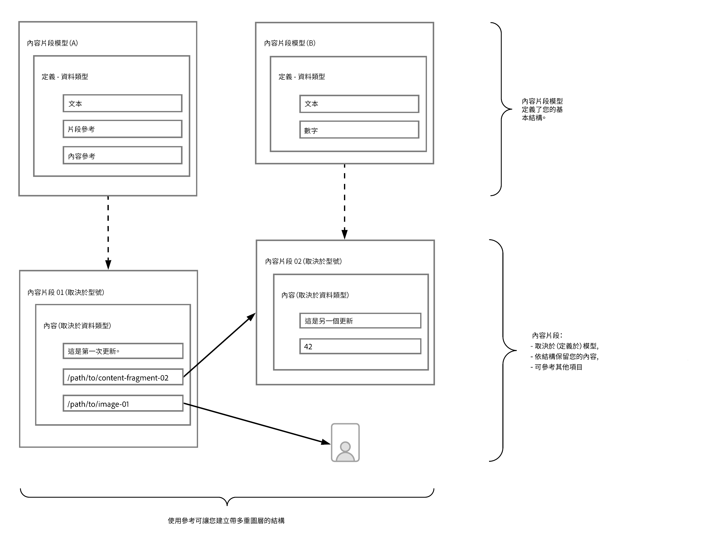
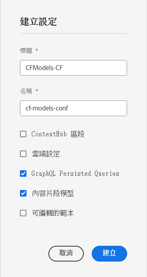
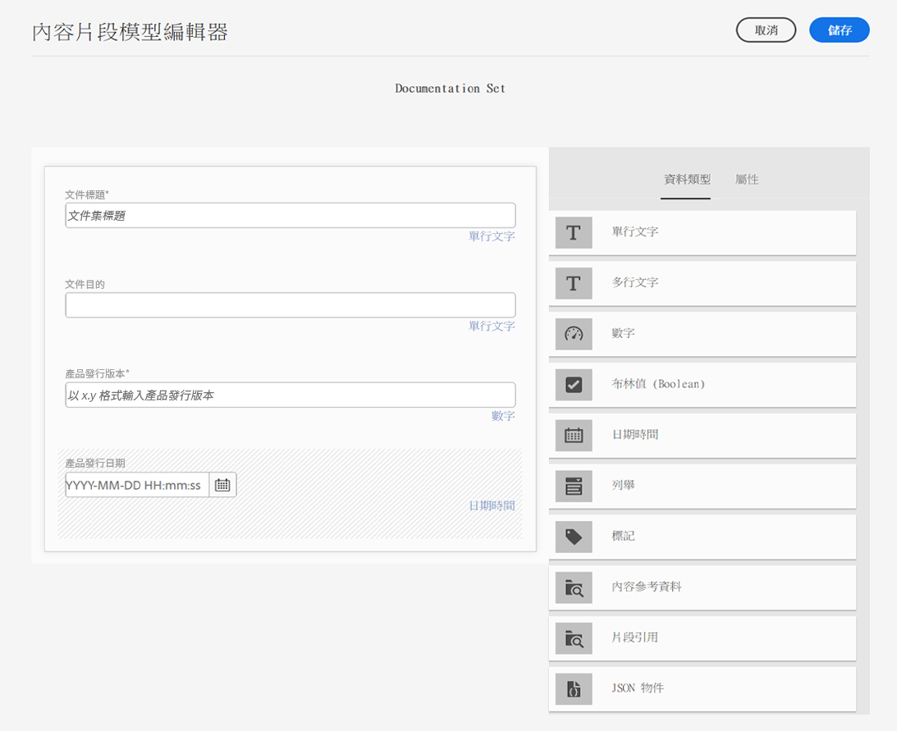
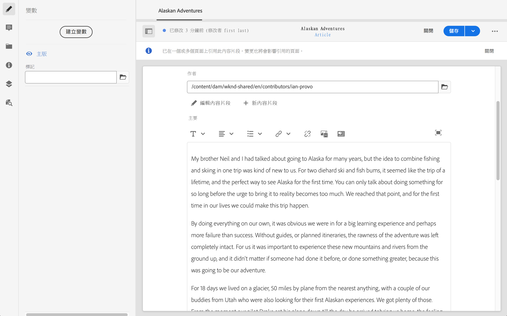

# 如何對內容建模 {#model-your-content}

在 [無AEM頭開發者之旅](overview.md)，您可以學習如何對內容結構建模。 然後實現Adobe Experience Manager(AEM)使用內容片段模型和內容片段的結構，以便跨通道重用。

## 到目前為止的故事 {#story-so-far}

在開始 [瞭解CMS無頭開發](learn-about.md) 包含無頭內容交付，以及應使用它的原因。 然後 [無頭as a Cloud Service入AEM門](getting-started.md) 在AEM您自己的項目中描述了。

在前一篇無頭旅AEM程中， [使用無頭設備獲得第一次體AEM驗](path-to-first-experience.md)，然後您學習了實施第一個項目所需的步驟。 讀完後，您應：

* 瞭解設計內容時的重要規劃考慮事項
* 瞭解根據您的整合級別要求實施無頭的步驟。
* 設定必要的工具和AEM配置。
* 瞭解最佳做法，使您的無頭之旅順暢，保持內容生成的高效性，並確保內容能快速交付。

本文基於這些基礎知識，以便您瞭解如何準備自己的無AEM頭項目。

## 目標 {#objective}

* **觀眾**:初學者
* **目標**:瞭解如何對內容結構建模，然後使用內容片段模AEM型和內容片段實現該結構：
   * 介紹與資料/內容建模相關的概念和術語。
   * 瞭解為什麼無頭內容交付需要內容建模。
   * 瞭解如何使用內容片段模AEM型（以及使用內容片段創作內容）實現此結構。
   * 學習如何對內容建模；基本樣本原則。

>[!NOTE]
>
>資料建模是一個很大的領域，在開發關係資料庫時使用它。 有許多書籍和線上資訊來源可供查閱。
>
>我們只考慮在建模資料以用於Headless時所關心的AEM方面。

## 內容建模 {#content-modeling}

*外面的世界很大，很糟*。

也許，也許不是，但那肯定是個 ***複雜*** 資料建模用來定義一個非常（非常）小的子段的簡化表示，使用特定目的所需的特定資訊。

>[!NOTE]
>
>在內AEM容方面，我們將資料建模稱為內容建模。

例如：

學校很多，但它們有很多共同點：

* 位置
* 頭師
* 許多教師
* 許多非教職人員
* 許多學生
* 許多前教師
* 許多前學生
* 許多教室
* 許多（許多）書籍
* 多（多）件設備
* 許多課外活動
* 等等……。

即使在如此小的例子中，這份名單也可能看起來無數。 但是，如果您只想讓應用程式執行一個簡單的任務，則需要將資訊限制在基本內容。

例如，為該地區的所有學校宣傳特別活動：

* 學校名稱
* 學校位置
* 校長
* 事件類型
* 事件日期
* 教師組織活動

### 概念 {#concepts}

您要描述的內容稱為 **實體**  — 基本上是我們要儲存有關資訊的「內容」。

我們想儲存的關於它們的資訊 **屬性** （屬性），如教師姓名和資格。

還有很多 **關係** 的下界。 像學校一般只有一位校長，許多老師（校長通常也是老師）,

分析和定義此資訊的過程以及它們之間的關係稱為 **內容建模**。

### 基本資訊 {#basics}

通常，您需要從繪製 **概念架構** 描述實體及其關係。 這通常是高級（概念性）。

穩定後，可將模型轉換為 **邏輯架構** 描述實體、屬性和關係的。 在此級別，您應仔細檢查定義，以消除重複並優化設計。

>[!NOTE]
>
>有時，這兩個步驟會合併，通常取決於方案的複雜性。

例如，您是否需要單獨的實體 `Head Teacher` 和 `Teacher`，或只是附加的屬性 `Teacher` 模型？

### 確保資料完整性 {#data-integrity}

需要資料完整性來保證內容在整個生命週期中的準確性和一致性。 這包括確保內容作者能夠輕鬆瞭解儲存內容的位置 — 因此以下內容至關重要：

* 清晰的結構
* 盡可能簡潔的結構（不犧牲精度）
* 驗證單個欄位
* 在適當情況下，將特定欄位的內容限制為有意義的內容

### 消除資料冗餘 {#data-redundancy}

當同一資訊在內容結構內儲存兩次時，資料冗餘發生。 這應避免，因為在建立內容時容易造成混淆，在查詢時會出錯；更別提濫用儲存空間了。

### 優化和效能 {#optimization-and-performance}

通過優化您的結構，您可以提高效能，無論是內容建立還是查詢。

一切都是一種平衡行為，但創造一種過於複雜或層次過多的結構，可以：

* 對生成內容的作者而言，令人困惑。

* 如果查詢必須訪問多個嵌套（引用）內容片段以檢索所需內容，則會嚴重影響效能。

## 無頭內容建AEM模 {#content-modeling-for-aem-headless}

資料建模是一組已建立的技術，在開發關係資料庫時經常使用，因此內容建模對於無頭公司意味著什麼？

### 為什麼？ {#why}

為了確保您的應用程式能夠一致高效地請求和從中接收所需內容，AEM必須對此內容進行結構化。

這意味著您的應用程式會提前知道響應的形式以及如何處理它。 這比接收自由格式內容容易得多，因為必須對自由格式內容進行分析以確定其包含的內容，從而確定其如何使用。

### 如何介紹？ {#how}

使AEM用內容片段提供將內容無頭傳送到應用程式所需的結構。

內容模型的結構是：

* 通過定義內容片段模型實現，
* 用作內容生成所用內容片段的基礎。

>[!NOTE]
>
>內容片段模型還用作GraphQL架構的基礎AEM，用於檢索內容 — 有關這些內容的詳細資訊，請在以後的會話中進行。

對內容的請求使用AEMGraphQL API（標準GraphQL API的自定義實現）。 GraphQL APIAEM允許您對內容片段執行（複雜）查詢，每個查詢都根據特定的模型類型。

然後，您的應用程式可以使用返回的內容。

## 使用內容片段模型建立結構 {#create-structure-content-fragment-models}

內容片段模型提供了各種機制，允許您定義內容的結構。

內容片段模型描述實體。

>[!NOTE]
>必須在配置瀏覽器中啟用內容片段功能，以便可以建立新模型。

>[!TIP]
>
>該模型應命名，以便內容作者知道在建立內容片段時要選擇的模型。

在模型中：

1. **資料類型** 允許您定義單個屬性。
例如，將保存教師姓名的欄位定義為 **文本** 和他們服役的年月 **數字**。
1. 資料類型 **內容引用** 和 **片段引用** 允許您建立與內部其他內容的關AEM系。
1. 的 **片段引用** 資料類型允許您通過嵌套內容片段（根據模型類型）實現多級結構。 這對您的內容建模至關重要。

例如：

### 資料類型 {#data-types}

AEM提供以下資料類型，以便對內容進行建模：

* 單行文字
* 多行文字
* 數量
* 布林值
* 日期時間
* 列舉
* 標記
* 內容參考資料
* 片段引用
* JSON 物件

### 引用和嵌套內容 {#references-nested-content}

兩種資料類型提供對特定片段外部內容的引用：

* **內容引用**
這提供了對任何類型的其他內容的簡單引用。
例如，可以在指定位置引用影像。

* **片段引用**
這提供了對其他內容片段的引用。
此類型的引用用於建立嵌套內容，並引入為內容建模所需的關係。
可以將資料類型配置為允許片段作者：
   * 直接編輯引用的片段。
   * 根據適當的模型建立新內容片段

### 建立內容片段模型 {#creating-content-fragment-models}

一開始，您需要為您的站點啟用內容片段模型，這在配置瀏覽器中完成；在工具 — >常規 — >配置瀏覽器下。 您可以選擇配置全局條目，或建立新配置。 例如：

>[!NOTE]
>
>請參閱配置瀏覽器中的其他資源 — 內容片段

然後可以建立內容片段模型並定義結構。 可以在 **工具** -> **常規** -> **內容片段模型**。 例如：

>[!NOTE]
>
>請參閱其他資源 — 內容片段模型。

## 用模型編寫內容片段 {#use-content-to-author-content}

內容片段始終基於內容片段模型。 模型提供結構，片段保存內容。

### 選擇適當的模型 {#select-model}

真正建立內容的第一步是建立內容片段。 這是使用「資產」 — >「檔案」下所需資料夾中的「建立」 — >「內容片段」來完成的。 嚮導將引導您完成這些步驟。

內容片段基於特定內容片段模型，您選擇該模型作為建立過程的第一步。

### 建立和編輯結構化內容 {#create-edit-structured-content}

建立片段後，可以在內容片段編輯器中開啟它。 您可以：

* 在正常或全屏模式下編輯內容。
* 將內容格式化為全文、純文字檔案或標籤。
* 建立和管理內容的變體。
* 關聯內容.
* 編輯元資料。
* 顯示樹結構。
* 預覽JSON表示法。

### 建立內容片段 {#creating-content-fragments}

選擇相應的模型後，將開啟內容片段以在內容片段編輯器中進行編輯：

>[!NOTE]
>
>請參閱其他資源 — 使用內容片段。

## 一些示例入門 {#getting-started-examples}

<!--
tbc...
...and/or see the structures covered for the GraphQL samples...
...will those (ever) be delivered as an official sample package?
-->

有關作為示例的基本結構，請參閱示例內容片段結構。

## 下一步 {#whats-next}

既然您已學習了如何建模結構並建立基於此的內容，下一步就是 [瞭解如何使用GraphQL查詢訪問和檢索內容片段內容](access-your-content.md)。 這將介紹和討論GraphQL，然後查看一些示例查詢，以瞭解實際操作的方式。

## 其他資源 {#additional-resources}

* [使用內容片段](/help/sites-cloud/administering/content-fragments/content-fragments.md)  — 內容片段的導入頁
   * [配置瀏覽器中的內容片段](/help/sites-cloud/administering/content-fragments/content-fragments-configuration-browser.md)  — 在配置瀏覽器中啟用內容片段功能
   * [內容片段模型](/help/sites-cloud/administering/content-fragments/content-fragments-models.md)  — 建立和編輯內容片段模型
   * [管理內容片段](/help/sites-cloud/administering/content-fragments/content-fragments-managing.md)  — 建立和創作內容片段；本頁將引導您閱讀其他詳細章節
* [AEMGraphQL架構](access-your-content.md) - GraphQL如何實現模型
* [樣本內容片段結構](/help/headless/graphql-api/sample-queries.md#content-fragment-structure-graphql)
* [無頭入門AEM](https://experienceleague.adobe.com/docs/experience-manager-learn/getting-started-with-aem-headless/graphql/overview.html)  — 一個短視頻教程系列，概述了使用無AEM頭功能（包括內容建模和GraphQL）
   * [GraphQL建模基礎](https://experienceleague.adobe.com/docs/experience-manager-learn/getting-started-with-aem-headless/graphql/video-series/modeling-basics.html)  — 瞭解如何定義和使用Adobe Experience Manager()中的內容片段AEM，以便與GraphQL一起使用。
