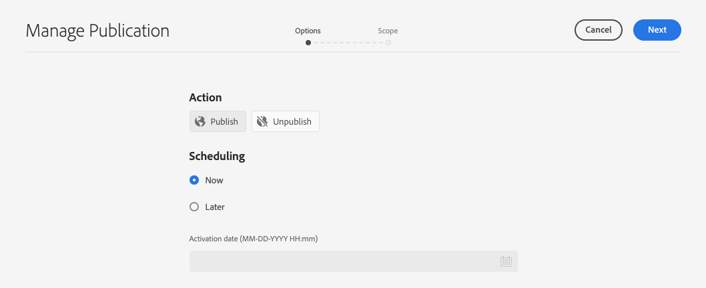

# 發佈翻譯的內容 {#publish-content}

了解如何發佈本地化內容。

## 迄今為止的故事 {#story-so-far}

在AEM無頭本地化歷程的上一個文檔中，[翻譯內容，](configure-connector.md)您學習了如何使用AEM翻譯項目來翻譯無頭內容。 您現在應該：

* 了解翻譯專案是什麼。
* 能夠建立新的翻譯專案。
* 使用翻譯專案來翻譯無頭內容。

現在您的初始翻譯已完成，本文會引導您完成發佈該內容的下一步，以及如何隨著基礎語言根內容變更更新翻譯。

## 目標 {#objective}

本檔案可協助您了解如何在AEM中發佈無頭式內容，以及如何建立持續的工作流程，讓翻譯隨時更新。 閱讀本檔案後，您應：

* 了解AEM的作者發佈模型。
* 了解如何發佈翻譯的內容。
* 能夠針對翻譯的內容實作持續更新模型。

## AEM作者發佈模型 {#author-publish}

在發佈內容之前，最好了解AEM作者發佈模型。 用最簡單的詞來說，AEM會將系統的使用者分成兩組。

1. 建立和管理內容及系統的使用者
1. 從系統中取用內容的使用者。

AEM因此物理上分為兩個例項。

1. **author**&#x200B;例項是內容作者和管理員共同建立和管理內容的系統。
1. **publish**&#x200B;例項是將內容傳遞給消費者的系統。

內容在製作例項上建立後，必須轉移至發佈例項，才可供使用。 從作者轉移至發佈的程式稱為&#x200B;**publication**。

## 發佈翻譯的內容 {#publishing}

一旦您對翻譯內容的狀態感到滿意，就可以發佈內容，讓無頭式服務可以使用。 最簡單的方法是導覽至專案資產資料夾。

```text
/content/dam/<your-project>/
```

在此路徑下，您擁有每個翻譯語言的子資料夾，並可以選擇要發佈的。

1. 前往&#x200B;**導覽** -> **資產** -> **檔案**&#x200B;並開啟專案資料夾。
1. 您會在此處看到語言根資料夾和所有其他語言資料夾。 選取您要發佈的本地化語言或語言。
   
1. 點選或按一下&#x200B;**管理出版物**。
1. 在&#x200B;**管理出版物**&#x200B;窗口中，確保在&#x200B;**Action**&#x200B;下自動選擇&#x200B;**Publish**，並在&#x200B;**Scheduling**&#x200B;下選擇&#x200B;**Now**。 點選或按一下「**Next**」。
   
1. 在下一個&#x200B;**管理發布**&#x200B;窗口中，確認已/已選擇正確路徑。 點選或按一下「**發佈**」。
   
1. AEM會在畫面底部顯示快顯訊息，以確認發佈動作。
   

您的本地化無頭內容現已發佈！ 您的無頭式服務現在可以存取及使用它。

>[!TIP]
>
>發佈時，您可以選取多個項目（即多個語言資料夾），以便一次發佈多個本地化項目。

發佈內容時還有其他選項，例如排程超出此歷程範圍的發佈時間。 如需詳細資訊，請參閱檔案結尾的[其他資源](#additional-resources)區段。

## 更新翻譯的內容 {#updating-translations}

本地化和翻譯很少是一次性練習。 初始本地化完成後，內容作者通常會繼續新增及修改語言根目錄中的內容。 這表示您也需要更新翻譯的內容。

特定的項目要求將定義您更新翻譯的頻率，以及在執行更新之前將遵循何種決策流程。 一旦您決定更新翻譯，AEM中的程式就相當簡單。 由於初始翻譯是以翻譯專案為基礎，因此任何更新也是如此。

1. 導覽至&#x200B;**導覽** -> **資產** -> **檔案**。 請記住，AEM中的無頭內容會儲存為稱為內容片段的資產。
1. 選取專案的語言根目錄。 在此情況下，我們已選擇`/content/dam/wknd/en`。
1. 點選或按一下邊欄選取器，並顯示&#x200B;**參考**&#x200B;面板。
1. 點選或按一下「語言副本&#x200B;**」。**
1. 勾選「**語言副本**」核取方塊。
1. 展開「參考」面板底部的「更新語言副本&#x200B;**」部分。**
1. 在&#x200B;**Project**&#x200B;下拉式清單中，選擇&#x200B;**添加到現有翻譯項目**。
1. 在&#x200B;**現有翻譯專案**&#x200B;下拉式清單中，選取為初始翻譯建立的專案。
1. 點選或按一下「**開始**」。


內容會新增至現有的翻譯專案。 要查看翻譯項目，請執行以下操作：

1. 導覽至&#x200B;**導覽** -&amp; **專案**。
1. 點選或按一下您剛更新的專案。
1. 點選或按一下語言或您所更新的語言之一。

您會看到專案已新增工作卡。 在此範例中，新增了另一個西班牙文翻譯。


您會發現新資訊卡上列出的統計資料（資產數和內容片段數）不同。 這是因為AEM可識別自上次翻譯以來所變更的內容，且僅包含需要翻譯的新內容（包括重新翻譯更新的內容或首次翻譯新內容）。

從這一點開始，您[開始並管理翻譯工作，就像您對原稿所做的一樣。](translate-content.md#using-translation-project)

## 旅程的結束？ {#end-of-journey}

恭喜！ 您已完成無頭式本地化歷程！ 您現在應該：

* 概略了解何謂無頭式內容傳送。
* 了解AEM無頭功能。
* 了解AEM的本地化功能，以及這些功能與無頭內容的相關性。
* 能夠開始將您自己的無頭內容本地化。

您現在已準備好在AEM中將您自己的無頭內容當地化。 不過，AEM是功能強大的工具，有許多其他選項可供使用。 查看下一節中提供的其他資源，以進一步了解您在此歷程中看到的功能。

## 其他資源 {#additional-resources}

* [管理翻譯專案](/help/sites-cloud/administering/translation/managing-projects.md)  — 了解翻譯專案的詳細資訊和其他功能，例如人工翻譯工作流程和多語言專案。
* [製作概念](/help/sites-cloud/authoring/getting-started/concepts.md)  — 深入了解AEM的製作和發佈模型。本檔案著重於編寫頁面，而非內容片段，但理論仍適用。
* [發佈頁面](/help/sites-cloud/authoring/fundamentals/publishing-pages.md)  — 了解發佈內容時可用的其他功能。本檔案著重於編寫頁面，而非內容片段，但理論仍適用。
