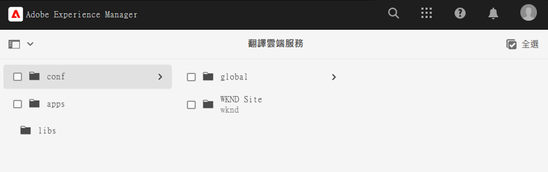
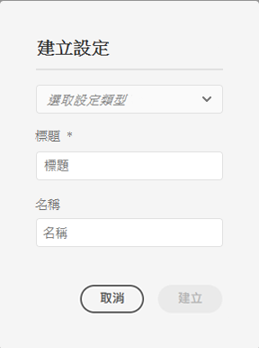
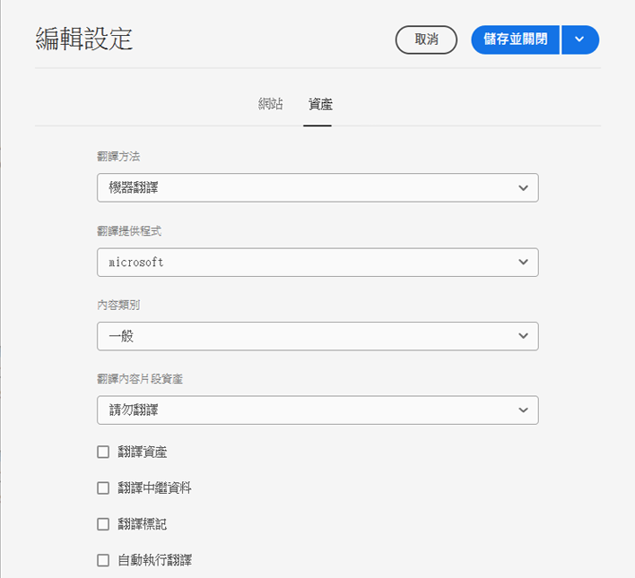
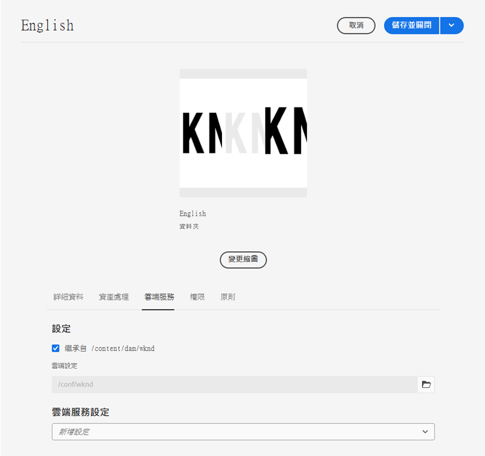

# 配置翻譯連接器 {#configure-connector}

了解如何將AEM連線至翻譯服務。

## 迄今為止的故事 {#story-so-far}

在AEM無頭翻譯歷程的上一份檔案中， [開始使用AEM無頭翻譯](learn-about.md) 您已學會如何組織無頭內容，以及AEM翻譯工具如何運作，您現在應該：

* 了解內容結構對翻譯的重要性。
* 了解AEM如何儲存無頭式內容。
* 熟悉AEM翻譯工具。

本文以這些基本知識為基礎，因此您可以進行第一個設定步驟並設定翻譯服務，以便稍後在歷程中用來翻譯內容。

## 目標 {#objective}

本檔案可協助您了解如何設定您所選翻譯服務的AEM連接器。 閱讀後，您應：

* 了解AEM中翻譯整合架構的重要參數。
* 能夠設定您與翻譯服務的連接。

## 翻譯整合框架 {#tif}

AEM翻譯整合架構(TIF)與第三方翻譯服務整合，以協調AEM內容的翻譯。 它涉及三個基本步驟。

1. 連接到翻譯服務提供商。
1. 建立翻譯整合架構設定。
1. 將設定與您的內容相關聯。

以下幾節將更詳細地說明這些步驟。

## 連接到翻譯服務提供商 {#connect-translation-provider}

第一步是選擇要使用的翻譯服務。 AEM提供許多人力和機器翻譯服務選擇。 大多數提供程式都提供要安裝的轉換程式包。 請參閱 [其他資源](#additional-resources) 區段（以選取可用選項）。

>[!NOTE]
>
>翻譯專家通常負責選擇要使用的翻譯服務，但管理員通常負責安裝所需的翻譯連接器封裝。

在此歷程中，我們使用Microsoft Translator,AEM提供試用授權且立即可用。 請參閱 [其他資源](#additional-resources) 一節，了解有關此提供程式的詳細資訊。

如果您選擇其他提供者，則管理員必須按照翻譯服務提供的說明安裝連接器封裝。

>[!NOTE]
>
>在AEM中使用現成可用的Microsoft轉譯器不需要額外的設定，且無需額外連接器設定即可正常運作。
>
>如果您選擇將Microsoft Translator連接器用於測試用途，則不需要執行下面兩個區段的步驟： [建立翻譯整合設定](#create-config) 和 [將設定與您的內容相關聯。](#associate) 不過，建議您閱讀這些參數，以便您熟悉需要設定偏好連接器時的步驟。
>
>Microsoft Translator連接器的試用許可不用於生產目的，如果您決定許可，系統管理員必須遵循 [其他資源](#additional-resources) 部分以配置該許可證。

## 建立翻譯整合設定 {#create-config}

安裝首選翻譯服務的連接器封裝後，必須為該服務建立翻譯整合框架配置。 設定包含下列資訊：

* 要使用哪個翻譯服務提供商
* 是要執行人還是機器翻譯
* 是否翻譯與內容片段相關聯的其他內容，例如標籤

要建立新的翻譯配置：

1. 在全域導覽選單中，按一下或點選 **工具** -> **Cloud Services** -> **翻譯Cloud Services**.
1. 導覽至您要在內容結構中建立設定的位置。 這通常以特定專案為基礎，或可為全球性專案。
   * 例如，在此情況下，可全域進行設定，以套用至所有內容，或僅套用至WKND專案。

   

1. 在欄位中提供下列資訊，然後按一下或點選 **建立**.
   1. 選擇 **配置類型** 中。 選擇 **翻譯整合** 從清單中。
   1. 輸入 **標題** 的URL。 此 **標題** 識別 **Cloud Services** 控制台以及頁面屬性下拉式清單中。
   1. （可選）鍵入 **名稱** 用於儲存配置的儲存庫節點。

   

1. 點選或按一下 **建立** 和 **編輯配置** 視窗中，您可以在其中設定設定屬性。

1. 請記住，內容片段會儲存為AEM中的資產。 點選或按一下 **資產** 標籤。



1. 提供下列資訊。

   1. **翻譯方法**  — 選擇 **機器翻譯** 或 **人類翻譯** 取決於您的翻譯提供者。 為了這個歷程的目的，我們假設有機器翻譯。
   1. **翻譯提供者**  — 從清單中選擇為翻譯服務安裝的連接器。
   1. **內容類別**  — 選擇最合適的類別，以便更好地定位翻譯（僅用於機器翻譯）。
   1. **轉譯內容片段資產**  — 檢查此項目以轉譯與內容片段相關聯的資產。
   1. **轉換資產**  — 檢查此項以轉換資產。
   1. **翻譯中繼資料**  — 勾選此項目以轉譯資產中繼資料。
   1. **翻譯標籤**  — 勾選此標籤可轉譯與資產相關聯的標籤。
   1. **自動執行翻譯**  — 如果希望將翻譯自動發送到翻譯服務，請檢查此屬性。

1. 點選或按一下 **儲存並關閉**.

您現在已配置翻譯服務的連接器。

## 將設定與您的內容關聯 {#associate}

AEM是一款靈活且功能強大的工具，可透過多個連接器和多個配置支援多個同時翻譯服務。 設定此類設定不在此歷程的討論範圍內。 不過，這種彈性表示您必須指定應使用哪些連接器和設定來將此設定與您的內容相關聯，以便翻譯您的內容。

若要這麼做，請導覽至內容的語言根目錄。 就我們的範例而言，這是

```text
/content/dam/<your-project>/en
```

1. 前往全域導覽，然後前往 **導覽** -> **資產** -> **檔案**.
1. 在資產主控台中，選取要設定的語言根目錄，然後按一下或點選 **屬性**.
1. 點選或按一下 **Cloud Services** 標籤。
1. 在 **Cloud Service配置** 在 **新增設定** 下拉式清單，選取您的連接器。 當您以 [前文所述。](#connect-translation-provider)
1. 在 **Cloud Service配置** 在 **新增設定** 下拉式清單，也選取您的設定。
1. 點選或按一下 **儲存並關閉**.



## 下一步 {#what-is-next}

現在您已完成無頭翻譯歷程的這一部分，您應：

* 了解AEM中翻譯整合架構的重要參數。
* 能夠設定您與翻譯服務的連接。

基於此知識，接下來檢閱此檔案，繼續您的AEM無頭翻譯歷程 [配置翻譯規則、](translation-rules.md) 您將學習如何定義要翻譯的內容。

## 其他資源 {#additional-resources}

雖然建議您透過檢閱檔案，繼續進行無頭式翻譯歷程的下一個階段 [配置翻譯規則](translation-rules.md) 以下是一些額外的選用資源，可更深入探討本檔案中提及的一些概念，但您不需要繼續進行無頭歷程。

* [配置翻譯整合框架](/help/sites-cloud/administering/translation/integration-framework.md)  — 查看選定翻譯連接器的清單，並了解如何配置翻譯整合框架以與第三方翻譯服務整合。
* [連接到Microsoft Translator](/help/sites-cloud/administering/translation/connect-ms-translator.md) - AEM提供試用的Microsoft翻譯帳戶以用於測試用途。
