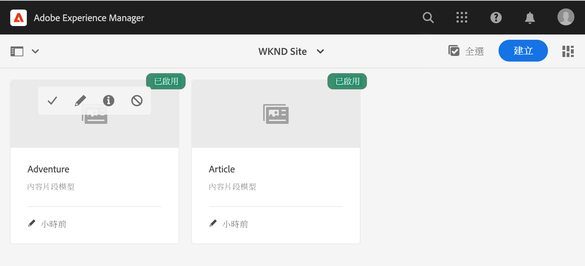
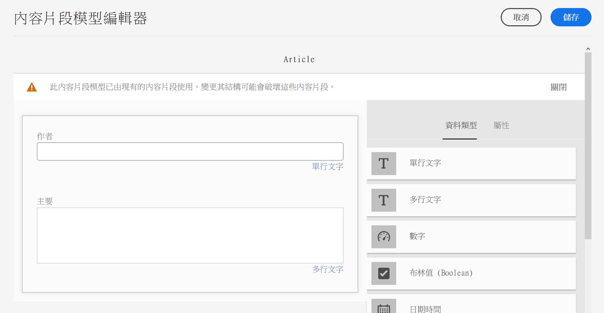
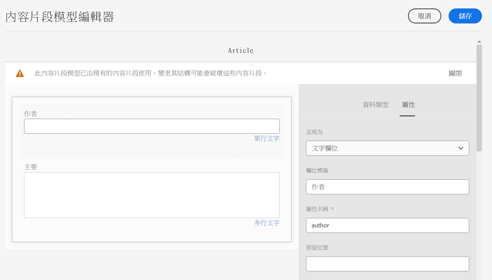

# 開始無頭AEM翻譯 {#getting-started}

瞭解如何組織無頭內容以及翻譯工AEM具的工作。

## 到目前為止的故事 {#story-so-far}

在前一篇無頭AEM翻譯旅程中， [瞭解無頭內容以及如何翻譯AEM](learn-about.md) 你學到了無頭CMS的基本理論，現在你應該：

* 瞭解無頭內容交付的基本概念。
* 熟悉如何支AEM持無頭翻譯。

本文基於這些基礎知識，以便您了AEM解如何儲存和管理無頭內容，以及如何使用翻AEM譯工具翻譯該內容。

## 目標 {#objective}

本文檔可幫助您瞭解如何開始翻譯中的無頭內容AEM。 閱讀完後，您應：

* 瞭解內容結構對翻譯的重要性。
* 瞭解如AEM何儲存無頭內容。
* 熟悉翻AEM譯工具。

## 要求和先決條件 {#requirements-prerequisites}

在開始翻譯無頭內容之前，有許多要AEM求。

### 知識 {#knowledge}

* 在CMS中翻譯內容的經驗
* 使用大型CMS基本功能的經驗
* 具備基本處理AEM工作知識
* 瞭解您使用的翻譯服務
* 對要翻譯的內容有基本的瞭解

>[!TIP]
>
>如果您不熟悉使用大型CMS，請考AEM慮查看 [基本處理](/help/sites-cloud/authoring/getting-started/basic-handling.md) 文檔，然後繼續。 「基本處理」文檔不在此過程中，因此，完成後請返回此頁。

### 工具 {#tools}

* 用於測試翻譯內容的沙盒訪問
* 連接到首選翻譯服務的憑據
* 是 `project-administrators` 分組AEM

## 結構是關鍵 {#content-structure}

無AEM論是無頭網頁還是傳統網頁，內容都受其結構驅動。 對內AEM容結構要求很少，但在項目規劃中仔細考慮內容層次結構會使翻譯變得簡單得多。

>[!TIP]
>
>在無頭項目開始時計畫翻譯。 及早與項目經理和內容架構師密切合作。
>
>國際化項目經理可能需要作為單獨的角色，其職責是定義哪些內容應該翻譯哪些內容不應該翻譯，哪些翻譯的內容可由區域或本地內容製作者修改。

## 如何AEM儲存無頭內容 {#headless-content-in-aem}

對於翻譯專家來說，深入瞭解如何管理無頭內容AEM並不重要。 但是，熟悉基本概念和術語後，在您以後使用翻譯工具時AEM會有所幫助。 最重要的是，您需要瞭解您自己的內容及其結構，以便有效地翻譯它。

### 內容模型 {#content-models}

為了使無頭內容能夠跨渠道、區域和語言一致地提供，內容必須高度結構化。 使AEM用內容模型來強制實施此結構。 將內容模型視為建立無頭內容的一種模板或模式。 因為每個項目都有自己的需求，每個項目都定義自己的內容片段模型。 AEM沒有固定要求或結構。

內容架構師在項目早期就可以定義此結構。 作為翻譯專家，您應與內容架構師密切合作，以瞭解和組織內容。

>[!NOTE]
>
>定義內容模型是內容架構師的責任。 翻譯專家只應熟悉以下步驟中概述的結構。

因為內容模型定義了內容的結構，所以您需要知道必須翻譯模型的哪些欄位。 通常，您與內容架構師一起定義此項。 要瀏覽內容模型的欄位，請執行以下步驟。

1. 導航到 **工具** -> **資產** -> **內容片段模型**。
1. 內容片段模型通常儲存在資料夾結構中。 按一下或按一下項目的資料夾。
1. 列出了模型。 點擊或按一下模型以查看詳細資訊。
   
1. 的 **內容片段模型編輯器** 的上界。
   1. 左列包含模型的欄位。 這篇專欄引起我們的興趣。
   1. 右列包含可添加到模型的欄位。 我們可以忽略此列。
      
1. 按一下或按一下模型的其中一個欄位。 AEM標籤，該欄位的詳細資訊顯示在右列中。
   

注意該欄位 **屬性名稱** 為必須翻譯的所有欄位。 在旅程的稍後部分，您需要這些資訊。 這些 **屬性名稱**&#x200B;必須通知AEM必須翻譯內容的欄位。

>[!TIP]
>
>通常，內容架構師為翻譯專家提供 **屬性名稱**&#x200B;翻譯所需的所有欄位。 這些欄位名稱是旅途後期所需的。 為了瞭解翻譯專家，提供了先前的步驟。

### 內容片段 {#content-fragments}

內容作者使用內容模型建立實際的無頭內容。 內容作者選擇將其內容基於的模型，然後建立內容片段。 內容片段是模型的實例，並表示要無頭傳送的實際內容。

如果「內容模型」是內容的模式，則「內容片段」是基於這些模式的實際內容。 內容片段表示必須翻譯的內容。

作為數字資產管理(DAM)的一AEM部分，內容片段作為資產進行管理。 這很重要，因為它們都位於路徑下 `/content/dam`。

## 推薦的內容結構 {#recommended-structure}

如先前建議的那樣，與內容架構師合作，為您自己的項目確定適當的內容結構。 但是以下是一個經過驗證、簡單、直觀的結構，是相當有效的。

為項目定義基資料夾 `/content/dam`。

```text
/content/dam/<your-project>
```

編寫內容所用的語言稱為語言根。 在我們的例子中，它是英語，它應該位於這條路徑下方。

```text
/content/dam/<your-project>/en
```

可能需要本地化的所有項目內容都應放在語言根下。

```text
/content/dam/<your-project>/en/<your-project-content>
```

翻譯應作為同級資料夾與語言根目錄一起建立，其資料夾名稱代表語言的ISO-2語言代碼。 例如，德語會有以下路徑。

```text
/content/dam/<your-project>/de
```

>[!NOTE]
>
>內容架構師通常負責建立這些語言資料夾。 如果未建立，AEM則以後將無法建立翻譯作業。

最後的結構可能如下所示。

```text
/content
    |- dam
        |- your-project
            |- en
                |- some
                |- exciting
                |- headless
                |- content
            |- de
            |- fr
            |- it
            |- ...
        |- another-project
        |- ...
```

您應注意內容的特定路徑，因為以後配置翻譯時需要它。

>[!NOTE]
>
>通常，內容架構師有責任定義內容結構，但可以與翻譯專家協作。
>
>這裡詳細介紹了完整性。

## 翻AEM譯工具 {#translation-tools}

現在，您瞭解了內容片段是什麼以及內容結構的重要性，我們可以瞭解如何翻譯此內容。 中的翻譯工AEM具功能強大，但在高級別上易於理解。

* **翻譯連接器**  — 連接器是您使用的AEM翻譯服務之間的連結。
* **翻譯規則**  — 規則定義應翻譯特定路徑下的內容。
* **翻譯項目**  — 翻譯項目收集應作為單一翻譯工作處理的內容，並跟蹤翻譯的進度，與連接器介面以傳輸要翻譯的內容並從翻譯服務接收回來。

通常，您只為實例和每個無頭項目設定一次連接器。 然後，您可以使用翻譯項目來翻譯您的內容並使其翻譯不斷更新。

## 下一步是什麼 {#what-is-next}

現在，您完成了這段無頭翻譯之旅，您應該：

* 瞭解內容結構對翻譯的重要性。
* 瞭解如AEM何儲存無頭內容。
* 熟悉翻AEM譯工具。

在此知識基礎上構建並繼AEM續您的無頭翻譯之旅，方法是下次查看文檔 [配置翻譯連接器](configure-connector.md) 您將學習如何連AEM接到翻譯服務。|

## 其他資源 {#additional-resources}

建議您通過查看文檔來進入無頭翻譯過程的下一部分 [配置翻譯連接器](configure-connector.md) 下面是一些附加的可選資源，這些資源對本文檔中提到的一些概念進行了更深入的探討，但不需要繼續進行無頭之旅。

* [基AEM本處理](/help/sites-cloud/authoring/getting-started/basic-handling.md)  — 瞭解UI的基AEM本知識，以便輕鬆導航並執行基本任務，如查找內容。
* [確定要翻譯的內容](/help/sites-cloud/administering/translation/rules.md)  — 瞭解翻譯規則如何識別需要翻譯的內容。
* [配置翻譯整合框架](/help/sites-cloud/administering/translation/integration-framework.md)  — 瞭解如何配置翻譯整合框架以與第三方翻譯服務整合。
* [管理翻譯項目](/help/sites-cloud/administering/translation/managing-projects.md)  — 瞭解如何在中建立和管理機器和人類翻譯項AEM目。
