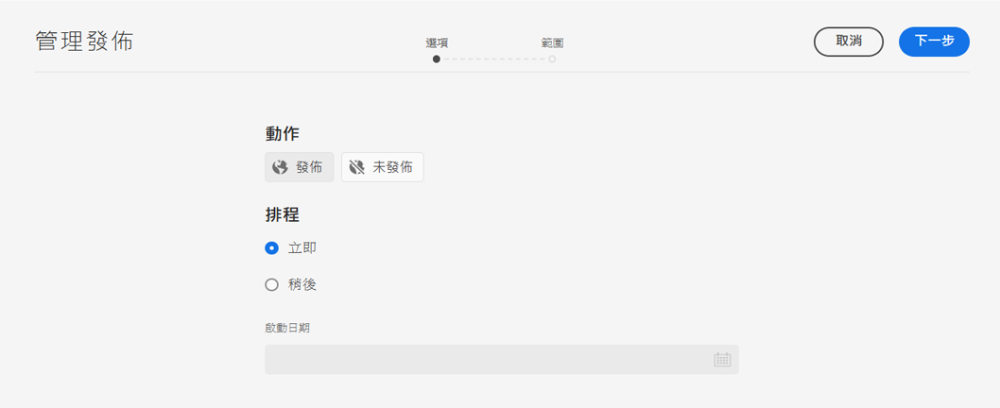
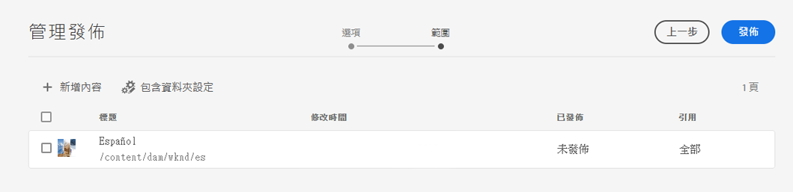
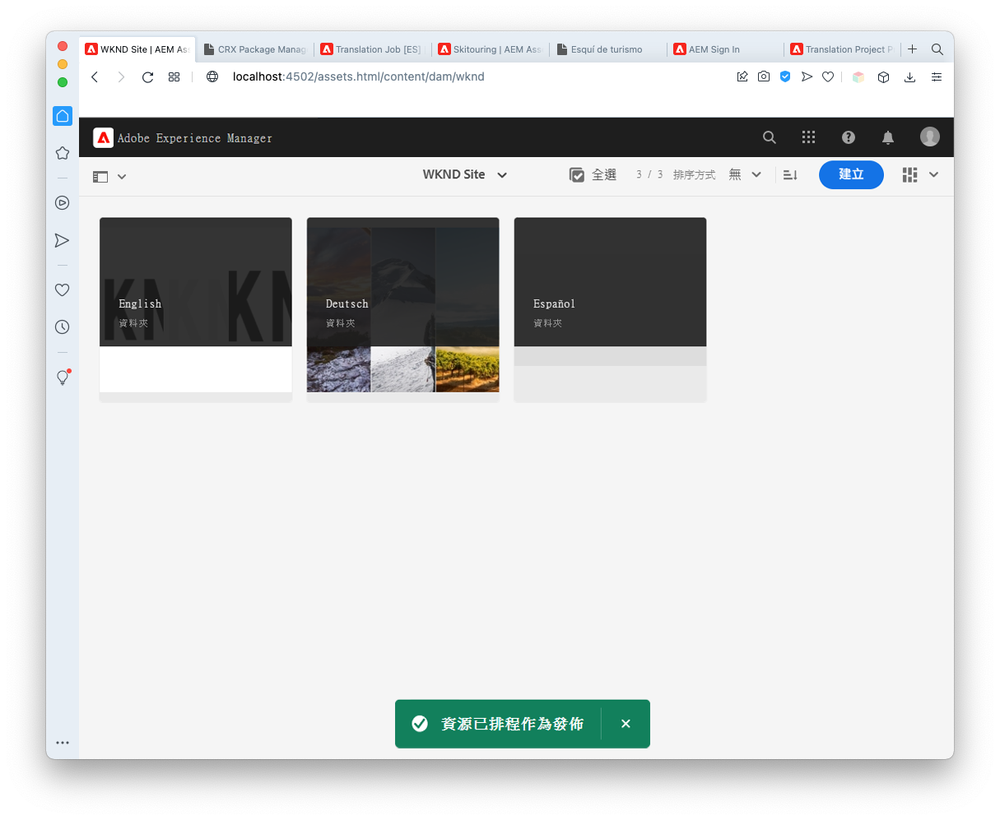
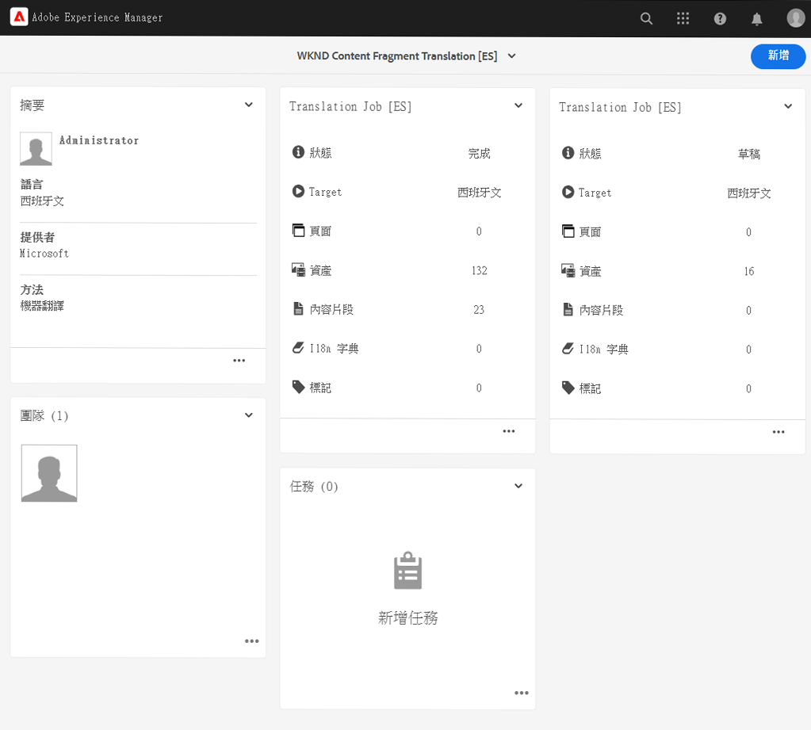
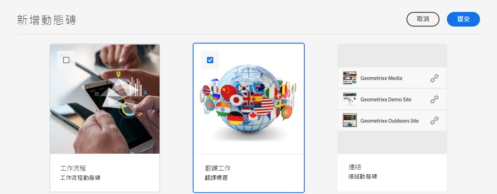
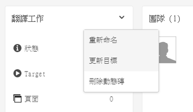
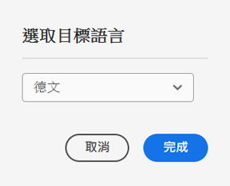

# 發佈翻譯的內容 {#publish-content}

了解如何發佈翻譯內容，並隨著內容更新更新翻譯。

## 迄今為止的故事 {#story-so-far}

在AEM無頭翻譯歷程的上一份檔案中， [翻譯內容、](configure-connector.md) 您已學習如何使用AEM翻譯專案來翻譯無頭內容。 您現在應該：

* 了解翻譯專案是什麼。
* 能夠建立新的翻譯專案。
* 使用翻譯專案來翻譯無頭內容。

現在您的初始翻譯已完成，本文會引導您完成發佈該內容的下一步，以及如何更新翻譯，以作為語言根目錄中的基礎內容。

## 目標 {#objective}

本檔案可協助您了解如何在AEM中發佈無頭式內容，以及如何建立持續的工作流程，讓翻譯隨時更新。 閱讀本檔案後，您應：

* 了解AEM的作者發佈模型。
* 了解如何發佈翻譯的內容。
* 能夠針對翻譯的內容實作持續更新模型。

## AEM作者發佈模型 {#author-publish}

在發佈內容之前，最好了解AEM作者發佈模型。 以簡化的術語來說，AEM會將系統的使用者分為兩組。

1. 建立和管理內容及系統的使用者
1. 從系統中取用內容的使用者

AEM因此物理上分為兩個例項。

1. 此 **作者** 例項是內容作者和管理員共同建立及管理內容的系統。
1. 此 **發佈** 例項是將內容傳遞給消費者的系統。

內容在製作例項上建立後，必須轉移至發佈例項，才可供使用。 系統會呼叫從作者移轉至發佈的程式 **出版物**.

## 發佈翻譯的內容 {#publishing}

一旦您對翻譯內容的狀態感到滿意，就必須發佈該內容，讓無頭式服務能夠使用它。 此任務通常不是翻譯專家的責任，而是記錄在此以說明完整的工作流。

>[!NOTE]
>
>通常當翻譯完成時，翻譯專家會通知內容擁有者翻譯已準備好發佈。 內容擁有者接著會發佈內容。
>
>為完整性，提供下列步驟。

發佈翻譯的最簡單方式是導覽至專案資產資料夾。

```text
/content/dam/<your-project>/
```

在此路徑下，您擁有每個翻譯語言的子資料夾，並可以選擇要發佈的。

1. 前往 **導覽** -> **資產** -> **檔案** 並開啟專案資料夾。
1. 在這裡，您會看到語言根資料夾和所有其他語言資料夾。 選取您要發佈的本地化語言或語言。
   
1. 點選或按一下 **管理出版物**.
1. 在 **管理出版物** 窗口，確保 **發佈** 在下自動選取 **動作** 還有 **現在** 已選取 **排程**. 點選或按一下 **下一個**.
   
1. 在下一個 **管理出版物** ，確認已選取正確的路徑。 點選或按一下 **發佈**.
   
1. AEM會在畫面底部顯示快顯訊息，以確認發佈動作。
   

您翻譯的無頭內容現在已發佈！ 您的無頭式服務現在可以存取及使用它。

>[!TIP]
>
>發佈時，您可以選取多個項目（即多個語言資料夾），以便一次發佈多個翻譯。

發佈內容時有其他選項，例如排程發佈時間，這些不在此歷程的範圍內。 請參閱 [其他資源](#additional-resources) 文檔末尾的「 」部分，以了解詳細資訊。

## 更新翻譯的內容 {#updating-translations}

翻譯很少是一次性的練習。 初始翻譯完成後，內容作者通常會繼續新增及修改語言根目錄中的內容。 這表示您也需要更新翻譯的內容。

特定的項目需求定義了您更新翻譯的頻率，以及在執行更新之前遵循的決策流程。 一旦您決定更新翻譯，AEM中的程式就相當簡單。 由於初始翻譯是以翻譯專案為基礎，因此任何更新也是如此。

不過，如果您選擇自動建立翻譯專案或手動建立翻譯專案，程式會稍有不同。

### 更新自動建立的翻譯專案 {#updating-automatic-project}

1. 導覽至 **導覽** -> **資產** -> **檔案**. 請記住，AEM中的無頭內容會儲存為稱為內容片段的資產。
1. 選取專案的語言根目錄。 在此案例中，我們已選取 `/content/dam/wknd/en`.
1. 點選或按一下邊欄選取器並顯示 **參考** 中。
1. 點選或按一下 **語言副本**.
1. 檢查 **語言副本** 核取方塊。
1. 展開區段 **更新語言副本** 在「參考」(references)面板的底部。
1. 在 **專案** 下拉式清單，選取 **新增至現有的翻譯專案**.
1. 在 **現有翻譯專案** 下拉式清單，選取為初始翻譯建立的專案。
1. 點選或按一下 **開始**.


內容會新增至現有的翻譯專案。 要查看翻譯項目，請執行以下操作：

1. 導覽至 **導覽** -> **專案**.
1. 點選或按一下您剛更新的專案。
1. 點選或按一下語言或您所更新的語言之一。

您會看到專案已新增工作卡。 在此範例中，新增了另一個西班牙文翻譯。



您可能會注意到新資訊卡上列出的統計資料（資產和內容片段的數量）不同。 這是因為AEM可識別自上次翻譯以來所變更的內容，且僅包含需要翻譯的內容。 這包括重新翻譯更新的內容以及首次翻譯新內容。

從這點開始，你 [開始並管理您的翻譯工作，就像您原稿一樣。](translate-content.md#using-translation-project)

### 更新手動建立的翻譯專案 {#updating-manual-project}

若要更新翻譯，您可以新增工作至現有專案，負責轉譯更新的內容。

1. 導覽至 **導覽** -> **專案**.
1. 點選或按一下您需要更新的專案。
1. 點選或按一下 **新增** 按鈕。
1. 在 **添加磁貼** 視窗，點選或按一下 **翻譯工作** 然後 **提交**.

   

1. 在新翻譯工作的卡片上，點選或按一下卡片頂端的>形按鈕，然後選取 **更新Target** 以定義新作業的目標語言。

   

1. 在 **選擇目標語言** 對話方塊，使用下拉式清單選取語言，然後點選或按一下 **完成**.

   

1. 設定新翻譯工作的目標語言後，點選或按一下工作卡底部的刪節號按鈕，查看工作的詳細資訊。
1. 首次建立作業時為空。 點選或按一下 **新增** 按鈕和使用路徑瀏覽器 [如同您在最初建立翻譯專案時所做的。](translate-content.md##manually-creating)

>[!TIP]
>
>路徑瀏覽器的強大篩選器對於只尋找已更新內容可能同樣有用。
>
>您可以在 [其他資源一節。](#additional-resources)

從這點開始，你 [開始並管理您的翻譯工作，就像您原稿一樣。](translate-content.md#using-translation-project)

## 旅程的結束？ {#end-of-journey}

恭喜！ 您已完成無頭翻譯歷程！ 您現在應該：

* 概略了解何謂無頭式內容傳送。
* 了解AEM無頭功能。
* 了解AEM翻譯功能，以及這些功能與無頭內容的相關性。
* 能夠開始翻譯您自己的無頭內容。

您現在可以在AEM中翻譯自己的無頭內容。 不過，AEM是功能強大的工具，有許多其他選項可供使用。 查看 [「其他資源」部分](#additional-resources) 以進一步了解您在此歷程中看到的功能。

## 其他資源 {#additional-resources}

* [管理翻譯專案](/help/sites-cloud/administering/translation/managing-projects.md)  — 了解翻譯專案的詳細資訊和其他功能，例如人工翻譯工作流程和多語言專案。
* [製作概念](/help/sites-cloud/authoring/getting-started/concepts.md)  — 深入了解AEM的製作和發佈模型。 本檔案著重於編寫頁面，而非內容片段，但理論仍適用。
* [發佈頁面](/help/sites-cloud/authoring/fundamentals/publishing-pages.md)  — 了解發佈內容時可用的其他功能。 本檔案著重於編寫頁面，而非內容片段，但理論仍適用。
* [製作環境和工具](/help/sites-cloud/authoring/fundamentals/environment-tools.md##path-selection) - AEM提供多種組織及編輯內容的機制，包括強大的路徑瀏覽器。
