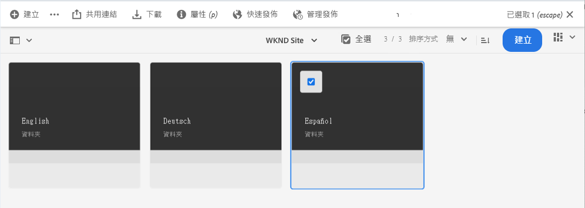
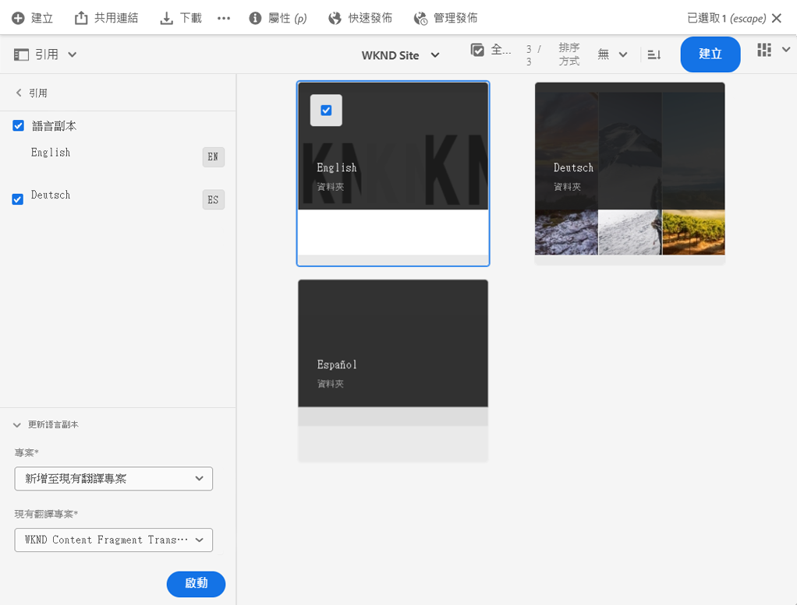

# 發佈翻譯的 Headless 內容 {#publish-content}

了解如何發佈翻譯的內容，並在內容更新時更新翻譯。

## 目前進度 {#story-so-far}

在 AEM Headless 歷程的上一份文件「[翻譯內容](configure-connector.md)」中，您已了解如何使用 AEM 翻譯專案來翻譯您的 Headless 內容。您現在應該：

* 了解什麼是翻譯專案。
* 能夠建立新的翻譯專案。
* 使用翻譯專案來翻譯您的 Headless 內容。

現在您的初始翻譯已完成，本文章將帶您完成發佈該內容的下一步，以及如何在語言根中的基礎內容變更時更新您的翻譯。

## 目標 {#objective}

本文件可協助您了解如何在 AEM 中發佈 Headless 內容，以及如何建立持續的工作流程以使您的翻譯保持最新。閱讀本文件後，您應該：

* 了解 AEM 的製作-發佈模型。
* 了解如何發佈翻譯的內容。
* 能夠為翻譯的內容實作持續更新模型。

## AEM 的製作-發佈模型 {#author-publish}

在發佈內容之前，最好了解 AEM 的製作-發佈模型。簡而言之，AEM 將系統使用者分成兩個群組。

1. 建立和管理內容和系統的人
1. 從系統取用內容的人

因此，AEM 實際上分成兩個執行個體。

1. **作者**&#x200B;執行個體是讓內容作者和管理員在其中建立和管理內容的系統。
1. **發佈**&#x200B;執行個體是將內容傳遞給取用者的系統。

在製作執行個體上建立內容後，必須將其傳輸到發佈執行個體才能供取用。從製作傳輸到發佈的流程稱之為&#x200B;**出版**。

## 發佈您的翻譯內容 {#publishing}

一旦您對翻譯內容的狀態感到滿意，就必須發佈內容，以便 Headless 服務可以取用。此工作通常不是翻譯專家負責，但在此說明的用意是要完整介紹工作流程。

>[!NOTE]
>
>通常，翻譯完成後，翻譯專家會通知內容所有者翻譯內容已準備好發佈。內容所有者接著會發佈。
>
>為了完整起見，提供了以下步驟。

最簡單的發佈翻譯方法是導覽到專案資產資料夾。

```text
/content/dam/<your-project>/
```

在此路徑下有每個翻譯語言的子資料夾，並且可以選擇要發佈的語言。

1. 前往「**導覽**」>「**資產**」>「**檔案**」並開啟專案資料夾。
1. 在這裡您可以看到語言根資料夾和所有其他語言資料夾。選擇本地化的語言或想要發佈的語言。
   
1. 選取「**管理出版物**」。
1. 在「**管理出版物**」視窗中，確保自動選取「**發佈**」(在「**動作**」之下)，而且已選取「**現在**」(在「**排程**」之下)。選取&#x200B;**「下一步」**。
   
1. 在下一個 **管理發佈**&#x200B;視窗中，確認正確的路徑已選取。選取「**發佈**」。
   
1. AEM 透過畫面底部的快顯訊息確認發佈動作。
   

您翻譯的 Headless 內容現已發佈！現在您的 Headless 服務可以存取和使用。

>[!TIP]
>
>您可以在發佈時選取多個項目 (即多個語言資料夾)，以便一次發佈多個翻譯。

發佈內容時還有其他選項可用，例如排程發佈時間，這不在本歷程的討論範圍內。如需更多資訊息，請參閱文件結尾處的[其他資源](#additional-resources)區段。

## 更新您的翻譯內容 {#updating-translations}

翻譯很少是一次性的工作。通常，在初始翻譯完成後，內容作者會繼續在語言根中新增和修改內容。這表示您也需要更新翻譯內容。

特定專案要求定義了需要多久更新一次翻譯以及執行更新之前要遵循的決策流程。一旦您決定更新翻譯，AEM 中的流程就非常簡單。由於初始翻譯是根據翻譯專案，因此任何更新也是如此。

但是，如同以往，根據您是選擇自動或手動建立翻譯專案，流程會略有不同。

### 更新自動建立的翻譯專案 {#updating-automatic-project}

1. 導覽至「**導覽**」>「**資產**」>「**檔案**」。請記住，AEM 中的 Headless 內容儲存成資產 (稱為內容片段)。
1. 選取專案的語言根。在此情況下，我們已選取 `/content/dam/wknd/en`。
1. 選取邊欄選擇器並顯示「**參考**」面板。
1. 選取「**語言副本**」。
1. 勾選&#x200B;**語言副本**&#x200B;核取方塊。
1. 展開參考面板底部的&#x200B;**更新語言副本**&#x200B;區段。
1. 在「**專案**」下拉式清單中，選取「**新增至現有翻譯專案**」。
1. 在「**現有翻譯專案**」下拉式清單中，選取為初始翻譯建立的專案。
1. 選取「**開始**」。



內容已新增至現有翻譯專案中。若要檢視翻譯專案：

1. 導覽至「**導覽**」>「**專案**」。
1. 選取您剛剛更新的專案。
1. 選取語言或其中一個您更新的語言。

您會看到新的工作卡已新增到專案中。在此範例中，新增了另一個西班牙語翻譯。


您可能會注意到新卡片上列出的統計資料 (資產和內容片段數量) 有所不同。這是因為 AEM 會識別自上次翻譯以來發生的變更，並且僅包括必須翻譯的內容。這包括更新內容的重新翻譯以及新內容的首次翻譯。

從這時開始，您[開始和管理您的翻譯工作，就像您最初的做法一樣](translate-content.md#using-translation-project)。

### 更新手動建立的翻譯專案 {#updating-manual-project}

若要更新翻譯，您可以在負責翻譯更新內容的現有專案中加入新的工作。

1. 導覽至「**導覽**」>「**專案**」。
1. 選取您需要更新的專案。
1. 選取視窗頂端的「**新增**」按鈕。
1. 在「**新增圖磚**」視窗中，選取「**翻譯工作**」再選取「**提交**」。

   

1. 在新翻譯工作的卡片上，選取卡片頂端的 > 形按鈕，然後選取「**更新目標**」以定義新工作的目標語言。

   

1. 在「**選取目標語言**」對話框中，使用下拉式選單選取語言，然後選取「**完成**」。

   

1. 設定好新翻譯工作的目標語言後，選取工作卡片底部的省略符號按鈕可檢視工作的詳細資料。
1. 工作首次建立時是空的。點選或按一下&#x200B;**新增**&#x200B;按鈕並使用路徑瀏覽器[新增內容到工作，就像最初建立翻譯專案時的做法一樣](translate-content.md##manually-creating)。

>[!TIP]
>
>路徑瀏覽器強大的篩選器可以再次高效地只尋找已更新的內容。
>
>若要進一步了解路徑瀏覽器，請參閱[其他資源區段](#additional-resources)。

從這時開始，您[開始和管理您的翻譯工作，就像您最初的做法一樣](translate-content.md#using-translation-project)。

## 歷程結尾？ {#end-of-journey}

恭喜！您已經完成 Headless 翻譯歷程！您現在應該：

* 大致了解什麼是 Headless 內容傳遞。
* 對 AEM Headless 功能有基本的了解。
* 了解 AEM 的翻譯功能及其與 Headless 內容的關係。
* 能夠開始翻譯您自己的 Headless 內容。

您現在已準備好在 AEM 中翻譯您自己的 Headless 內容。但是，AEM 是一個強大的工具，還有許多其他選項可用。查看[其他資源區段](#additional-resources)提供的一些其他資源，以詳細了解您在此歷程中看到的功能。

## 其他資源 {#additional-resources}

* [管理翻譯專案](/help/sites-cloud/administering/translation/managing-projects.md) - 了解翻譯專案的詳細資料和其他功能，例如人工翻譯工作流程和多語言專案。
* [製作概念](/help/sites-cloud/authoring/author-publish.md) - 詳細了解 AEM 的製作和發佈模型。本文件重點放在製作頁面而不是內容片段，但該理論仍然適用。
* [發佈頁面](/help/sites-cloud/authoring/sites-console/publishing-pages.md) - 了解其他可用於發佈內容的功能。本文件重點放在製作頁面而不是內容片段，但該理論仍然適用。
* [製作環境和工具](/help/sites-cloud/authoring/path-selection.md#path-selection) - AEM 提供各種機制來組織和編輯您的內容，包括強大的路徑瀏覽器。
