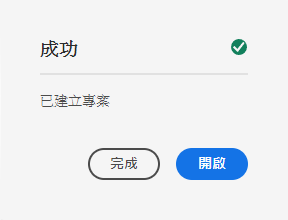

# 翻譯內容 {#translate-content}

使用翻譯連接器和規則來翻譯無頭內容。

## 到目前為止的故事 {#story-so-far}

在前一篇無頭AEM翻譯旅程中， [配置轉換規則](translation-rules.md) 您學習了如何使用AEM翻譯規則來識別翻譯內容。 您現在應該：

* 瞭解翻譯規則的作用。
* 能夠定義自己的翻譯規則。

既然已設定了連接器和翻譯規則，本文將引導您完成翻譯無頭內容的下一步。

>[!NOTE]
>
>如果跳過 [配置轉換規則](translation-rules.md) 您在as a Cloud Service的預發行渠道上，AEM因此您無需考慮本文檔中提到的翻譯規則。

## 目標 {#objective}

本文檔幫助您瞭解如何使用翻譯項AEM目以及連接器和翻譯規則來翻譯內容。 閱讀此文檔後，您應：

* 瞭解翻譯項目是什麼。
* 能夠建立新的翻譯項目。
* 使用翻譯項目來翻譯您的無頭內容。

## 建立翻譯項目 {#creating-translation-project}

翻譯項目使您能夠管理無頭內容的AEM翻譯。 一個翻譯項目將要翻譯的內容匯集到一個位置，以便獲得翻譯工作的中心視圖。

將內容添加到翻譯項目時，將為其建立翻譯作業。 作業提供命令和狀態資訊，用於管理在資源上執行的人工翻譯和機器翻譯工作流。

翻譯項目可通過兩種方式建立：

1. 選擇內容的語言根，並已AEM根據內容路徑自動建立翻譯項目。
1. 建立空項目並手動選擇要添加到翻譯項目的內容

這兩種方法是有效的方法，通常只根據執行翻譯的人物的不同：

* 翻譯項目經理(TPM)通常需要靈活地手動選擇翻譯項目的內容。
* 如果內容所有者也負責翻譯，則AEM讓基於所選內容路徑自動建立項目通常更容易。

以下各節探討了這兩種方法。

### 基於內容路徑自動建立翻譯項目 {#automatically-creating}

對於同樣負責翻譯的內容所有者，自動建立翻譯項目AEM通常更容易。 要根據AEM內容路徑自動建立翻譯項目，請執行以下操作：

1. 導航到 **導航** -> **資產** -> **檔案**。 請記住，中的無AEM頭內容儲存為稱為內容片段的資產。
1. 選擇項目的語言根。 在此情況下，我們選擇 `/content/dam/wknd/en`。
1. 點擊或按一下滑軌選擇器並顯示 **引用** 的子菜單。
1. 點擊或按一下 **語言副本**。
1. 檢查 **語言副本** 複選框。
1. 展開該部分 **更新語言副本** 的下界。
1. 在 **項目** 下拉清單，選擇 **建立翻譯項目**。
1. 為翻譯項目提供適當的標題。
1. 點擊或按一下 **開始**。


您會收到一條消息，即項目已建立。

>[!NOTE]
>
>假定已經為翻譯語言建立了必要的語言結構，作為 [定義內容結構。](getting-started.md#content-structure) 這應與內容架構師協作完成。
>
>如果未提前建立語言資料夾，您將無法建立前面步驟中所述的語言副本。

### 通過選擇內容手動建立翻譯項目 {#manually-creating}

對於翻譯項目經理，通常需要手動選擇要包括在翻譯項目中的特定內容。 要建立此類手動翻譯項目，必須首先建立一個空項目，然後選擇要添加到其中的內容。

1. 導航到 **導航** -> **項目**。
1. 點擊或按一下 **建立** -> **資料夾** 建立項目的資料夾。
   * 這是可選的，但有助於組織您的翻譯工作。
1. 在 **建立項目** 窗口，添加 **標題** ，然後按一下 **建立**。

   

1. 按一下或按一下資料夾以開啟資料夾。
1. 在新項目資料夾中，點擊或按一下 **建立** -> **項目**。
1. 項目基於模板。 點擊或按一下 **翻譯項目** 選擇模板，然後點擊或按一下 **下一個**。

   

1. 在 **基本** 的子菜單。

   

1. 在 **高級** 頁籤 **目標語言** 下拉菜單以選擇應將內容翻譯到的語言。 點擊或按一下 **建立**。

   

1. 點擊或按一下 **開啟** 的子菜單。

   

項目已建立，但不包含要翻譯的內容。 下一節詳細介紹了項目的結構以及如何添加內容。

## 使用翻譯項目 {#using-translation-project}

翻譯項目旨在在一個地方收集與翻譯工作相關的所有內容和任務，使翻譯簡單易行。

要查看翻譯項目，請執行以下操作：

1. 導航到 **導航** -> **項目**。
1. 按一下或按一下在上一節中建立的項目。


項目分為多張卡。

* **摘要**  — 此卡顯示項目的基本標題資訊，包括所有者、語言和翻譯提供商。
* **翻譯作業**  — 此卡或這些卡顯示了實際翻譯作業的概述，包括狀態、資產數等。 通常，每個語言都有一個作業，ISO-2語言代碼附加在作業名稱上。
* **團隊**  — 此卡顯示正在此翻譯項目上協作的用戶。 這趟旅程不包括這個話題。
* **任務**  — 與翻譯內容相關的其他任務，如執行項目或工作流項目。 這趟旅程不包括這個話題。

翻譯項目的使用方式取決於其建立方式：自動或手AEM動。

### 使用自動建立的翻譯項目 {#using-automatic-project}

自動建立翻譯項目時，AEM根據先前定義的翻譯規則評估所選路徑下的無頭內容。 根據這一評估，它提取需要翻譯的內容，並將其轉換為新的翻譯項目。

要查看此項目中包含的無頭內容的詳細資訊：

1. 點擊或按一下位於 **翻譯作業** 卡。
1. 的 **翻譯作業** 窗口將列出作業中的所有項。
   
1. 點擊或按一下一行可查看該行的詳細資訊，同時要記住一行可能表示要翻譯的多個內容項。
1. 點擊或按一下行項的選中複選框可查看其他選項，如從作業中刪除它或在「內容片段」或「資產」控制台中查看它的選項。


通常，翻譯作業的內容在 **草稿** 表示的狀態 **州** 列 **翻譯作業** 的子菜單。

要啟動翻譯作業，請返回到翻譯項目概述，點擊或按一下位於 **翻譯作業** 卡和選擇 **開始**。


現AEM在與翻譯配置和連接器通信，以將內容發送到翻譯服務。 通過返回到 **翻譯作業** 窗口和查看 **州** 的子菜單。


機器翻譯自動返回，狀態為 **已批准**。 人文翻譯可以更多互動，但不在這趟旅程的範疇。

### 使用手動建立的翻譯項目 {#using-manual-project}

手動建立翻譯項目時，AEM會建立必要的作業，但不會自動選擇要包括的任何內容。 這使翻譯項目經理能夠靈活地選擇要翻譯的內容。

要向翻譯作業添加內容：

1. 點擊或按一下其中一個選項底部的省略號按鈕 **翻譯作業** 卡片。
1. 查看作業不包含任何內容。 點擊或按一下 **添加** 按鈕 **資產/頁** 從下拉清單中。

   

1. 將開啟一個路徑瀏覽器，允許您特別選擇要添加的內容。 找到您的內容並點擊或按一下選擇。

   

1. 點擊或按一下 **選擇** 將所選內容添加到作業。
1. 在 **翻譯** 對話框，指定您希望 **建立語言副本**。

   

1. 內容現在包括在作業中。

   

1. 點擊或按一下行項的選中複選框可查看其他選項，如從作業中刪除它或在「內容片段」或「資產」控制台中查看它的選項。


1. 重複這些步驟，以在作業中包含所有必需內容。

>[!TIP]
>
>路徑瀏覽器是一個功能強大的工具，允許您搜索、篩選和導航內容。 點擊或按一下 **僅內容/篩選器** 按鈕切換側面板並顯示高級濾鏡，如 **修改日期** 或 **翻譯狀態**。
>
>您可以在 [其他資源部分。](#additional-resources)

您可以使用前面的步驟將必要的內容添加到項目的所有語言（作業）中。 選擇所有內容後，即可開始翻譯。

通常，翻譯作業的內容在 **草稿** 表示的狀態 **州** 列 **翻譯作業** 的子菜單。

要啟動翻譯作業，請返回到翻譯項目概述，點擊或按一下位於 **翻譯作業** 卡和選擇 **開始**。


現AEM在與翻譯配置和連接器通信，以將內容發送到翻譯服務。 通過返回到 **翻譯作業** 窗口和查看 **州** 的子菜單。


機器翻譯自動返回，狀態為 **已批准**。 人文翻譯可以更多互動，但不在這趟旅程的範疇。

## 查看已翻譯的內容 {#reviewing}

[如前所見，](#using-translation-project) 電腦翻譯的內AEM容返回 **已批准** 因為假設機器翻譯被使用，所以不需要人為干預。 但是，當然仍然可以審查翻譯的內容。

只需按一下或按一下複選框即可轉到已完成的翻譯作業並選擇行項目。 表徵圖 **在內容片段中顯示** 工具欄中。


點擊或按一下該表徵圖，在其編輯器控制台中開啟已翻譯的內容片段，以查看已翻譯內容的詳細資訊。


如果您擁有適當的權限，您可以根據需要進一步修改內容片段，但編輯內容片段超出了此過程的範圍。 請參閱 [其他資源](#additional-resources) 的子菜單。

項目的目的是在一個地方收集與翻譯相關的所有資源，以便於訪問和清晰的概述。 但是，正如您通過查看已翻譯項目的詳細資訊所看到的，翻譯本身會流回翻譯語言的資產資料夾中。 在本示例中，資料夾

```text
/content/dam/wknd/es
```

如果您通過 **導航** -> **檔案** -> **資產**，您可以看到已翻譯的內容。


AEM翻譯框架從翻譯連接器接收翻譯，然後基於語言根並使用連接器提供的翻譯自動建立內容結構。

瞭解此內容未發佈，因此您的無頭服務不可用，這一點非常重要。 我們將瞭解此作者發佈結構，並瞭解如何在翻譯過程的下一步中發佈我們的翻譯內容。

## 人類翻譯 {#human-translation}

如果您的翻譯服務提供人工翻譯，則審閱流程將提供更多選項。 例如，翻譯將返回具有狀態的項目 **草稿** 必須手動審核和批准或拒絕。

人文翻譯超出了本地化的範圍。 請參閱 [其他資源](#additional-resources) 的子菜單。 但是，除了附加的批准選項之外，人工翻譯的工作流與此行程中描述的機器翻譯相同。

## 下一步是什麼 {#what-is-next}

現在，您完成了這段無頭翻譯之旅，您應該：

* 瞭解翻譯項目是什麼。
* 能夠建立新的翻譯項目。
* 使用翻譯項目來翻譯您的無頭內容。

在此知識基礎上構建並繼AEM續您的無頭翻譯之旅，方法是下次查看文檔 [發佈已翻譯的內容](publish-content.md) 您將在何處學習如何發佈已翻譯的內容以及如何隨著語言根內容的更改更新這些翻譯。

## 其他資源 {#additional-resources}

建議您通過查看文檔來進入無頭翻譯過程的下一部分 [發佈已翻譯的內容，](publish-content.md) 下面是一些附加的可選資源，這些資源對本文檔中提到的一些概念進行了更深入的探討，但不需要繼續進行無頭之旅。

* [管理翻譯項目](/help/sites-cloud/administering/translation/managing-projects.md)  — 瞭解翻譯項目和其他功能的詳細資訊，如人工翻譯工作流和多語言項目。
* [創作環境和工具](/help/sites-cloud/authoring/fundamentals/environment-tools.md##path-selection)  — 提供AEM各種組織和編輯內容的機制，包括強健的路徑瀏覽器。
