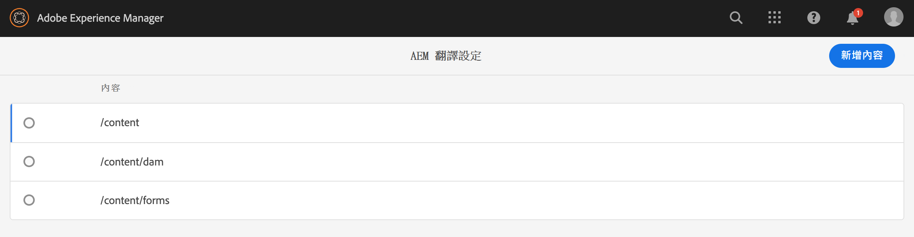
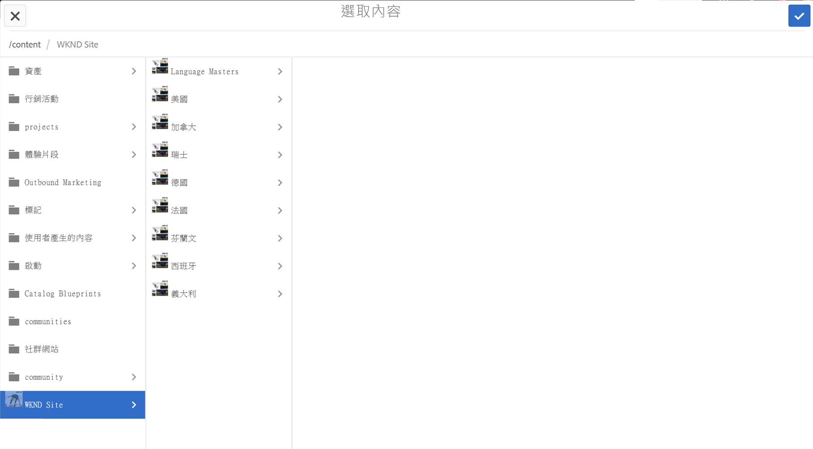
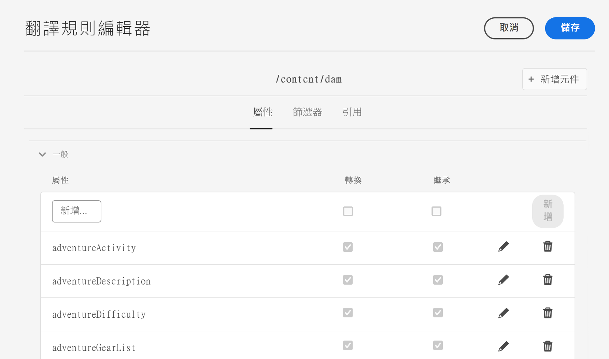
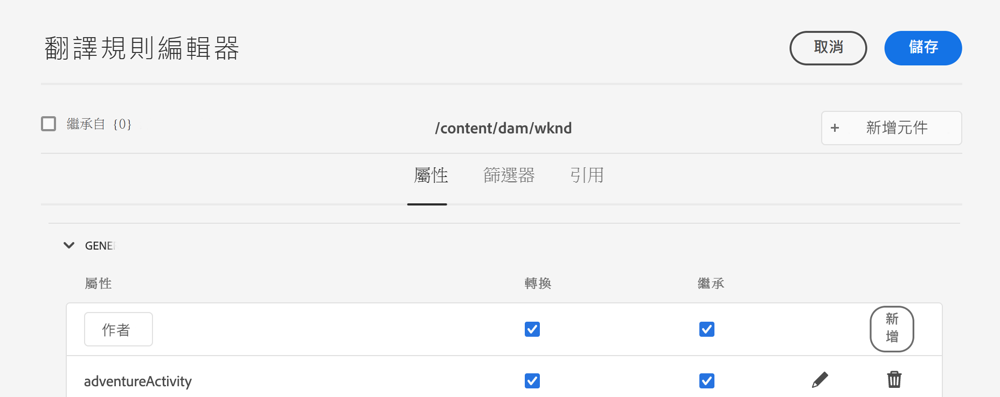

# 配置轉換規則 {#configure-translation-rules}

瞭解如何定義翻譯規則以標識翻譯內容。

## 到目前為止的故事 {#story-so-far}

在前一篇無頭AEM翻譯旅程中， [配置翻譯連接器](configure-connector.md) 您已學會了如何安裝和配置翻譯連接器，現在應：

* 瞭解中翻譯整合框架的重要參AEM數。
* 能夠設定自己與翻譯服務的連接。

現在已設定連接器，本文將引導您完成確定需要翻譯的內容的下一步。

## 目標 {#objective}

本文檔幫助您瞭解如何使用AEM翻譯規則來識別翻譯內容。 閱讀此文檔後，您應：

* 瞭解翻譯規則的作用。
* 能夠定義自己的翻譯規則。

## 翻譯規則 {#translation-rules}

「內容片段」(Content Fragments)表示您的無頭內容，它可包含許多按結構化欄位組織的資訊。 根據您的項目需要，可能不是必須翻譯內容片段中的所有欄位。

翻譯規則可標識包含在翻譯項目中或排除在翻譯項目中的內容。 翻譯內容時，AEM會根據這些規則提取或收集內容。 這樣，只有必須翻譯的內容才會發送到翻譯服務。

翻譯規則包括以下資訊：

* 應用規則的內容的路徑
   * 該規則也適用於內容的子體
* 包含要翻譯的內容的屬性的名稱
   * 該屬性可以特定於特定資源類型或所有資源類型

因為定義內容片段結構的內容片段模型是您自己的項目所獨有的，所以必須設定翻譯規則AEM，以便瞭解要翻譯的內容模型的哪些元素。

>[!TIP]
>
>通常，內容架構師為翻譯專家提供 **屬性名稱**&#x200B;翻譯所需的所有欄位。 配置轉換規則需要這些名稱。 作為翻譯專家，你 [能找到 **屬性名稱**&#x200B;你自己](getting-started.md#content-modlels) 正如此次旅程中所述。

## 建立翻譯規則 {#creating-rules}

可以建立多個規則來支援複雜的翻譯要求。 例如，您可能正在處理的一個項目要求轉換模型的所有欄位，但在另一個項目上，只有說明欄位必須在標題保留未轉換時進行轉換。

翻譯規則旨在處理此類情況。 但在本示例中，我們將重點介紹簡單的單一配置來說明如何建立規則。

有 **翻譯配置** 控制台可用於配置轉換規則。 要訪問它：

1. 導航到 **工具** -> **常規**。
1. 點擊或按一下 **翻譯配置**。

在 **翻譯配置** UI，有許多選項可用於翻譯規則。 這裡我們重點介紹基本無頭本地化配置所需的最必要和最典型的步驟。

1. 點擊或按一下 **添加上下文**，允許您添加路徑。 這是受規則影響的內容的路徑。
   
1. 使用路徑瀏覽器選擇所需路徑，點擊或按一下 **確認** 按鈕。 請記住，包含無頭內容的內容片段通常位於 `/content/dam/<your-project>`。
   
1. 保AEM存配置。
1. 必須選擇剛建立的上下文，然後點擊或按一下 **編輯**。 開啟 **翻譯規則編輯器** 來配置屬性。
   
1. 預設情況下，所有配置都從父路徑繼承，在本例中 `/content/dam`。 取消選中選項 **繼承自`/content/dam`** 以便向配置中添加其他欄位。
1. 一旦未選中，在 **常規** 添加您的內容片段模型的屬性名 [先前已標識為要翻譯的欄位。](getting-started.md#content-models)
   1. 在 **新建屬性** 的子菜單。
   1. 選項 **翻譯** 和 **繼承** 的子菜單。
   1. 點擊或按一下 **添加**。
   1. 對必須翻譯的所有欄位重複這些步驟。
   1. 點擊或按一下 **保存**。
      

您現在已配置翻譯規則。

## 高級使用 {#advanced-usage}

有許多附加屬性可配置為翻譯規則的一部分。 此外，您還可以將規則手動指定為XML，這樣可以實現更具體的靈活性。

通常不需要這些功能即可開始本地化您的無頭內容，但您可以在 [其他資源](#additional-resources) 的上界。

## 下一步是什麼 {#what-is-next}

現在，您完成了這段無頭翻譯之旅，您應該：

* 瞭解翻譯規則的作用。
* 能夠定義自己的翻譯規則。

在此知識基礎上構建並繼AEM續您的無頭翻譯之旅，方法是下次查看文檔 [翻譯內容](translate-content.md) 在這裡，您將學習連接器和規則如何協同工作來翻譯無頭內容。

## 其他資源 {#additional-resources}

建議您通過查看文檔來進入無頭翻譯過程的下一部分 [翻譯內容，](translate-content.md) 下面是一些附加的可選資源，這些資源對本文檔中提到的一些概念進行了更深入的探討，但不需要繼續進行無頭之旅。

* [確定要翻譯的內容](/help/sites-cloud/administering/translation/rules.md)  — 瞭解翻譯規則如何識別需要翻譯的內容。
