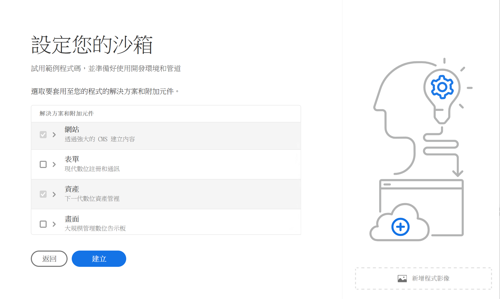

# 建立方案 {#create-program}

在[上線歷程](overview.md)的這一部分，您將了解如何使用 Cloud Manager 建立您的第一個方案。

## 目標 {#objective}

在查看了此上線過程中的上一個文件後，[ Access 雲管理器，](cloud-manager.md)您已確保您擁有對 Cloud Manager 的適當存取權限。現在您可以建立您的第一個方案。

閱讀本文件後，您可以：

* 了解並解釋什麼是方案。
* 了解生產方案和沙箱方案之間的區別。
* 建立您自己的方案。

## 了解什麼是方案？ {#programs}

方案是 Cloud Manager 中最高級別的組織。根據您的 Adobe 授權，方案允許您組織您的解決方案並授予特定團隊成員對這些方案的存取權限。

Cloud Manager 方案代表一組 Cloud Manager 環境。這些方案支援業務倡議的邏輯集，通常對應於許可的服務水平協議 (SLA)。例如，一個方案可能代表 Adobe Experience Manager (AEM) 資源以支援組織的全球公共網站，而另一個方案代表內部的中央 DAM。

如果您回想一下理論上的 WKND Travel and Adventure Enterprises 的範例，他們是一家專注於旅遊相關媒體的租用戶，他們可能有兩個方案：一個用於 WKND 雜誌部門的 AEM Sites 方案，和一個用於 WKND 媒體部門的 AEM Assets 方案。由於他們自己的分工要求，不同的團隊成員將可以存取不同的方案。

有兩種不同類型的方案：

* **生產方案**&#x200B;是為啟用網站的即時流量而建立的。這是您的「真實」環境。
* **沙箱方案**&#x200B;通常建立的目的是提供培訓、執行示範、培訓、POC 或文件。

由於它們服務於不同的目的，不同的環境有不同的選擇。但是建立它們的過程是相似的。對於此上線歷程，您將建立一個沙箱環境。

>[!TIP]
>
>如果您必須建立生產方案，請參閱[其他資源](#additional-resources)一節，以取得詳細描述方案的文件連結。

## 建立沙箱方案 {#create-sandbox}

1. 在 [my.cloudmanager.adobe.com](https://my.cloudmanager.adobe.com/) 登入 Cloud Manager 並選取適當的組織。

1. 從 Cloud Manager 的登陸頁面，按一下畫面的右上角的&#x200B;**新增方案**。

   

1. 從建立方案精靈中，選取「**設定沙箱**」，接著提供方案名稱，然後選取「**繼續**」。

   

1. 在&#x200B;**設定沙箱**&#x200B;對話框中，您可以選擇要在沙箱方案中想要啟用的解決方案。沙箱程序中一律包含並自動選取 **Sites** 和 **Assets** 解決方案。這對於您的上線範例來說已經足夠了。按一下&#x200B;**建立**。

   

隨著設定過程的進行，您會在登陸頁面上看到一個帶有狀態指示器的新沙箱方案卡。

方案完成後，您組織被指派到&#x200B;**開發人員**&#x200B;產品設定檔的成員，便可以登入 Cloud Manager 並管理 Cloud Manager git 存放庫。

## 下一步 {#whats-next}

現在您的第一個程序已建立，您可以為其建立環境。透過下一次查看文件來繼續您的上線之旅[建立環境。](create-environments.md)

## 其他資源 {#additional-resources}

如果您想要此上線歷程以外的內容，以下是您可選擇的其他資源。

* [程序和程序類型](/help/implementing/cloud-manager/getting-access-to-aem-in-cloud/program-types.md) - 了解 Cloud Manager 的階層以及不同類型的程序如何適應其結構以及它們之間的差異。
* [建立沙箱程序](/help/implementing/cloud-manager/getting-access-to-aem-in-cloud/creating-sandbox-programs.md) - 了解如何使用 Cloud Manager 建立您自己的沙箱程序，用於培訓、演示、POC 或其他非生產目的。
* [建立生產程序](/help/implementing/cloud-manager/getting-access-to-aem-in-cloud/creating-production-programs.md)- 了解如何使用 Cloud Manager 建立您自己的生產程序來託管實時流量。
* [使用 Adobe Cloud Manager - 程序](https://experienceleague.adobe.com/docs/experience-manager-learn/cloud-service/cloud-manager/programs.html) - Cloud Manager 程序代表支援邏輯業務程序集合的 AEM 環境集合，通常會對應到已購買的服務等級協定 (SLA)。
* [AEM as a Cloud Service 團隊和產品設定檔](/help/onboarding/aem-cs-team-product-profiles.md) - 了解 AEM as a Cloud Service 團隊和產品設定檔如何能夠授與和限制您的授權 Adobe 解決方案的存取權。
