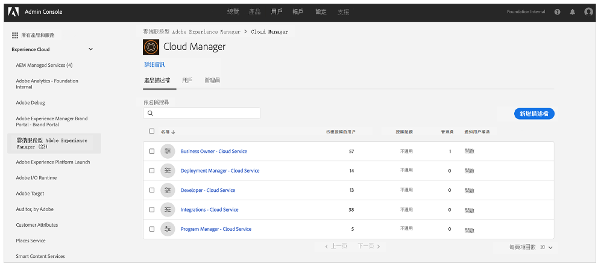
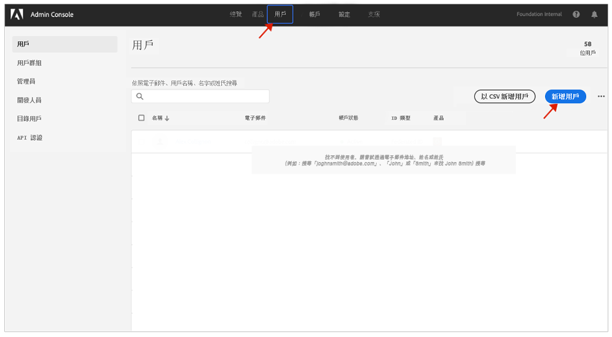

# 通知設定檔 {#notification-profiles}

了解如何在 Admin Console 中建立使用者設定檔來管理重要電子郵件通知的接收。

## 概觀 {#overview}

Adobe 有時需要就 AEM as a Cloud Service 環境聯絡使用者。除了產品內通知，Adobe 偶爾也會使用電子郵件進行通知。此類電子郵件通知有兩種類型：

* **事件通知** - 這些通知是在事件期間或 Adobe 發現您的 AEM as a Cloud Service 環境存在潛在可用性問題時傳送的。
* **主動通知** - 當 Adobe 支援團隊成員想要提供有關可使您的 AEM as a Cloud Service 環境受益的潛在最佳化或建議的指引時，將傳送這些通知。

為了讓正確的使用者收到這些通知，您需要按照本文件中所述來設定和指派使用者設定檔。

## 必備條件 {#prerequisites}

由於使用者設定檔是在 Admin Console 中建立和維護的，因此在針對通知建立設定檔之前，您必須：

* 具有新增和設定成員資格的權限。
* 擁有有效的 Adobe Admin Console 設定檔。

## 建立新的 Cloud Manager 產品設定檔 {#create-profiles}

要正確設定接收通知，您需要建立兩個使用者設定檔。這些步驟只能執行一次。

1. 請上 [`https://adminconsole.adobe.com` 登入 Admin Console。](https://adminconsole.adobe.com)

1. 確認您位於正確的組織。

1. 在「**概觀**」頁面，從「**產品和服務**」卡選取「**Adobe Experience Manager as a Cloud Service**」。

   在 。

1. 從所有執行個體清單瀏覽至 **Cloud Manager** 執行個體。

   

1. 您將看到所有已設定的 Cloud Manager 產品設定檔清單。

   

1. 按一下「**新增設定檔**」，並提供以下詳細資料：

   * **產品設定檔名稱**：`Incident Notification - Cloud Service`
   * **顯示名稱**：`Incident Notification - Cloud Service`
   * **說明**：將在事件期間或 Adobe 發現您的 AEM as a Cloud Service 環境存在潛在可用性問題時收到通知的使用者 Cloud Manager 設定檔

1. 按一下「**儲存**」。

1. 再按一次「**新增設定檔**」，並提供以下詳細資料：

   * **產品設定檔名稱**：`Proactive Notification - Cloud Service`
   * **顯示名稱**：`Proactive Notification - Cloud Service`
   * **說明**：當 Adobe 支援團隊成員想要針對 AEM as a Cloud Service 環境設定的潛在最佳化提供指引或建議動作時，將接收通知的使用者 Cloud Manager 設定檔

1. 按一下「**儲存**」。

您的兩個新通知設定檔就此建立。

>[!NOTE]
>
>Cloud Manager **產品設定檔名稱**&#x200B;必須與提供的完全一樣，這點很重要。複製並貼上提供的產品設定檔名稱以避免錯誤。任何偏差或拼寫錯誤都將導致通知無法按要求傳送。
>
>如果出現錯誤或未定義設定檔，Adobe 預設將通知指派到 **Cloud Manager 開發人員**&#x200B;或&#x200B;**部署管理員**&#x200B;設定檔的現有使用者。

## 將使用者指派到通知設定檔 {#add-users}

設定檔現已建立，您必須指派適當的使用者。您可以在建立新使用者或更新現有使用者時執行此操作。

### 將新的使用者新增至設定檔 {#new-user}

按照以下步驟新增尚未設定 Federated ID 的使用者。

1. 確定應接收事件或主動通知的使用者。

1. 如果您尚未登入，請登入 Admin Console，位於 [`https://adminconsole.adobe.com`](https://adminconsole.adobe.com)。

1. 確認您選擇了適當的組織。

1. 在「**概觀**」頁面，從「**產品和服務**」卡選取「**Adobe Experience Manager as a Cloud Service**」。

   

1. 如果您的團隊成員尚未設定 Federated ID，請從頂端導覽區域中選取「**使用者**」標籤，然後選取「**新增使用者**」。否則請跳到[將現有使用者新增至設定檔](#existing-users)一節。

   

1. 在「**新增使用者至團隊**」對話框中，輸入您要新增之使用者的電子郵件 ID，並選取 `Adobe ID` 作為「**ID 類型**」。

1. 按一下「**選取產品**」標題下方的加號按鈕，開始選擇產品。

1. 選取「**Adobe Experience Manager as a Cloud Service**」並將一個或兩個新設定檔指派給使用者。

   * **事件通知 - Cloud Service**
   * **主動通知 - Cloud Service**

1. 按一下「**儲存**」即會傳送一封歡迎電子郵件給您新增的使用者。

受邀使用者現在將收到通知。對團隊中您希望接收通知的使用者重複這些步驟。

### 將現有使用者新增至設定檔 {#existing-user}

按照以下步驟新增已經存在 Federated ID 的使用者。

1. 確定應接收事件或主動通知的使用者。

1. 如果您尚未登入，請登入 Admin Console，位於 [`https://adminconsole.adobe.com`](https://adminconsole.adobe.com)。

1. 確認您選擇了適當的組織。

1. 在「**概觀**」頁面，從「**產品和服務**」卡選取「**Adobe Experience Manager as a Cloud Service**」。

1. 在頂端導覽區域中選取「**使用者**」標籤。

1. 如果要新增到通知設定檔之團隊成員的 Federated ID 已經存在，請在清單中找出並按一下它。否則請跳到[將新的使用者新增至設定檔](#add-user)一節。

1. 在使用者詳細資料視窗的「**產品**」區段，按下省略號按鈕，然後選取「**編輯**」。

1. 在「**編輯產品**」視窗中，按一下「**選取產品**」標題下面的鉛筆按鈕，開始選擇產品。

1. 選取「**Adobe Experience Manager as a Cloud Service**」並將一個或兩個新設定檔指派給使用者。

   * **事件通知 - Cloud Service**
   * **主動通知 - Cloud Service**

1. 按一下「**儲存**」即會傳送一封歡迎電子郵件給您新增的使用者。

受邀使用者現在將收到通知。對團隊中您希望接收通知的使用者重複這些步驟。

## 其他資源 {#additional-resources}

如果您想要此上線歷程以外的內容，以下是您可選擇的其他資源。

* [動作中心](/help/operations/actions-center.md)  — 善用行動中心，方便您對事件和其他重要資訊採取行動。
