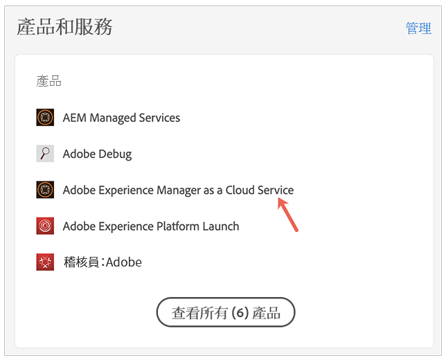
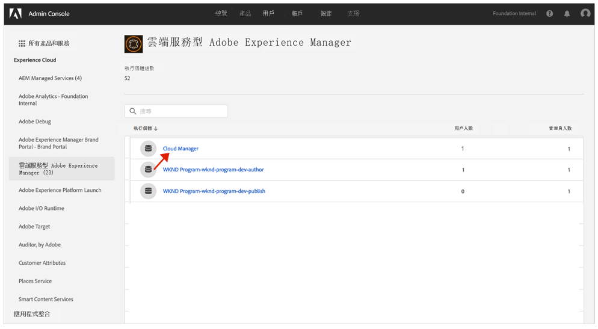
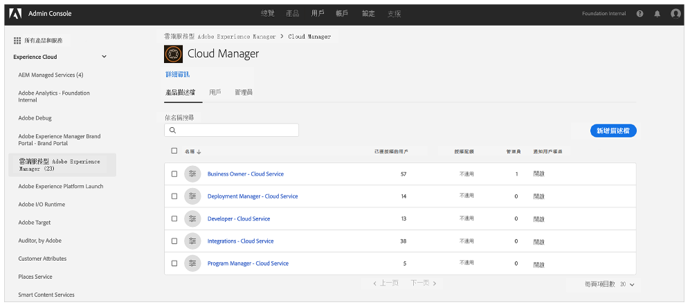
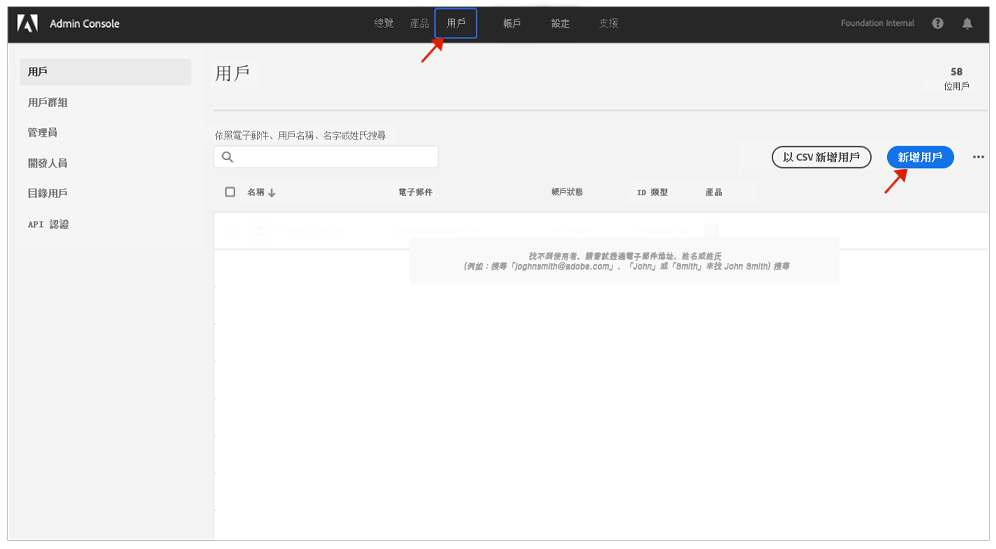

# 通知的使用者群組 {#user-groups}

了解如何在Admin Console中建立使用者群組，以管理重要電子郵件通知的接收。

## 總覽 {#overview}

Adobe有時需要聯絡使用者，了解其AEMas a Cloud Service環境。 除了產品內通知外，Adobe偶爾也會使用電子郵件接收通知。 此類電子郵件通知有兩種類型：

* **事件通知**  — 這些通知會在發生事件或Adobe發現AEMas a Cloud Service環境可能有可用性問題時傳送。
* **主動通知**  — 當Adobe支援團隊成員想要提供潛在最佳化或建議的指引，以利於您的AEMas a Cloud Service環境時，會傳送這些通知。

若要讓正確的使用者收到這些通知，您需要設定並指派使用者群組，本檔案中會有相關說明。

## 必備條件 {#prerequisites}

由於使用者群組是在Admin Console中建立和維護的，因此在建立通知的使用者群組之前，您必須：

* 具有添加和編輯組成員資格的權限。
* 具有有效的Adobe Admin Console設定檔。

## 建立新的Cloud Manager產品設定檔 {#create-groups}

若要正確設定接收通知，您需要建立兩個使用者群組。 這些步驟只能執行一次。

1. 登入Admin Console: [`https://adminconsole.adobe.com`.](https://adminconsole.adobe.com)

1. 從 **概述** 頁面，選取 **Adobe Experience Manager as a Cloud Service** 從 **產品和服務** 卡片。

   

1. 導覽至 **Cloud Manager** 例項（從所有例項清單）。

   

1. 您會看到所有已設定Cloud Manager產品設定檔的清單。

   

1. 按一下 **新設定檔** 並提供下列詳細資訊：

   * **產品設定檔名稱**: `Incident Notification - Cloud Service`
   * **顯示名稱**: `Incident Notification - Cloud Service`
   * **說明**:適用於在事件期間或Adobe發現AEMas a Cloud Service環境可能存在可用性問題時會收到通知之使用者的Cloud Manager設定檔

1. 按一下「**儲存**」。

1. 按一下 **新設定檔** 並再次提供下列詳細資料：

   * **產品設定檔名稱**: `Proactive Notification - Cloud Service`
   * **顯示名稱**: `Proactive Notification - Cloud Service`
   * **說明**:當Adobe支援團隊成員想要針對您的AEMas a Cloud Service環境設定提供潛在最佳化或建議的指引時，會收到通知之使用者的Cloud Manager設定檔

1. 按一下「**儲存**」。

會建立您的兩個新通知群組。

>[!NOTE]
>
>Cloud Manager必須 **產品設定檔名稱** 與提供的完全相同。 請複製並貼上提供的產品設定檔名稱，以避免發生錯誤。 任何偏差或錯字都會導致通知無法視需要傳送。
>
>如果發生錯誤或尚未定義設定檔，Adobe預設會通知指派給 **Cloud Manager開發人員** 或 **部署管理員** 設定檔。

## 將使用者指派至新通知產品設定檔 {#add-users}

現在已建立群組，您必須指派適當的使用者。 您可以在建立新使用者或更新現有使用者時執行此操作。

### 新增使用者至群組 {#new-user}

請依照下列步驟，新增尚未設定同盟ID的使用者。

1. 識別應接收事件或主動通知的使用者。

1. 登入Admin Console: [`https://adminconsole.adobe.com`](https://adminconsole.adobe.com) 如果您尚未登入。

1. 從 **概述** 頁面，選取 **Adobe Experience Manager as a Cloud Service** 從 **產品和服務** 卡片。

   

1. 如果尚未設定團隊成員的Federated ID，請選取 **使用者** 標籤，然後選取 **添加用戶**. 否則請跳至區段 [新增現有使用者至群組。](#existing-users)

   

1. 在 **新增使用者至您的團隊** 對話框，輸入要添加的用戶的電子郵件ID並選擇 `Adobe ID` 針對 **ID類型**.

1. 按一下 **選擇產品** 開始選擇產品。

1. 選擇 **Adobe Experience Manager as a Cloud Service** 並將一個或兩個新群組指派給使用者。

   * **事件通知 — Cloud Service**
   * **主動通知 — Cloud Service**

1. 按一下 **儲存** 會傳送歡迎電子郵件給您新增的使用者。

受邀的使用者現在會收到通知。 對您要接收通知的團隊使用者重複這些步驟。

### 新增現有使用者至群組 {#existing-user}

請依照下列步驟，新增已存在同盟ID的使用者。

1. 識別應接收事件或主動通知的使用者。

1. 登入Admin Console: [`https://adminconsole.adobe.com`](https://adminconsole.adobe.com) 如果您尚未登入。

1. 從 **概述** 頁面，選取 **Adobe Experience Manager as a Cloud Service** 從 **產品和服務** 卡片。

1. 選取 **使用者** 標籤。

1. 如果想要新增至通知群組的團隊成員已有同盟ID，請在清單中找到該使用者，然後按一下該使用者。 否則請跳至區段 [新增使用者至群組。](#add-user)

1. 在 **產品** 按一下刪節號按鈕，然後選擇 **編輯**.

1. 在 **編輯產品** ，按一下 **選擇產品** 開始選擇產品。

1. 選擇 **Adobe Experience Manager as a Cloud Service** 並將一個或兩個新群組指派給使用者。

   * **事件通知 — Cloud Service**
   * **主動通知 — Cloud Service**

1. 按一下 **儲存** 會傳送歡迎電子郵件給您新增的使用者。

受邀的使用者現在會收到通知。 對您要接收通知的團隊使用者重複這些步驟。
