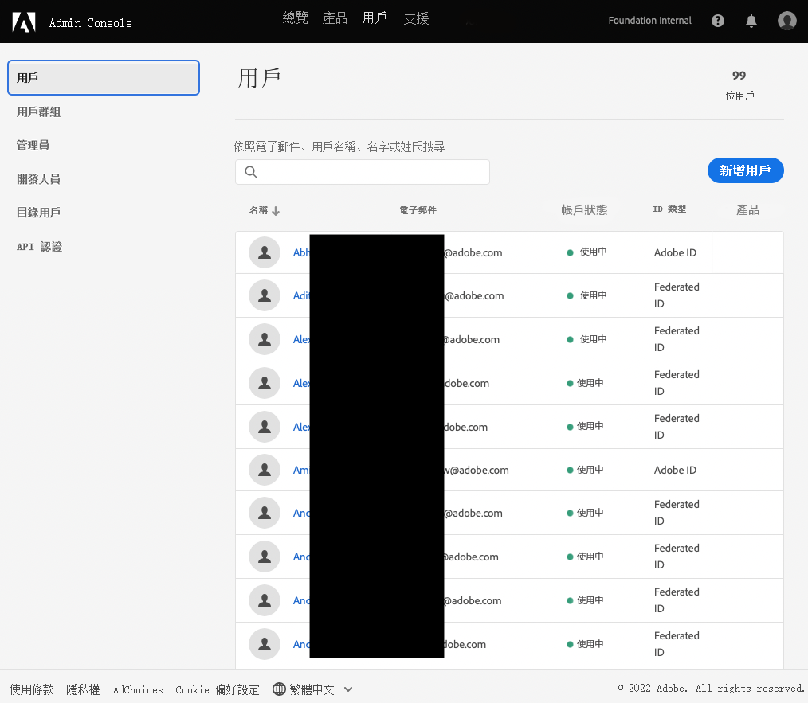

# 通知的使用者群組 {#user-groups}

了解如何在Admin Console中建立使用者群組，以管理重要電子郵件通知的接收。

## 總覽 {#overview}

Adobe不時需要聯絡有關其AEMas a Cloud Service環境的資訊。 除了產品內通知外，Adobe偶爾也會使用電子郵件來傳送此類通知。 此類通知有兩種類型：

* **被動通知**  — 這些通知會在發生事件或Adobe發現AEMas a Cloud Service環境可能有可用性問題時傳送。
* **主動通知**  — 當Adobe支援團隊成員想要提供潛在最佳化或建議的指引，以利於您的AEMas a Cloud Service環境時，會傳送這些通知。

若要讓正確的使用者收到這些通知，您必須設定使用者群組。

## 必備條件 {#prerequisites}

由於使用者群組是在Admin Console中建立和維護的，因此在建立通知的使用者群組之前，您必須：

* 具有添加和編輯組成員資格的權限。
* 具有有效的Adobe Admin Console設定檔。

## 建立通知的使用者群組 {#create-groups}

若要正確設定接收通知，您需要建立兩個使用者群組。 這些步驟只能執行一次。

1. 登入Admin Console: [`https://adminconsole.adobe.com`.](https://adminconsole.adobe.com)

1. 按一下 **使用者** 標籤 **使用者群組** 選項。

   

1. 按一下 **新使用者群組** 按鈕並提供 **使用者群組名稱** 與指定的完全一致，且為選填 **說明**.

   * 組名稱必須符合以下條件。 請勿以任何方式調整或修改群組名稱。
      * `AEM CS - Reactive Notification`
      * `AEM CS - Proactive Notification`

   

1. 按一下「**儲存**」。

1. 對第二組重複步驟。

若未定義群組，Adobe會使用Cloud Manager通知現有使用者 **開發人員** 或 **部署** 設定檔。

## 新增使用者至群組 {#add-users}

現在已建立群組，您必須指派適當的使用者。 您可以在建立新使用者或更新現有使用者時執行此操作。

### 新增使用者至群組 {#new-user}

1. 登入Admin Console: [`https://adminconsole.adobe.com`](https://adminconsole.adobe.com) 如果您尚未登入。

1. 按一下 **使用者** 標籤 **使用者** 選項。

   

1. 按一下 **新增使用者** 按鈕，並提供使用者的電子郵件地址。 您也可以選擇提供名字和姓氏。

   * 如果使用者已存在，Admin Console會符合電子郵件地址並預先填入欄位。

1. 按一下使用者名稱欄位下方的加號，然後按一下 **使用者群組** 標籤，以選取使用者的群組。

   

1. 按一下 **儲存** 以儲存新使用者。

對您需要為其指派通知群組的每個使用者重複這些步驟。

### 新增現有使用者至群組 {#existing-user}

1. 登入Admin Console: [`https://adminconsole.adobe.com`](https://adminconsole.adobe.com) 如果您尚未登入。

1. 按一下 **使用者** 標籤 **使用者** 選項。

   

1. 按一下您要新增至通知群組的使用者列。 會開啟顯示使用者詳細資訊的面板。

1. 按一下右側的刪節號表徵圖 **使用者群組** 區段。