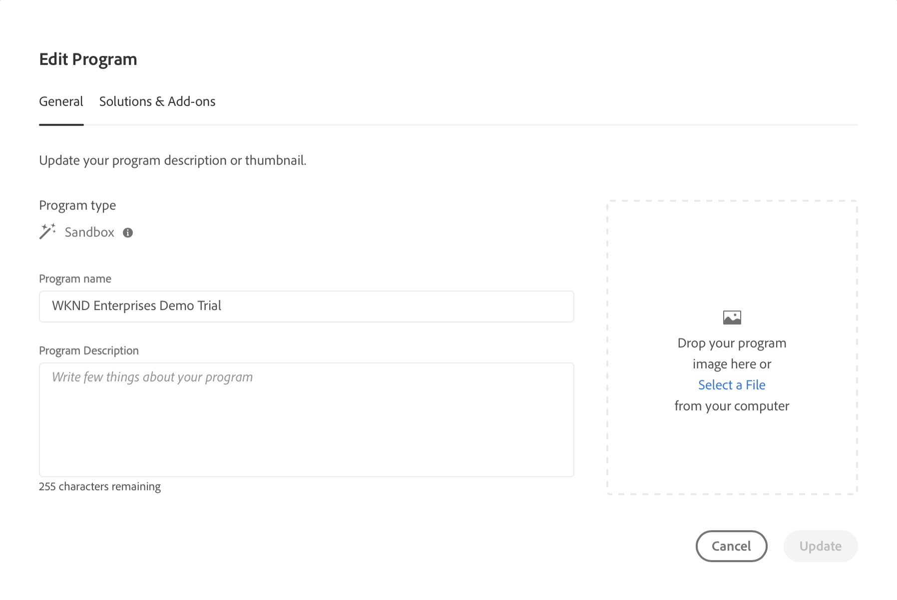

# 建立方案 {#creating-a-program}

了解如何設定新程式和管道來部署附加元件。

## 迄今為止的故事 {#story-so-far}

在AEM參考示範附加元件歷程的上一份檔案中， [了解參考示範附加元件安裝，](installation.md) 您了解了「參考演示」附加元件的安裝過程如何工作，說明了不同元件如何協同工作。 您現在應該：

* 對Cloud Manager有基本的了解。
* 了解管道如何將內容和設定傳送至AEM。
* 了解範本如何只按幾下，就能建立預先填入示範內容的新網站。

本文以這些基本知識為基礎，並採取第一個設定步驟來建立程式以供測試之用，並使用管道來部署附加內容。

## 目標 {#objective}

本檔案可協助您了解如何設定新程式和管道來部署附加元件。 閱讀後，您應：

* 了解如何使用Cloud Manager建立新方案。
* 了解如何為新計畫激活參考演示附加元件。
* 能夠執行管道以部署附加內容。

## 建立方案 {#create-program}

登入Cloud Manager後，您可以建立新的沙箱方案，以供測試和示範之用。

>[!NOTE]
>
>您的使用者必須是 **業務負責人** 在組織中的角色，以建立方案。

1. 登入AdobeCloud Manager，網址為 [my.cloudmanager.adobe.com](https://my.cloudmanager.adobe.com/).

1. 登入後，請在畫面右上角勾選，以確定您所在的組織正確無誤。 如果您只是一個組織的成員，則不需要執行此步驟。

   

1. 點選或按一下 **添加程式** 窗口的右上角。

1. 在 **建立您的方案** 對話，確保 **Adobe Experience Manager** 已選取 **產品** 然後點選或按一下 **繼續**.

   

1. 在下一個對話方塊中：

   * 提供 **方案名稱** 來描述你的計畫。
   * 點選或按一下 **設定沙箱** 為 **方案目標**

   然後點選或按一下 **建立**.

   

1. 系統會將您帶往方案概覽畫面，讓您可以在此觀察方案建立的程式。 Cloud Manager提供剩餘時間的預估值。 建立程式時，您可以離開此畫面，並在稍後視需要返回。

   

1. 完成後，Cloud Manager會提供概述，包括自動建立的環境和管道。

   

1. 按一下頁面左上角的方案名稱，然後在下拉式清單中選取，編輯方案詳細資訊 **編輯方案**.

   

1. 在 **編輯方案** 對話框，切換到 **解決方案和附加元件** 標籤。

   

1. 在 **解決方案和附加元件** 頁簽，展開 **網站** 條目，然後檢查 **參考示範**. 如果您也想要建立AEM Screens的示範，請核取 **Screens** 選項。 點選或按一下 **更新**.

   

1. 現在會以選項的形式啟用附加元件，但其內容必須部署至AEM才能使用。 返回方案概覽頁面，點選或按一下 **開始** 啟動管道以將附加內容部署至AEM。

   

1. 管道將啟動，並將您帶到詳細說明部署進度的頁面。 建立程式時，您可以離開此畫面，並在稍後視需要返回。

   

管道完成後，附加元件及其示範內容即可在AEM製作環境中使用。

## 下一步 {#what-is-next}

現在您已完成AEM Reference Demo Add-On歷程的這一部分，您應：

* 了解如何使用Cloud Manager建立新方案。
* 了解如何為新計畫激活參考演示附加元件。
* 能夠執行管道以部署附加內容。

基於此知識，並透過接下來檢閱檔案，繼續您的AEM參考示範附加元件歷程 [建立示範網站，](create-site.md) 您可在其中了解如何根據管道部署的預先設定範本庫，在AEM中建立示範網站。

## 其他資源 {#additional-resources}

* [Cloud Manager檔案](https://experienceleague.adobe.com/docs/experience-manager-cloud-service/onboarding/onboarding-concepts/cloud-manager-introduction.html)  — 如果您想要取得Cloud Manager功能的詳細資訊，可直接參閱深入的技術檔案。
