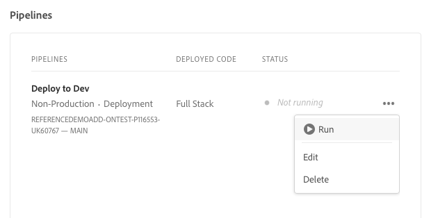

# 建立方案 {#creating-a-program}

了解如何設定新方案和管道以部署附加元件。

## 目前進度 {#story-so-far}

Adobe Experience Manager (AEM) 參考示範附加元件歷程的上一個文件「[了解參考示範附加元件安裝](installation.md)」中，您會了解參考示範附加元件的安裝過程，其中說明不同的部分如何搭配運作。您現在應該：

* 對 Cloud Manager 有基本的了解。
* 了解管道如何將內容和設定傳遞到 AEM。
* 了解如何透過數次點選即可建立預填示範內容的網站。

此文章以這些基本知識為基礎，而其第一個設定步驟是建立測試用的方案，並使用管道來部署附加內容。

## 目標 {#objective}

本文件協助您了解如何設定新方案和管道來部署附加元件。閱讀之後，您應該能夠執行以下操作：

* 了解並解釋如何使用 Cloud Manager 來建立方案。
* 啟動新方案的參考示範附加元件。
* 執行管道以便您可以部署附加內容。

## 建立方案 {#create-program}

登入 Cloud Manager 後，您可以建立一個供測試和示範使用的沙箱方案。

>[!NOTE]
>
>您的使用者在組織中必須是&#x200B;**業務負責人**&#x200B;角色的一員才能建立方案。

1. 在 [my.cloudmanager.adobe.com](https://my.cloudmanager.adobe.com/) 登入 Adobe Cloud Manager。

1. 登入後，在螢幕右上角勾選您的組織，確認您屬於正確的組織。如果您只是一個組織的成員，則無需執行此步驟。

   

1. 選取視窗右上角的「**新增方案**」。

1. 在「**讓我們建立您的方案**」對話框中：

   1. 提供一個「**方案名稱**」來描述您的方案。
   1. 選取「**設定沙箱**」作為您的「**方案目標**」
   1. 選取「**繼續**」。

   

1. 在「**設定您的沙箱**」對話框 (位在「**解決方案和附加元件**」表格) 中，點選或按一下「**網站**」項目清單來展開，再勾選「**參考示範**」。

   * 如果您也想建立 AEM Screens 的示範，請勾選清單中的「**Screens**」選項。選取「**更新**」。

   

1. 選取「**建立**」，接著 Cloud Manager 便開始設定您的沙箱方案。您將進入方案概觀畫面，並有一條簡短的橫幅通知表明該流程已開始。概觀頁面已為您的新方案新增一個卡片。設定過程需要幾分鐘才能完成。

1. 設定完成後，概觀頁面上的環境卡片將其狀態顯示為「**準備就緒**」。選取卡片，以便您可以開啟環境。

   

1. 您的環境已準備就緒，而且作為選項的附加元件已啟用，但示範的內容必須部署到 AEM 才能使用。要做這個動作，請在「**管道**」卡片選取「部署至開發」管道旁的省略號按鈕，並選擇「**執行**」。

   

1. 管道啟動，您將進入一個詳細說明部署進度的頁面。您可以在方案建立過程中離開此畫面，之後可在必要時返回。

   

該管道可能需要幾分鐘才能完成。完成後，此附加元件及其示範內容即可在 AEM 製作環境中使用。

## 下一步 {#what-is-next}

您已完成 AEM 參考示範附加元件歷程的這個部分，您應該：

* 了解如何使用 Cloud Manager 建立方案。
* 了解如何啟動該方案的參考示範附加元件。
* 能夠執行管理，以便您可以部署附加內容。

以此知識為基礎並繼續您的 AEM 參考示範附加元件歷程，接著檢閱「[建立一個示範網站](create-site.md)」。在示範網站中，您會學習如何根據由管道部署的預先設定的範本庫在 AEM 中建立示範網站。

## 其他資源 {#additional-resources}

* [Cloud Manager 文件](https://experienceleague.adobe.com/docs/experience-manager-cloud-service/content/onboarding/onboarding-concepts/cloud-manager-introduction.html) - 如果您想要 Cloud Manager 功能的更多詳細資訊，您可能想直接查閱深入的技術文件。
