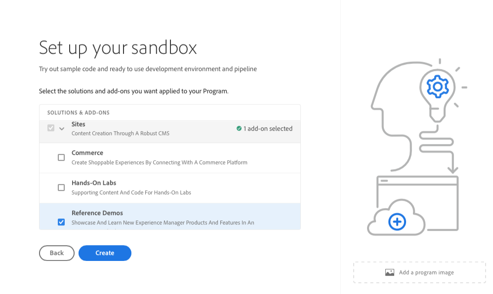

# 建立計畫 {#creating-a-program}

了解如何設定新方案和管道以部署附加元件。

## 到目前為止 {#story-so-far}

在AEM參考示範附加元件歷程的上一個檔案中， [瞭解參考示範附加元件安裝，](installation.md) 您已瞭解參考示範附加元件的安裝程式如何運作，說明不同部分如何共同運作。 您現在應該：

* 基本瞭解Cloud Manager。
* 瞭解管道如何將內容和設定傳送至AEM。
* 瞭解範本如何按幾下即可建立已預先填入示範內容的新網站。

本文基於這些基礎之上，並採取第一個設定步驟來建立程式以進行測試，並使用管道來部署附加內容。

## 目標 {#objective}

本檔案可協助您瞭解如何設定新方案和管道以部署附加元件。 閱讀本文件後，您應該：

* 瞭解如何使用Cloud Manager建立新計畫。
* 瞭解如何為新方案啟動參考示範附加元件。
* 能夠執行管道以部署附加內容。

## 建立計畫 {#create-program}

登入Cloud Manager後，您可以建立新的沙箱程式用於測試和示範目的。

>[!NOTE]
>
>您的使用者必須是 **業務負責人** 在您組織的Cloud Manager中角色以建立計畫。

1. 在 [my.cloudmanager.adobe.com](https://my.cloudmanager.adobe.com/) 登入 Adobe Cloud Manager。

1. 登入後，在畫面的右上角勾選組織，以確保您在正確的組織中。 如果您只是一個組織的成員，則不需要執行此步驟。

   

1. 點選或按一下 **新增計畫** 視窗右上角的。

1. 在 **讓我們建立您的程式** 對話方塊：

   1. 提供 **計畫名稱** 描述您的程式。
   1. 點選或按一下 **設定沙箱** 您的 **程式目標**
   1. 點選或按一下&#x200B;**繼續**。

   

1. 在 **設定您的沙箱** 對話方塊 **解決方案和附加元件** 表格中，展開 **網站** 點選或按一下清單中的專案，然後核取 **參考示範**.

   * 如果您也想要建立AEM Screens的示範，請檢查 **Screens** 選項時，也會一併刪除。 點選或按一下 **更新**.

   

1. 點選或按一下 **建立** 和Cloud Manager開始設定您的沙箱計畫。 您會進入計畫總覽畫面，而簡短的橫幅通知會指出流程已開始。 新方案的概觀頁面已新增一張卡片。 設定程式需要幾分鐘才能完成。

1. 設定完成後，總覽頁面上的環境卡片會將其狀態顯示為 **就緒**. 點選或按一下卡片以開啟環境。

   

1. 您的環境已準備就緒，且附加元件現在已作為一個選項啟用，但示範的內容必須部署到AEM才能使用。 若要這麼做，請點選或按一下中「部署至開發」管道旁的省略符號按鈕 **管道** 卡片並選取 **執行**.

   

1. 管道隨即啟動，並帶您到一個詳細說明部署進度的頁面。 您可以在建立計畫時離開此畫面進行瀏覽，並稍後返回（如有需要）。

   

管道可能需要幾分鐘才能完成。 完成後，即可在AEM編寫環境中使用附加元件及其示範內容。

## 下一步 {#what-is-next}

現在您已完成AEM參考示範附加元件歷程的這一部分，您應：

* 瞭解如何使用Cloud Manager建立新計畫。
* 瞭解如何為新方案啟動參考示範附加元件。
* 能夠執行管道以部署附加內容。

在此知識的基礎上繼續您的AEM參考示範附加元件歷程，接下來檢視檔案 [建立示範網站，](create-site.md) 在這裡，您將瞭解如何根據管道部署的預設定範本資料庫，在AEM中建立示範網站。

## 其他資源 {#additional-resources}

* [Cloud Manager 文件](https://experienceleague.adobe.com/docs/experience-manager-cloud-service/onboarding/onboarding-concepts/cloud-manager-introduction.html) - 如果您想要 Cloud Manager 功能的更多詳細資訊，您可能想要直接查閱深入的技術文件。
