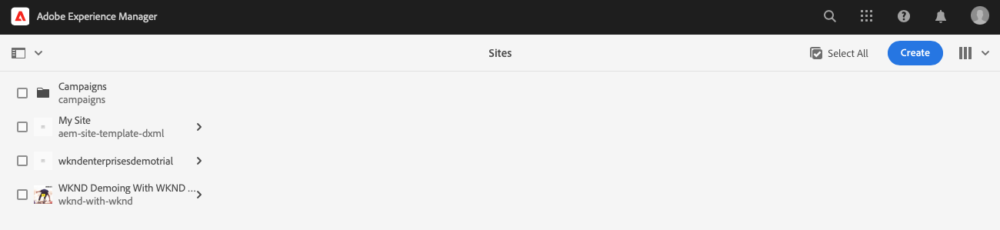

# 建立示範網站 {#creating-a-site}

根據預先設定的範本庫，在AEM中建立示範網站。

## 迄今為止的故事 {#story-so-far}

在AEM快速網站建立歷程的上一份檔案中， [建立方案，](create-program.md) 您執行了第一個設定步驟，建立用於測試用途的程式，並使用管道來部署附加內容。 您現在應該：

* 了解如何使用Cloud Manager建立新方案。
* 了解如何為新計畫激活參考演示附加元件。
* 能夠執行管道以部署附加內容。

本文根據參考示範附加元件的範本，在AEM中建立新網站，以說明程式的下一步。

## 目標 {#objective}

本檔案可協助您了解如何根據參考示範附加元件的範本建立新網站。 閱讀後，您應：

* 了解如何存取AEM製作環境。
* 了解如何根據範本建立網站。
* 了解導覽網站結構和編輯頁面的基本知識。

## 建立示範網站 {#create-site}

在管道部署參考示範附加元件後，您就可以存取AEM製作環境，以根據附加元件內容建立示範網站。

1. 從Cloud Manager的方案概觀頁面，點選或按一下連結至AEM製作環境。

   

1. 從AEM的主功能表，點選或按一下 **網站**.

   

1. 從網站主控台，點選或按一下 **建立** 並選取 **範本網站** 中。

   

1. 站點建立嚮導將啟動。 在左欄中，您可以看到管道部署至製作執行個體的示範範本。 點選或按一下以選取它，並在右欄中顯示詳細資訊。 點選或按一下 **下一個**.

   

1. 在下一個畫面中，提供您網站的標題。 若省略，可提供網站名稱或從標題產生網站名稱。 點選或按一下 **建立**.

   * 網站標題會顯示在瀏覽器標題列中。
   * 網站名稱會成為URL的一部分。
   * 網站名稱必須符合AEM頁面命名慣例，其詳細資訊可在 [其他資源](#additional-resources) 區段。

   

1. 網站建立會以對話方塊確認。 點選或按一下 **完成**.

   

您現在已建立自己的示範網站！

## 使用示範網站 {#use-site}

現在您的示範網站已建立，您可以像在AEM中瀏覽任何其他網站一樣導覽及使用。

1. 網站現在會顯示在網站主控台中。

   

1. 在畫面的右上角，確認主控台檢視已設為 **欄檢視**.

   

1. 點選或按一下網站以探索其結構和內容。 導覽示範網站的內容樹狀結構時，欄檢視會持續展開。

   

1. 點選或按一下頁面以選取它，然後點選或按一下 **編輯** 的下一頁。

   

1. 您可以以任何其他AEM內容頁面的形式編輯頁面，例如新增或編輯元件或資產，並測試AEM的功能。

   

恭喜！ 您現在可以進一步探索示範網站的內容，並透過參考示範附加元件的最佳實務內容探索AEM必須提供的所有內容。

根據其他範本建立其他網站，以探索更多AEM功能。

## 下一步 {#what-is-next}

現在您已完成AEM Reference Demo Add-On歷程的這一部分，您應：

* 了解如何存取AEM製作環境。
* 了解如何根據範本建立網站。
* 了解導覽網站結構和編輯頁面的基本知識。

您現在可以使用附加內容來測試AEM的功能。 若要了解如何管理此示範內容，請繼續您的AEM參考示範附加元件歷程，繼續檢閱此檔案 [管理您的示範網站，](manage.md) 您將在何處了解可協助您管理示範網站的工具，以及如何移除示範網站。

## 其他資源 {#additional-resources}

* [Cloud Manager檔案](https://experienceleague.adobe.com/docs/experience-manager-cloud-service/onboarding/onboarding-concepts/cloud-manager-introduction.html)  — 如果您想要取得Cloud Manager功能的詳細資訊，可直接參閱深入的技術檔案。
* [建立網站](/help/sites-cloud/administering/site-creation/create-site.md)  — 了解如何使用AEM使用網站範本來定義網站的樣式和結構來建立網站。
* [AEM頁面命名慣例。](/help/sites-cloud/authoring/fundamentals/organizing-pages.md#page-name-restrictions-and-best-practices)  — 請參閱本頁面，了解組織AEM頁面的慣例。
* [AEM基本處理](/help/sites-cloud/authoring/getting-started/basic-handling.md)  — 如果您是剛接觸AEM的人，熟悉導覽與主控台組織等基本概念，請探索本檔案。