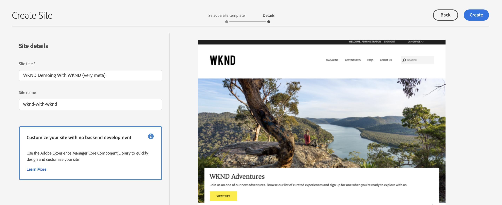

# 建立演示網站 {#creating-a-site}

基於預配置模AEM板庫在中建立演示站點。

## 到目前為止的故事 {#story-so-far}

在參考演示附AEM加程式的上一文檔中， [建立程式，](create-program.md) 您執行了第一個配置步驟，建立了用於測試的程式，並使用管道部署附加內容。 您現在應該：

* 瞭解如何使用雲管理器建立新程式。
* 瞭解如何激活新程式的參考演示載入項。
* 能夠運行管道以部署附加內容。

本文介紹該過程的下一步，方法是根據「參考演示附加程式」AEM的模板在中建立新站點或AEM Screens項目。

## 目標 {#objective}

本文檔幫助您瞭解如何根據參考演示載入項的模板建立新站點。 閱讀完後，您應：

* 瞭解如何訪問創AEM作環境。
* 瞭解如何根據模板建立站點。
* 瞭解導航站點結構和編輯頁面的基本知識。

## 建立演示站點或螢幕項目 {#create-site}

一旦管道部署了「參考演示載入項」，您就可以訪問AEM創作環境，以根據附加內容建立演示站點。

1. 在Cloud Manager中的程式概述頁面中，點擊或按一下指向創作環境AEM的連結。

   

1. 在主菜單AEM中，點擊或按一下 **站點**。

   

1. 在站點控制台中，點擊或按一下 **建立** 在螢幕的右上角，然後選擇 **來自模板的站點** 的下界。

   

1. 站點建立嚮導將啟動。 在左欄中，您可以看到管道部署到創作實例的演示模板。 點擊或按一下其中一項選擇它並在右列中顯示詳細資訊。 如果您想test或演示AEM Screens，請務必選擇 **We.Cafe網站模板**。 點擊或按一下 **下一個**。

   

1. 在下一螢幕中，為您的網站或螢幕項目提供標題。 如果省略，則可以提供或將從標題生成站點名稱。 點擊或按一下 **建立**。

   * 網站標題顯示在瀏覽器標題欄中。
   * 站點名稱成為URL的一部分。
   * 站點名稱必須符AEM合頁面命名約定，其詳細資訊可在 [其他資源](#additional-resources) 的子菜單。

   

1. 通過對話框確認站點建立。 點擊或按一下 **完成**。

   

您現在已建立自己的演示網站！

## 使用演示網站 {#use-site}

現在，您的演示網站已建立，您可以像中的任何其他網站一樣導航和使AEM用。

1. 站點現在顯示在站點控制台中。

   

1. 在螢幕的右上角，確保控制台視圖設定為 **列視圖**。

   

1. 點擊或按一下網站以瀏覽其結構和內容。 在您瀏覽演示網站的內容樹時，列視圖會不斷展開。

   

1. 點擊或按一下某個頁面以選擇它，然後點擊或按一下 **編輯** 的子菜單。

   

1. 您可以以任何其他內容頁AEM面（如添加或編輯元件或資產）的形式編輯頁面，並test其功AEM能。

   

恭喜！ 現在，您可以進一步瀏覽演示網站的內容，並通過參考演示附AEM件中的最佳實踐內容來發現必須提供的所有內容。

根據其他模板建立其他站點以瞭解更AEM多功能。

## 下一步是什麼 {#what-is-next}

現在，您已完成了「參考演示附AEM加程式」的這一部分，您應：

* 瞭解如何訪問創AEM作環境。
* 瞭解如何根據模板建立站點。
* 瞭解導航站點結構和編輯頁面的基本知識。

現在，您可以test使AEM用附加內容的功能。 您有兩種選擇可繼續您的旅程：

* 如果您希望充分演示和testAEM Screens內容，請確保您已根據 **We.Cafe網站模板** 如前所述，並繼續 [為演示網站啟用AEM Screens。](screens.md)
* 如果您只能演示網站內容，請繼續 [管理您的演示站點，](manage.md) 您將從中瞭解可用工具，以幫助您管理演示網站以及如何刪除它們。

## 其他資源 {#additional-resources}

* [Cloud Manager文檔](https://experienceleague.adobe.com/docs/experience-manager-cloud-service/onboarding/onboarding-concepts/cloud-manager-introduction.html)  — 如果您想更詳細地瞭解Cloud Manager的功能，則可能需要直接查閱深入的技術文檔。
* [建立站點](/help/sites-cloud/administering/site-creation/create-site.md)  — 瞭解如何使用站AEM點模板來建立站點，以定義站點的樣式和結構。
* [頁AEM面命名約定。](/help/sites-cloud/authoring/fundamentals/organizing-pages.md#page-name-restrictions-and-best-practices)  — 請參閱此頁瞭解組織頁面的AEM約定。
* [基AEM本處理](/help/sites-cloud/authoring/getting-started/basic-handling.md)  — 如果您剛瞭解導航和控制台AEM組織等基本概念，請瀏覽本文檔。