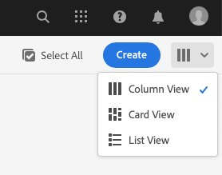

# 建立示範網站 {#creating-a-site}

根據預先設定的範本庫在 AEM 中建立示範網站。

## 目前進度 {#story-so-far}

在 AEM 參考示範附加元件歷程的上一份文件「[建立方案](create-program.md)」中，您已執行第一個設定步驟，建立測試用的方案，並使用管道來部署附加內容。您現在應該：

* 了解如何使用 Cloud Manager 建立方案。
* 了解如何啟動新方案的參考示範附加元件。
* 能夠執行管道來部署附加內容。

本文章說明流程的下一步，即根據參考示範附加元件的範本在 AEM 中建立網站或 AEM Screens 專案。

## 目標 {#objective}

本文件協助您瞭解如何根據參考示範附加元件的範本建立網站。閱讀本文件後，您應該：

* 了解如何存取 AEM 製作環境。
* 了解如何根據範本建立網站。
* 了解導覽網站結構和編輯頁面的基礎知識。

## 建立示範網站或 Screens 專案 {#create-site}

在參考示範附加元件部署管道後，便可以存取 AEM 製作環境並根據附加內容來建立示範網站。

1. 從 Cloud Manager 的方案概觀頁面中，選擇指向 AEM 製作環境的連結。

   

1. 從 AEM 的主選單選擇「**Sites**」。

   

1. 從 Sites 主控台中，選取畫面右上角的「**建立**」並從下拉式清單選取「**來自範本的網站**」。

   

1. 網站建立精靈啟動。您可以在左欄看到管道部署到您的製作執行個體的示範範本。選取其中一個可在右欄看到其詳細資訊。如果您想測試或示範 AEM Screens，請務必選取「**We.Cafe 網站範本**」。選取「**下一步**」。

   

1. 在下一個畫面中，請提供您的網站或 Screens 專案的標題。如果省略的話，可以提供網站名稱或從標題產生。選取「**建立**」。

   * 網站標題顯示在瀏覽器標題列中。
   * 網站名稱成為 URL 的一部分。
   * 網站名稱必須符合 AEM 的頁面命名慣例，詳細資訊請參閱「[其他資源](#additional-resources)」區段。

   

1. 透過對話框確認建立網站。選取「**完成**」。

   

現在您已建立自己的示範網站！

## 使用示範網站 {#use-site}

現在您已建立示範網站，即可如同 AEM 中任何其他網站一般進行導覽和使用。

1. 該網站現在顯示在 Sites 主控台中。

   

1. 在畫面右上角，確認主控台檢視設定為「**欄視圖**」。

   

1. 選取該網站以探索其結構和內容。當您瀏覽示範網站的內容樹時，欄視圖會持續展開。

   

1. 選取一個頁面，然後選取工具列的「**編輯**」。

   

1. 您可以像其他 AEM 內容頁面一樣編輯該頁面，例如新增或編輯元件或資產並測試 AEM 的功能。

   

恭喜！現在您可以進一步探索示範網站的內容，並透過參考示範附加元件的最佳實務內容來瞭解 AEM 提供的所有功能。

根據其他範本建立其他網站以探索更多 AEM 功能。

## 下一步 {#what-is-next}

您已完成 AEM 參考示範附加元件歷程的這個部分，您應該：

* 了解如何存取 AEM 製作環境。
* 了解如何根據範本建立網站。
* 了解導覽網站結構和編輯頁面的基礎知識。

現在您可以使用附加內容測試 AEM 的功能。要繼續進行歷程，您有兩個選項：

* 如果您想要完整示範並測試 AEM Screens 內容，請確保您已依照前述內容根據「**We.Cafe 網站範本**」部署網站，並繼續「[為您的示範網站啟用 AEM Screens](screens.md)」。
* 如果您只想示範網站內容，請繼續「[管理您的示範網站](manage.md)」，您可以在此了解可協助您管理示範網站的各項工具以及如何刪除它們。

## 其他資源 {#additional-resources}

* [Cloud Manager 文件](https://experienceleague.adobe.com/docs/experience-manager-cloud-service/onboarding/onboarding-concepts/cloud-manager-introduction.html?lang=zh-Hant) - 如果您想要 Cloud Manager 功能的更多詳細資訊，您可能想直接查閱深入的技術文件。
* [建立網站](/help/sites-cloud/administering/site-creation/create-site.md) - 了解如何在 AEM 中利用網站範本來定義網站的樣式與結構以便建立網站。
* [AEM 的頁面命名慣例](/help/sites-cloud/authoring/sites-console/organizing-pages.md#page-name-restrictions-and-best-practices)- 請參閱此頁面以了解組織 AEM 頁面的慣例。
* [AEM 基本處理](/help/sites-cloud/authoring/basic-handling.md) - 如果您初次使用 AEM，請探索此文件以了解導覽和主控台組織等基本概念。
