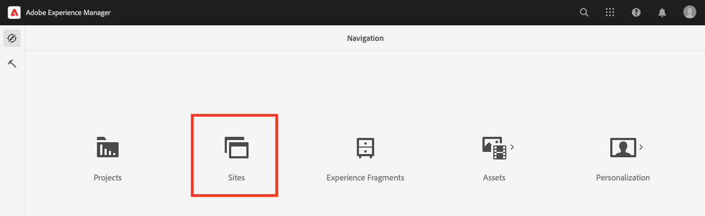
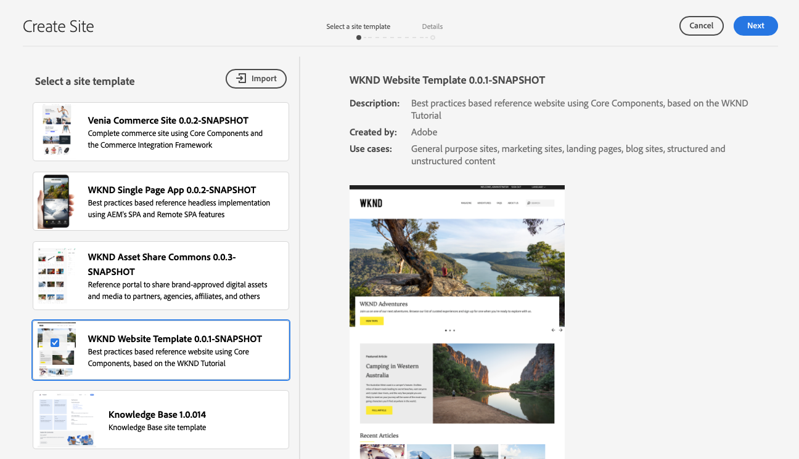
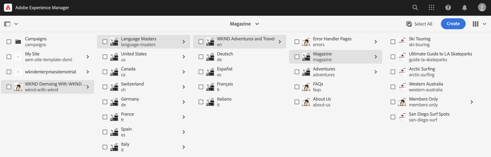

# 建立示範網站 {#creating-a-site}

根據預先設定的範本庫在 AEM 中建立示範網站。

## 到目前為止 {#story-so-far}

在AEM參考示範附加元件歷程的上一個檔案中， [建立計畫，](create-program.md) 您執行了第一個設定步驟來建立方案以進行測試，並使用管道來部署附加內容。 您現在應該：

* 瞭解如何使用Cloud Manager建立計畫。
* 瞭解如何啟用新方案的參考示範附加元件。
* 能夠執行管道以部署附加內容。

本文會根據參考示範附加元件的範本，在AEM中建立網站或AEM Screens專案，說明此流程的下一步。

## 目標 {#objective}

本檔案可協助您瞭解如何根據參考示範附加元件的範本建立網站。 閱讀本文件後，您應該：

* 瞭解如何存取AEM製作環境。
* 瞭解如何根據範本建立網站。
* 瞭解導覽網站結構和編輯頁面的基本概念。

## 建立示範網站或Screens專案 {#create-site}

在管道部署參考示範附加元件後，您可以存取AEM製作環境，以根據附加元件內容建立示範網站。

1. 從Cloud Manager中的計畫總覽頁面，選擇AEM創作環境的連結。

   

1. 從AEM的主功能表選取 **網站**.

   

1. 在網站主控台中，選取 **建立** ，然後選取「 」 **從範本建立網站** 位於下拉式清單中。

   

1. 網站建立精靈隨即啟動。 在左欄中，您可以看到管道部署至編寫執行個體的示範範本。 選取一個以將其選取，並在右欄中顯示詳細資訊。 如果您想要測試或示範AEM Screens，請務必選擇 **We.Cafe網站範本**. 選取 **下一個**.

   

1. 在下一個畫面中，為您的網站或Screens專案提供標題。 若省略，可提供網站名稱，或從標題產生。 選擇 **建立**。

   * 網站標題會顯示在瀏覽器標題列中。
   * 網站名稱會成為URL的一部分。
   * 網站名稱必須符合AEM頁面命名慣例，可參閱以下詳細資訊： [其他資源](#additional-resources) 區段。

   

1. 透過對話方塊確認場地建立。 選取 **完成**.

   

您現在已建立自己的示範網站！

## 使用示範網站 {#use-site}

現在您的示範網站已建立，您可以像在AEM中瀏覽及使用任何其他網站一樣導覽及使用示範網站。

1. 網站現在會顯示在網站主控台中。

   

1. 在畫面的右上角，確定主控台檢視已設為 **欄檢視**.

   

1. 選取網站以探索其結構和內容。 當您導覽示範網站的內容樹狀結構時，欄檢視會持續展開。

   

1. 選取要選取的頁面，然後選取 **編輯** （在工具列中）。

   

1. 您可以像編輯任何其他AEM內容頁面一樣編輯頁面，例如新增或編輯元件或資產，以及測試AEM的功能。

   

恭喜！您現在可以進一步探索示範網站的內容，並透過參考示範附加元件的最佳實務內容來探索AEM必須提供的一切。

根據其他範本建立其他網站以探索更多AEM功能。

## 下一步 {#what-is-next}

現在您已完成AEM參考示範附加元件歷程的這一部分，您應：

* 瞭解如何存取AEM製作環境。
* 瞭解如何根據範本建立網站。
* 瞭解導覽網站結構和編輯頁面的基本概念。

您現在可以使用附加內容來測試AEM的功能。 您有兩個選項可以繼續您的歷程：

* 如果您想要完整示範和測試AEM Screens內容，請確定您已根據 **We.Cafe網站範本** 如前所述，並繼續 [為您的示範網站啟用AEM Screens 。](screens.md)
* 如果您只想要示範Sites內容，請繼續 [管理您的示範網站，](manage.md) 瞭解可用來協助您管理示範網站的工具，以及如何移除這些工具。

## 其他資源 {#additional-resources}

* [Cloud Manager 文件](https://experienceleague.adobe.com/docs/experience-manager-cloud-service/onboarding/onboarding-concepts/cloud-manager-introduction.html) - 如果您想要 Cloud Manager 功能的更多詳細資訊，您可能想要直接查閱深入的技術文件。
* [建立網站](/help/sites-cloud/administering/site-creation/create-site.md)  — 瞭解如何使用AEM建立網站，使用網站範本定義網站的樣式和結構。
* [AEM頁面命名慣例](/help/sites-cloud/authoring/fundamentals/organizing-pages.md#page-name-restrictions-and-best-practices).  — 請參閱本頁面以瞭解組織AEM頁面的慣例。
* [AEM基本處理](/help/sites-cloud/authoring/getting-started/basic-handling.md)  — 如果您不熟悉AEM，請參閱本檔案，瞭解導覽與主控台組織等基本概念。
