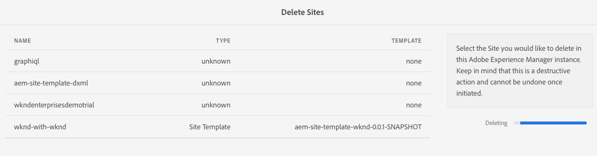

# 管理您的演示站點 {#manage-demo-sites}

瞭解幫助您管理演示網站的可用工具以及如何刪除它們。

## 到目前為止的故事 {#story-so-far}

在參考演示附AEM加程式的上一文檔中， [建立站點，](create-site.md) 您基於「參考演示載入項」的模板建立了一個新的演示站點。 您現在應該：

* 瞭解如何訪問創AEM作環境。
* 瞭解如何根據模板建立站點。
* 瞭解導航站點結構和編輯頁面的基本知識。

如果 [啟用了AEM Screens,](screens.md) 您還應：

* 瞭解AEM Screens的基本知識。
* 瞭解We.Cafe演示內容。
* 知道如何為We.Cafe配置AEM Screens。

現在，您有自己的演示網站可供您瀏覽，本文介紹了幫助您管理演示網站的工具以及如何刪除這些工具。

## 目標 {#objective}

此文檔幫助您瞭解如何管理您建立的演示站點。 閱讀完後，您應：

* 瞭解如何訪問自助演示實用程式。
* 瞭解您可以使用哪些實用程式。
* 如何刪除現有演示網站或模板。

## 訪問自助演示實用程式 {#accessing-utilities}

既然您擁有自己的演示站點，您可能希望瞭解如何管理這些站點。 管道不僅部署了站點模板以提供您的演示站點內容，還部署了一組實用程式來管理這些站點。

1. 從全局導AEM航欄中，選擇 **工具** -> **參考演示** -> **參考演示實用程式**。

   

1. 參考演示實用程式是一組有用的功能，可幫助設定和監控您的Adobe Experience Manager環境。 初始視圖為 **儀表板**，用於檢查環境及其演示功能的狀態。

   

自助演示實用程式提供了多種工具。

* **刪除站點**  — 選擇要在此Adobe Experience Manager實例中刪除的站點。 請記住，這是破壞性操作，一旦啟動，就無法撤消。
* **刪除網站模板**  — 選擇要在此Adobe Experience Manager實例中刪除的站點模板。 在刪除站點模板之前，請確保引用該模板的所有站點也被刪除。 請記住，這是破壞性操作，一旦啟動，就無法撤消。
* **主要作者快取**  — 這將在Adobe Experience Manager實例內獲取多個資源，加快其獲取時間。 可能需要幾秒鐘。
* **Android應用**  — 用於安裝和啟動演示Android App的工具。 根據 **WKND單頁應用** 來填充此頁。 使用Android設備、模擬器或Bluestack。
* **用戶首選項**  — 關閉教程彈出對話框。
* **設定GraphQL**  — 快速設定全局GraphQL終結點。

## 刪除演示站點和模板 {#deleting}

在測試了一組功AEM能後，您可能不再需要您的演示站點，甚至不再需要它所基於的模板。 刪除演示站點和站點模板都很容易。

1. 訪問 **參考演示實用程式** 點擊並按一下 **刪除站點**。

   

1. 可用的站點列在清單中。 檢查要刪除的站點，然後點擊或按一下 **刪除**。

   >[!CAUTION]
   >
   >站點和模板刪除是破壞性操作，一旦啟動就無法撤消。

1. 在對話框中確認站點刪除。

   

1. 刪AEM除所選站點，並顯示其進度 **刪除** 按鈕。

   

現在已刪除該站點。

可以以相同方式刪除標題下的模板 **刪除網站模板** 的 **參考演示實用程式**。

>[!CAUTION]
>
>在刪除站點模板之前，請確保引用該模板的所有站點也被刪除。

## 旅程結束？ {#end-of-journey}

恭喜！ 您已完成參AEM考演示附加程式的旅程！ 您現在應該：

* 瞭解Cloud Manager的基本知識，並瞭解管道如何將內容和配置交付AEM到。
* 瞭解如何使用雲管理器建立新程式。
* 瞭解如何為新程式激活參考演示載入項，並能夠運行管道來部署載入項內容。
* 瞭解如何訪問AEM創作環境以基於模板建立站點。
* 瞭解如何訪問自助演示實用程式。
* 瞭解如何刪除現有演示網站或模板。

現在，您已準備好探索使用您自己AEM的演示網站的功能。 但是AEM它是一個功能強大的工具，並有許多其他選項可供選擇。 簽出中的某些可用額外資源 [「其他資源」部分](#additional-resources) 瞭解您在此過程中看到的功能。

## 其他資源 {#additional-resources}

* [Cloud Manager文檔](https://experienceleague.adobe.com/docs/experience-manager-cloud-service/onboarding/onboarding-concepts/cloud-manager-introduction.html)  — 如果您想更詳細地瞭解Cloud Manager的功能，則可能需要直接查閱深入的技術文檔。
* [建立站點](/help/sites-cloud/administering/site-creation/create-site.md)  — 瞭解如何使用站AEM點模板來建立站點，以定義站點的樣式和結構。
* [頁AEM面命名約定。](/help/sites-cloud/authoring/fundamentals/organizing-pages.md#page-name-restrictions-and-best-practices)  — 請參閱此頁瞭解組織頁面的AEM約定。
* [基AEM本處理](/help/sites-cloud/authoring/getting-started/basic-handling.md)  — 如果您剛瞭解導航和控制台AEM組織等基本概念，請瀏覽本文檔。
* [AEMas a Cloud Service技術文檔](https://experienceleague.adobe.com/docs/experience-manager-cloud-service.html)  — 如果您已經對此有了確切的了AEM解，您可能需要直接咨詢深入的技術文檔。
* [站點模板](/help/sites-cloud/administering/site-creation/site-templates.md)  — 如果您想瞭解有關站點模板的結構以及它們如何用於建立站點的詳細資訊，請參閱本文檔。
