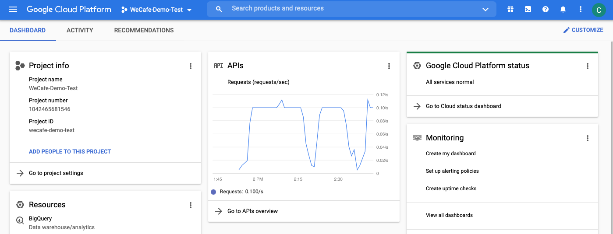
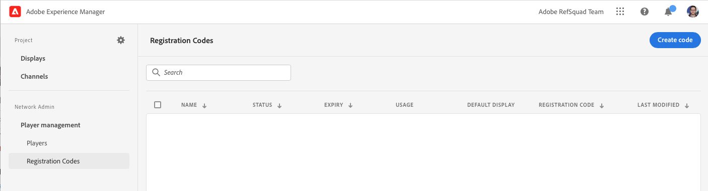

# 為演示網站啟用AEM Screens {#enable-screens}

瞭解在演示站點上啟用完整的AEM Screensas a Cloud Service體驗的步驟。

## 到目前為止的故事 {#story-so-far}

在參考演示附AEM加程式的上一文檔中， [建立演示網站，](create-site.md) 您基於「參考演示載入項」的模板建立了一個新的演示站點。 您現在應該：

* 瞭解如何訪問創AEM作環境。
* 瞭解如何根據模板建立站點。
* 瞭解導航站點結構和編輯頁面的基本知識。

現在，您有了自己的演示網站來瀏覽和瞭解可用於幫助您管理演示網站的工具，現在，您可以為您的演示網站啟用完整的AEM Screensas a Cloud Service體驗。

## 目標 {#objective}

參AEM考演示附件包含We.Cafe的AEM Screens內容，這是一家咖啡店的垂直業務。 本文檔可幫助您瞭解如何在AEM Screens上下文中執行We.Cafe演示設定。 閱讀完後，您應：

* 瞭解AEM Screens的基本知識。
* 瞭解We.Cafe演示內容。
* 知道如何為We.Cafe配置AEM Screens。
   * 知道如何為We.Cafe建立螢幕項目。
   * 能夠使用Google表和API配置模擬天氣服務。
   * 根據「天氣服務」動態模擬更改的螢幕內容。
   * 安裝並使用螢幕播放器。

## 瞭解螢幕 {#understand-screens}

AEM Screensas a Cloud Service是一種數字標牌解決方案，使營銷人員能夠建立和管理動態的數字型驗。 借助AEM Screensas a Cloud Service，您可以建立吸引人且動態的數字標牌體驗，以便在公共空間中使用。

>[!TIP]
>
>有關AEM Screensas a Cloud Service的完整詳細資訊，請參閱 [其他資源](#additional-resources) 的下界。

通過安AEM裝「參考演示載入項」，您可以在演示創作環境中自動獲得AEM Screens的We.Cafe內容。 中介紹的步驟 [部署演示螢幕項目](#deploy-project) 允許您發佈該內容並部署到媒體播放器等，從而實現AEM Screens的完整體驗。

## 瞭解演示內容 {#demo-content}

We.Cafe咖啡店由位於美國三個地點的三家店組成。 這三家商店都有三種類似的體驗：

* 計數器上方的菜單板，帶有兩三個垂直面板
* 面向街道的入口顯示器，帶有一個水準或垂直面板，邀請顧客進入商店
* 一個快速自訂亭亭，用一個垂直的平板電腦繞過隊列

>[!NOTE]
>
>只有入口顯示才能在當前版本的演示中進行測試。 其他顯示將在以後的版本中顯示。
>
>演示的當前版本中未包含該終端。 它將包含在將來的版本中。

紐約的地點被假定在一個空間不大的小商店，因此：

* 菜單板只有兩個垂直面板，而不是三個面板，用於舊金山和聖何塞
* 入口顯示器被垂直放置，而不是水準放置

>[!NOTE]
>
>如果您決定連接到中的「螢幕」Cloud Service [連接螢幕as a Cloud Service](#connect-screens) 部分，請將位置建立為顯示下的資料夾。 查看 [其他資源](#additional-resources) 的子菜單。

### 咖啡館佈局 {#care-layouts}

We.Cafe的位置有以下佈局。


>[!NOTE]
>
>螢幕的測量單位為英吋。

### 入口 {#entrance}

入口展是天分，從早到下午，第一張圖就改了。 在序列的每次傳遞中，它還將宣傳不同的特殊咖啡制劑，每次使用計量嵌入序列來播放不同的物品。

入口通道上的最後一幅影像也基於外部溫度被定向（即動態改變），可如 [建立模擬資料源](#data-source) 的子菜單。

## 部署演示螢幕項目 {#deploy-project}

為了使用您在 [建立程式](create-program.md) 步驟，必須基於模板建立站點。

如果尚未建立We.Cafe演示網站，只需按照與 [建立演示網站](create-site.md) 的子菜單。 選擇模板時，只需選擇 **We.Cafe網站模板**。


嚮導完成後，您將在「站點」下找到部署的內容，並可以像瀏覽任何其他內容一樣導航和瀏覽。


現在，您已經擁有We.Cafe演示內容，您可以選擇如何testAEM Screens:

* 如果您只想瀏覽AEM Sites控制台中的內容，只需開始瀏覽並在 [其他資源](#additional-resources) 分區！ 無需再執行任何操作。
* 如果想體驗AEM Screens的全部動態功能，請繼續下一節， [動態更改螢幕內容。](#dynamically-change)

## 動態更改螢幕內容 {#dynamically-change}

就像AEM Sites一樣，AEM Screens可以根據上下文動態更改內容。 We.Cafe演示的頻道配置為根據當前溫度顯示不同的內容。 為了模擬這種情況，我們需要創造我們自己的簡單氣象服務。

### 建立模擬資料源 {#data-source}

由於在演示期間或測試期間很難改變天氣，因此必須模擬溫度變化。 我們將通過將溫度值儲存在Google工作表電子錶格中來模擬天氣服務，AEM ContextHub將調用該電子錶格來檢索溫度。

#### 建立GoogleAPI密鑰 {#create-api-key}

首先，我們需要建立一個GoogleAPI密鑰，以便於資料交換。

1. 登錄Google帳戶。
1. 使用此連結開啟雲控制台 `https://console.cloud.google.com`。
1. 通過按一下工具欄左上角的當前項目名稱，在 **Google雲平台** 的子菜單。

   

1. 在項目選擇器對話框中，按一下 **新建項目**。

   

1. 為項目指定名稱，然後按一下 **建立**。

   

1. 確保已選擇新項目，然後使用雲控制台儀表板中的漢堡菜單，選擇 **API和服務**。

   

1. 在「APIs &amp; Services（API和服務）」窗口的左面板中，按一下 **憑據** 在窗口頂部，按一下 **建立憑據** 和 **API密鑰**。

   

1. 在對話框中，複製新的API密鑰並保存以供以後使用。 按一下 **關閉** 按鈕

#### 啟用Google表API {#enable-sheets}

要允許使用API密鑰交換Google表資料，您需要啟用Google表API。

1. 返回Google雲控制台，地址為 `https://console.cloud.google.com` ，然後使用漢堡菜單選擇 **API和服務 — >庫**。

   

1. 在「API庫」螢幕中，滾動以查找搜索 **Google·謝特斯API**。 按一下它。

   

1. 在 **Google·謝特斯API** 窗口 **啟用**。

   

#### 建立Google工作表電子錶格 {#create-spreadsheet}

現在，您可以建立一個Google工作表電子錶格來儲存您的天氣資料。

1. 轉到 `https://docs.google.com` 並建立新的Google工作表。
1. 通過輸入 `32` 的下界。
1. 通過按一下 **共用** 在窗口的右上角和下面 **獲取連結** 按一下 **更改**。

   

1. 複製下一步的連結。

   

1. 找到工作表ID。

   * 工作表ID是在您複製後的工作表連結中隨機字串 `d/` 之前 `/edit`。
   * 例如：
      * 如果URL為 `https://docs.google.com/spreadsheets/d/1cNM7j1B52HgMdsjf8frCQrXpnypIb8NkJ98YcxqaEP30/edit#gid=0`
      * 工作表ID為 `1cNM7j1B52HgMdsjf8frCQrXpnypIb8NkJ98YcxqaEP30`。

1. 複製工作表ID以供將來使用。

#### Test天氣服務 {#test-weather-service}

現在，您已將資料源建立為Google工作表電子錶格並啟用通過API的訪問，請test它以確保「天氣服務」可訪問。

1. 開啟Web瀏覽器。

1. 輸入以下請求，替換先前保存的工作表ID和API鍵值。

   ```
   https://sheets.googleapis.com/v4/spreadsheets/<yourSheetID>/values/Sheet1?key=<yourAPIKey>
   ```

1. 如果接收的JSON資料類似於以下內容，請正確設定它。

   ```json
   {
     "range": "Sheet1!A1:Z1000",
     "majorDimension": "ROWS",
     "values": [
       [],
       [
         "32"
       ]
     ]
   }
   ```

AEM Screens可以使用同樣的服務來獲取模擬天氣資料。 將在下一步中配置。

### 配置ContextHub {#configure-contexthub}

AEM Screens可以根據上下文動態更改內容。 We.Cafe演示的頻道配置為通過利用ContextHub顯示不同的內容，具體取決於當前AEM的溫度。

>[!TIP]
>
>有關ContextHub的完整詳細資訊，請參閱 [其他資源](#additional-resources) 的下界。

當螢幕內容顯示時，ContextHub將調用您的天氣服務，以查找當前溫度以確定要顯示的內容。

為了演示目的，可以更改工作表中的值。 ContextHub將識別此內容，並且內容將根據更新的溫度在通道中進行調整。

1. 在AEMaaCS作者實例上，轉到 **全局導航 — >工具 — >站點 — > ContextHub**。
1. 選擇與建立「螢幕」項目時為項目指定的名稱相同的配置容器 **We.Cafe網站模板**。
1. 選擇 **配置 — > ContextHub配置 — >Google工作表** 按一下 **下一個** 右上角。
1. 配置應已預配置JSON資料。 有兩個值需要更改：
   1. 替換 `[your Google Sheets id]` 頁面ID [您以前保存過。](#create-spreadsheet)
   1. 替換 `[your Google API Key]` 使用API密鑰 [您以前保存過。](#create-api-key)
1. 按一下「**儲存**」。

現在，您可以更改Google工作表電子錶格中的溫度值，ContextHub將在螢幕「看到天氣變化」時動態更新螢幕。

### Test動態資料 {#test-dynamic}

現在，AEM Screens和ContextHub已連接到您的氣象服務，您可以test它，查看螢幕如何動態更新內容。

1. 訪問沙盒作者實例。
1. 通過導航到站點控制台 **全局導航 — >站點** 並選擇以下頁面 **螢幕 — > &lt;project-name> ->渠道 — >入口早（縱向）**。

   

1. 在工具欄中按一下「編輯」(Edit)，或鍵入快捷鍵 `e` 的子菜單。

1. 在編輯器中，您可以看到內容。 請注意，一個影像以藍色高亮顯示，其角處有一個目標表徵圖。

   

1. 將您在電子錶格中輸入的溫度從32更改為70，並觀察內容更改。

   

根據溫度從32°F(0°C)變化到舒適70°F(21°C)，特徵影像由杯茶變為冰咖啡。

>[!IMPORTANT]
>
>僅使用描述的Google表解決方案進行演示。 Adobe不支援將Google產品介紹用於生產環境。

## 連接螢幕as a Cloud Service {#connect-screens}

如果您還希望設定真正的數字標牌體驗，包括在數字標牌設備或電腦上運行的播放器，請執行以下步驟。

或者，您也可以在AEMaaCS上的「渠道編輯器」中簡單地預覽演示。

>[!TIP]
>
>有關渠道編輯器的全部詳細資訊，請參見 [其他資源](#additional-resources) 的下界。

### 配置AEM Screensas a Cloud Service {#configure-screens}

首先，您需要將螢幕演示內容發佈到AEM Screensas a Cloud Service並配置服務。

1. 發佈演示螢幕項目的內容。
1. 導航至as a Cloud Service於的螢幕 `https://experience.adobe.com/screens` 登錄。
1. 在螢幕右上角，確保您所在的組織正確。

   

1. 在左上角，按一下 **編輯設定** 表徵圖，形狀像齒輪。

   

1. 提供AEMaaCS作者的URL並發佈建立演示網站的實例，然後按一下 **保存**。

   

1. 一旦連接到您的演示實例，螢幕將拉入您的頻道內容。 按一下 **頻道** 的子菜單。 資訊可能需要一段時間才能填充。 可以按一下藍色 **同步** 按鈕來更新資訊。

   

1. 按一下 **顯示** 的下界。 您尚未為演示建立任何內容。 我們將通過為每個資料夾建立資料夾來模擬We.Cafe的位置。 按一下 **建立** 在螢幕的右上角，然後選擇 **資料夾**。

   

1. 在對話框中，提供資料夾名稱，如 **聖何塞** 按一下 **建立**。

1. 按一下資料夾，然後按一下 **建立** 在右上角選擇 **顯示**。

1. 提供顯示名稱，然後按一下 **建立**。

   

1. 建立顯示後，按一下顯示器的名稱以開啟顯示詳細資訊螢幕。 必須為顯示器分配從演示網站同步的頻道。 按一下 **分配通道** 在螢幕右上角。

   

1. 在對話框中，選擇通道，然後按一下 **分配**。

   

您可以對附加位置重複這些步驟並顯示。 完成後，您已將您的演示站點與AEM Screens連結，並已完成必要的配置。

您只需在AEMaaCS上的「渠道編輯器」中預覽演示。

### 使用螢幕播放器 {#screens-player}

要在實際螢幕上查看內容，您可以下載播放器並在本地設定。 AEM Screensas a Cloud Service會將內容傳送給您的播放器

#### 生成註冊代碼 {#registration-code}

首先，您需要建立註冊代碼，以便將播放器安全地連接到AEM Screensas a Cloud Service。

1. 導航至as a Cloud Service於的螢幕 `https://experience.adobe.com/screens` 登錄。
1. 在螢幕右上角，確保您所在的組織正確。

   

1. 在左面板中，按一下 **播放器管理 — >註冊代碼** 然後按一下 **建立代碼** 在螢幕右上角。



1. 輸入代碼的名稱，然後按一下 **建立**。

   

1. 建立代碼後，該代碼將出現在清單中。 按一下以複製代碼。

   

#### 安裝和配置播放器 {#install-player}

1. 從下載平台的播放器 `https://download.macromedia.com/screens/` 安裝它。
1. 運行播放器並切換到 **配置** 頁籤，滾動到底部，按一下並確認 **重置為出廠** 然後 **更改為雲模式**。

   

1. 玩家將自動更改為 **玩家註冊** 頁籤。 輸入先前生成的代碼，然後按一下 **註冊**。

   

1. 切換到 **系統資訊** 頁籤，確認播放器已註冊。

   

#### 將播放器分配給顯示器 {#assign-player}

1. 導航至as a Cloud Service於的螢幕 `https://experience.adobe.com/screens` 登錄。
1. 在螢幕右上角，確保您所在的組織正確。

   

1. 在左面板中，按一下 **玩家管理 — >玩家** 您將看到您以前安裝和註冊的播放器。

   

1. 按一下播放器名稱以開啟其詳細資訊，然後按一下 **分配給顯示** 在螢幕右上角。

   

1. 在對話框中，選擇先前建立的顯示，然後按一下 **選擇**。

   

#### 播放! {#playback}

一旦您為播放器分配了顯示器，AEM Screensas a Cloud Service會將內容傳送到您的播放器的可見位置。


## 下一步是什麼 {#what-is-next}

現在，您已完成了「參考演示附AEM加程式」的這一部分，您應：

* 瞭解AEM Screens的基本知識。
* 瞭解We.Cafe演示內容。
* 知道如何為We.Cafe配置AEM Screens。

現在，您已準備好使用您自己的演示站點來探索AEM Screens的功能。 繼續下一節的旅程， [管理您的演示站點，](manage.md) 您將從中瞭解可用工具，以幫助您管理演示網站以及如何刪除它們。

您還可以簽出中的某些附加資源 [「其他資源」部分](#additional-resources) 瞭解您在此過程中看到的功能。

## 其他資源 {#additional-resources}

* [ContextHub文檔](/help/sites-cloud/authoring/personalization/contexthub.md)  — 瞭解如何使用ContextHub根據超出天氣條件的用戶上下文對內容進行個性化。
* [使用API密鑰 — Google文檔](https://developers.google.com/maps/documentation/javascript/get-api-key)  — 有關使用GoogleAPI密鑰的詳細資訊的便捷參考。
* [顯示](/help/screens-cloud/creating-content/creating-displays-screens-cloud.md)  — 瞭解AEM Screens的顯示器及其功能。
* [下載播放器](/help/screens-cloud/managing-players-registration/installing-screens-cloud-player.md)  — 瞭解如何訪問螢幕播放器以及如何安裝。
* [註冊播放器](/help/screens-cloud/managing-players-registration/registering-players-screens-cloud.md)  — 瞭解如何在您的AEM Screens項目中設定和註冊玩家。
* [將播放器分配給顯示器](/help/screens-cloud/managing-players-registration/assigning-player-display.md)  — 配置播放器以顯示內容。
