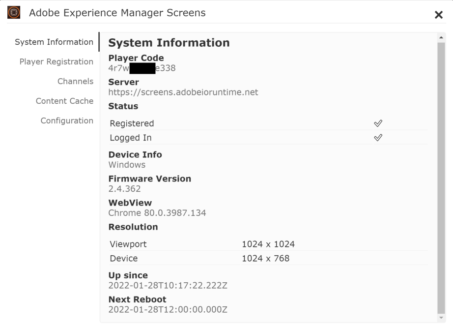

# 為您的示範網站啟用AEM Screens {#enable-screens}

瞭解在您的示範網站上啟用完整AEM Screensas a Cloud Service體驗的步驟。

>[!NOTE]
>
>AEM Screens示範需要將Screens附加元件新增到Cloud Manager程式。 瞭解 [此處](https://experienceleague.adobe.com/docs/experience-manager-cloud-service/content/screens-as-cloud-service/onboarding-screens-cloud/adding-screens-addon/add-on-new-program-screens-cloud.html) 如何新增。

## 到目前為止 {#story-so-far}

在AEM參考示範附加元件歷程的上一個檔案中， [建立示範網站，](create-site.md) 您已根據參考示範附加元件的範本建立新的示範網站。 您現在應該：

* 瞭解如何存取AEM製作環境。
* 瞭解如何根據範本建立網站。
* 瞭解導覽網站結構和編輯頁面的基本知識。

現在您已擁有自己的示範網站，可探索和瞭解可用來協助您管理示範網站的工具，您現在可以為示範網站啟用完整的AEM Screensas a Cloud Service體驗。

## 目標 {#objective}

AEM參考示範附加元件包含咖啡店垂直業務We.Cafe的AEM Screens內容。 本檔案可協助您瞭解如何在AEM Screens內容中執行We.Cafe示範設定。 閱讀本文件後，您應該：

* 瞭解AEM Screens的基本概念。
* 瞭解We.Cafe示範內容。
* 瞭解如何為We.Cafe設定AEM Screens。
   * 瞭解如何為We.Cafe建立Screens專案。
   * 能夠使用Google工作表和API設定模擬的天氣服務。
   * 根據您的「天氣服務」模擬動態變化的Screens內容。
   * 安裝並使用Screens播放器。

## 瞭解Screens {#understand-screens}

AEM Screens as a Cloud Service 是數位招牌解決方案，可讓行銷人員大規模建立和管理動態數位體驗。有了 AEM Screens as a Cloud Service，您可以建立吸引人的動態數位招牌體驗，用於公共空間。

>[!TIP]
>
>如需AEM Screensas a Cloud Service的完整詳細資訊，請參閱 [其他資源](#additional-resources) 區段。

安裝AEM參考示範附加元件後，示範撰寫環境中便會自動提供適用於AEM Screens的We.Cafe內容。 中所述的步驟 [部署示範Screens專案](#deploy-project) 可讓您發佈該內容並部署至媒體播放器等，進而啟用完整的AEM Screens體驗。

## 瞭解示範內容 {#demo-content}

We.Cafe咖啡店在美國有三家店，分佈在三個位置。 這三間商店都有三種相似的體驗：

* 計數器上方的功能表板，有兩個或三個垂直面板
* 面對街道的入口顯示，有一個水平或垂直面板邀請客戶進入商店
* 快速自助訂購資訊站亭，使用垂直平板電腦略過佇列

>[!NOTE]
>
>目前版本的示範中只能測試入口顯示。 其他顯示專案將在未來版本中推出。
>
>目前的示範版本不包含此資訊站。 未來版本將包含此功能。

假設紐約的店面較小，沒有太多空間，因此：

* 功能表主機板只有兩個垂直面板，而舊金山、聖荷西則只有三個
* 入口顯示垂直放置，而非水平放置

>[!NOTE]
>
>如果您決定連線至畫面的Cloud Service位於 [as a Cloud Service連線Screens](#connect-screens) 區段，請在顯示下方將位置建立為資料夾。 請參閱 [其他資源](#additional-resources) 區段，以取得有關顯示的詳細資訊。

### 咖啡館版面配置 {#care-layouts}

We.Cafe位置有下列配置。


>[!NOTE]
>
>熒幕的測量單位為英吋。

### 入口 {#entrance}

入口顯示已分日，只會將第一個影像從早上變更為下午。 在每次播放序列時，它也會宣傳不同的特別咖啡製品，每次都會使用計量的內嵌序列播放不同的專案。

入口色版上的最後一個影像也是根據外部溫度來鎖定目標（即動態變更），可以模擬外部溫度，如 [建立模擬資料來源](#data-source) 區段。

## 部署示範Screens專案 {#deploy-project}

為了使用您在中建立的沙箱中的示範內容 [建立計畫](create-program.md) 步驟，必須根據範本建立網站。

如果您尚未建立We.Cafe示範網站，只需依照中的相同步驟操作 [建立示範網站](create-site.md) 區段。 選取範本時，只要選擇 **We.Cafe網站範本**.


精靈完成後，您會發現內容已部署在Sites下，並且可以像瀏覽任何其他內容一樣導覽和探索。


現在您已擁有We.Cafe示範內容，您可以選擇如何測試AEM Screens：

* 如果您只想探索AEM Sites主控台中的內容，只需開始探索並探索中的更多內容 [其他資源](#additional-resources) 區段！ 無需執行其他動作。
* 如果您想體驗AEM Screens的完整動態功能，請繼續下一節， [動態變更Screens內容。](#dynamically-change)

## 動態變更Screens內容 {#dynamically-change}

和AEM Sites一樣，AEM Screens也可以根據內容動態變更內容。 We.Cafe示範已將頻道設定為根據目前溫度顯示不同內容。 為了模擬這一點，我們需要建立自己的簡單天氣服務。

### 建立模擬資料來源 {#data-source}

由於在示範期間或測試時很難變更天氣，因此必須模擬溫度變化。 我們會將溫度值儲存在AEM ContextHub呼叫用來擷取溫度的Google工作表試算表中，以模擬天氣服務。

#### 建立Google API金鑰 {#create-api-key}

首先，我們需要建立Google API金鑰來促進資料交換。

1. 登入Google帳戶。
1. 使用此連結開啟Cloud Console `https://console.cloud.google.com`.
1. 按一下「 」後方工具列左上角的目前專案名稱，以建立新專案 **Google Cloud Platform** 標籤。

   

1. 在專案選擇器對話方塊中，按一下 **新增專案**.

   

1. 為專案命名，然後按一下 **建立**.

   

1. 確認已選取您的新專案，然後使用Cloud Console控制面板中的漢堡選單，選取 **API和服務**.

   

1. 在「API和服務」視窗的左側面板中，按一下 **認證** ，然後按一下 **建立認證** 和 **API金鑰**.

   

1. 在對話方塊中，複製新的API金鑰並儲存以供稍後使用。 按一下 **關閉** 以關閉對話方塊。

#### 啟用Google Sheets API {#enable-sheets}

若要允許使用API金鑰交換Google工作表資料，您必須啟用Google工作表API。

1. 返回Google Cloud Console，網址為 `https://console.cloud.google.com` ，然後使用漢堡功能表來選取 **API和服務 — >資料庫**.

   

1. 在「API程式庫」畫面中，捲動以尋找我們的搜尋 **Google Sheets API**. 按一下它。

   

1. 在 **Google Sheets API** 視窗點按 **啟用**.

   

#### 建立Google工作表 {#create-spreadsheet}

現在您可以建立Google Sheets試算表來儲存您的天氣資料。

1. 前往 `https://docs.google.com` 並建立新的Google工作表試算表。
1. 輸入以定義溫度 `32` 在儲存格A2中。
1. 按一下以共用檔案 **共用** 位於視窗右上角及下方 **取得連結** 按一下 **變更**.

   

1. 複製下一個步驟的連結。

   

1. 找到工作表ID。

   * 工作表ID是您在複製工作表連結之後所出現的隨機字元字串 `d/` 及早於 `/edit`.
   * 例如：
      * 如果您的URL是 `https://docs.google.com/spreadsheets/d/1cNM7j1B52HgMdsjf8frCQrXpnypIb8NkJ98YcxqaEP30/edit#gid=0`
      * 工作表ID為 `1cNM7j1B52HgMdsjf8frCQrXpnypIb8NkJ98YcxqaEP30`.

1. 複製工作表ID以供日後使用。

#### 測試您的天氣服務 {#test-weather-service}

您已將資料來源建立為Google Sheets試算表，並啟用透過API的存取，接著請測試該試算表，以確保您的「天氣服務」可供存取。

1. 開啟網頁瀏覽器。

1. 輸入以下請求，取代您先前儲存的工作表ID和API金鑰值。

   ```
   https://sheets.googleapis.com/v4/spreadsheets/<yourSheetID>/values/Sheet1?key=<yourAPIKey>
   ```

1. 如果您收到類似於以下內容的JSON資料，則表示您已正確設定。

   ```json
   {
     "range": "Sheet1!A1:Z1000",
     "majorDimension": "ROWS",
     "values": [
       [],
       [
         "32"
       ]
     ]
   }
   ```

AEM Screens可使用此相同服務來存取模擬的天氣資料。 這將在下一個步驟中設定。

### 設定ContextHub {#configure-contexthub}

AEM Screens可以根據內容動態變更內容。 We.Cafe示範已設定頻道，以運用AEM ContextHub根據目前溫度顯示不同內容。

>[!TIP]
>
>如需ContextHub的完整詳細資訊，請參閱 [其他資源](#additional-resources) 區段。

當熒幕內容顯示時，ContextHub會呼叫您的天氣服務來尋找目前的溫度，以決定要顯示的內容。

為了進行示範，您可以變更工作表中的值。 ContextHub將會識別此項，而內容將根據更新後的溫度在頻道中調整。

1. 在AEMaaCS作者執行個體上，前往 **全域導覽 — >工具 — >網站 — > ContextHub**.
1. 選取與您從建立畫面專案時給予專案之名稱相同的設定容器 **We.Cafe網站範本**.
1. 選取 **設定 — > ContextHub設定 — > Google工作表** 然後按一下 **下一個** 右上角。
1. 設定應已預先設定JSON資料。 有兩個值需要變更：
   1. Replace `[your Google Sheets id]` 包含工作表ID [您先前已儲存。](#create-spreadsheet)
   1. Replace `[your Google API Key]` 使用API金鑰 [您先前已儲存。](#create-api-key)
1. 按一下「**儲存**」。

現在您可以變更Google工作表試算表中的溫度值，ContextHub會在「看到天氣變化」時動態更新Screens。

### 測試動態資料 {#test-dynamic}

現在AEM Screens和ContextHub已連線至您的天氣服務，您可以對其進行測試以瞭解Screens如何動態更新內容。

1. 存取您的沙箱編寫執行個體。
1. 透過以下方式導覽至網站主控台： **全域導覽 — >網站** 並選取下列頁面 **畫面 — > &lt;project-name> ->頻道 — >入口早上顯示（縱向）**.

   

1. 按一下工具列中的「編輯」或鍵入快速鍵 `e` 以編輯頁面。

1. 在編輯器中，您可以看到內容。 請注意，一個影像以藍色突出顯示，角落處有一個鎖定目標圖示。

   

1. 將您在試算表中輸入的溫度從32變更為70，並觀看內容變更。

   

根據溫度從冰冷的32°F (0°C)到舒適的70°F (21°C)的變化，精選影像從一杯暖茶變為一杯涼爽的冰咖啡。

>[!IMPORTANT]
>
>僅將說明的Google Sheets解決方案用於示範目的。 Adobe不支援將Google Sheets用於生產環境。

## as a Cloud Service連線Screens {#connect-screens}

如果您也想設定真正的數位看板體驗，包括在數位看板裝置或電腦上執行的播放器，請遵循後續步驟。

或者，您也可以在AEMaaCS上的管道編輯器中預覽示範。

>[!TIP]
>
>如需管道編輯器的完整詳細資訊，請參閱 [其他資源](#additional-resources) 區段。

### 設定AEM Screensas a Cloud Service {#configure-screens}

首先，您需要將Screens示範內容發佈至AEM Screensas a Cloud Service並設定服務。

1. 發佈示範Screens專案的內容。
1. 瀏覽至as a Cloud Service熒幕於 `https://experience.adobe.com/screens` 並登入。
1. 在畫面的右上方，確定您隸屬於正確的組織。

   

1. 在左上方，按一下 **編輯設定** 圖示，形狀像齒輪。

   

1. 提供您建立示範網站的AEMaaCS作者和發佈執行個體的URL，然後按一下 **儲存**.

   

1. 連線至您的示範執行個體後，Screens會提取您的頻道內容。 按一下 **頻道** ，以檢視您發佈的頻道。 填入資訊可能需要一點時間。 您可以按一下藍色 **同步** 按鈕來更新資訊。

   

1. 按一下 **顯示區** 在左側面板中。 您尚未為您的示範建立任何專案。 我們將為每個專案建立資料夾，以模擬We.Cafe的位置。 按一下 **建立** 在熒幕右上方，然後選取 **資料夾**.

   

1. 在對話方塊中，提供資料夾名稱，例如 **聖荷西** 並按一下 **建立**.

1. 按一下資料夾以將其開啟，然後按一下 **建立** 右上角並選取 **顯示**.

1. 提供顯示名稱，然後按一下 **建立**.

   

1. 建立顯示後，按一下顯示的名稱以開啟顯示詳細資訊畫面。 必須為顯示指派已從您的示範網站同步的頻道。 按一下 **指派管道** 位於熒幕右上方。

   

1. 在對話方塊中，選取頻道並按一下 **指派**.

   

您可以對其他位置和顯示重複這些步驟。 完成之後，您就會將示範網站與AEM Screens連結，並完成必要的設定。

您可以在AEMaaCS上的管道編輯器中預覽示範。

### 使用Screens播放器 {#screens-player}

若要以實際熒幕檢視內容，您可以下載播放器並在本機進行設定。 AEM Screensas a Cloud Service會將內容傳送至您的播放器

#### 產生註冊代碼 {#registration-code}

首先，您需要建立註冊碼，以安全地將播放器連線至AEM Screensas a Cloud Service。

1. 瀏覽至as a Cloud Service熒幕於 `https://experience.adobe.com/screens` 並登入。
1. 在畫面的右上方，確定您隸屬於正確的組織。

   

1. 在左側面板中，按一下 **播放器管理 — >註冊代碼** 然後按一下 **建立程式碼** 位於熒幕右上方。


1. 輸入程式碼的名稱，然後按一下 **建立**.

   

1. 建立程式碼後，它就會顯示在清單中。 按一下以復製程式碼。

   

#### 安裝及設定播放器 {#install-player}

1. 從下載您平台的播放器 `https://download.macromedia.com/screens/` 並安裝。
1. 執行播放器並切換至 **設定** 標籤，捲動至底部以按一下並確認兩者 **重設為原廠** 然後 **變更為雲端模式**.

   

1. 播放器會自動變更為 **播放器註冊** 標籤。 輸入您先前產生的程式碼，然後按一下 **註冊**.

   

1. 切換至 **系統資訊** 索引標籤以確認播放器已註冊。

   

#### 將播放器指派給顯示區 {#assign-player}

1. 瀏覽至as a Cloud Service熒幕於 `https://experience.adobe.com/screens` 並登入。
1. 在畫面的右上方，確定您隸屬於正確的組織。

   

1. 在左側面板中，按一下 **播放器管理 — >播放器** 而且您會看到先前安裝並註冊的播放器。

   

1. 按一下播放器名稱以開啟其詳細資料，然後按一下 **指派給顯示區** 在畫面的右上方。

   

1. 在對話方塊中，選取您先前建立的顯示，然後按一下 **選取**.

   

#### 播放! {#playback}

將顯示指派給播放器後，AEM Screensas a Cloud Service會將內容傳送給可顯示它的播放器。


## 下一步 {#what-is-next}

現在您已完成AEM參考示範附加元件歷程的這一部分，您應：

* 瞭解AEM Screens的基本概念。
* 瞭解We.Cafe示範內容。
* 瞭解如何為We.Cafe設定AEM Screens。

您現在已準備好使用自己的示範網站來探索AEM Screens的功能。 繼續下一段歷程， [管理您的示範網站，](manage.md) 您將在此處瞭解可用來協助您管理示範網站的工具，以及如何移除這些工具。

您也可以檢視中提供的部分其他資源 [其他資源區段](#additional-resources) 以進一步瞭解您在此歷程中看到的功能。

## 其他資源 {#additional-resources}

* [ContextHub檔案](/help/sites-cloud/authoring/personalization/contexthub.md)  — 瞭解如何使用ContextHub根據天氣條件以外的使用者內容來個人化內容。
* [使用API金鑰 — Google檔案](https://developers.google.com/maps/documentation/javascript/get-api-key)  — 方便參考使用Google API金鑰的詳細資訊。
* [顯示區](/help/screens-cloud/creating-content/creating-displays-screens-cloud.md)  — 進一步瞭解AEM Screens中的顯示及其用途。
* [下載播放器](/help/screens-cloud/managing-players-registration/installing-screens-cloud-player.md)  — 瞭解如何存取Screens播放器以及如何安裝。
* [註冊播放器](/help/screens-cloud/managing-players-registration/registering-players-screens-cloud.md)  — 瞭解如何在您的AEM Screens專案中設定並註冊播放器。
* [將播放器指派給顯示區](/help/screens-cloud/managing-players-registration/assigning-player-display.md)  — 設定播放器以顯示您的內容。
