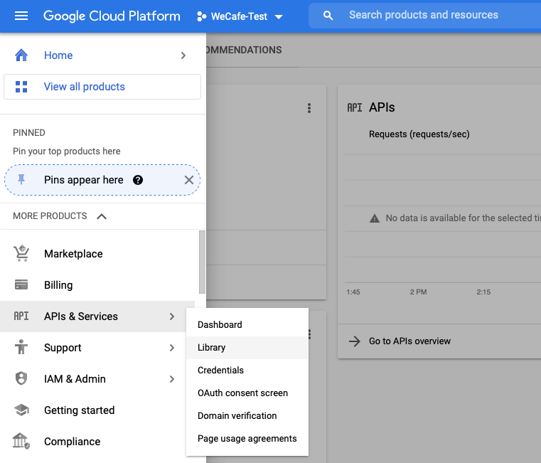
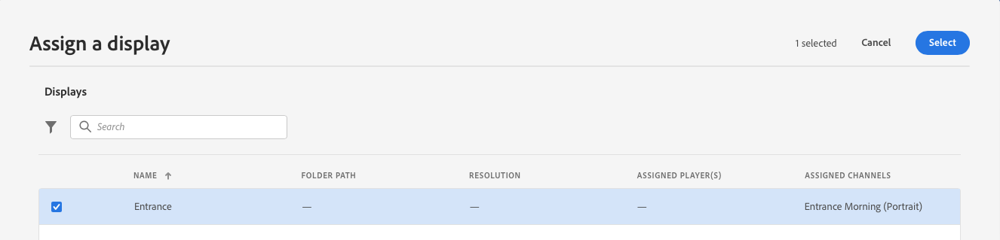

# 為您的示範網站啟用AEM Screens {#enable-screens}

了解在示範網站上啟用完整AEM Screensas a Cloud Service體驗的步驟。

>[!NOTE]
>
>AEM Screens示範需要將Screens附加元件新增至Cloud Manager計畫。 學習 [此處](https://experienceleague.adobe.com/docs/experience-manager-cloud-service/content/screens-as-cloud-service/onboarding-screens-cloud/adding-screens-addon/add-on-new-program-screens-cloud.html) 如何新增。

## 到目前為止 {#story-so-far}

在AEM參考示範附加元件歷程的上一份檔案中， [建立演示網站，](create-site.md) 您根據「參考演示附加元件」的模板建立了新的演示站點。 您現在應該：

* 了解如何存取AEM製作環境。
* 了解如何根據範本建立網站。
* 了解導覽網站結構和編輯頁面的基本知識。

現在，您擁有自己的示範網站，可探索並了解可協助您管理示範網站的工具，現在您可以為示範網站啟用完整的AEM Screensas a Cloud Service體驗。

## 目標 {#objective}

AEM參考示範附加元件包含We.Cafe的AEM Screens內容，這是一家咖啡店的垂直業務。 本檔案可協助您了解如何在AEM Screens的內容中執行We.Cafe示範設定。 閱讀後，您應：

* 了解AEM Screens的基本知識。
* 了解We.Cafe示範內容。
* 了解如何為We.Cafe設定AEM Screens。
   * 了解如何為We.Cafe建立Screens專案。
   * 可使用Google Sheets和API來設定模擬氣象服務。
   * 根據您的「天氣服務」，模擬動態變更的Screens內容。
   * 安裝並使用螢幕播放器。

## 了解螢幕 {#understand-screens}

AEM Screensas a Cloud Service是數位看板解決方案，可讓行銷人員大規模建立及管理動態數位體驗。 透過AEM Screensas a Cloud Service，您可以建立吸引人且動態的數位看板體驗，以便在公共空間使用。

>[!TIP]
>
>如需AEM Screens as a Cloud Service的完整詳細資訊，請參閱 [其他資源](#additional-resources) 部分。

安裝AEM Reference Demos附加元件後，您就能在示範製作環境中自動提供AEM Screens的We.Cafe內容。 中所述的步驟 [部署Demo Screens專案](#deploy-project) 可讓您發佈該內容並部署至媒體播放器等，以啟用完整的AEM Screens體驗。

## 了解示範內容 {#demo-content}

We.Cafe咖啡店由位於美國三個地點的三家店鋪組成。 這三家店都有三種類似的體驗：

* 計數器上方的菜單板有兩個或三個垂直面板
* 面向街道的入口顯示器，帶有一個水準或垂直的面板，邀請顧客進入商店
* 一個快速自訂資訊站亭，用一個垂直平板電腦繞過佇列

>[!NOTE]
>
>在目前的示範版本中，只能測試入口顯示。 未來版本中會隨後顯示其他顯示。
>
>示範的目前版本不包含資訊站。 它將包含在未來版本中。

紐約的店位被假定在一家沒有太多空間的小店，因此：

* 選單板只有兩個垂直面板，而非三個，適用於舊金山和聖荷西
* 入口顯示器垂直定位而不是水準定位

>[!NOTE]
>
>如果您決定連線至 [連接螢幕as a Cloud Service](#connect-screens) 部分，請將位置建立為顯示下的資料夾。 請參閱 [其他資源](#additional-resources) 區段，以取得顯示器的詳細資訊。

### 咖啡館版面 {#care-layouts}

We.Cafe位置的佈局如下。


>[!NOTE]
>
>螢幕的測量單位為英吋。

### 入口 {#entrance}

入口展覽是天分開的，從早上到下午只會改變第一張圖片。 在序列的每次通過時，它還將宣傳不同的特殊咖啡制劑，每次使用計量嵌入序列來播放不同的物品。

此外，還根據外界溫度對入口通道上的最後一幅影像進行目標定位（即動態改變），如 [建立模擬資料源](#data-source) 區段。

## 部署Demo Screens專案 {#deploy-project}

若要在您於 [建立方案](create-program.md) 步驟中，必鬚根據範本建立網站。

如果您尚未建立We.Cafe示範網站，只需依照 [建立示範網站](create-site.md) 區段。 選取範本時，只需選取 **We.Cafe網站範本**.


精靈完成後，您就會找到Sites下部署的內容，並且可以像瀏覽任何其他內容一樣導覽和探索。


現在您擁有We.Cafe示範內容，您可以選擇要如何測試AEM Screens:

* 如果您只想在AEM Sites主控台中探索內容，只要開始探索並探索 [其他資源](#additional-resources) 區段！ 不需執行任何動作。
* 如果您想體驗AEM Screens的完整動態功能，請繼續前往下一節， [動態變更畫面內容。](#dynamically-change)

## 動態變更畫面內容 {#dynamically-change}

就像AEM Sites一樣，AEM Screens也可以根據內容動態變更內容。 We.Cafe示範已設定管道，可依目前的溫度顯示不同內容。 為了模擬這種情況，我們需要建立自己的簡單氣象服務。

### 建立模擬資料源 {#data-source}

由於在演示或測試期間很難改變天氣，因此必須模擬溫度變化。 我們將在Google工作表試算表中儲存溫度值，以模擬天氣服務，AEM ContextHub會呼叫該試算表來擷取溫度。

#### 建立Google API金鑰 {#create-api-key}

首先，我們需要建立Google API金鑰以便利資料交換。

1. 登入Google帳戶。
1. 使用此連結開啟Cloud Console `https://console.cloud.google.com`.
1. 按一下工具列左上角的「目前專案名稱」，建立新專案時，應先於 **Google Cloud Platform** 標籤。

   

1. 在專案選取器對話方塊中，按一下 **新增專案**.

   

1. 為專案命名，然後按一下 **建立**.

   

1. 確認已選取您的新專案，然後使用雲端主控台控制面板中的漢堡功能表，選取 **API與服務**.

   

1. 在「 API &amp;服務」視窗的左側面板中，按一下 **憑證** 在視窗頂端，按一下 **建立憑證** 和 **API金鑰**.

   

1. 在對話方塊中，複製您的新API金鑰並儲存以供日後使用。 按一下 **關閉** 以關閉對話方塊。

#### 啟用Google工作表API {#enable-sheets}

若要允許使用您的API金鑰交換Google表單資料，您必須啟用Google表單API。

1. 返回Google Cloud Console(位於 `https://console.cloud.google.com` ，然後使用漢堡菜單選擇 **API &amp; Services ->程式庫**.

   

1. 在API程式庫畫面中，捲動以尋找搜尋項目 **Google Sheets API**. 按一下。

   

1. 在 **Google Sheets API** 按一下 **啟用**.

   

#### 建立Google工作表試算表 {#create-spreadsheet}

現在您可以建立Google工作表試算表來儲存天氣資料。

1. 前往 `https://docs.google.com` 並建立新的Google工作表試算表。
1. 通過輸入 `32` 儲存格A2。
1. 按一下 **共用** 在窗口的右上角和下面 **取得連結** 按一下 **變更**.

   

1. 複製下一步的連結。

   

1. 找出工作表ID。

   * 工作表ID是您之後複製的工作表連結中的隨機字串 `d/` 和之前 `/edit`.
   * 例如：
      * 如果您的URL為 `https://docs.google.com/spreadsheets/d/1cNM7j1B52HgMdsjf8frCQrXpnypIb8NkJ98YcxqaEP30/edit#gid=0`
      * 工作表ID為 `1cNM7j1B52HgMdsjf8frCQrXpnypIb8NkJ98YcxqaEP30`.

1. 複製工作表ID以供日後使用。

#### 測試天氣服務 {#test-weather-service}

現在您已將資料來源建立為Google工作表試算表，並啟用透過API的存取，請加以測試，以確保您的「氣象服務」可供存取。

1. 開啟網頁瀏覽器。

1. 輸入以下請求，取代您先前儲存的工作表ID和API金鑰值。

   ```
   https://sheets.googleapis.com/v4/spreadsheets/<yourSheetID>/values/Sheet1?key=<yourAPIKey>
   ```

1. 如果您收到的JSON資料類似下列，請正確設定。

   ```json
   {
     "range": "Sheet1!A1:Z1000",
     "majorDimension": "ROWS",
     "values": [
       [],
       [
         "32"
       ]
     ]
   }
   ```

AEM Screens可使用相同的服務來存取模擬的天氣資料。 這將在下一步中設定。

### 設定ContextHub {#configure-contexthub}

AEM Screens可以根據內容動態變更內容。 We.Cafe示範已設定管道，透過運用AEM ContextHub根據目前溫度來顯示不同內容。

>[!TIP]
>
>如需ContextHub的完整詳細資訊，請參閱 [其他資源](#additional-resources) 部分。

當顯示螢幕內容時，ContextHub會呼叫您的氣象服務，以尋找目前的溫度，以決定要顯示的內容。

為了示範，可以變更工作表中的值。 ContextHub會辨識此項，而內容會根據更新的溫度在通道中調整。

1. 在AEMaaCS製作例項上，前往 **全域導覽 — >工具 — >網站 — > ContextHub**.
1. 選取與您從以下項目建立Screens專案時所提供專案相同名稱的設定容器： **We.Cafe網站範本**.
1. 選擇 **設定 — > ContextHub設定 — >Google表** 然後按一下 **下一個** 在右上角。
1. 設定應已預先設定JSON資料。 有兩個值需要變更：
   1. 取代 `[your Google Sheets id]` 和工作表ID [您先前已儲存。](#create-spreadsheet)
   1. 取代 `[your Google API Key]` 與API金鑰 [您先前已儲存。](#create-api-key)
1. 按一下「**儲存**」。

現在，您可以變更Google工作表試算表中的溫度值，而ContextHub會隨著「看到天氣變化」而動態更新Screens。

### 測試動態資料 {#test-dynamic}

既然AEM Screens和ContextHub已連線至您的氣象服務，您就可以測試它，了解螢幕如何動態更新內容。

1. 存取您的沙箱作者例項。
1. 透過導覽至網站主控台 **全局導航 — >站點** 並選取下列頁面 **螢幕 — > &lt;project-name> ->頻道 — >入口早晨（縱向）**.

   

1. 按一下工具列中的「編輯」(Edit)，或鍵入快捷鍵 `e` 來編輯頁面。

1. 在編輯器中，您可以看到內容。 請注意，一個影像以藍色高亮，角落裡有一個目標圖示。

   

1. 將您在試算表中輸入的溫度從32變更為70，並觀察內容變更。

   

根據溫度從冷凍32°F(0°C)變化到舒適70°F(21°C)，該特色影像從暖杯茶變為涼冰咖啡。

>[!IMPORTANT]
>
>請僅將上述Google工作表解決方案用於示範用途。 Adobe不支援將Google工作表用於生產環境。

## 連接螢幕as a Cloud Service {#connect-screens}

如果您也想要設定真正的數位看板體驗，包括在數位看板裝置或電腦上執行的播放器，請遵循後續步驟。

或者，您也可以直接在AEMaaCS的頻道編輯器中預覽示範。

>[!TIP]
>
>如需管道編輯器的完整詳細資訊，請參閱 [其他資源](#additional-resources) 部分。

### 設定AEM Screensas a Cloud Service {#configure-screens}

首先，您需要將Screens示範內容發佈至AEM Screensas a Cloud Service並設定服務。

1. 發佈示範畫面專案的內容。
1. 導覽至as a Cloud Service於 `https://experience.adobe.com/screens` 並登入。
1. 在畫面的右上角，確定您所在的組織正確無誤。

   

1. 在左上角，按一下 **編輯設定** 表徵圖，形狀像齒輪。

   

1. 提供您建立示範網站並按一下之AEMaaCS製作和發佈例項的URL **儲存**.

   

1. 連線至您的示範執行個體後，Screens會提取您的頻道內容。 按一下 **管道** ，查看已發佈的管道。 填入資訊可能需要一些時間。 您可以按一下藍色 **同步** 按鈕以更新資訊。

   

1. 按一下 **顯示** 中。 您尚未為示範建立任何。 我們將為每個We.Cafe建立資料夾，以模擬We.Cafe的位置。 按一下 **建立** 並選取 **資料夾**.

   

1. 在對話方塊中，提供資料夾名稱，例如 **聖荷西** 按一下 **建立**.

1. 按一下資料夾，然後按一下 **建立** 並選取 **顯示**.

1. 提供顯示名稱，然後按一下 **建立**.

   

1. 建立顯示後，按一下顯示的名稱以開啟顯示詳細資訊螢幕。 必須為顯示器指派從示範網站同步的管道。 按一下 **指派管道** 在螢幕的右上角。

   

1. 在對話方塊中，選取通道並按一下 **指派**.

   

您可以對其他位置和顯示重複這些步驟。 完成後，您將示範網站與AEM Screens連結，並完成必要的設定。

您只需在AEMaCS的頻道編輯器中預覽示範即可。

### 使用Screens Player {#screens-player}

若要在實際畫面上檢視內容，您可以下載播放器，並在本機設定。 AEM Screens as a Cloud Service接著會將內容傳送至您的播放器

#### 生成註冊代碼 {#registration-code}

首先，您需要建立註冊程式碼，以安全方式將播放器連線至AEM Screensas a Cloud Service。

1. 導覽至as a Cloud Service於 `https://experience.adobe.com/screens` 並登入。
1. 在畫面的右上角，確定您所在的組織正確無誤。

   

1. 在左側面板中，按一下 **播放器管理 — >註冊代碼** 然後按一下 **建立程式碼** 在螢幕的右上角。


1. 輸入程式碼的名稱，然後按一下 **建立**.

   

1. 程式碼建立後，就會顯示在清單中。 按一下以復製程式碼。

   

#### 安裝和配置播放器 {#install-player}

1. 從下載適用於您平台的播放器 `https://download.macromedia.com/screens/` 並安裝。
1. 執行播放器，並切換至 **設定** 頁簽，滾動到底部以按一下並確認 **重置為工廠** 然後 **變更為雲端模式**.

   

1. 播放器會自動變更為 **播放器註冊** 標籤。 輸入您先前產生的程式碼，然後按一下 **註冊**.

   

1. 切換至 **系統資訊** 標籤，確認播放器已註冊。

   

#### 將播放器指派給顯示器 {#assign-player}

1. 導覽至as a Cloud Service於 `https://experience.adobe.com/screens` 並登入。
1. 在畫面的右上角，確定您所在的組織正確無誤。

   

1. 在左側面板中，按一下 **播放器管理 — >播放器** 您會看到您先前安裝和註冊的播放器。

   

1. 按一下播放器名稱以開啟其詳細資訊，然後按一下 **指派給顯示** 在螢幕的右上角。

   

1. 在對話方塊中，選取您先前建立的顯示，然後按一下 **選擇**.

   

#### 播放! {#playback}

將顯示畫面指派給播放器後，AEM Screens as a Cloud Service會將內容傳送至可見的播放器。


## 下一步 {#what-is-next}

現在您已完成AEM Reference Demo Add-On歷程的這一部分，您應：

* 了解AEM Screens的基本知識。
* 了解We.Cafe示範內容。
* 了解如何為We.Cafe設定AEM Screens。

您現在可以使用自己的示範網站來探索AEM Screens的功能。 繼續前往歷程的下一個區段， [管理您的示範網站，](manage.md) 您將在何處了解可協助您管理示範網站的工具，以及如何移除示範網站。

您也可以查看 [「其他資源」部分](#additional-resources) 以進一步了解您在此歷程中看到的功能。

## 其他資源 {#additional-resources}

* [ContextHub檔案](/help/sites-cloud/authoring/personalization/contexthub.md)  — 了解如何使用ContextHub，根據天氣狀況以外的使用者內容個人化內容。
* [使用API金鑰 — Google檔案](https://developers.google.com/maps/documentation/javascript/get-api-key)  — 使用Google API金鑰的詳細資訊，此為實用參考。
* [顯示](/help/screens-cloud/creating-content/creating-displays-screens-cloud.md)  — 深入了解AEM Screens中的顯示內容及其功能。
* [下載播放器](/help/screens-cloud/managing-players-registration/installing-screens-cloud-player.md)  — 了解如何存取Screens Player及如何安裝。
* [註冊播放器](/help/screens-cloud/managing-players-registration/registering-players-screens-cloud.md)  — 了解如何透過您的AEM Screens專案設定和註冊播放器。
* [將播放器指派給顯示器](/help/screens-cloud/managing-players-registration/assigning-player-display.md)  — 設定播放器以顯示您的內容。
