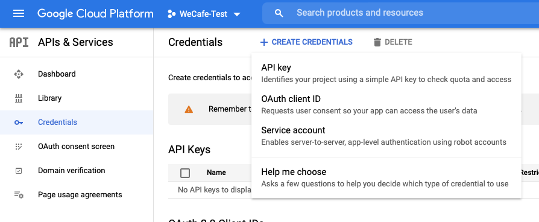

# 為您的示範網站啟用 AEM Screens {#enable-screens}

了解在您的示範網站上啟用完整 AEM Screens as a Cloud Service 體驗的步驟。

>[!NOTE]
>
>AEM Screens 示範要求將 Screens Add-on 新增至 Cloud Manager 方案。透過「[將 Screens 作為附加元件新增至 Cloud Manager 的新程式](/help/screens-cloud/onboarding-screens-cloud/add-on-new-program-screens-cloud.md)」了解如何新增它。

## 目前進度 {#story-so-far}

在 AEM 參考示範附加元件歷程的上一個文件「[建立示範網站](create-site.md)」中，您根據參考示範附加元件的範本建立一個示範網站。您現在應該：

* 了解如何存取 AEM 製作環境。
* 了解如何根據範本建立網站。
* 了解導覽網站結構和編輯頁面的基礎知識。

現在您已經有了自己的示範網站可供探索，並了解了可協助您管理示範網站的工具，接下來可以為您的簡報網站啟用完整的 AEM Screens as a Cloud Service 體驗。

## 目標 {#objective}

AEM 參考示範附加元件包含適用於咖啡店垂直業務 We.Cafe 的 AEM Screens 內容。本文件協助您了解如何在 AEM Screens 內容中執行 We.Cafe 示範設定。閱讀文件後，您應該：

* 了解 AEM Screens 的基礎知識。
* 了解 We.Cafe 示範內容。
* 了解如何針對 We.Cafe 設定 AEM Screens。
   * 了解如何建立 We.Cafe 的 Screens 專案。
   * 能夠使用 Google Sheets 和 API 設定模擬天氣服務。
   * 根據您的「天氣服務」模擬動態變化的 Screens 內容。
   * 安裝並使用 Screens Player。

## 了解 Screens {#understand-screens}

AEM Screens as a Cloud Service 是數位招牌解決方案，可讓行銷人員大規模建立和管理動態數位體驗。利用 AEM Screens as a Cloud Service，您可以建立要在公共空間使用的吸引人的動態數位招牌體驗。

>[!TIP]
>
>有關 AEM Screens as a Cloud Service 的完整詳細資訊，請參閱本文件結尾處的「[其他資源](#additional-resources)」區段。

透過安裝 AEM 參考示範附加元件，您會自動在示範製作環境中獲得 AEM Screens 適用的 We.Cafe 內容。在「[部署示範 Screens 專案](#deploy-project)」中說明的步驟，會發佈該內容並部署到媒體播放器等，讓您啟用完整的 AEM Screens 體驗。

## 了解示範內容 {#demo-content}

We.Cafe 咖啡店包含位於美國三個地點的三家咖啡店。這三家咖啡店都有三種相似的體驗：

* 櫃檯上方有菜單展示板，上有兩個或三個垂直面板
* 面向街道的入口顯示區，附有一個水平或垂直面板，吸引顧客進入咖啡店
* 快速自助點餐機，只需一台直立式平板電腦即可不必排隊

>[!NOTE]
>
>在目前的示範版本中，只能測試入口顯示區。在未來版本中將會包含其他顯示區。
>
>目前版本的示範中不包括點餐機。在未來的版本中會包含點餐機。

假設紐約的位置是一家沒有太多空間的小型咖啡店，因此：

* 這裡的菜單展示板只有兩個垂直面板，而不像舊金山和聖荷西的菜單展示板有三個垂直面板
* 入口顯示區垂直放置而不是水平放置

>[!NOTE]
>
>如果您決定連接到 [Connect Screens as a Cloud Service](#connect-screens) 區段中的 Screens Cloud Service，在顯示區下將位置建立為資料夾。如需有關顯示區的更多資訊，請參閱本文件結尾處的「[其他資源](#additional-resources)」區段。

### 咖啡館佈局 {#care-layouts}

We.Cafe 位置的格局如下。


>[!NOTE]
>
>螢幕尺寸以英吋為單位。

### 入口 {#entrance}

入口顯示區是日間分段顯示，從早上到下午只會更換第一張影像。在每一回接連展示的內容中，它還宣傳不同的特別咖啡準備方式，使用計量嵌入式連播內容，每次播放不同的項目。

入口頻道的最後一個影像也會根據室外溫度來決定目標 (即動態變化)，可以按照「[建立模擬資料來源](#data-source)」區段進行模擬。

## 部署示範 Screens 專案 {#deploy-project}

若要使用您在「[建立方案](create-program.md)」步驟建立的沙箱中的示範內容，您必須根據範本來建立網站。

如果您尚未建立 We.Cafe 示範網站，只需按照「[建立示範網站](create-site.md)」區段所述相同步驟即可。選擇範本時，直接選擇「**We.Cafe 網站範本**」。


在精靈完成後，您會找到部署在 Sites 之下的內容，而且可以像導覽任何其他內容一樣進行導覽和探索。


現在您已經有 We.Cafe 示範內容，您可以選擇 AEM Screens 的測試方式：

* 如果您只想探索 AEM Sites 主控台中的內容，請開始探索「[其他資源](#additional-resources)」區段並搜尋更多資訊！無需採取更多動作。
* 如果您想體驗 AEM Screens 的完整動態功能，請繼續閱讀下一區段「[動態變更 Screens 內容](#dynamically-change)」。

## 動態變更 Screens 內容 {#dynamically-change}

就像 AEM Sites 一樣，AEM Screens 可以根據環境動態變更內容。We.Cafe 示範具備已設定的頻道，可根據目前溫度顯示不同的內容。要模擬這種體驗，您必須建立自己的簡易天氣服務。

### 建立模擬的資料來源 {#data-source}

由於在示範或測試期間很難改變天氣，因此必須模擬溫度變化。模擬天氣服務的方法是將溫度值儲存在 Google Sheet 試算表，並由 AEM 的 ContextHub 呼叫來擷取溫度。

#### 建立 Google API 金鑰 {#create-api-key}

首先，您必須建立一個 Google API 金鑰以方便資料交換。

1. 登入 Google 帳戶。
1. 使用此連結 `https://console.cloud.google.com` 開啟 Cloud Console。
1. 按一下 **Google Cloud Platform** 標籤之後工具列左上角目前的專案名稱來建立專案。

   

1. 在專案選擇器對話框中，按一下「**新增專案**」。

   

1. 提供專案名稱並按一下「**建立**」。

   

1. 確保選取您的新專案，然後使用 Cloud Console 儀表板中的漢堡菜單，選取「**API 和服務**」。

   

1. 在「API 和服務」視窗的左邊面板中，按一下視窗上方的「**認證**」，再挾一下「**建立認證**」和「**API 金鑰**」。

   

1. 在對話框中，複製新的 API 金鑰並儲存以供日後使用。按一下「**關閉**」以便退出該對話框。

#### 啟用 Google Sheets API {#enable-sheets}

若要允許使用 API 金鑰進行 Google Sheets 資料交換，您必須啟用 Google Sheets API。

1. 返回您的專案的 Google Cloud 主控台 (`https://console.cloud.google.com`)，然後使用漢堡菜單選取&#x200B;**「API 和服務」>「程式庫」**。

   

1. 在「API 程式庫」畫面中，捲動尋找您要搜尋的「**Google Sheets API**」，然後按一下它。

   

1. 在「**Google Sheets API**」視窗中，按一下「**啟用**」。

   

#### 建立 Google Sheets 試算表 {#create-spreadsheet}

現在，您可以建立 Google Sheets 試算表來儲存天氣資料。

1. 前往 `https://docs.google.com` 並建立一個 Google Sheets 試算表。
1. 在儲存格 A2 中輸入 `32` 來定義溫度。
1. 共用文件，按一下視窗右上角的「**共用**」，然後在「**取得連結**」之下，按一下「**變更**」。

   

1. 複製下一步的連結。

   

1. 找到工作表 ID。

   * 工作表 ID 是您在 `d/` 之後和 `/edit` 之前複製的在工作表連結中的任意字元字串。
   * 例如：
      * 如果您的 URL 是 `https://docs.google.com/spreadsheets/d/1cNM7j1B52HgMdsjf8frCQrXpnypIb8NkJ98YcxqaEP30/edit#gid=0`
      * 工作表 ID 是 `1cNM7j1B52HgMdsjf8frCQrXpnypIb8NkJ98YcxqaEP30`。

1. 複製工作表 ID 以供將來使用。

#### 測試您的天氣服務 {#test-weather-service}

現在您已將資料來源建立為 Google Sheets 試算表並透過 API 啟用存取，請進行測試以確保您的「天氣服務」可存取。

1. 開啟網頁瀏覽器。

1. 輸入以下請求，取代您先前儲存的工作表 ID 和 API 金鑰。

   ```
   https://sheets.googleapis.com/v4/spreadsheets/<yourSheetID>/values/Sheet1?key=<yourAPIKey>
   ```

1. 如果您收到類似以下內容的 JSON 資料，則表示您的設定正確。

   ```json
   {
     "range": "Sheet1!A1:Z1000",
     "majorDimension": "ROWS",
     "values": [
       [],
       [
         "32"
       ]
     ]
   }
   ```

AEM Screens 可以使用相同的服務來存取在下一個步驟中設定的模擬天氣資料。

### 設定 ContextHub {#configure-contexthub}

AEM Screens 可以根據環境動態變更內容。We.Cafe 示範具備已設定的頻道，可使用 AEM 的 ContextHub 根據目前溫度顯示不同的內容。

>[!TIP]
>
>有關 ContextHub 的完整詳細資訊，請參閱本文件結尾處的「[其他資源](#additional-resources)」區段。

當螢幕內容顯示時，ContextHub 會呼叫您的天氣服務來尋找目前溫度，以確定要顯示的內容。

出於示範目的，工作表中的值可以變更。ContextHub 認識到這一事實，並根據最新溫度調整頻道中的內容。

1. 在 AEMaaCS 作者執行個體上，前往「**全球導覽」>「工具」>「網站」>「ContextHub**」。
1. 選擇設定容器，其名稱與您使用「**We.Cafe 網站範本**」建立 Screens 專案時所指定的專案名稱相同。
1. 選擇&#x200B;**「設定」>「ContextHub 設定」>「Google Sheets」**，然後按一下右上角「**下一個**」。
1. 設定應該已經有預先設定的 JSON 資料。有兩個值必須變更：
   1. 取代 `[your Google Sheets id]`，使用[您之前儲存的](#create-spreadsheet)工作表 ID 來。
   1. 取代 `[your Google API Key]`，使用[您之前儲存的](#create-api-key) API 金鑰。
1. 按一下「**儲存**」。

現在，您可以變更 Google Sheet 試算表中的溫度值，ContextHub 會在「看到天氣變化」時動態更新 Screens。

### 測試動態資料 {#test-dynamic}

現在，AEM Screens 和 ContextHub 已連接到您的天氣服務，您可以對其進行測試以了解畫面如何動態更新內容。

1. 存取您的沙箱作者執行個體。
1. 透過「**全球導覽 > 網站**」導覽到 Sites 主控台，並選取以下頁面&#x200B;**「Screens」>「&lt;project-name>」>「頻道」>「入口早晨 (縱向)」**。

   

1. 按一下工具列中的「**編輯**」或輸入快速鍵 `e`，這樣便可以編輯頁面。

1. 您可以在編輯器中看到內容。一張影像以藍色加強標示，並在角落有一個瞄準圖示。

   

1. 將您在試算表中輸入的溫度從 32 更改為 70，並觀察內容變更。

   

根據溫度從冰凍的 32°F (0°C) 到舒適的 70°F (21°C) 的變化，精選影像從一杯熱茶變成一杯冰咖啡。

>[!IMPORTANT]
>
>所述 Google Sheets 解決方案僅可用於示範。Adobe 不支援在生產環境中使用 Google Sheets。

## 連接 Screens as a Cloud Service {#connect-screens}

如果您還想設定真正的數位招牌體驗，包括在數位招牌裝置或電腦上執行的播放器，請按照以下步驟操作。

或者，您可以直接在 AEMaaCS 上的頻道編輯器中預覽示範。

>[!TIP]
>
>有關頻道編輯器的完整詳細資訊，請參閱本文件結尾處的「[其他資源](#additional-resources)」區段。

### 設定 AEM Screens as a Cloud Service {#configure-screens}

首先，您必須將 Screens 示範內容發佈到 AEM Screens as a Cloud Service 並設定該服務。

1. 發布示範 Screens 專案的內容。
1. 導覽至 Screens as a Cloud Service (`https://experience.adobe.com/screens`) 並登入。
1. 在螢幕右上角，確保您位在正確的組織中。

   

1. 在左上角附近，按一下「**編輯設定**」圖示，形狀像齒輪。

   

1. 提供 AEMaaCS 作者的 URL 並在您建立示範網站的地方發佈執行個體，然後按一下「**儲存**」。

   

1. 連接到您的示範執行個體後，Screens 就會提取您的頻道內容。按一下左側面板的「**頻道**」，以便可以看到已發佈的頻道。填入資訊可能需要一些時間。您可以按一下畫面右上角的藍色「**同步**」按鈕來更新資訊。

   

1. 在左側面板按一下「**顯示區**」。您還沒有為您的示範建立任何顯示內容。您可以建立每個位置的資料夾來模擬 We.Cafe 的位置。在畫面右上角按一下「**建立**」並選取「**資料夾**」。

   

1. 在對話框中，提供資料夾名稱，例如「**聖荷西**」然後按一下「**建立**」。

1. 按一下資料夾將其開啟，然後按一下右上角的「**建立**」並選取「**顯示區**」。

1. 提供顯示區名稱，然後按一下「**「建立」**」。

   

1. 建立顯示區後，按一下顯示區的名稱以開啟顯示區詳細資訊畫面。顯示區必須指派一個與示範網站同步的頻道。按一下畫面右上角的「**指派頻道**」。

   

1. 在對話框中選擇頻道並挾一下「**指派**」。

   

您可以對其他位置和顯示區重複這些步驟。完成後，您已將非範網站與 AEM Screens 連結並完成必要的設定。

您可以直接在 AEMaaCS 上的頻道編輯器中預覽示範。

### 使用 Screens Player {#screens-player}

要在實際畫面上查看內容，您可以下載播放器並在本機進行設定。AEM Screens as a Cloud Service 將內容傳遞到您的播放器

#### 產生註冊代碼 {#registration-code}

首先，您必須建立註冊代碼，將播放器安全地連接到 AEM Screens as a Cloud Service。

1. 導覽至 Screens as a Cloud Service (`https://experience.adobe.com/screens`) 並登入。
1. 在螢幕右上角，確保您位在正確的組織中。

   

1. 在左側面板中，按一下&#x200B;**「播放器管理」>「註冊代碼」**，然後按一下螢幕右上角的「**建立程式碼**」。


1. 輸入代碼的名稱，然後按一下「**建立**」。

   

1. 建立代碼後，它會顯示在清單中。按一下複製代碼。

   

#### 安裝與設定播放器 {#install-player}

1. 從 `https://download.macromedia.com/screens/` 下載您的平台適用的播放器並進行安裝。
1. 執行播放器，然後切換到「**設定**」標籤。
1. 捲動到底部，然後按一下並確認「**重設為出廠設定**」和「**變更為雲端模式**」兩個選項。

   

1. 播放器自動切換到「**播放器註冊**」標籤。輸入您之前產生的代碼並按一下「**註冊**」。

   

1. 切換到「**系統資訊**」標籤，確認播放器已註冊。

   

#### 將播放器指派到顯示區 {#assign-player}

1. 導覽至 Screens as a Cloud Service (`https://experience.adobe.com/screens`) 並登入。
1. 在螢幕右上角，確保您位在正確的組織中。

   

1. 在左側面板中，按一下&#x200B;**「播放器管理」>「播放器」**，您會看到先前安裝並註冊的播放器。

   

1. 按一下播放器名稱即可開啟其詳細資訊。按一下畫面右上角的「**指派給顯示區**」。

   

1. 在對話框中，選取您先前建立的顯示區，然後按一下「**選取**」。

   

#### 播放！ {#playback}

將顯示區指派給播放器後，AEM Screens as a Cloud Service 會將內容傳遞到播放器讓大家看見。


## 下一步 {#what-is-next}

您已完成 AEM 參考示範附加元件歷程的這個部分，您應該：

* 了解 AEM Screens 的基礎知識。
* 了解 We.Cafe 示範內容。
* 了解如何針對 We.Cafe 設定 AEM Screens。

現在您已準備好使用自己的示範網站探索 AEM Screens 的功能。繼續歷程的下個區段「[管理您的示範網站](manage.md)」，從中了解可協助您管理示範網站的工具以及如何移除它們。

您也可以查看「[其他資源](#additional-resources)」區段提供的其他資源，詳細了解您在此歷程中看到的功能。

## 其他資源 {#additional-resources}

* [ContextHub 文件](/help/sites-cloud/authoring/personalization/contexthub.md) - 了解如何使用 ContextHub 根據天氣條件之外的使用者情境來打造個人化內容。
* [使用 API 金鑰 - Google 文件](https://developers.google.com/maps/documentation/javascript/get-api-key) - 有關使用 Google API 金鑰的詳細資訊的簡易參考。
* [顯示區](/help/screens-cloud/creating-content/creating-displays-screens-cloud.md) - 詳細了解 AEM Screens 中的顯示內容及其功能。
* [下載播放器](/help/screens-cloud/managing-players-registration/installing-screens-cloud-player.md) - 了解如何存取 Screens Player 以及如何安裝。
* [註冊播放器](/help/screens-cloud/managing-players-registration/registering-players-screens-cloud.md) - 了解如何在 AEM Screens 專案中設定和註冊播放器。
* [將播放器指派到顯示區](/help/screens-cloud/managing-players-registration/assigning-player-display.md) - 設定播放器來顯示您的內容。
