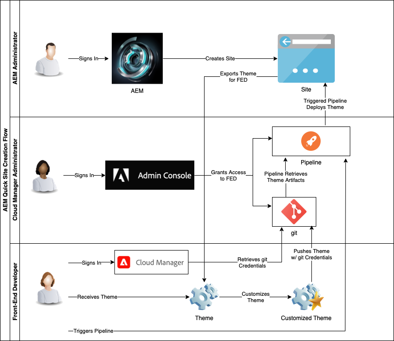

# 瞭解雲管理器和快速站點建立工作流 {#understand-cloud-manager}

瞭解Cloud Manager及其如何將新的快速站點建立過程聯繫起來。

>[!TIP]
>
>如果您的角色只是前端開發，則可以跳到文章 [檢索Git儲存庫訪問資訊](retrieve-access.md) 在這段旅程中。
>
>如果您是AEM管理員、Cloud Manager管理員，負責前端開發和管理員任務，或者只想瞭解前端開發中的端到端流程，繼續閱讀當前文檔並繼續此行程。

## 目標 {#objective}

本文檔幫助您瞭解快速AEM站點建立工具的工作原理，並提供端到端流的概述。 閱讀完後，您應：

* 瞭解AEM Sites和雲管理器如何協作以促進前端開發
* 瞭解前端定制步驟如何與完全脫離，AEM並且不需AEM要知識。

本文檔將重點介紹快速站點建立解決方案的這些基本部分，然後再轉到開始配置的下一步。

儘管建議您分步完成此過程，但如果您已經瞭解AEM Sites和雲管理器協同工作並希望直接開始配置，您可以 [跳到旅程的下一步。](create-site.md)

## 責任角色 {#responsible-role}

此部分旅程適用於管AEM理員和Cloud Manager管理員。

## 要求和先決條件 {#requirements-prerequisites}

在開始使用快速站點建立工具建立和自定義站點之前，有幾項要求。

由於此行程是面向前端開發人員、管理員和所有角色組合的，因此此處列出了對這兩種角色的要求。

瞭解前端開發人員無需訪問或AEM瞭解這一點非常重要。

### 知識 {#knowledge}

| 知識 | 角色 |
|---|---|
| 瞭解前端開發的標準工具和流程 | 前端開發人員 |
| 有關如何建立和管理站點的基本知AEM識 | AEM 管理員 |
| 雲管理器的基本知識 | Cloud Manager管理員 |

對於前端開發人員，AEM無需任何知識。

### 工具 {#tools}

| 工具 | 角色 |
|---|---|
| 首選前端開發環境 | 前端開發人員 |
| npm | 前端開發人員 |
| 網路包 | 前端開發人員 |
| 訪問雲管理器 | Cloud Manager管理員 |
| 是 **業務所有者** 雲管理器中的角色 | Cloud Manager管理員 |
| 在雲管理器中擔任系統管理員 | Cloud Manager管理員 |
| 訪問Admin Console | Cloud Manager管理員 |
| 是 **部署管理器** 雲管理器中的角色 | Cloud Manager管理員 |
| 是 **部署管理器** 雲管理器中的角色 | 前端開發人員 |

對於前端開發人員，無需AEM使用。

>[!TIP]
>
>如果您不熟悉雲管理器角色和角色管理，請參閱中的「基於角色的權限」文檔 [其他資源](#additional-resources) 的子菜單。

## Cloud Manager {#cloud-manager}

Cloud Manager是as a Cloud Service的AEM重要元件，是平台的單一入口點。

為支援具有企業開發設定的客AEM戶，as a Cloud Service與Cloud Manager及其專門構建的CI/CD管道完全整合。 快速站點建立工具擴展了這些功能，以支援專用的前端開發管道。

為了完成此旅程，不需要完全瞭解雲管理器。 在高級別上，Cloud Manager由若干級別的結構組成。

* **租戶**  — 每個客戶都有租戶。
* **程式。**  — 每個租戶都有一個或多個計畫，這些計畫通常反映客戶的許可解決方案。
* **環境**  — 每個計畫都有多個環境，例如為即時內容製作、一個用於試運行，一個用於開發。
* **儲存庫**  — 這些環境具有用於維護應用程式和前端代碼的Git儲存庫。
* **工具和工作流**  — 管道管理從儲存庫到環境的代碼部署。

一個示例通常有助於將此層次結構置於背景中。

* WKND旅行和冒險企業可能是 **租戶** 以旅行相關媒體為主。
* WKND旅遊和冒險企業租戶可能有兩個 **方案**:WKND雜誌的一個網站項目和WKND媒體的一個資產項目。
* WKND雜誌和WKND媒體項目都將具有開發、舞台和製作 **環境**。

## 快速建立站點前端開發流程 {#flow}

即使您尚未擁有豐富的雲管理器經驗，整個流程也簡單直觀。

1. 管AEM理員登錄到AEM環境，並使用站點模板建立新站點。
1. Cloud Manager管理員在Cloud Manager中建立前端管道。 該管道協調從Git儲存庫到環境的代AEM碼部署。
1. 管AEM理員從程式實例AEM中導出站點主題，並將其提供給前端開發人員。
1. Cloud Manager管理員授予前端開發人員對Git儲存庫的訪AEM問權限，在該儲存庫中可提交自定義項。
1. 前端開發人員檢索訪問git和管道的訪問憑據。
1. 前端開發人員定制主題，使用代理從站點使用實際內容對其進行測試，然後將更改提交到Git儲存庫。
1. 前端開發人員執行管道，以將主題定制部署到程式的生產環境。

使用快速站點建立工具的主要優勢是純前端開發人員只負責實際的定製。 前端開發人員沒有與任何交AEM互，也不需要任何知AEM識。

## 下一步是什麼 {#what-is-next}

現在，您已完成快速站點創AEM建過程的這一部分：

* 瞭解AEM Sites和雲管理器如何協作以促進前端開發
* 瞭解前端定制步驟如何與完全脫離，AEM並且不需AEM要知識。

在此知識基礎上構建並繼AEM續快速建立網站的過程，方法是下次查看文檔 [從模板建立站點，](create-site.md) 您將在其中學習如何使用模板快AEM速建立新站點。

## 其他資源 {#additional-resources}

建議您通過審閱文檔進入快速站點建立過程的下一部分 [從模板建立站點，](create-site.md) 下面是一些附加的可選資源，這些資源對本文檔中提到的一些概念進行了更深入的瞭解，但不需要繼續旅行。

* [Cloud Manager文檔](https://experienceleague.adobe.com/docs/experience-manager-cloud-service/onboarding/onboarding-concepts/cloud-manager-introduction.html)  — 如果您想更詳細地瞭解Cloud Manager的功能，則可能需要直接查閱深入的技術文檔。
* [基於角色的權限](https://experienceleague.adobe.com/docs/experience-manager-cloud-manager/using/requirements/role-based-permissions.html)  — 雲管理器具有預配置的具有適當權限的角色。 有關這些角色以及如何管理這些角色的詳細資訊，請參閱本文檔。
* [npm](https://www.npmjs.com)  — 用AEM於快速構建站點的主題基於npm。
* [網路包](https://webpack.js.org)  — 用AEM於快速構建網站的主題依賴webpack。
