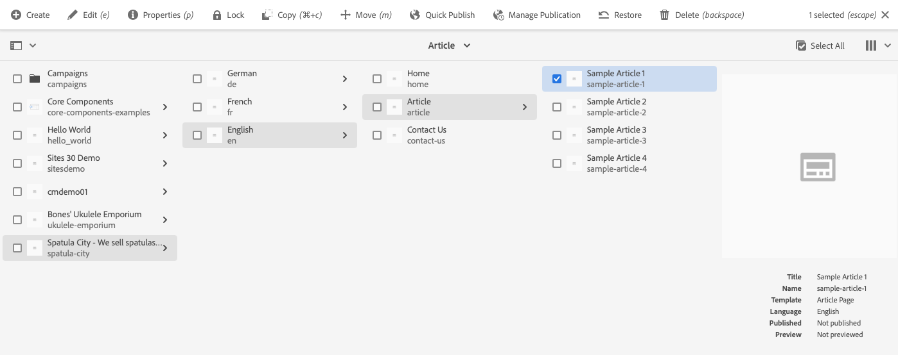
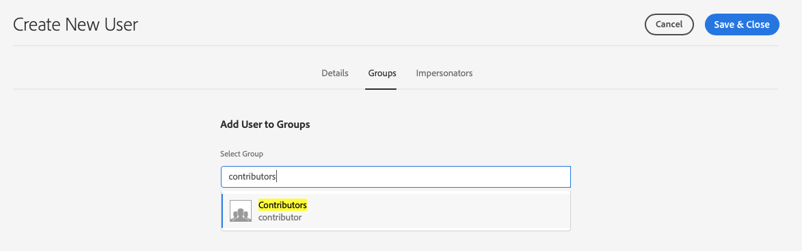

# 從範本建立網站 {#create-site-from-template}

了解如何使用網站範本快速建立新AEM網站。

## 迄今為止的故事 {#story-so-far}

在AEM快速網站建立歷程的上一份檔案中， [了解Cloud Manager和快速網站建立工作流程，](cloud-manager.md) 您已了解Cloud Manager及其如何將新的快速網站建立程式連結在一起，您現在應：

* 了解AEM Sites與Cloud Manager如何共同合作以促進前端開發
* 了解前端自訂步驟如何與AEM完全分離，且不需要AEM知識。

本文以這些基本知識為基礎，因此您可以執行第一個配置步驟，並從範本中建立新網站，以後可使用前端工具自訂。

## 目標 {#objective}

本檔案可協助您了解如何使用網站範本快速建立新AEM網站。 閱讀後，您應：

* 了解如何取得AEM網站範本。
* 了解如何使用範本建立新網站。
* 了解如何從您的新網站下載範本，以提供給前端開發人員。

## 負責角色 {#responsible-role}

此部分的歷程會套用至AEM管理員。

## 網站範本 {#site-templates}

網站範本是將基本網站內容結合為方便且可重複使用套件的方式。 網站範本通常包含基本網站內容和結構，以及網站樣式資訊，以便快速開始新網站。 實際結構如下：

* `files`:包含UI套件、XD檔案和其他檔案的資料夾
* `previews`:包含網站範本螢幕擷取畫面的資料夾
* `site`:針對從此範本建立的每個網站（如頁面範本、頁面等）所複製的內容套件。
* `theme`:範本主題的來源，以修改網站的外觀，包括CSS、JavaScript等。

範本功能強大，因為可重複使用，讓您的內容作者可以快速建立網站。 由於AEM安裝中提供多個範本，因此您有彈性可滿足各種業務需求。

>[!NOTE]
>
>網站範本與頁面範本不容混淆。 此處說明的網站範本定義網站的整體結構。 頁面範本會定義個別頁面的結構和初始內容。

## 取得網站範本 {#obtaining-template}

開始使用最簡單的方式是 [從其GitHub存放庫下載最新版的AEM標準網站範本。](https://github.com/adobe/aem-site-template-standard/releases)

下載後，您就可以像上傳任何其他套件一樣，將其上傳至AEM環境。 請參閱 [「其他資源」部分](#additional-resources) 如需有關本主題的詳細資訊，請參閱如何使用套件的詳細資訊。

>[!TIP]
>
>您可以自訂AEM標準網站範本，以符合專案的需求，並避免進一步自訂。 不過，此主題不在本歷程的討論範圍內。 如需詳細資訊，請參閱標準網站範本的GitHub檔案。

>[!TIP]
>
>您也可以選擇在專案工作流程中從來源建立範本。 不過，此主題不在本歷程的討論範圍內。 如需詳細資訊，請參閱標準網站範本的GitHub檔案。

## 安裝網站範本 {#installing-template}

使用範本建立新網站相當簡單。

1. 登入AEM製作環境，並導覽至Sites主控台

   * `https://<your-author-environment>.adobeaemcloud.com/sites.html/content`

1. 點選或按一下 **建立** 在畫面右上方，從下拉式功能表中選取 **範本網站**.

   

1. 在「建立網站」精靈中，點選或按一下 **匯入** 在左欄頂端。

   

1. 在檔案瀏覽器中，找到範本 [您先前下載的](#obtaining-template) 點選或按一下 **上傳**.

1. 上傳後，它會顯示在可用範本清單中。 點選或按一下以選取範本（這也會在右欄中顯示範本的相關資訊），然後點選或按一下 **下一個**.

   

1. 提供您網站的標題。 若省略，可提供網站名稱或從標題產生網站名稱。

   * 網站標題會顯示在瀏覽器標題列中。
   * 網站名稱會成為URL的一部分。

1. 點選或按一下 **建立** 並從網站範本建立新網站。

   

1. 在顯示的確認對話方塊中，點選或按一下 **完成**.

   

1. 在網站主控台中，新網站會可見且可導覽，以探索範本所定義的基本結構。

   

內容作者現在可以開始編寫。

## 是否需要進一步自訂？ {#customization-required}

網站範本功能強大且靈活，可為專案建立任何數字，以方便建立網站變數。 根據您所使用網站範本上已執行的自訂層級，您甚至不需要額外的前端自訂。

* 如果您的網站不需要其他自訂，恭喜！ 你的旅程到此結束！
* 如果您仍需要其他前端定制，或者只想了解完整流程以備將來需要定制，請繼續閱讀。

## 範例頁面 {#example-page}

如果您確實需要額外的前端自訂，請記住，前端開發人員可能不熟悉您內容的詳細資訊。 因此，最好為開發人員提供一條通向典型內容的路徑，當主題被定制時，這些路徑可用作參考的基礎。 網站的主版語言首頁就是典型的範例。

1. 在網站瀏覽器中，導覽至網站主版語言的首頁，然後點選或按一下頁面以選取，然後點選或按一下 **編輯** 的下限。

   

1. 在編輯器中，選取 **頁面資訊** 按鈕，然後 **查看已發佈**.

   

1. 在開啟的標籤中，從位址列複製內容的路徑。 看起來會像 `/content/<your-site>/en/home.html?wcmmode=disabled`.

   

1. 儲存路徑，以便稍後提供給前端開發人員。

## 下載主題 {#download-theme}

現在，網站已建立完畢，即可下載範本產生的網站主題，並提供給前端開發人員自訂。

1. 在網站主控台上，顯示 **網站** 欄。

   

1. 點選或按一下新網站的根目錄，然後點選或按一下 **下載主題來源** 欄。

   

下載檔案中現在有主題源檔案的副本。

## 設定代理用戶 {#proxy-user}

若要讓前端開發人員使用您網站的實際AEM內容預覽自訂內容，您必須設定Proxy使用者。

1. 在AEM中，從主導覽前往 **工具** -> **安全性** -> **使用者**.
1. 在使用者管理主控台中，點選或按一下 **建立**.

   
1. 在 **建立新用戶** 窗口，您至少必須提供：
   * **ID**  — 請注意此值，因為您必須將它提供給前端開發人員。
   * **密碼**  — 將此值安全地保存在密碼保管庫中，因為您必須將其提供給前端開發人員。

   

1. 在 **群組** 頁簽，將代理用戶添加到 `contributors` 群組。
   * 在詞語中輸入 `contributors` 觸發AEM自動完成功能，方便選取群組。

   

1. 點選或按一下 **儲存並關閉**.

您現在已完成設定。 內容作者現在可以開始在網站上建立內容，準備在歷程的下一個步驟中開始進行前端自訂。

## 下一步 {#what-is-next}

現在您已完成AEM快速網站建立歷程的這一部分，您應：

* 了解如何取得AEM網站範本。
* 了解如何使用範本建立新網站。
* 了解如何從您的新網站下載範本，以提供給前端開發人員。

基於此知識，並透過接下來檢閱檔案，繼續建立AEM快速網站的歷程 [設定管道，](pipeline-setup.md) 您將在此處建立前端管道，以管理網站主題的自訂。

## 其他資源 {#additional-resources}

建議您透過檢閱檔案，繼續進行快速網站建立歷程的下一個階段 [設定管道，](pipeline-setup.md) 以下是一些額外的選用資源，可更深入探討本檔案中提及的一些概念，但您不需要這些資源即可繼續進行歷程。

* [AEM標準網站範本](https://github.com/adobe/aem-site-template-standard)  — 這是AEM標準網站範本的GitHub存放庫。
* [建立及組織頁面](/help/sites-cloud/authoring/fundamentals/organizing-pages.md)  — 如果您想在從範本建立後進一步自訂AEM網站，本指南會詳細說明如何管理您的Adobe Site頁面。
* [如何使用套件](/help/implementing/developing/tools/package-manager.md)  — 允許導入和導出儲存庫內容的包。 本檔案說明如何使用AEM 6.5（也適用於AEMaCS）中的套件。
* [網站管理檔案](/help/sites-cloud/administering/site-creation/create-site.md)  — 查看網站建立技術檔案，以取得快速網站建立工具功能的詳細資訊。
