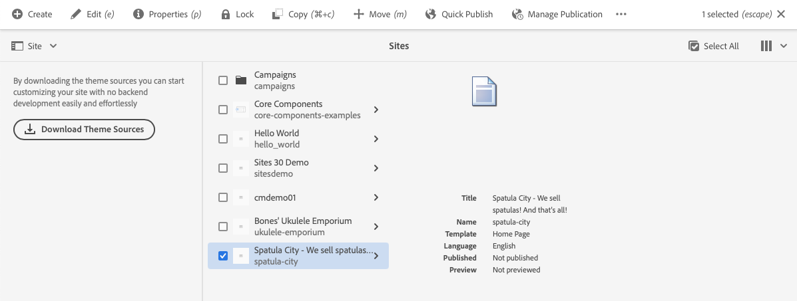
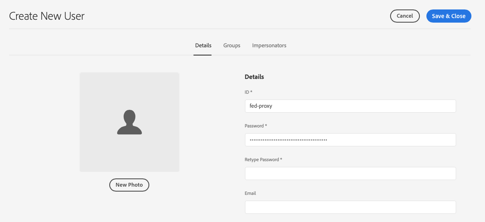

# 從範本建立網站 {#create-site-from-template}

瞭解如何使用網站範本快速建立新的AEM網站。

## 到目前為止 {#story-so-far}

在AEM快速網站建立歷程的上一個檔案中， [瞭解Cloud Manager和快速網站建立工作流程](cloud-manager.md) 您已瞭解Cloud Manager以及它如何將新的快速網站建立流程聯絡起來，您現在應：

* 瞭解AEM Sites和Cloud Manager如何共同運作以促進前端開發
* 瞭解前端自訂步驟如何與AEM完全分離且不需要AEM知識。

本文基於這些基礎之上，因此您可以進行第一個設定步驟並從範本建立新網站，之後您可以使用前端工具進行自訂。

## 目標 {#objective}

本檔案可協助您瞭解如何使用網站範本快速建立新的AEM網站。 閱讀本文件後，您應該：

* 瞭解如何取得AEM網站範本。
* 瞭解如何使用範本建立新網站。
* 瞭解如何從新網站下載範本以提供給前端開發人員。

## 負責角色 {#responsible-role}

此歷程的這一部分適用於AEM管理員。

## 網站範本 {#site-templates}

網站範本是將基本網站內容結合成方便且可重複使用的套件的方法。 網站範本通常包含基本網站內容和結構以及網站樣式資訊，以便快速啟動新網站。 實際結構如下：

* `files`：包含UI套件、XD檔案和可能的其他檔案的資料夾
* `previews`：包含網站範本熒幕擷圖的資料夾
* `site`：為從此範本建立之每個網站複製的內容套件，例如頁面範本、頁面等
* `theme`：用於修改網站外觀的範本主題來源，包括CSS、JavaScript等

範本功能強大，因為其可重複使用，讓內容作者可以快速建立網站。 而且，由於您可以在AEM安裝中使用多個範本，因此您可以靈活地滿足各種業務需求。

>[!NOTE]
>
>網站範本與頁面範本不可混淆。 此處說明的網站範本定義網站的整體結構。 頁面範本會定義個別頁面的結構和初始內容。

## 取得網站範本 {#obtaining-template}

最簡單的入門方式是 [從其GitHub存放庫下載最新版的AEM Standard網站範本。](https://github.com/adobe/aem-site-template-standard/releases)

下載後，您可以像上傳任何其他套件一樣將它上傳到您的AEM環境。 請參閱 [其他資源區段](#additional-resources) 如需有關如何使用套件的詳細資訊，請參閱此主題。

>[!TIP]
>
>AEM標準網站範本可自訂以符合您的專案需求，且無需進一步自訂。 不過，此主題不在本次歷程的涵蓋範圍內。 如需詳細資訊，請參閱標準網站範本的GitHub檔案。

>[!TIP]
>
>您也可以選擇從來源建立範本，作為專案工作流程的一部分。 不過，此主題不在本次歷程的涵蓋範圍內。 如需詳細資訊，請參閱標準網站範本的GitHub檔案。

## 安裝網站範本 {#installing-template}

使用範本建立新網站非常簡單。

1. 登入您的AEM製作環境並導覽至Sites主控台

   * `https://<your-author-environment>.adobeaemcloud.com/sites.html/content`

1. 點選或按一下 **建立** 在熒幕右上方，從下拉式選單中選取 **從範本建立網站**.

   

1. 在建立網站精靈中，點選或按一下 **匯入** 左欄頂端。

   

1. 在檔案瀏覽器中，找到範本 [您先前已下載](#obtaining-template) 並點選或按一下 **上傳**.

1. 上傳後，範本就會顯示在可用範本清單中。 點選或按一下以選取它（這也會在右欄中顯示有關範本的資訊），然後點選或按一下 **下一個**.

   

1. 提供您網站的標題。 若省略，可提供網站名稱或從標題產生網站名稱。

   * 網站標題會顯示在瀏覽器標題列中。
   * 網站名稱會成為URL的一部分。

1. 點選或按一下 **建立** 並從網站範本建立新網站。

   

1. 在出現的確認對話方塊中，點選或按一下 **完成**.

   

1. 在網站主控台中，新網站是可見的，並可導覽以探索其由範本定義的基本結構。

   

內容作者現在可以開始編寫。

## 是否需要進一步自訂？ {#customization-required}

網站範本功能非常強大且有彈性，您可以為專案建立任何數量，以便輕鬆建立網站變體。 根據您使用的網站範本已執行的自訂等級，您甚至可能不需要額外的前端自訂。

* 如果您的網站不需要額外自訂，恭喜您！ 您的歷程到此結束！
* 如果您仍然需要額外的前端自訂，或者您只是想瞭解整個流程，以備將來需要自訂，請繼續閱讀。

## 範例頁面 {#example-page}

如果您確實需要額外的前端自訂，請記住，前端開發人員可能不熟悉您的內容的詳細資訊。 因此，建議為開發人員提供典型內容的路徑，在自訂主題時作為參考基礎。 一個典型的範例是網站主要語言的首頁。

1. 在網站瀏覽器中，導覽至網站主要語言的首頁，然後點選或按一下頁面以選取它，然後點選或按一下 **編輯** 功能表列中的。

   

1. 在編輯器中，選取 **頁面資訊** 按鈕，然後 **以發佈狀態檢視**.

   

1. 在開啟的標籤中，從位址列複製內容的路徑。 它看起來會像這樣 `/content/<your-site>/en/home.html?wcmmode=disabled`.

   

1. 儲存路徑以稍後提供給前端開發人員。

## 下載主題 {#download-theme}

現在已建立網站，可以下載範本產生的網站主題，並提供給前端開發人員進行自訂。

1. 在網站主控台上，顯示 **網站** 邊欄。

   

1. 點選或按一下新網站的根目錄，然後點選或按一下 **下載主題來源** 在網站邊欄中。

   

您的下載檔案現在有主題來源檔案的復本。

## 設定Proxy使用者 {#proxy-user}

為了讓前端開發人員使用您網站中的實際AEM內容預覽自訂，您必須設定Proxy使用者。

1. 在AEM中，從主要導覽移至 **工具** -> **安全性** -> **使用者**.
1. 在使用者管理主控台中，點選或按一下 **建立**.

   
1. 在 **建立新使用者** 視窗至少必須提供：
   * **ID**  — 記下此值，因為您必須將它提供給前端開發人員。
   * **密碼**  — 將此值安全地儲存在密碼儲存庫中，因為您必須將它提供給前端開發人員。

   

1. 於 **群組** 索引標籤中，將Proxy使用者新增至 `contributors` 群組。
   * 輸入詞語 `contributors` 觸發AEM自動完成功能以輕鬆選取群組。

   

1. 點選或按一下&#x200B;**儲存並關閉**。

您現在已完成設定。 內容作者現在可以開始在網站上建立內容，為歷程的下一步中的前端自訂做準備。

## 下一步 {#what-is-next}

現在您已完成AEM快速網站建立歷程的這一部分，您應：

* 瞭解如何取得AEM網站範本。
* 瞭解如何使用範本建立新網站。
* 瞭解如何從新網站下載範本以提供給前端開發人員。

在此知識的基礎上繼續您的AEM快速網站建立歷程，接下來檢視檔案 [設定您的管道，](pipeline-setup.md) 在這裡您將建立前端管道來管理網站主題的自訂。

## 其他資源 {#additional-resources}

我們建議您檢閱檔案，繼續快速網站建立歷程的下一部分 [設定您的管道，](pipeline-setup.md) 以下是一些其他可選資源，這些資源對本文檔中提到的一些概念進行了更深入的探究，但並非繼續此歷程所必需的。

* [AEM標準網站範本](https://github.com/adobe/aem-site-template-standard)  — 這是AEM標準網站範本的GitHub存放庫。
* [建立及組織頁面](/help/sites-cloud/authoring/fundamentals/organizing-pages.md)  — 如果您想要在從範本建立AEM網站後進一步自訂，本指南會詳細說明如何管理您的網站頁面。
* [如何使用套件](/help/implementing/developing/tools/package-manager.md)  — 套件可匯入和匯出存放庫內容。 本檔案說明如何在AEM 6.5中使用套件（同樣適用於AEMaaCS）。
* [網站管理文件](/help/sites-cloud/administering/site-creation/create-site.md) - 查看關於建立網站的技術文件，了解快速網站建立工具功能的更多詳細資訊。
* [建立表單或新增表單至AEM Sites頁面](/help/forms/create-or-add-an-adaptive-form-to-aem-sites-page.md)  — 瞭解將表單整合至網站的分步技巧和最佳實務，將數位體驗最佳化以發揮最大影響力。
