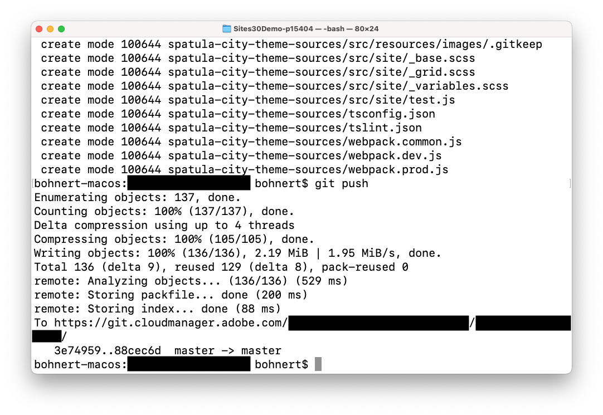

# 自定義網站主題 {#customize-the-site-theme}

瞭解如何構建網站主題、如何自定義以及如何使用即時內容進AEM行test。

## 到目前為止的故事 {#story-so-far}

在快速建立站AEM點的上一文檔中， [檢索Git儲存庫訪問資訊，](retrieve-access.md) 您瞭解了前端開發人員用戶Cloud Manager如何訪問git儲存庫資訊，現在您應該：

* 高級瞭解Cloud Manager是什麼。
* 已檢索您的憑據以訪AEM問Git，以便您可以提交自定義。

此部分將執行下一步並深入到站點主題中，並向您顯示如何自定義該主題，然後使用您檢索的訪問憑據提交這些自定義設定。

## 目標 {#objective}

本文檔介紹如AEM何構建站點主題、如何自定義它以及如何使用即時內容testAEM它。 閱讀完後，您應：

* 瞭解網站主題的基本結構以及如何編輯它。
* 瞭解如何通過本地代理使用真實內容AEMtest主題自定義。
* 瞭解如何將更改提交到AEMGit儲存庫。

## 責任角色 {#responsible-role}

這部分行程適用於前端開發商。

## 瞭解主題結構 {#understand-theme}

將管理員提供的AEM主題解壓到您希望編輯該主題的位置，並在首選編輯器中開啟它。


您會看到主題是典型的前端項目。 該結構最重要的部分是：

* `src/main.ts`:JS和CSS主題的主要入口點
* `src/site`:應用於整個站點的JS和CSS檔案
* `src/components`:特定於元件的JS和CSSAEM檔案
* `src/resources`:靜態檔案，如表徵圖、徽標和字型

>[!TIP]
>
>如果您想瞭解有關標準網站主題的AEM更多資訊，請參閱 [其他資源](#additional-resources) 的下界。

一旦您對主題項目的結構感到滿意，請啟動本地代理，以便您可以根據實際內容即時查看任何主題自AEM定義。

## 啟動本地代理 {#starting-proxy}

1. 從命令行導航到本地電腦上主題的根。
1. 執行 `npm install` npm檢索依賴項並安裝項目。

   

1. 執行 `npm run live` 代理伺服器啟動。

   

1. 代理伺服器啟動時，會自動開啟瀏覽器 `http://localhost:7001/`。 點擊或按一下 **本地登錄（僅限管理任務）** 並使用管理員提供給您的代理用戶憑據登AEM錄。

   

1. 登錄後，請更改瀏覽器中的URL以指向管理員提供給您的示例內AEM容的路徑。

   * 例如，如果提供的路徑是 `/content/<your-site>/en/home.html?wcmmode=disabled`
   * 將URL更改為 `http://localhost:7001/content/<your-site>/en/home.html?wcmmode=disabled`

   

您可以導航站點以瀏覽內容。 站點從即時實例中即時拉AEM出，以便您可以針對實際內容進行主題自定義。

## 自定義主題 {#customize-theme}

現在可以開始自定義主題。 下面是一個簡單的示例，說明如何通過代理即時查看更改。

1. 在編輯器中，開啟檔案 `<your-theme-sources>/src/site/_variables.scss`

   

1. 編輯變數 `$color-background` 將其設定為除白色以外的值。 在本例中， `orange` 的子菜單。

   

1. 保存檔案時，代理伺服器通過該行識別更改 `[Browsersync] File event [change]`。

   

1. 切換回代理伺服器的瀏覽器後，更改立即可見。

   

您可以根據管理員提供的要求繼續自定義主AEM題。

## 提交更改 {#committing-changes}

完成自定義後，您可以將其提交到AEMgit儲存庫。 首先，必須將儲存庫克隆到本地電腦。

1. 從命令行導航到要克隆回購的位置。
1. 執行命令 [以前從雲管理器檢索到。](retrieve-access.md) 應該和 `git clone https://git.cloudmanager.adobe.com/<my-org>/<my-program>/`。 使用Git用戶名和密碼 [你在前一段路上取回了。](retrieve-access.md)

   

1. 使用類似於 `mv <site-theme-sources> <cloned-repo>`
1. 在克隆的回購目錄中，使用以下命令提交您剛移入的主題檔案。

   ```text
   git add .
   git commit -m "Adding theme sources"
   git push
   ```

1. 將自定義項推送到AEMGit儲存庫。

   

您的自定義內容現在安全地儲存AEM在Git儲存庫中。

## 下一步是什麼 {#what-is-next}

現在，您已完成快速站點創AEM建過程的這一部分：

* 瞭解網站主題的基本結構以及如何編輯它。
* 瞭解如何通過本地代理使用真實內容AEMtest主題自定義。
* 瞭解如何將更改提交到AEMGit儲存庫。

在此知識基礎上構建並繼AEM續快速建立網站的過程，方法是下次查看文檔 [部署您的自定義主題，](deploy-theme.md) 您將在其中學習如何使用前端管道部署主題。

## 其他資源 {#additional-resources}

建議您通過審閱文檔進入快速站點建立過程的下一部分 [部署您的自定義主題，](deploy-theme.md) 下面是一些附加的可選資源，這些資源對本文檔中提到的一些概念進行了更深入的瞭解，但不需要繼續旅行。

* [網AEM站主題](https://github.com/adobe/aem-site-template-standard-theme-e2e)  — 這是網站主題的GitHubAEM儲存庫。
* [npm](https://www.npmjs.com)  — 用AEM於快速構建站點的主題基於npm。
* [網路包](https://webpack.js.org)  — 用AEM於快速構建網站的主題依賴webpack。
