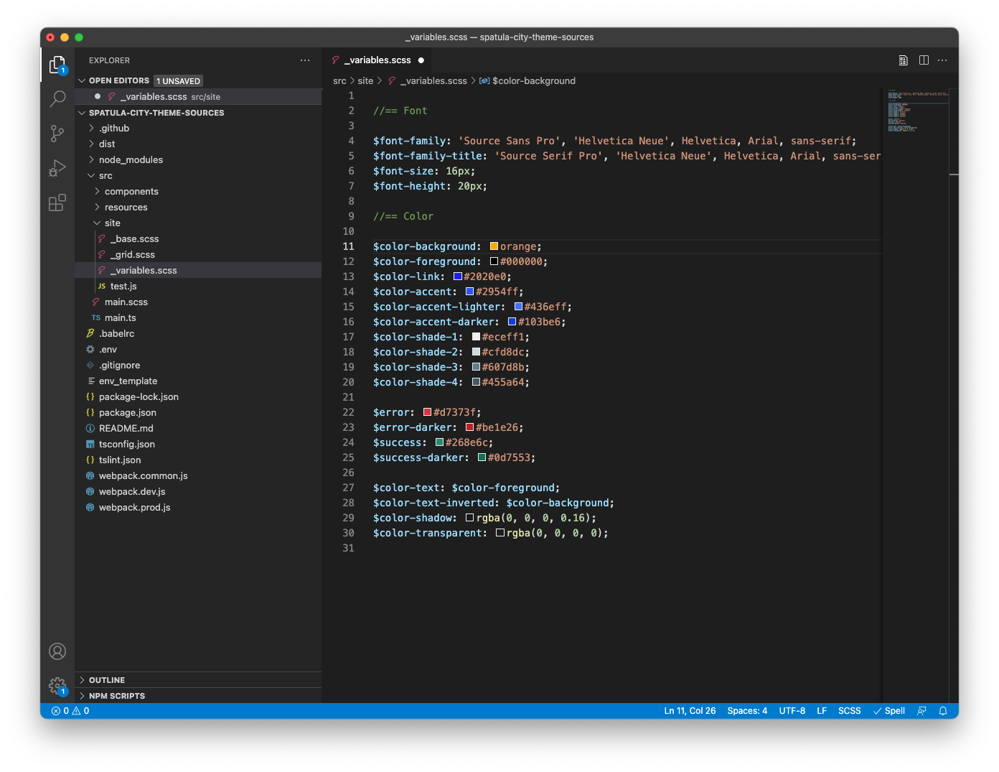
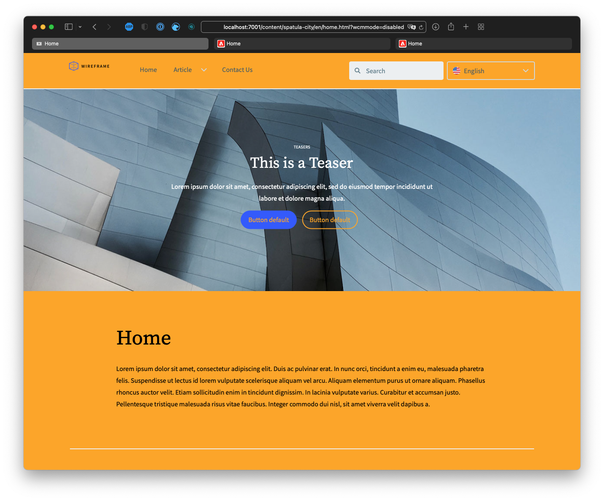

# 自訂網站主題 {#customize-the-site-theme}

瞭解如何使用即時AEM內容建立、自訂和測試網站主題。

## 到目前為止 {#story-so-far}

在AEM快速網站建立歷程的上一個檔案中， [擷取Git存放庫存取資訊，](retrieve-access.md) 您已瞭解前端開發人員如何使用Cloud Manager存取Git存放庫資訊，您現在應：

* 從較高層面瞭解什麼是Cloud Manager。
* 已擷取您的認證以存取AEM Git，因此您可以認可自訂。

此歷程部分會進行下一個步驟，並深入瞭解網站主題，示範如何自訂，然後使用您擷取的存取憑證來認可這些自訂。

## 目標 {#objective}

本檔案說明如何建立AEM網站主題、如何自訂，以及如何使用即時AEM內容來測試。 閱讀本文件後，您應該：

* 瞭解網站主題的基本結構以及如何進行編輯。
* 瞭解如何透過本機Proxy使用真實的AEM內容來測試您的主題自訂。
* 瞭解如何將變更提交至AEM Git存放庫。

## 負責角色 {#responsible-role}

此歷程的這一部分適用於前端開發人員。

## 瞭解主題結構 {#understand-theme}

將AEM管理員提供的主題擷取到您要編輯主題的位置，並在您偏好的編輯器中開啟它。


您會看到主題是典型的前端專案。 結構最重要的部分包括：

* `src/main.ts`：JS &amp; CSS主題的主要進入點
* `src/site`：套用至整個網站的JS &amp; CSS檔案
* `src/components`：AEM元件專屬的JS &amp; CSS檔案
* `src/resources`：圖示、標誌和字型等靜態檔案

>[!TIP]
>
>如果您想深入瞭解標準AEM網站主題，請參閱 [其他資源](#additional-resources) 區段。

在您熟悉佈景主題專案的結構後，請啟動本機Proxy，以便根據實際AEM內容即時檢視任何佈景主題自訂。

## 啟動本機Proxy {#starting-proxy}

1. 從命令列，導覽至本機電腦上主題的根目錄。
1. 執行 `npm install` 和npm會擷取相依性並安裝專案。

   

1. 執行 `npm run live` Proxy伺服器就會啟動。

   

1. Proxy伺服器啟動時，會自動開啟瀏覽器，以 `http://localhost:7001/`. 選取 **本機登入（僅限管理員工作）** 並使用AEM管理員提供給您的Proxy使用者認證登入。

   

   >[!TIP]
   >
   >如果您沒有這些認證，請洽詢參照 [從範本建立網站一文的設定Proxy使用者區段](/help/journey-sites/quick-site/create-site.md#proxy-user) 在此歷程中。

1. 登入後，請變更瀏覽器中的URL，使其指向AEM管理員提供給您的範例內容路徑。

   * 例如，如果提供的路徑為 `/content/<your-site>/en/home.html?wcmmode=disabled`
   * 您可以將URL變更為 `http://localhost:7001/content/<your-site>/en/home.html?wcmmode=disabled`

   

您可以導覽網站以探索內容。 系統會從即時AEM例項即時提取網站，這樣您就可以根據實際內容來自訂主題。

## 自訂主題 {#customize-theme}

現在您可以開始自訂佈景主題。 以下是一個簡單範例，說明如何透過Proxy即時檢視變更。

1. 在編輯器中，開啟檔案 `<your-theme-sources>/src/site/_variables.scss`

   

1. 編輯變數 `$color-background` 並將其設定為白色以外的值。 在此範例中， `orange` 已使用。

   

1. 儲存檔案時，您會看到Proxy伺服器透過行來辨識變更 `[Browsersync] File event [change]`.

   

1. 切換回Proxy伺服器的瀏覽器時，變更會立即顯示。

   

您可以根據AEM管理員提供給您的需求繼續自訂主題。

## 認可變更 {#committing-changes}

完成自訂後，您可以將其提交到AEM Git存放庫。 首先，您必須將存放庫複製到本機電腦。

1. 從命令列，導覽至您要複製存放庫的位置。
1. 執行命令 [先前從Cloud Manager擷取。](retrieve-access.md) 它應類似於 `git clone https://git.cloudmanager.adobe.com/<my-org>/<my-program>/`. 使用符合以下條件的Git使用者名稱和密碼 [您已在此歷程的上一部分中擷取。](retrieve-access.md)

   

1. 使用類似於的命令將您編輯的主題專案移動到複製的存放庫中 `mv <site-theme-sources> <cloned-repo>`
1. 在複製存放庫的目錄中，使用下列命令提交您剛移入的主題檔案。

   ```text
   git add .
   git commit -m "Adding theme sources"
   git push
   ```

1. 自訂會推送至AEM Git存放庫。

   

您的自訂內容現在會安全地儲存在AEM Git存放庫中。

## 下一步 {#what-is-next}

現在您已完成AEM快速網站建立歷程的這一部分，您應：

* 瞭解網站主題的基本結構以及如何進行編輯。
* 瞭解如何透過本機Proxy使用真實的AEM內容來測試您的主題自訂。
* 瞭解如何將變更提交至AEM Git存放庫。

在此基礎上繼續您的AEM快速網站建立歷程，接下來檢閱檔案 [部署您的自訂主題，](deploy-theme.md) 您可在其中瞭解如何使用前端管道來部署主題。

## 其他資源 {#additional-resources}

我們建議您檢閱檔案，繼續快速網站建立歷程的下一部分 [部署您的自訂主題，](deploy-theme.md) 以下是一些其他可選資源，這些資源對本文中提到的一些概念進行了更深入的探究，但並非繼續此歷程所必需的。

* [AEM網站主題](https://github.com/adobe/aem-site-template-standard-theme-e2e)  — 這是AEM網站主題的GitHub存放庫。
* [npm](https://www.npmjs.com)  — 用來快速建立網站的AEM主題是以npm為基礎。
* [webpack](https://webpack.js.org)  — 用於快速建立網站的AEM主題依賴webpack。
