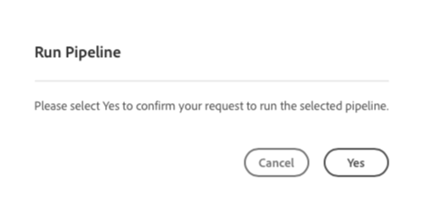
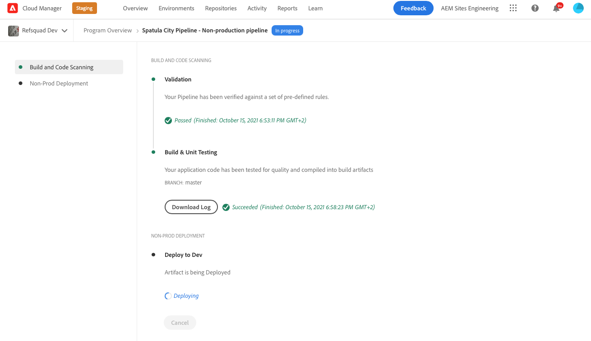

# 部署自定義的主題 {#deploy-your-customized-theme}

了解如何使用管道部署網站主題。

## 迄今為止的故事 {#story-so-far}

在AEM快速網站建立歷程的上一份檔案中， [自訂網站主題、](customize-theme.md) 您已了解主題的建立方式、如何自訂主題，以及如何使用即時AEM內容測試主題，您現在應：

* 了解網站主題的基本結構及編輯方式。
* 請參閱如何透過本機Proxy，使用真實的AEM內容來測試您的主題自訂。
* 了解如何將變更提交至AEM Git存放庫。

您現在可以採取最後一步，並使用管道來部署。

## 目標 {#objective}

本檔案說明如何使用管道部署主題。 閱讀後，您應：

* 了解如何觸發管道部署。
* 請參閱如何檢查部署狀態。

## 負責角色 {#responsible-role}

此部分的歷程適用於前端開發人員。

## 啟動管道 {#start-pipeline}

將主題自訂變更提交至AEM Git存放庫後，即可執行 [管理員建立的管道](pipeline-setup.md) 來部署變更。

1. 登入Cloud Manager [就像您擷取git存取資訊一樣](retrieve-access.md) 並訪問你的程式。 在 **概述** 頁簽，您會看到 **管道**.

   

1. 點選或按一下所需開始管道旁的刪節號。 從下拉式功能表中，選取 **執行**.

   

1. 在 **執行管道** 確認對話方塊，點選或按一下 **是**.

   

1. 在管道清單中，狀態列指示管道當前正在運行。

   

## 檢查管道狀態 {#pipeline-status}

您可以隨時檢查管道的狀態，以查看其進度的詳細資訊。

1. 點選或按一下管道旁的刪節號。

   

1. 管道詳細資訊視窗會顯示管道進度的劃分。

   

>[!TIP]
>
>在管道詳細資訊窗口中，可以點選或按一下 **下載記錄檔** 用於偵錯用途的管道任何步驟（如果任何步驟應失敗）。 對管道進行除錯不在此歷程的範圍之內。 請參閱 [其他資源](#additional-resources) 區段。

## 驗證已部署的自定義 {#view-customizations}

管道完成後，您可通知管理員驗證變更。 然後，管理員將：

1. 開啟AEM製作環境。
1. 導覽至 [管理員先前建立的站點。](create-site.md)
1. 編輯其中一個內容頁面。
1. 查看所套用的變更。

## 旅程的結束？ {#end-of-journey}

恭喜！ 您已完成AEM快速網站建立歷程！ 您現在應該：

* 了解Cloud Manager和前端管道如何運作，以管理和部署前端自訂。
* 了解如何根據範本建立AEM網站，以及如何下載網站主題。
* 如何將前端開發人員上線，以便存取AEM Git存放庫。
* 如何使用代理的AEM內容自訂和測試主題，並將這些變更提交至AEM Git。
* 如何使用管道部署前端自訂。

您現在可以自訂自己AEM網站的主題。 但是，在開始使用多個前端管道建立不同的工作流之前，請先查看該文檔 [使用前端管道開發網站。](/help/implementing/developing/introduction/developing-with-front-end-pipelines.md) 它可協助您充份運用前端開發，方法如下：

* 保持單一的真相。
* 保持關注的分離。

AEM是功能強大的工具，有許多其他選項可供使用。 查看 [「其他資源」部分](#additional-resources) 以進一步了解您在此歷程中看到的功能。

## 其他資源 {#additional-resources}

以下是一些額外資源，可深入探討本檔案中提及的一些概念。

* [AEMas a Cloud Service技術檔案](https://experienceleague.adobe.com/docs/experience-manager-cloud-service.html)  — 如果您已對AEM有明確的了解，建議您直接參閱深入的技術檔案。
* [Cloud Manager檔案](https://experienceleague.adobe.com/docs/experience-manager-cloud-service/onboarding/onboarding-concepts/cloud-manager-introduction.html)  — 如果您想要取得Cloud Manager功能的詳細資訊，可直接參閱深入的技術檔案。
* [角色型權限](https://experienceleague.adobe.com/docs/experience-manager-cloud-manager/using/requirements/role-based-permissions.html) - Cloud Manager已預先設定角色，並擁有適當權限。 請參閱本檔案，了解這些角色的詳細資訊以及如何管理這些角色。
* [Cloud Manager儲存庫](/help/implementing/cloud-manager/managing-code/cloud-manager-repositories.md)  — 若您需要有關如何設定及管理AEMaaCS專案的Git存放庫的詳細資訊，請參閱本檔案。
* [設定CI/CD管道 — Cloud Services](/help/implementing/cloud-manager/configuring-pipelines/introduction-ci-cd-pipelines.md)  — 在本檔案中了解有關設定管道的詳細資訊，包括完整堆棧和前端。
* [AEM標準網站範本](https://github.com/adobe/aem-site-template-standard)  — 這是AEM標準網站範本的GitHub存放庫。
* [AEM網站主題](https://github.com/adobe/aem-site-template-standard-theme-e2e)  — 這是AEM網站主題的GitHub存放庫。
* [npm](https://www.npmjs.com)  — 用來快速建立網站的AEM主題是以npm為基礎。
* [webpack](https://webpack.js.org)  — 用於快速建立網站的AEM主題依賴webpack。
* [建立及組織頁面](/help/sites-cloud/authoring/fundamentals/organizing-pages.md)  — 如果您想在從範本建立後進一步自訂AEM網站，本指南會詳細說明如何管理您的Adobe Site頁面。
* [如何使用套件](/help/implementing/developing/tools/package-manager.md)  — 允許導入和導出儲存庫內容的包。 本檔案說明如何使用AEM 6.5（也適用於AEMaCS）中的套件。
* [入門歷程](/help/journey-onboarding/home.md)  — 本指南是您的起點，可確保您的團隊已設定且可存取AEMas a Cloud Service。
* [Adobe Experience Manager Cloud Manager檔案](https://experienceleague.adobe.com/docs/experience-manager-cloud-manager/using/introduction-to-cloud-manager.html?lang=zh-Hant)  — 探索Cloud Manager檔案，以取得其功能的完整詳細資訊。
* [網站管理檔案](/help/sites-cloud/administering/site-creation/create-site.md)  — 查看網站建立技術檔案，以取得快速網站建立工具功能的詳細資訊。
* [使用前端管道開發網站](/help/implementing/developing/introduction/developing-with-front-end-pipelines.md)  — 本檔案說明若想使用前端管道充分發揮前端開發程式的潛力，需注意的一些事項。
