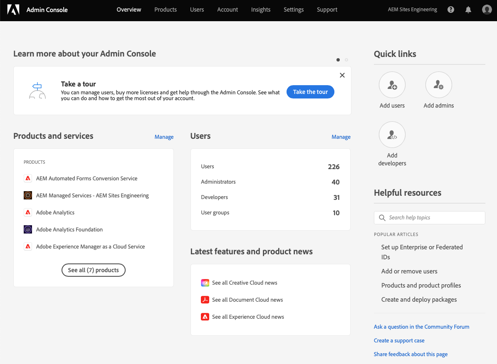
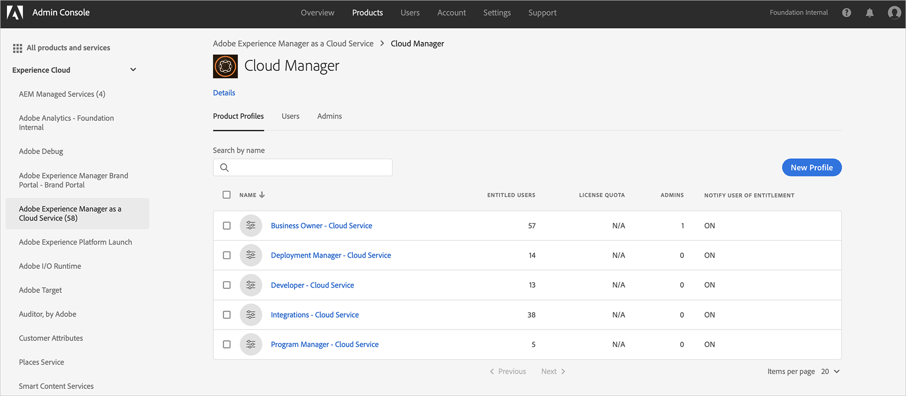

# 授予前端開發人員的存取權 {#grant-fed-access}

將前端開發人員上線至Cloud Manager，讓他們能存取您的AEM網站Git存放庫和管道。

## 迄今為止的故事 {#story-so-far}

在AEM快速網站建立歷程的上一份檔案中， [設定管道，](pipeline-setup.md) 您已了解如何建立前端管道來管理網站主題的自訂，您現在應：

* 了解前端管道是什麼。
* 了解如何在Cloud Manager中設定前端管道。

您現在需要透過入門程式授予前端開發人員對Cloud Manager的存取權，讓前端開發人員可存取AEM Git存放庫和您建立的管道。

## 目標 {#objective}

授予Cloud Manager存取權並指派使用者角色給使用者的程式稱為入門。 本檔案將概述入門前端開發人員的最重要步驟，閱讀後您將了解：

* 如何以使用者身分新增前端開發人員。
* 如何將所需角色授予前端開發人員。

>[!TIP]
>
>您可透過以下連結，完成整個檔案歷程，將團隊引導至AEM as a Cloud Service [「其他資源」部分](#additional-resources) ，如果您需要有關該流程的其他詳細資訊。

## 負責角色 {#responsible-role}

此部分的歷程會套用至Cloud Manager管理員。

## 需求 {#requirements}

* 你需要成為 **業務負責人** 角色。
* 你需要成為 **系統管理員** 在Cloud Manager中。
* 您必須擁有Admin Console的存取權。

## 將前端開發人員添加為用戶 {#add-fed-user}

首先，您需要使用Admin Console將前端開發人員新增為使用者。

1. 登入Admin Console: [https://adminconsole.adobe.com/](https://adminconsole.adobe.com/).

1. 登入後，畫面會顯示類似下圖的概觀頁面。

   

1. 檢查畫面右上角的組織名稱，確認您位於適當的組織。

   

1. 選擇 **Adobe Experience Manager as a Cloud Service** 從 **產品和服務** 卡片。

   

1. 您會看到預先設定的Cloud Manager產品設定檔清單。 如果您沒有看見這些設定檔，請連絡您的Cloud Manager管理員，因為您的組織中可能沒有正確的權限。

   

1. 若要將前端開發人員指派給正確的設定檔，請點選或按一下 **使用者** 標籤 **添加用戶** 按鈕。

   

1. 在 **新增使用者至您的團隊** 對話框中，鍵入要添加的用戶的電子郵件ID。 如果尚未設定團隊成員的Federated ID，請為「ID類型」選取「Adobe ID」。

   

1. 在 **產品** 選取、點選或按一下加號，然後選取 **Adobe Experience Manager as a Cloud Service** 並指派 **部署管理員** 和 **開發人員** 產品設定檔傳送給使用者。

   

1. 點選或按一下 **儲存** 歡迎電子郵件會傳送給您以使用者身分新增的前端開發人員。

受邀的前端開發人員可按一下歡迎電子郵件中的連結，並使用其Adobe ID登入，以存取Cloud Manager。

## 切換到前端開發人員 {#handover}

在前端開發人員前往Cloud Manager的途中，您和AEM管理員現在可以透過電子郵件邀請前端開發人員取得其餘的必要資訊，以開始自訂。

* A [典型內容的路徑](#example-page)
* 主題來源 [已下載](#download-theme)
* 此 [代理用戶證書](#proxy-user)
* 程式的名稱或其URL [從Cloud Manager複製](pipeline-setup.md#login)
* 前端設計要求

## 下一步 {#what-is-next}

現在您已完成AEM快速網站建立歷程的這一部分，您應該知道：

* 如何以使用者身分新增前端開發人員。
* 如何將所需角色授予前端開發人員。

基於此知識，並透過接下來檢閱檔案，繼續建立AEM快速網站的歷程 [擷取Git存放庫存取資訊，](retrieve-access.md) 這種解決方案專門面向前端開發人員，並說明前端開發人員使用者Cloud Manager如何存取git存放庫資訊。

## 其他資源 {#additional-resources}

建議您透過檢閱檔案，繼續進行快速網站建立歷程的下一個階段 [檢索前端開發人員憑據，](retrieve-access.md) 以下是一些額外的選用資源，可更深入探討本檔案中提及的一些概念，但您不需要這些資源即可繼續進行歷程。

* [入門歷程](/help/journey-onboarding/overview.md)  — 本指南是您的起點，可確保您的團隊已設定且可存取AEMas a Cloud Service。
